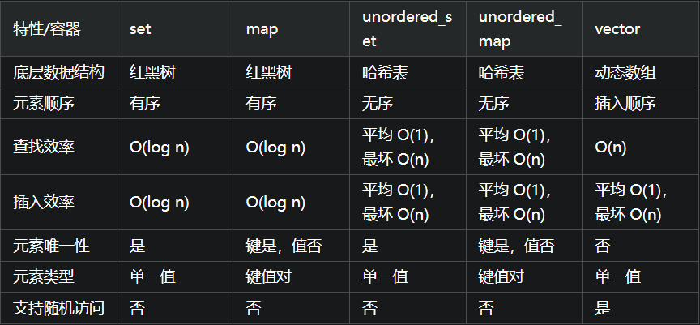

# set

1. 为何map和set的插入删除效率比用其他序列容器高？

因为对于关联容器来说，不需要做内存拷贝和内存移动。说对了，确实如此。set容器内所有元素都是以节点的方式来存储，其节点结构和链表差不多，指向父节点和子节点。
因此插入的时候只需要稍做变换，把节点的指针指向新的节点就可以了。删除的时候类似，稍做变换后把指向删除节点的指针指向其他节点也OK了。这里的一切操作就是指针换来换去，和内存移动没有关系。

2. 为何每次insert之后，以前保存的iterator不会失效？
iterator这里就相当于指向节点的指针，内存没有变，指向内存的指针怎么会失效呢(当然被删除的那个元素本身已经失效了)。相对于vector来说，每一次删除和插入，指针都有可能失效，调用push_back在尾部插入也是如此。因为为了保证内部数据的连续存放，iterator指向的那块内存在删除和插入过程中可能已经被其他内存覆盖或者内存已经被释放了。即使时push_back的时候，容器内部空间可能不够，需要一块新的更大的内存，只有把以前的内存释放，申请新的更大的内存，复制已有的数据元素到新的内存，最后把需要插入的元素放到最后，那么以前的内存指针自然就不可用了。特别时在和find等算法在一起使用的时候，牢记这个原则：不要使用过期的iterator。

3. 当数据元素增多时，set的插入和搜索速度变化如何？
如果你知道log2的关系你应该就彻底了解这个答案。在set中查找是使用二分查找，也就是说，如果有16个元素，最多需要比较4次就能找到结果，有32个元素，最多比较5次。那么有10000个呢？最多比较的次数为log10000，最多为14次，如果是20000个元素呢？最多不过15次。看见了吧，当数据量增大一倍的时候，搜索次数只不过多了1次，多了1/14的搜索时间而已。你明白这个道理后，就可以安心往里面放入元素了。

# set 
set 容器，作为 STL 的一部分，专为存储唯一元素而设计，自动为元素排序。它的内部实现基于一种高度平衡的二叉树结构——红黑树（Red-Black Tree），这保证了即使在大量数据面前，操作（如插入、删除、查找）的效率也非常高，时间复杂度保持在 O(log n)。



+ set：当需要存储不重复的元素，并且对元素的顺序有要求时，set 是一个好选择。它的查找、插入和删除操作都是高效的，特别适合于元素集合的管理，其中每个元素都是唯一的且需要有序。
+ map：当你需要键值对的映射，并且希望按照键来排序时，map 是更适合的选择。它同样保证了元素的唯一性（针对键），并且提供了高效的基于键的查找。
+ unordered_set 和 unordered_map：当元素的插入和查找效率是首要考虑的，而对元素顺序没有要求时，这两个基于哈希表的容器提供了非常高的效率。它们适合于快速查找和数据访问，但不保证元素的顺序。
+ vector：如果你需要频繁地在序列的末尾添加或移除元素，且不关心元素的唯一性，vector 是最佳选择。它支持随机访问，使得任何位置的元素都可以快速访问。


唯一性：set中的所有元素都是唯一的，不允许有重复值。
排序：set中的元素默认以升序排列，但可以通过自定义比较函数来改变排序规则

注意事项:
 + set中的元素是常量，一旦插入后不能直接修改，如果需要修改某个元素，必须先删除再重新插入。
 + set适用于需要维护元素唯一性和有序性的场景，如果不需要这些特性，可能有其他更高效的容器可以选择，如vector或unordered_set

## 自定义比较函数
默认情况下，C++ 中的 set 是按照升序排列的.


如果你想改变set中元素的默认排序方式，可以提供一个自定义的比较函数。
```cpp
struct customCompare {
    bool operator()(int a, int b) const {
        return a > b; // 这将使set按降序排序
    }
};

std::set<int, customCompare> s_custom; // 使用自定义比较函数创建set
```

如果元素是结构体，可以直接将比较函数写在结构体内。
```cpp
        struct Info
        {
            string name;
            float score;
            //重载“<”操作符，自定义排序规则
            bool operator < (const Info &a) const
            {
                //按score从大到小排列
                return a.score<score;
            }
        }
        set<Info> s;
        ......
        set<Info>::iterator it;
```

## set 常用的方法
begin()     　　 ,返回set容器的第一个元素

end() 　　　　 ,返回set容器的最后一个元素

clear()   　　     ,删除set容器中的所有的元素

empty() 　　　,判断set容器是否为空

max_size() 　 ,返回set容器可能包含的元素最大个数

size() 　　　　 ,返回当前set容器中的元素个数

rbegin　　　　 ,返回的值和end()相同

rend()　　　　 ,返回的值和rbegin()相同

count() 用来查找set中某个某个键值出现的次数。这个函数在set并不是很实用，因为一个键值在set只可能出现0或1次，这样就变成了判断某一键值是否在set出现过了。

equal_range() ，返回一对定位器，分别表示第一个大于或等于给定关键值的元素和 第一个大于给定关键值的元素，这个返回值是一个pair类型，如果这一对定位器中哪个返回失败，就会等于end()的值

erase(iterator)  ,删除定位器iterator指向的值

erase(first,second),删除定位器first和second之间的值

erase(key_value),删除键值key_value的值

find()  ，返回给定值值得定位器，如果没找到则返回end()。

insert(key_value); 将key_value插入到set中 ，返回值是pair<set<int>::iterator,bool>，bool标志着插入是否成功，而iterator代表插入的位置，若key_value已经在set中，则iterator表示的key_value在set中的位置。

inset(first,second);将定位器first到second之间的元素插入到set中，返回值是void.

lower_bound(key_value) ，返回第一个大于等于key_value的定位器

upper_bound(key_value)，返回最后一个大于等于key_value的定位器


