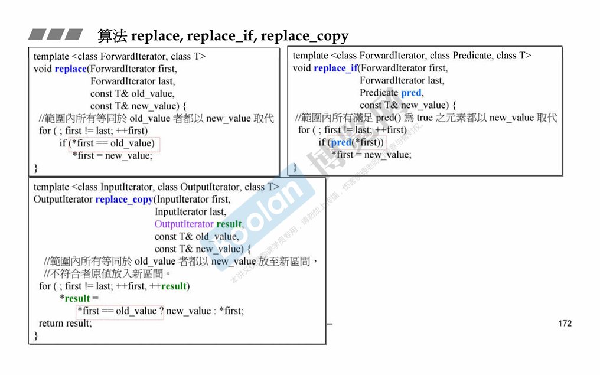
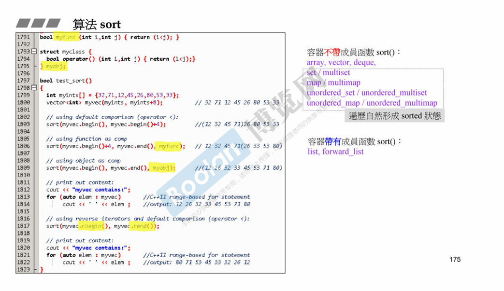

# 算法 algorithms
1. accumalata 累加和
通常算法有两个版本，可以在第二个版本上加上操作；

2. replace, replace_if,replace_copy

3. count, count_if
有一些容器自身带有特定的成员函数，调用本身的更快；比如序列式容器

4. find, find_if

5. sort
list和forward_list 必须调用自己的成员函数 sort，因为链表迭代器不能跳到某个位置，只能++；

6. rbegin() rend()
rbegin() rend()，都是拿到begin()和end(),只是利用 reverse_iterator 改变指向；

7. binary_search
二分查找，就是利用 lower_bound 实现的

lower_bound 的comp，参数第一个是迭代器，第二个才是val；
并且当 comp为 true时，继续查找，也就是说返回第一个 comp为false的迭代器；

# 仿函数 function

因为是函数，所有需要重载 () ;
有三大类： 算术类， 逻辑运算类， 相对关系类

标准库提供的都有继承关系，标示着融入stl；
继承的 binary_function 不占内存，只是提供三个 typedef;
用于 适配器 询问，所以一个仿函数可适配的条件就是继承；

