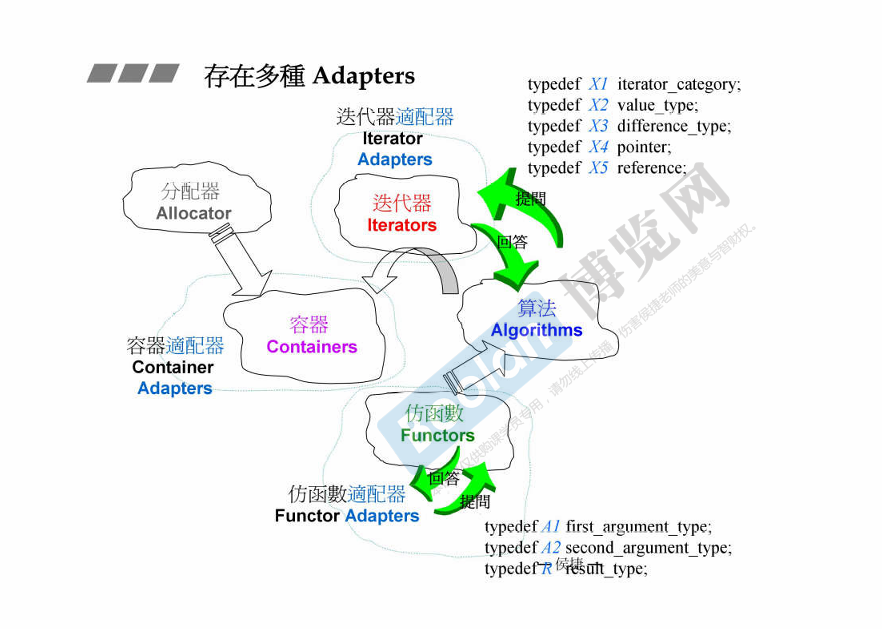
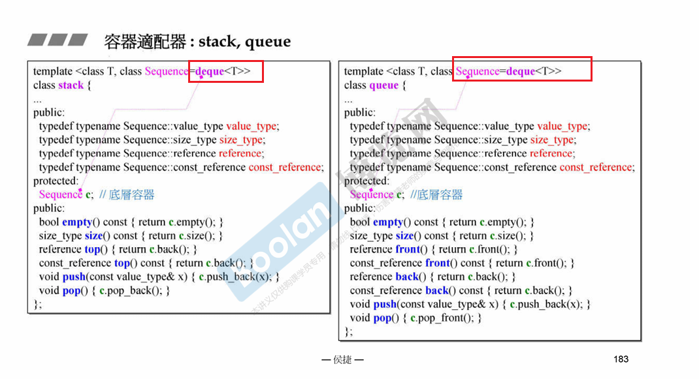
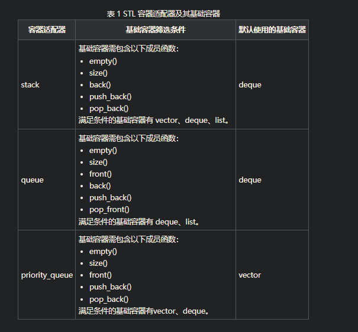
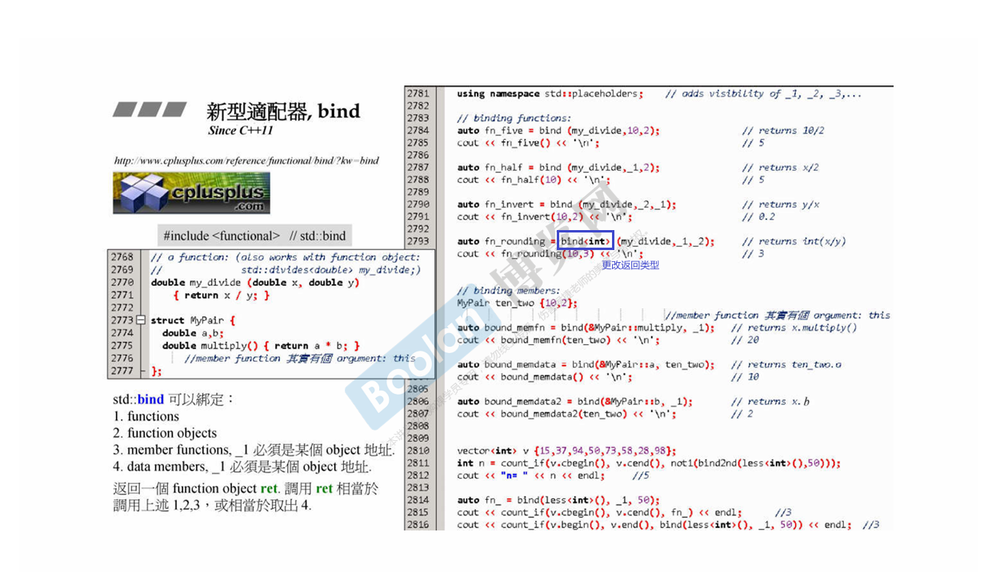
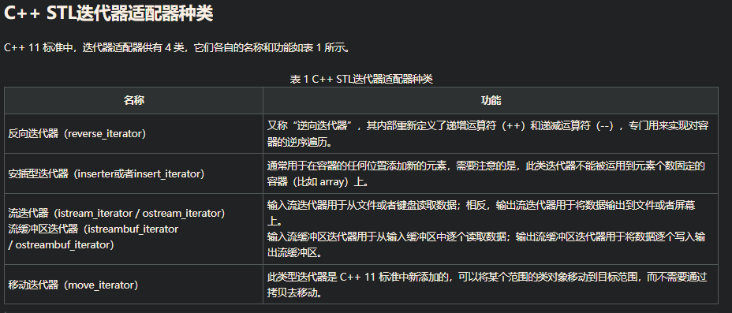
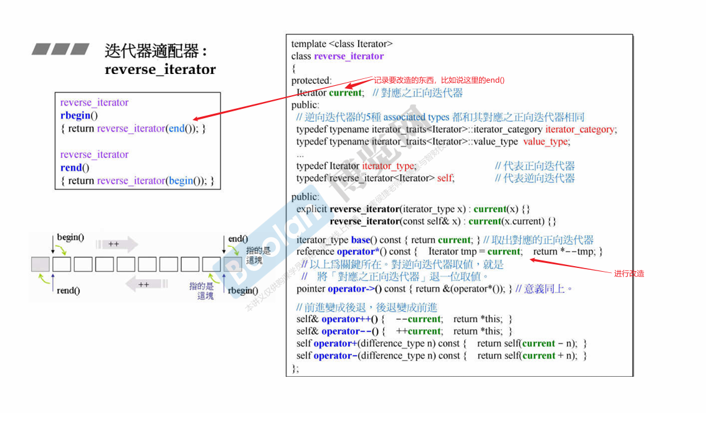
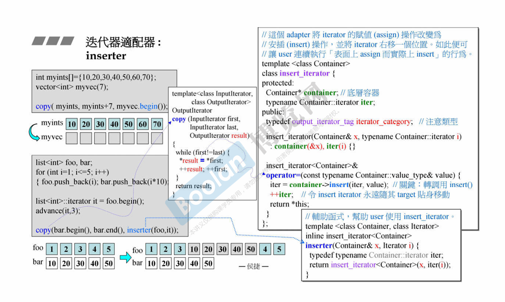
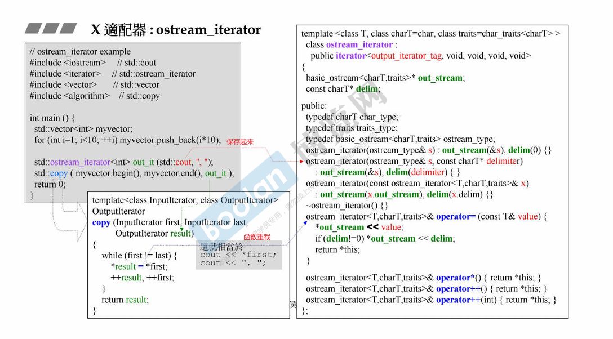
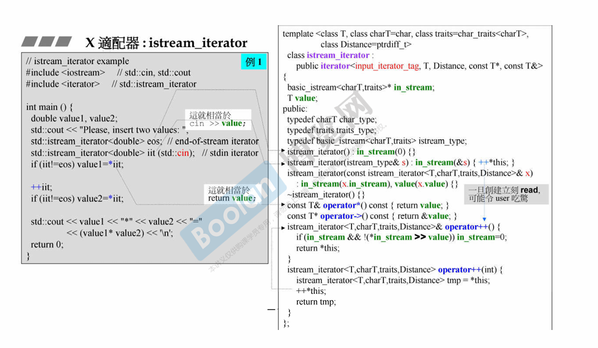
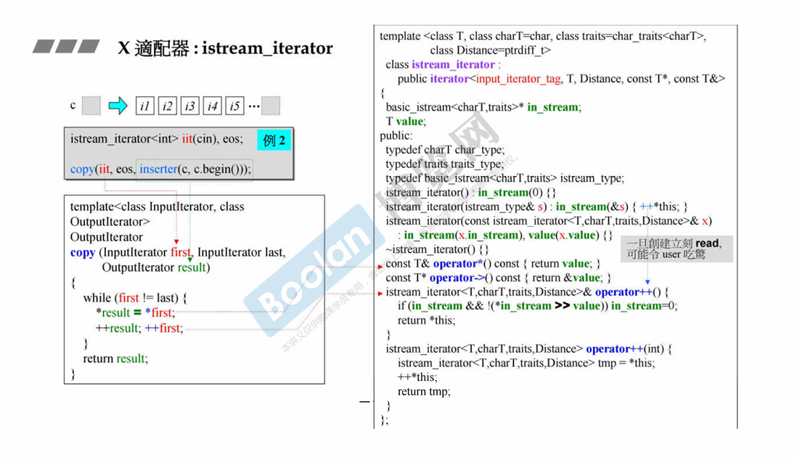

# 适配器 adaoters
存在多种适配器： 仿函数适配器，容器适配器，迭代器适配器



## 容器适配器
简单的理解容器适配器，其就是将不适用的序列式容器（包括 vector、deque 和 list）变得适用。

>容器适配器本质上还是容器，只不过此容器模板类的实现，利用了大量其它基础容器模板类中已经写好的成员函数。当然，如果必要的话，容器适配器中也可以自创新的成员函数。

容器适配器就是内涵一个容器，并进行改造；
比如说 stack 和 queue 就是用deque改造的:





## 仿函数适配器
改造函数

1. binder2nd 
binder2nd 是一个已经被废弃的 C++ 标准库函数，用于创建一个函数对象，该函数对象将其第一个参数绑定到某个特定值。它通常与 STL 算法和函数对象一起使用
```cpp
#include <functional>

template<typename Operation, typename T>
std::binder2nd<Operation> binder2nd(Operation op, T value);

```
 + Operation: 原始函数对象或函数指针。
 + T: 需要绑定到函数对象的值。
假设你有一个接受两个参数的函数 plus，并希望将第二个参数固定为一个特定值：
```cpp
#include <iostream>
#include <functional>

int plus(int a, int b) {
    return a + b;
}

int main() {
    using namespace std::placeholders;
    auto bound = std::binder2nd<decltype(&plus)>(plus, 5);

    std::cout << bound(10) << std::endl;  // 输出 15

    return 0;
}

```
**现代替代：std::bind**
在 C++11 中，std::binder2nd 被 std::bind 替代。std::bind 提供了更灵活和强大的方式来绑定参数。你可以使用 std::bind 来实现类似的功能：
```cpp
#include <iostream>
#include <functional>

int plus(int a, int b) {
    return a + b;
}

int main() {
    auto bound = std::bind(plus, std::placeholders::_1, 5);

    std::cout << bound(10) << std::endl;  // 输出 15

    return 0;
}
```
std::bind：用来创建一个新的函数对象，该对象将部分或全部的参数绑定到指定的值。它比 binder2nd 更灵活，支持更复杂的参数绑定和占位符。

bind 如果加上 bind<int>,这个模板参数代表着返回类型，如果没有这个模板参数则使用函数的返回类型；
这里的 _1表示占位符号，_2就是第二个参数；




## 迭代器适配器
标准库中迭代器大致分为 5 种类型，分别是输入迭代器、输出迭代器、前向迭代器、双向迭代器以及随机访问迭代器

所谓迭代器适配器，其本质也是一个模板类，比较特殊的是，该模板类是借助以上 5 种基础迭代器实现的。换句话说，迭代器适配器模板类的内部实现，是通过对以上 5 种基础迭代器拥有的成员方法进行整合、修改，甚至为了实现某些功能还会添加一些新的成员方法。由此，将基础迭代器“改头换面”，就变成了本节要讲的迭代器适配器。

>本质上讲，迭代器适配器仍属于迭代器，可以理解为是基础迭代器的“翻新版”或者“升级版”。同时，“xxx 迭代器适配器”通常直接称为“xxx 迭代器”



### reverse_iterator
反向迭代器适配器（reverse_iterator），可简称为反向迭代器或逆向迭代器，常用来对容器进行反向遍历，即从容器中存储的最后一个元素开始，一直遍历到第一个元素。

适配器其实就是把要改造的东西先记录起来，然后再进行改造
比如说 reverse_iterator



### inserter
inserter 其实就是利用copy，然后对 输出迭代器进行 =重载，进而分配空间，插值；
把赋值的操作重载为安插的动作



### ostream_iterator

首先定义 ostream_iterator<int>out_it(std::cout, ",");;
传递两个参数，可以看到右边这个类，其实就是记录到 out_stream和delim;
然后调用copy，这里面和 out_it 有关的操作有： *,=,++;
看这个函数重载：可以发现 operator= 这里面就是 *out_stream << vale;这里的 *out_stream 其实就是 cout；
然后再 *out_stream << delim,输出分割符；



1. 只接受一个输出流的构造函数：
   ```cpp
    explicit ostream_iterator(std::ostream& os);
   ```
2. 接受输出流和分隔符的构造函数
   ```cpp
    ostream_iterator(std::ostream& os, const charT* delimiter);
   ```
使用此构造函数时，输出每个元素后将插入一个分隔符字符串。

### istream_iterator
这里的eos其实就是标兵，用来判断当前的iit是否有效；
可以看到当创建：`istream_iterator<double> iit(std::cin);`时，
先进行 ++*this 跳到 operator++，在这里 *instream>>val将等待输入，也就是说此时我们需要在终端输入数据了；
输入完数据后，此时的 value=输入的数据；
然后 *iit 返回这个 value；
如果想继续输入的话，就需要 ++iit，重新进入 *instream>>val；
可以发现这里的 operator++ 仅仅是输入数据，并没有改变指针指向；






