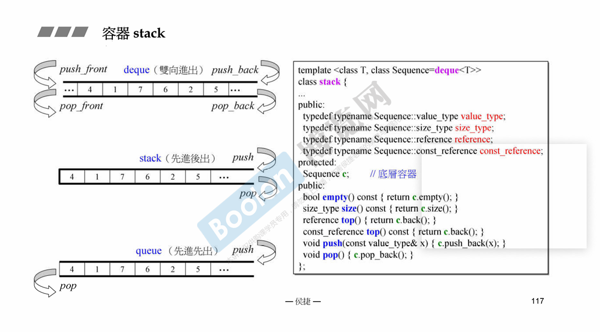

# deuqe 和 queue stack的关系

可以看到 queue 和 stack 的底层容器都是 deque，其函数都是用queue的接口；

stack 和 queue 都不允许遍历，所以不提供 iterator：
  因为 stack 和 queue 设计的初衷就是想要其特性(先进后出，先进先出)，所以不允许遍历；

可以用其他容器作为底层吗？
stack 可以使用vector，但是queue不行

都不能使用 set或map

