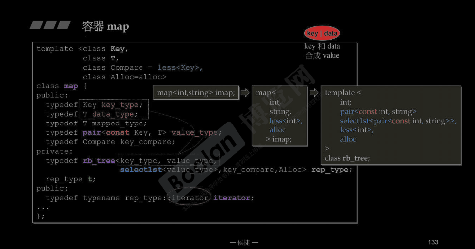

参考：https://c.biancheng.net/view/7173.html

# map

map 容器存储的都是 pair 对象，也就是用 pair 类模板创建的键值对。其中，各个键值对的键和值可以是任意数据类型，包括 C++ 基本数据类型（int、double 等）、使用结构体或类自定义的类型。

> 通常情况下，map 容器中存储的各个键值对都选用 string 字符串作为键的类型。

与此同时，在使用 map 容器存储多个键值对时，该容器会自动根据各键值对的键的大小，按照既定的规则进行排序。默认情况下，map 容器选用std::less<T>排序规则（其中 T 表示键的数据类型），其会根据键的大小对所有键值对做升序排序。当然，根据实际情况的需要，我们可以手动指定 map 容器的排序规则，既可以选用 STL 标准库中提供的其它排序规则（比如std::greater<T>），也可以自定义排序规则。



另外需要注意的是，使用 map 容器存储的各个键值对，**键的值既不能重复也不能被修改**(基于红黑树)。换句话说，map 容器中存储的各个键值对不仅键的值独一无二，键的类型也会用 const 修饰，这意味着只要键值对被存储到 map 容器中，其键的值将不能再做任何修改。

> 前面提到，map 容器存储的都是 pair 类型的键值对元素，更确切的说，该容器存储的都是 pair<const K, T> 类型（其中 K 和 T 分别表示键和值的数据类型）的键值对元素。

map 容器定义在 <map> 头文件中，并位于 std 命名空间中。

C++ map容器包含的成员方法

[](../图片/map的成员方法.png)

## map容器迭代器用法详解

C++ STL 标准库为 map 容器配备的是双向迭代器（bidirectional iterator）。这意味着，map 容器迭代器只能进行 ++p、p++、--p、p--、*p 操作，并且迭代器之间只能使用 == 或者 != 运算符进行比较。

值得一提的是，相比序列式容器，map 容器提供了更多的成员方法，通过调用它们，我们可以轻松获取具有指定含义的迭代器。

`lower_bound(key)` 返回的是指向第一个键不小于 key 的键值对的迭代器；
`upper_bound(key)` 返回的是指向第一个键大于 key 的键值对的迭代器；

> `lower_bound(key)` 和 `upper_bound(key)` 更多用于 multimap 容器，在 map 容器中很少用到。

`equal_range(key)` 成员方法可以看做是 `lower_bound(key)` 和 `upper_bound(key)` 的结合体，该方法会返回一个 `pair` 对象，其中的 2 个元素都是迭代器类型，其中 `pair.first` 实际上就是 l`ower_bound(key)` 的返回值，而 `pair.second` 则等同于 u`pper_bound(key)` 的返回值。

显然，equal_range(key) 成员方法表示的一个范围，位于此范围中的键值对，其键的值都为 key
和 lower_bound(key)、upper_bound(key) 一样，该方法也更常用于 multimap 容器，因为 map 容器中各键值对的键的值都是唯一的，因此通过 map 容器调用此方法，其返回的范围内最多也只有 1 个键值对。

## map 获取键对应值的几种方法

我们知道，map 容器中存储的都是 pair 类型的键值对，但几乎在所有使用 map 容器的场景中，经常要做的不是找到指定的 pair 对象（键值对），而是从该容器中找到某个键对应的值。

>注意，使用 map 容器存储的各个键值对，其键的值都是唯一的，因此指定键对应的值最多有 1 个。

庆幸的是，map 容器的类模板中提供了以下 2 种方法，可直接获取 map 容器指定键对应的值。

1. map 类模板中对`[ ]`运算符进行了重载，这意味着，类似于借助数组下标可以直接访问数组中元素，通过指定的键，我们可以轻松获取 map 容器中该键对应的值。

注意，只有当 map 容器中确实存有包含该指定键的键值对，借助重载的 [ ] 运算符才能成功获取该键对应的值；反之，若当前 map 容器中没有包含该指定键的键值对，则此时使用 [ ] 运算符将不再是访问容器中的元素，而变成了向该 map 容器中增添一个键值对。其中，该键值对的键用 [ ] 运算符中指定的键，其对应的值取决于 map 容器规定键值对中值的数据类型，如果是基本数据类型，则值为 0；如果是 string 类型，其值为 ""，即空字符串（即使用该类型的默认值作为键值对的值）。

2.  除了借助 [ ] 运算符获取 map 容器中指定键对应的值，还可以使用 at() 成员方法。和前一种方法相比，at() 成员方法也需要根据指定的键，才能从容器中找到该键对应的值；不同之处在于，如果在当前容器中查找失败，该方法不会向容器中添加新的键值对，而是直接抛出 out_of_range 异常。

3. 除了可以直接获取指定键对应的值之外，还可以借助 find() 成员方法间接实现此目的。和以上 2 种方式不同的是，该方法返回的是一个迭代器，即如果查找成功，该迭代器指向查找到的键值对；反之，则指向 map 容器最后一个键值对之后的位置（和 end() 成功方法返回的迭代器一样）。

如果以上方法都不适用，我们还可以遍历整个 map 容器，找到包含指定键的键值对，进而获取该键对应的值。比如：
```cpp
#include <iostream>
#include <map>      // map
#include <string>   // string
using namespace std;

int main() {
    //创建并初始化 map 容器
    std::map<std::string, std::string>myMap{ {"STL教程","http://c.biancheng.net/stl/"},
                                             {"C语言教程","http://c.biancheng.net/c/"},
                                             {"Java教程","http://c.biancheng.net/java/"} };

    for (auto iter = myMap.begin(); iter != myMap.end(); ++iter) {
        //调用 string 类的 compare() 方法，找到一个键和指定字符串相同的键值对
        if (!iter->first.compare("C语言教程")) {
            cout << iter->first << " " << iter->second << endl;
        }
    }
    return 0;
}
```

## map insert()插入数据的 4 种方式

当操作对象为 map 容器中已存储的键值对时，则借助 [ ] 运算符，既可以获取指定键对应的值，还能对指定键对应的值进行修改；反之，若 map 容器内部没有存储以 [ ] 运算符内指定数据为键的键值对，则使用 [ ] 运算符会向当前 map 容器中添加一个新的键值对。

实际上，除了使用 [ ] 运算符实现向 map 容器中添加新键值对外，map 类模板中还提供有 `insert()` 成员方法，该方法专门用来向 map 容器中插入新的键值对。

>注意，这里所谓的“插入”，指的是 insert() 方法可以将新的键值对插入到 map 容器中的指定位置，但这与 map 容器会自动对存储的键值对进行排序并不冲突。当使用 insert() 方法向 map 容器的指定位置插入新键值对时，其底层会先将新键值对插入到容器的指定位置，如果其破坏了 map 容器的有序性，该容器会对新键值对的位置进行调整。

自 C++ 11 标准后，insert() 成员方法的用法大致有以下 4 种。

1. 无需指定插入位置，直接将键值对添加到 map 容器中。insert() 方法的语法格式有以下 2 种：
```cpp
//1、引用传递一个键值对
pair<iterator,bool> insert (const value_type& val);
//2、以右值引用的方式传递键值对
template <class P>
    pair<iterator,bool> insert (P&& val);
```
其中，val 参数表示键值对变量，同时该方法会返回一个 pair 对象，其中 pair.first 表示一个迭代器，pair.second 为一个 bool 类型变量：
  + 如果成功插入 val，则该迭代器指向新插入的 val，bool 值为 true；
  + 如果插入 val 失败，则表明当前 map 容器中存有和 val 的键相同的键值对（用 p 表示），此时返回的迭代器指向 p，bool 值为 false。


2.  除此之外，insert() 方法还支持向 map 容器的指定位置插入新键值对，该方法的语法格式如下：
```CPP
//以普通引用的方式传递 val 参数
iterator insert (const_iterator position, const value_type& val);
//以右值引用的方式传递 val 键值对参数
template <class P>
    iterator insert (const_iterator position, P&& val);
```
其中 val 为要插入的键值对变量。注意，和第 1 种方式的语法格式不同，这里 insert() 方法返回的是迭代器，而不再是 pair 对象：
  + 如果插入成功，insert() 方法会返回一个指向 map 容器中已插入键值对的迭代器；
  + 如果插入失败，insert() 方法同样会返回一个迭代器，该迭代器指向 map 容器中和 val 具有相同键的那个键值对。

>再次强调，即便指定了新键值对的插入位置，map 容器仍会对存储的键值对进行排序。也可以说，决定新插入键值对位于 map 容器中位置的，不是 insert() 方法中传入的迭代器，而是新键值对中键的值。

3. insert() 方法还支持向当前 map 容器中插入其它 map 容器指定区域内的所有键值对，该方法的语法格式如下：
```CPP
template <class InputIterator>
  void insert (InputIterator first, InputIterator last);
```
其中 first 和 last 都是迭代器，它们的组合<first,last>可以表示某 map 容器中的指定区域。

4. 除了以上一种格式外，insert() 方法还允许一次向 map 容器中插入多个键值对，其语法格式为：
```CPP
void insert ({val1, val2, ...});
```
其中，vali 都表示的是键值对变量。

## emplace()和emplace_hint()方法详解

C++ STL map 类模板中还提供了 emplace() 和 emplace_hint() 成员函数，也可以实现向 map 容器中插入新的键值对

> 值得一提的是，实现相同的插入操作，无论是用 emplace() 还是 emplace_hont()，都比 insert() 方法的效率高（后续章节会详细讲解）。

和 insert() 方法相比，emplace() 和 emplace_hint() 方法的使用要简单很多，因为它们各自只有一种语法格式。其中，emplace() 方法的语法格式如下：
```CPP
template <class... Args>
  pair<iterator,bool> emplace (Args&&... args);
```
参数 (Args&&... args) 指的是，这里只需要将创建新键值对所需的数据作为参数直接传入即可，此方法可以自行利用这些数据构建出指定的键值对。另外，该方法的返回值也是一个 pair 对象，其中 pair.first 为一个迭代器，pair.second 为一个 bool 类型变量：
  + 当该方法将键值对成功插入到 map 容器中时，其返回的迭代器指向该新插入的键值对，同时 bool 变量的值为 true；
  + 当插入失败时，则表明 map 容器中存在具有相同键的键值对，此时返回的迭代器指向此具有相同键的键值对，同时 bool 变量的值为 false。


emplace_hint() 方法的功能和 emplace() 类似，其语法格式如下：
```cpp
template <class... Args>
  iterator emplace_hint (const_iterator position, Args&&... args);
```
显然和 emplace() 语法格式相比，有以下 2 点不同：
  1. 该方法不仅要传入创建键值对所需要的数据，还需要传入一个迭代器作为第一个参数，指明要插入的位置（新键值对键会插入到该迭代器指向的键值对的前面）；
  
  2. 该方法的返回值是一个迭代器，而不再是 pair 对象。当成功插入新键值对时，返回的迭代器指向新插入的键值对；反之，如果插入失败，则表明 map 容器中存有相同键的键值对，返回的迭代器就指向这个键值对。

注意，和 insert() 方法一样，虽然 emplace_hint() 方法指定了插入键值对的位置，但 map 容器为了保持存储键值对的有序状态，可能会移动其位置。

## 为什么 emplace() 和 emplace_hint() 方法的执行效率，比 insert() 高呢？

emplace() 和 emplace_hint() 的执行效率通常比 insert() 高，主要是因为它们避免了不必要的对象复制和临时对象创建.

1. insert() 的工作方式
当你使用 insert() 方法插入元素时，你通常会传递一个对象或临时对象作为参数。例如：
```cpp
std::map<int, std::string> myMap;
myMap.insert(std::make_pair(1, "hello"));

```
在这个例子中，std::make_pair(1, "hello") 会首先创建一个 std::pair 对象，然后将这个对象传递给 insert()。接着，insert() 会将这个 std::pair 对象插入到容器中。这意味着至少发生了一次对象构造和复制操作，具体的步骤如下：
  1. 调用 std::make_pair() 创建一个临时 std::pair 对象。
  2. 将这个临时对象传递给 insert() 方法。
  3. insert() 再将这个对象复制到容器中。

2. emplace() 的工作方式
emplace() 方法则提供了一种更高效的插入方式。它允许你直接传递构造函数的参数，而不是先构造一个对象再插入。例如：
```cpp
myMap.emplace(1, "hello");

```
在这个例子中，emplace() 会直接在容器内部构造元素，这样就避免了临时对象的创建和复制，具体步骤如下：
  1. emplace() 直接在容器中分配内存，并使用传递的参数来构造元素。
  2. 不会创建和复制临时对象

因此，emplace() 通常比 insert() 更高效，尤其是在涉及复杂对象时，它可以显著减少对象构造、复制和析构的开销。

3. emplace_hint() 的工作方式
emplace_hint() 是 emplace() 的一个变种，除了提供构造参数外，它还接受一个迭代器作为参数，指示插入位置的提示。例如：
```cpp
myMap.emplace_hint(myMap.end(), 1, "hello");

```
如果你已经知道元素大致会插入的位置，emplace_hint() 可以利用这个提示来加速插入过程，进一步提升性能。与 emplace() 相比，它减少了在某些容器中寻找插入位置的时间。


