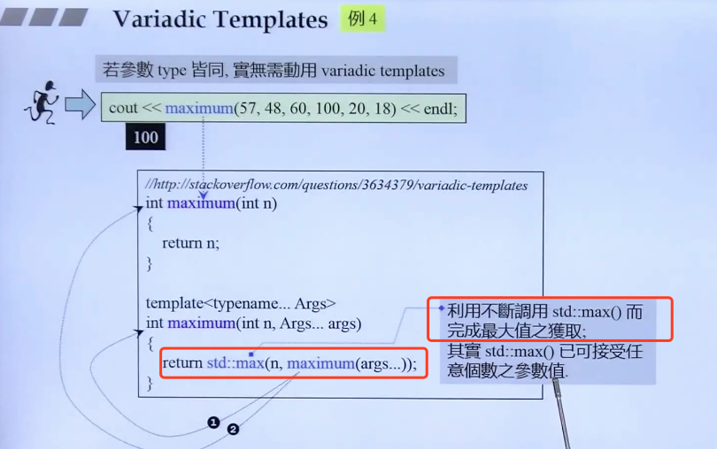

# Variadic Templates

在C++中，数量不定的参数模板（variadic template）是一种允许模板接受可变数量参数的特性。它在C++11中引入，适用于函数模板和类模板。以下是使用数量不定参数模板的一些基本概念和示例。

## 1. 基本语法
在定义数量不定的参数模板时，使用省略号（`...`）表示参数包。以下是一个简单的函数模板示例：
```cpp
template<typename... Args>
void print(Args... args) {
    // 使用递归展开参数包
    (std::cout << ... << args) << std::endl;
}

```
## 2. 参数包展开
数量不定参数模板通常与参数包展开（parameter pack expansion）一起使用。参数包展开是指将参数包中的参数依次展开并应用到操作中。

递归展开
递归展开是一种常见的方法，结合递归函数调用来处理参数包中的每个参数。
```cpp
template<typename T>
void print(T t) {
    std::cout <<"sss:"<< t << std::endl;
}

template<typename T, typename... Args>
void print(T t, Args... args) {
    std::cout << t << " ";
    print(args...);  // 递归调用
}

```
输出： 1 2 3.14 sss:Hello, world!

折叠表达式（C++17）
C++17 引入了折叠表达式（fold expression），它简化了递归展开的过程。
```cpp
template<typename... Args>
void print(Args... args) {
    (std::cout << ... << args) << std::endl;  // 一元右折叠
}

```

## 3. 应用场景
数量不定参数模板可以用于实现诸如日志函数、序列化/反序列化函数、智能指针的包装类等场景。例如：
```cpp
template<typename T, typename... Args>
std::shared_ptr<T> make_shared(Args&&... args) {
    return std::shared_ptr<T>(new T(std::forward<Args>(args)...));
}

```

# variadic templates-2


## Example 3：处理参数个数不限，但类型相同的情况 - initializer_list

实现max函数：在while中两两比较大小，存下满足comp运算规则的变量，comp参数所代表的结构体对象用来指定规则


## Example 4 : 利用标准库函数，实现同类型，个数不定的函数参数调用，与上不同的是不需要加大括号




## Example 5：用异于一般的方式，处理 first 元素和 last 元素

实现 cout<<make_tuple(7.5,string("hello"),bitset<16>(377),42)<<endl; 输出 [7.5,hello,0000000101111001,42]

需要单独处理首尾，即在首尾加上 []，并且最后一位输出删去 ,


## Example 6：用于递归继承 - 在递归中继承尾部类

模版类：tuple<Head,Tail>

继承：tuple<Tail>

构造函数 设初值：tuple(Head v, Tail... vtail) : m_head,inherited(vtail...){ }


## 


