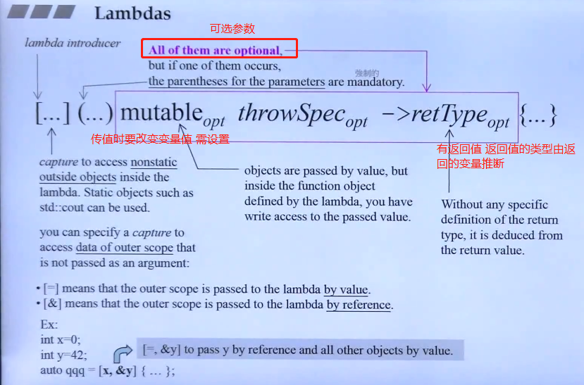
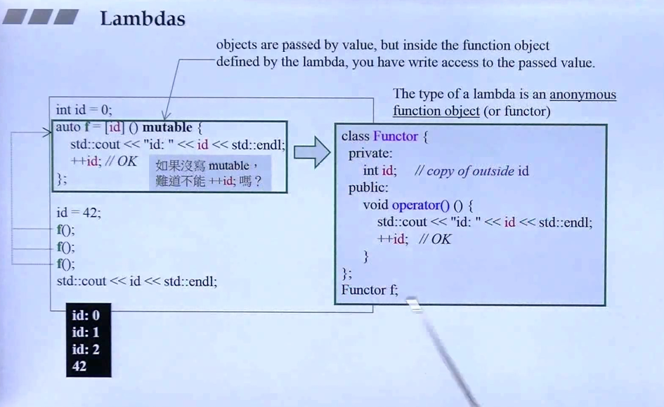
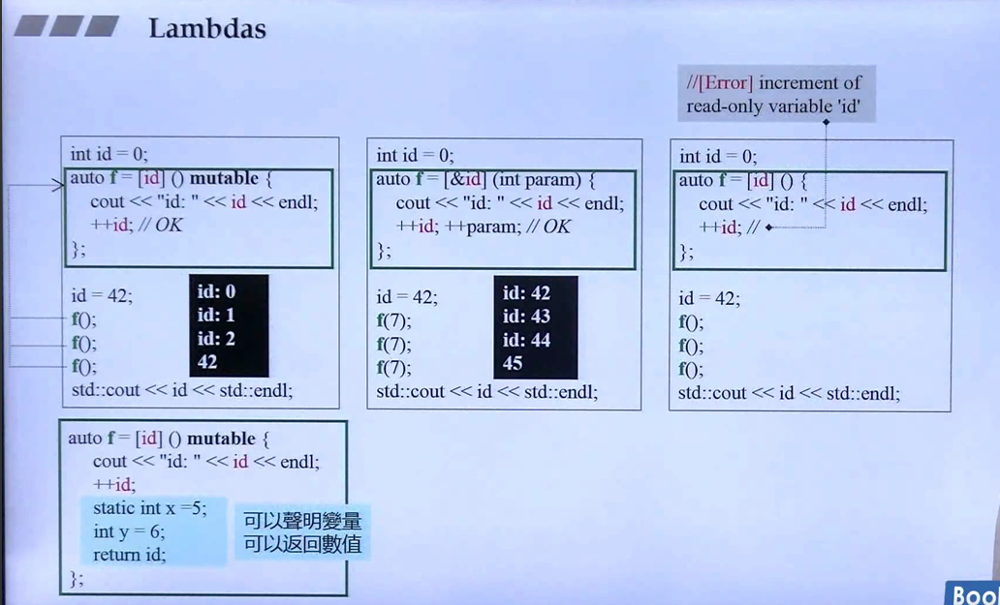
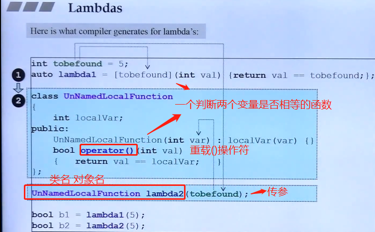
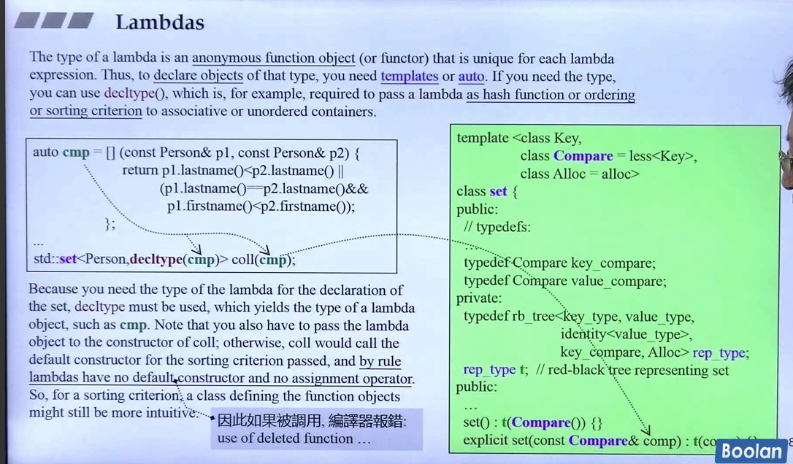

# Lambda 表达式

注意：表达式要写引用，否则消耗内存很严重
  ```cpp
  //leetcode 452
   sort(points.begin(),points.end(),[](const vector<int>a,const vector<int>b){return a[0]<b[0];}); //未加引用消耗内存536MB

   sort(points.begin(),points.end(),[](const vector<int>&a,const vector<int>&b){return a[0]<b[0];}); //加引用消耗91MB
  ```

Lambda 表达式是 C++11 引入的一种匿名函数，用于创建临时的、可以在需要的地方使用的函数对象。它们可以用来定义简短的函数体，而不需要为每个函数单独定义一个命名的函数。Lambda 表达式可以捕获周围的变量，并直接在其体内使用它们。



注意mutable：
  默认情况下，捕获的变量是只读的，因为 lambda 表达式的 operator() 是 const 的，而 mutable 关键字会移除这个 const 限制，使得捕获的变量可以在 lambda 体内修改。

  通过使用 mutable，我们可以在 lambda 内部修改捕获的变量 x。需要注意的是，修改的是 lambda 内部的 x 的副本，原来的 x 不会受到影响。

  不使用 mutable，外界的变量不会影响捕获变量





```cpp
[capture](parameters) -> return_type {
    // function body
}
```
  捕获列表 [capture]：指定 lambda 表达式可以访问的外部变量。捕获列表可以包含按值捕获、按引用捕获或两者的组合。
  参数列表 (parameters)：指定 lambda 表达式接受的参数，与普通函数类似。如果没有参数，可以省略括号。 
  返回类型 -> return_type（可选）：指定 lambda 表达式的返回类型。如果省略，编译器会自动推导。
  函数体：定义 lambda 表达式的实际操作代码。


+ lambda 与匿名函数对象互转：


+ 用lambda定义 com，用decltype取其类型，然后传递lambda表达式；


## 使用 & 和 [] 的区别在于如何捕获外部变量：
1.  []（空捕获列表）
使用空的捕获列表 [] 表示 lambda 不捕获任何外部变量。这意味着你不能在 lambda 内部访问任何外部变量。

2. [&]（按引用捕获）
使用 & 表示按引用捕获所有外部变量。这意味着 lambda 可以在其体内访问和修改外部变量的值。

什么时候使用
  使用 []：如果你的 lambda 不需要访问外部变量，可以使用空捕获列表。这通常用于简化和提高性能。

  使用 [&]：当你需要在 lambda 内部访问或修改外部变量时，使用按引用捕获。这使得 lambda 能够访问任何在其作用域内的变量。
```cpp
int x = 10;

// 不捕获任何外部变量
auto lambda1 = []() {
    // 无法访问 x
};

// 按引用捕获外部变量 x
auto lambda2 = [&]() {
    x += 5; // 可以访问并修改 x
};

lambda2(); // x 现在是 15

```

## **带参数的Lambda表达式**
```cpp
#include <iostream>

int main() {
    // Lambda 表达式带有一个参数
    auto add = [](int a, int b) { // [](int a, int b)->int {};
        return a + b;
    };

    // 调用 lambda 表达式
    std::cout << "Sum: " << add(3, 4) << std::endl;

    return 0;
}
```
在这个例子中，[](int a, int b) { return a + b; } 是一个 lambda 表达式，它接受两个整数参数并返回它们的和。

## **捕获外部变量**
```cpp
#include <iostream>

int main() {
    int x = 10;
    int y = 20;

    // Lambda 表达式按值捕获外部变量
    auto sum = [x, y]() {
        return x + y;
    };

    // 调用 lambda 表达式
    std::cout << "Sum: " << sum() << std::endl;

    return 0;
}
```
在这个例子中，[x, y] 捕获了外部变量 x 和 y 的值。lambda 表达式使用这些值进行计算。

## **按引用捕获**
```cpp
#include <iostream>

int main() {
    int x = 10;
    int y = 20;

    // Lambda 表达式按引用捕获外部变量
    auto increment = [&x, &y]() {
        x++;
        y++;
        std::cout << "x: " << x << ", y: " << y << std::endl;
    };

    increment();
    increment();

    return 0;
}

```
在这个例子中，[&x, &y] 按引用捕获了 x 和 y，所以 lambda 表达式可以修改这些变量。

## **自动推导返回类型**
```cpp
#include <iostream>

int main() {
    // Lambda 表达式的返回类型由编译器推导
    auto multiply = [](double a, double b) -> double {
        return a * b;
    };

    std::cout << "Product: " << multiply(3.5, 2.0) << std::endl;

    return 0;
}

```
在这个例子中，-> double 明确指定了 lambda 表达式的返回类型，但如果省略返回类型，编译器通常可以根据返回值推导出正确的类型。
