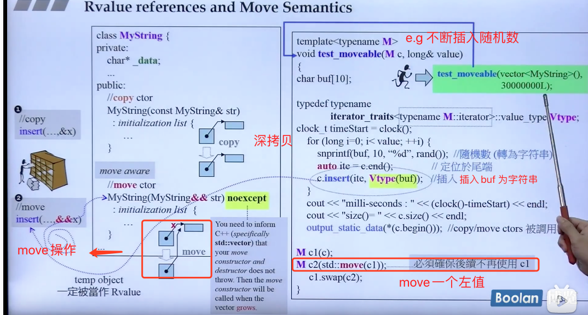
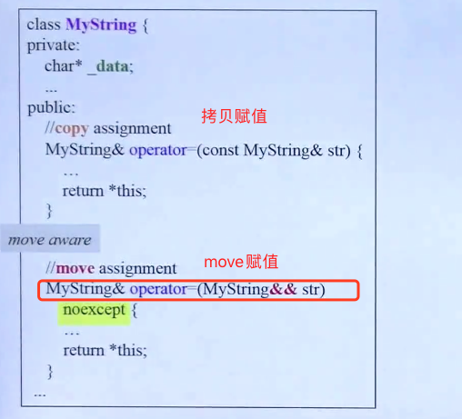
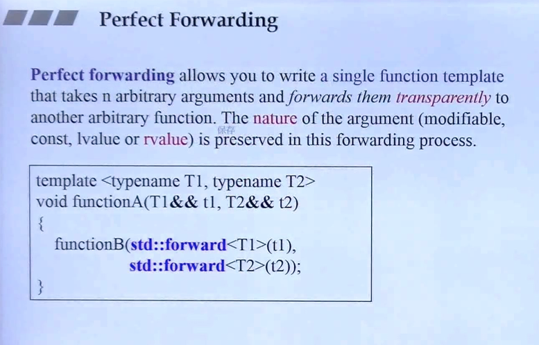
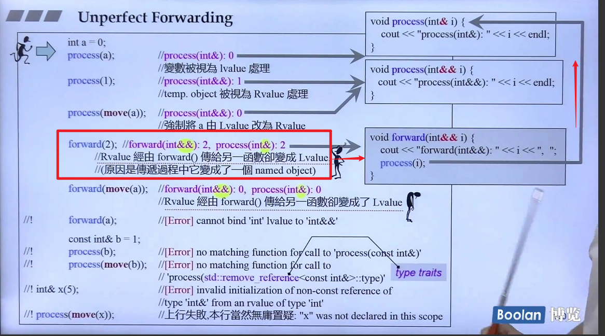
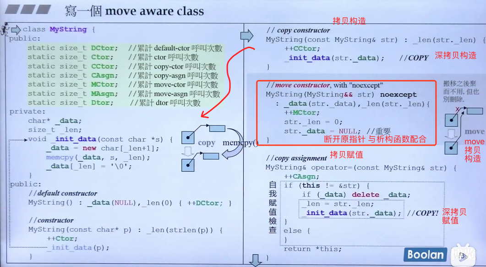
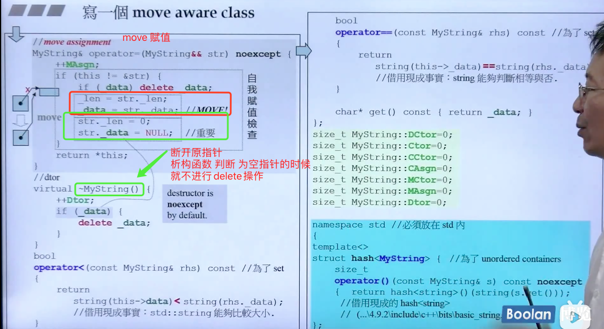

## 1. 左值和右值
1. 左值（lvalue） : local value
左值 是指能够在程序的整个生命周期中持有或引用一个对象的内存地址的表达式。换句话说，左值是指向某个内存位置的表达式，通常可以用在赋值语句的左侧。

特点：
  可以获取它的地址（通过 & 运算符）。
  可以被赋值或修改。
  左值在内存中有明确的存储位置。

2. 右值（rvalue） : read value
右值 是指不具有持久地址的临时对象或表达式，通常出现在赋值语句的右侧。右值不能直接获取其地址，也不能被赋值或修改。

特点：
  右值是临时的，没有明确的存储位置。
  通常是表达式的计算结果，生命周期很短。
  右值不能作为左值引用的目标。

3. 左值和右值的区别
  左值 表示可以持续存在的对象，能够取地址，并且通常能被赋值。
  右值 是临时的，通常不能取地址，也不能被赋值。

4. 左值引用和右值引用
C++ 中有两种引用类型：
  左值引用（lvalue reference）：用 T& 声明，可以绑定到左值。
  右值引用（rvalue reference）：用 T&& 声明，可以绑定到右值。

1、左值和右值的概念
    左值是可以放在赋值号左边可以被赋值的值；左值必须要在内存中有实体；
    右值当在赋值号右边取出值赋给其他变量的值；右值可以在内存也可以在CPU寄存器。
    一个对象被用作右值时，使用的是它的内容(值)，被当作左值时，使用的是它的地址。
2、引用

    引用是C++语法做的优化，引用的本质还是靠指针来实现的。引用相当于变量的别名。

    引用可以改变指针的指向，还可以改变指针所指向的值。

    引用的基本规则：

    声明引用的时候必须初始化，且一旦绑定，不可把引用绑定到其他对象；即引用必须初始化，不能对引用重定义；
    对引用的一切操作，就相当于对原对象的操作。

## 2. & 与 &&
在C++11之前就有引用“&”，但是此种引用有一个缺陷，即正常情况下只能操作 C++ 中的左值，无法对右值添加引用。

右值往往是没有名称的，因此要使用它只能借助引用的方式。这就产生一个问题，实际开发中我们可能需要对右值进行修改（实现移动语义时就需要），显然左值引用的方式是行不通的。

为此，C++11 标准新引入了另一种引用方式，称为右值引用，用 "&&" 表示

这种形式的右值引用并没有实际用处。一方面，右值引用主要用于移动语义和完美转发，其中前者需要有修改右值的权限；其次，常量右值引用的作用就是引用一个不可修改的右值，这项工作完全可以交给常量左值引用完成。

总结：
1. 非常量左值引用可以引用的值的类型只有非常量左值；常量左值引用非常量左值、常量左值及右值
```cpp
	int num = 10;
	int& a = num;	//编译成功，非常量左值引用支持引用非常量左值
	const int num2 = 100;
	int& b = num2;	//编译失败，非常量左值引用不支持引用常量左值
	int& c = 10;	//编译失败，非常量左值引用不支持引用右值
 
	const int& d = num;		//编译成功，常量左值引用支持引用非常量左值
	const int& e = num2;	//编译成功，常量左值引用支持引用常量左值
	const int& f = 100;		//编译成功，常量左值引用支持引用右值
```
2. 右值引用不支持引用左值；非常量右值引用可以引用的值的类型**只有**非常量右值，常量右值引用非常量右值、常量右值
```cpp
	int num = 10;
	const int num2 = 100;
	int&& a = num;	//编译失败，非常量右值引用不支持引用非常量左值
	int&& b = num2;	//编译失败，非常量右值引用不支持引用常量左值
	int&& c =10;	//编译成功，非常量右值引用支持引用非常量右值
	const int&& d = num;	//编译失败，常量右值引用不支持引用非常量左值
	const int&& e = num2;	//编译失败，常量右值引用不支持引用常量左值
	const int&& f = 100;	//编译成功，常量右值引用支持引用右值
```
## 3. 右值引用
拷贝方法：
  + 深拷贝：用一块新内存，存储要拷贝的内容
  + 浅拷贝：用指针指向要拷贝的内容，相当于两个指针指向同一内存
  + move(变量)：用指针指向要拷贝的内容，但删除原来指向该目标内存的指针，即最终只有当前指针指向目标内容块 -> 多用于右值引用，但当某左值确定不再使用时，也可以用这种方式copy

右值引用：即用 move 的方法拷贝右值元素，多用于拷贝临时对象 `e.g insert(...&&x); //x为临时对象`

>Question: string() = "world";s1+s2 = s2;不报错，如何解释？？


```cpp
int foo() { return 5;}
...
int x = foo(); //ok x=5
int *p = &foo();  //[error] 以前不行 不能对右值取引用 int *p = &foo; 可以通过编译，相当于取函数地址
									//c++11就不报错了 相当于取右值的引用
foo() = 7; //同上
```


跟随右值引用出现的 新的拷贝赋值方式：



Perfect Forwarding 完美转交,其实就是万能引用（在move.md中写了）



不完美引用，为什么会调用`void process(int& i)`呢？
   当你调用forward(2);时，2是一个右值，所以它被绑定到forward函数的右值引用参数int&& i。但是在forward函数内部，你通过process(i)调用了process函数，此时i虽然是右值引用类型，但在函数内部，它的名称是一个左值。
   
   虽然i是int&&类型，但一旦你给它取名字（即i），它就变成了一个左值。在C++中，任何有名字的变量都是左值，即使它本来是右值引用类型。因此，process(i)中的i是一个左值。如果希望保持右值引用属性并调用process(int&& i)，你需要使用std::move(i)或std::forward(i)。


右值引用的拷贝构造与拷贝赋值（使用move）：
重新定义一个string类：
  注意的是：move拷贝构造的时候，把原指针指向 null，这样配合临时变量的析构函数（临时变量的生命周期只在哪一行），当临时变量调用析构函数时，摧毁内存；





