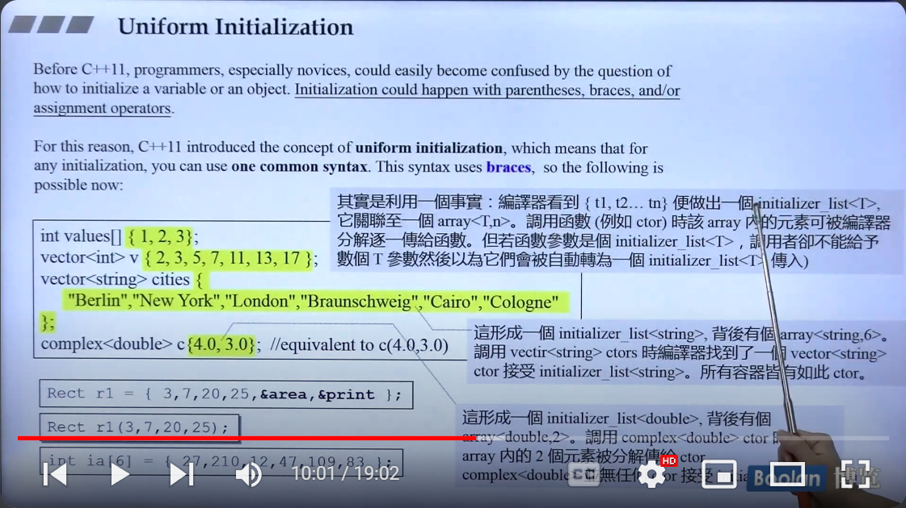
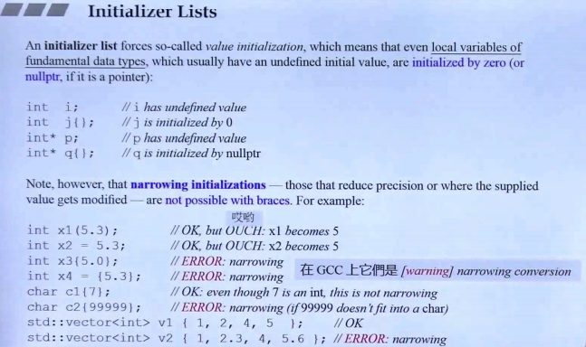
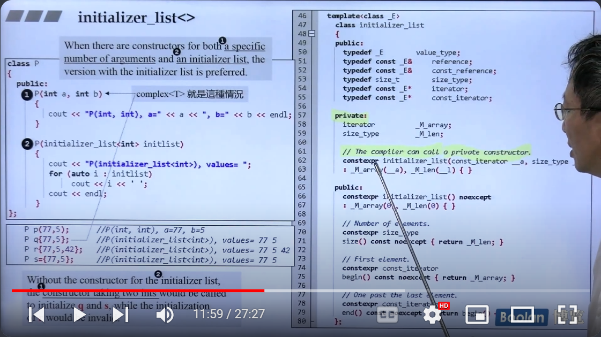

# 3.uniform initialization

使用大括号直接赋初值



原理：编译器看到大括号里的数值，就会生成一个 initializer_list<T> ，他背面其实就是是一个 array<T,n>。调用构造函数的时候，如果已经有 initializer_list<T> 则直接传递 生成的initializer_list<T>;如果没有 会发生隐式转换

大括号赋初值，会有默认初值，赋初值的内容与声明的类型不一致时，会报错or warning



## initializer_list<T>

这里是上面那一部分的例子，假如提供了 initializer_list<T> 构造函数，则 q,r,s都调用；
假如不提供 initializer_list<T>这个构造函数，则q,s会调用1；


1. 基本语法
std::initializer_list<T> 是一个模板类，其中 T 是列表中元素的类型。你可以通过使用大括号 {} 直接创建一个 initializer_list。
```cpp
std::initializer_list<int> list = {1, 2, 3, 4};

```
2. 使用示例
函数参数
std::initializer_list<T> 常用于函数的参数，以接受不定数量的参数：
```cpp
#include <initializer_list>
#include <iostream>

void printList(std::initializer_list<int> list) {
    for (int elem : list) {
        std::cout << elem << " ";
    }
    std::cout << std::endl;
}

int main() {
    printList({1, 2, 3, 4, 5});  // 传递初始化列表
    return 0;
}

```
类构造函数
你可以在类的构造函数中使用 std::initializer_list 来实现对象初始化：
```cpp
#include <initializer_list>
#include <iostream>

class MyClass {
public:
    MyClass(std::initializer_list<int> list) {
        for (int elem : list) {
            std::cout << elem << " ";
        }
        std::cout << std::endl;
    }
};

int main() {
    MyClass obj = {1, 2, 3, 4};  // 通过初始化列表调用构造函数
    return 0;
}

```
3.  成员函数
std::initializer_list<T> 提供了一些成员函数来访问元素和属性：
  
  size()：返回列表中的元素数量。
  begin()：返回指向列表首元素的指针。
  end()：返回指向列表末元素后一个位置的指针。
4. 与其他容器的关系
std::initializer_list<T> 是一种只读类型，因此你不能修改其中的元素。此外，它与标准容器不同，没有提供动态添加或删除元素的功能。它主要用于初始化和传递固定数量的元素。

如果你需要将 initializer_list 转换为其他容器类型（如 std::vector），可以使用构造函数或范围构造函数：
```cpp
std::initializer_list<int> list = {1, 2, 3};
std::vector<int> vec(list);  // 将 initializer_list 转换为 vector

```


