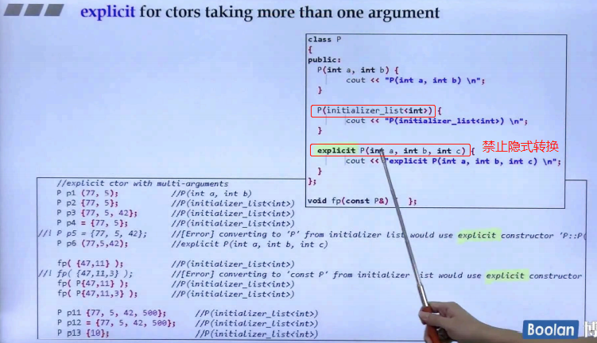

#  explicit

隐式转换条件：一个实参 的 non-exlicit 构造函数
explicit 关键字 - 禁止隐式转换 基本只用于构造函数（模板也有）

explicit 关键字是 C++ 中的一个修饰符，用于防止编译器在不经意间进行隐式类型转换。它主要用于构造函数和转换操作符，以避免不必要或潜在的错误的自动类型转换。

使用场景
1. 构造函数： 当构造函数只有一个参数时，编译器可以自动将该参数转换为类的类型，这可能会导致意外的行为。通过将构造函数声明为 explicit，可以防止这种隐式转换。

```cpp
class MyClass {
public:
    explicit MyClass(int x); // 只允许显式转换
};

void func(MyClass obj);

int main() {
    func(10); // 编译错误：不能隐式转换 int 为 MyClass
    func(MyClass(10)); // 正确：显式转换
}
```

2. 转换操作符： 当定义转换操作符时，explicit 可以防止隐式类型转换，确保只有显式调用时才会执行转换
```cpp
class MyClass {
public:
    explicit operator int() const; // 只允许显式转换
};

void func(int x);

int main() {
    MyClass obj;
    func(obj); // 编译错误：不能隐式转换 MyClass 为 int
    func(static_cast<int>(obj)); // 正确：显式转换
}
```


