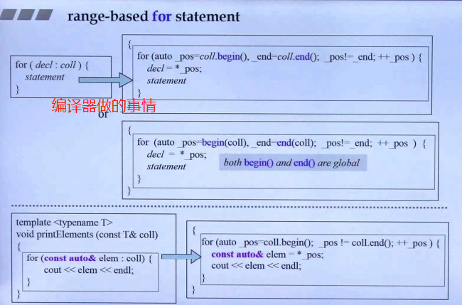

```cpp
for(decl : coll){
	statement
}

for(int i:{2,3,5,7,9,13,17,19}){
    cout << i << endl;
}

vector<double> vec;
for(auto elem : vec){
    cout << elem << endl;
}
for(auto& elem:vec){  //reference
    elem *= 3;
}
```

