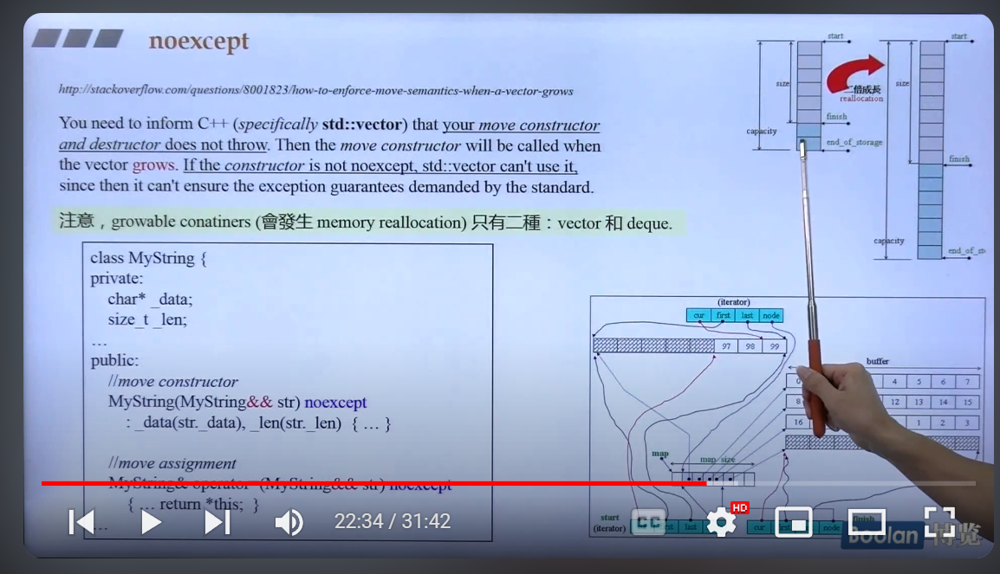
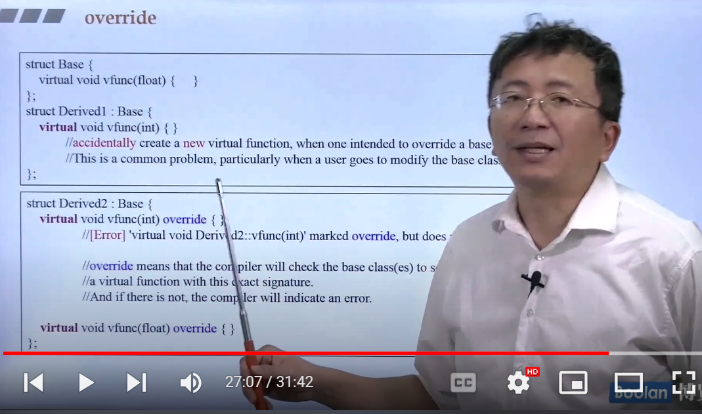

#  noexcept

`noexcept` 是 C++11 引入的一个关键字，用于指定函数不会抛出异常。它的主要作用是向编译器和程序员明确表明一个函数在执行过程中不会抛出异常。

在函数声明中使用 `noexcept`，如 `thread() noexcept;`，表示这个 `thread` 函数保证不会抛出异常。它可以带来以下几个好处：

1. 优化性能：如果编译器知道一个函数不会抛出异常，它可以生成更高效的代码。例如，可以避免异常处理的开销，特别是在一些情况下（如内存分配失败）进行不必要的检查。

2. 提高代码安全性：使用 noexcept 明确标记函数的异常保证，可以让代码更容易维护和理解，特别是在多线程环境或资源受限的系统中。

3. 与标准库的兼容性：C++标准库中的许多函数也使用 noexcept，如果你的自定义函数也符合这些约定，可能会更好地与标准库结合使用。

假如定义移动构造，一定要加上 noexcept

# override 关键字

virtual + 返回值类型 函数名（参数列表）+ override + {…}：子类重写虚函数时，表明该函数是重载的，帮助编译器判断重载有误与否

# final 关键字
+ 类名 + final + {…}：用来修饰class，表示该类不允许继承
+ vitual + 返回值类型 函数名（参数列表）+ final ：该虚函数不允许重写

