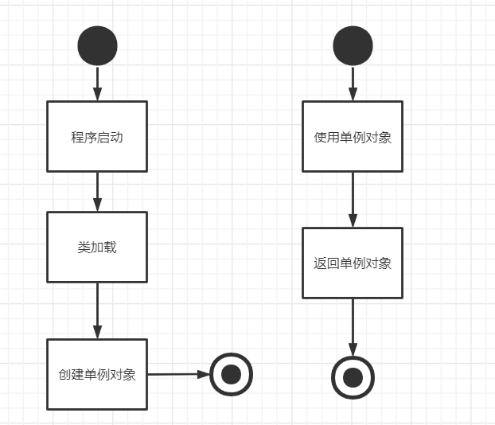
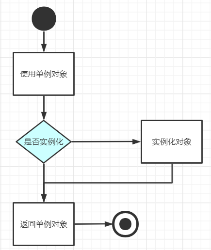
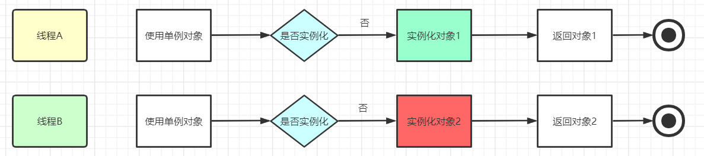
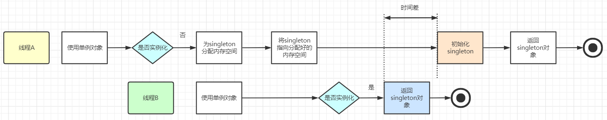

# 单例模式
## 1. 什么是单例模式
面试官问什么是单例模式时，千万不要答非所问，给出单例模式有两种类型之类的回答，要围绕单例模式的定义去展开。

单例模式是指在内存中只会创建且仅创建一次对象的设计模式。在程序中多次使用同一个对象且作用相同时，为了防止频繁地创建对象使得内存飙升，单例模式可以让程序仅在内存中创建一个对象，让所有需要调用的地方都共享这一单例对象。

## 2. 单例模式的实现方法
单例模式有两种类型：
 + 饿汉式：在类加载时已经创建好该单例对象，等待被程序使用
 + 懒汉式：在真正需要使用对象时才去创建该单例类对象

### 1. 饿汉式（Eager Initialization）
这种方式是在**类加载**时就**创建实例**，因此无论是否需要使用这个实例，都会占用一部分内存。对象在类加载时就创建了，因此在整个程序运行期间都会占用内存空间。
在程序调用时直接返回该单例对象即可，即我们在编码时就已经指明了要马上创建这个对象，不需要等到被调用时再去创建。


```cpp
class Singleton {
public:
    static Singleton& getInstance() {
        static Singleton instance; // 静态局部变量保证只初始化一次
        return instance;
    }

    void someMethod() {
        // 实现方法
    }

private:
    Singleton() {} // 私有构造函数

    ~Singleton() {} // 私有析构函数

    Singleton(const Singleton&) = delete; // 禁止复制构造函数
    Singleton& operator=(const Singleton&) = delete; // 禁止赋值操作符
};
```

### 2. 懒汉式（Lazy Initialization）
这种方式是在第一次使用时才创建实例，节省了不必要的内存消耗。
懒汉式单例模式使用**指针**来延迟实例的创建：

懒汉式创建对象的方法是在程序使用对象前，先判断该对象是否已经实例化（判空），若已实例化直接返回该类对象。，否则则先执行实例化操作。


```cpp
class Singleton {
public:
    static Singleton* getInstance() {
        static Singleton* instance = nullptr;
        if (instance == nullptr) {
            instance = new Singleton();
        }
        return instance;
    }

    void someMethod() {
        // 实现方法
    }

private:
    Singleton() {} // 私有构造函数

    ~Singleton() { delete this; } // 私有析构函数

    Singleton(const Singleton&) = delete; // 禁止复制构造函数
    Singleton& operator=(const Singleton&) = delete; // 禁止赋值操作符
};
```

使用示例
```cpp
int main() {
    // 通过 GetInstance 获取 Singleton 的唯一实例
    Singleton* s1 = Singleton::GetInstance();
    Singleton* s2 = Singleton::GetInstance();

    // s1 和 s2 是同一个实例
    if (s1 == s2) {
        std::cout << "s1 and s2 are the same instance." << std::endl;
    }

    return 0;
}
```

### 线程安全
在多线程环境下，饿汉式单例模式通常是线程安全的。这是因为饿汉式单例模式在类加载时就创建了单例对象，并且这个对象的创建是在类加载过程中完成的。

在多线程环境下，懒汉式的单例模式需要保证线程安全，否则多个线程可能同时创建多个实例。
试想一下，如果两个线程同时判断singleton为空，那么它们都会去实例化一个Singleton对象，这就变成双例了。所以，我们要解决的是线程安全问题。



#### 使用互斥锁
```cpp
#include <mutex>

class Singleton {
public:
    static Singleton* getInstance() {
        std::lock_guard<std::mutex> lock(mutex_); // RAII风格的锁
        if (instance_ == nullptr) {
            instance_ = new Singleton();
        }
        return instance_;
    }

    void someMethod() {
        // 实现方法
    }

private:
    Singleton() {} // 私有构造函数

    ~Singleton() { delete this; } // 私有析构函数

    Singleton(const Singleton&) = delete; // 禁止复制构造函数
    Singleton& operator=(const Singleton&) = delete; // 禁止赋值操作符

    static Singleton* instance_; // 静态成员变量
    static std::mutex mutex_; // 互斥锁
};

Singleton* Singleton::instance_ = nullptr;
std::mutex Singleton::mutex_;
```

#### 双重检查锁定（Double-Checked Locking）
这是一种优化的懒汉式单例模式，通过两次检查来减少加锁的范围。
```cpp
class Singleton {
public:
    static Singleton* getInstance() {
        if (instance_ == nullptr) {
            std::lock_guard<std::mutex> lock(mutex_);
            if (instance_ == nullptr) {
                instance_ = new Singleton();
            }
        }
        return instance_;
    }

    void someMethod() {
        // 实现方法
    }

private:
    Singleton() {} // 私有构造函数

    ~Singleton() { delete this; } // 私有析构函数

    Singleton(const Singleton&) = delete; // 禁止复制构造函数
    Singleton& operator=(const Singleton&) = delete; // 禁止赋值操作符

    static Singleton* instance_; // 静态成员变量
    static std::mutex mutex_; // 互斥锁
};

Singleton* Singleton::instance_ = nullptr;
std::mutex Singleton::mutex_;
```
为什么要用双检测，只检测一次不行吗？
  如果只检测一次，在每次调用获取实例的方法时，都需要加锁，这将严重影响程序性能。双层检测可以有效避免这种情况，仅在第一次创建单例的时候加锁，其他时候都不再符合NULL == p的情况，直接返回已创建好的实例。

##### 指令重排
指令重排（Instruction Reordering）是指编译器、处理器或运行时环境为了优化性能而重新安排指令执行顺序的行为。这种行为在不影响单线程程序语义的前提下进行，但是在多线程环境中可能导致不可预测的行为，尤其是在涉及共享数据的情况下。

在多线程环境中，指令重排可能会导致以下问题：
 1. 数据竞争：
  + 如果多个线程访问同一变量并且至少有一个线程对其进行写入，那么指令重排可能导致数据竞争（Data Race）。
 2. 可见性问题：
  + 一个线程修改了共享变量，但由于指令重排，另一个线程可能看不到这个修改。
 3. 顺序一致性问题：
  + 在多核或多处理器系统中，指令重排可能导致内存访问顺序与程序顺序不一致。

创建一个对象，在JVM中会经过三步：
 （1）为singleton分配内存空间

 （2）初始化singleton对象

 （3）将singleton指向分配好的内存空间

在这三步中，第2、3步有可能会发生指令重排现象，创建对象的顺序变为1-3-2，会导致多个线程获取对象时，有可能线程A创建对象的过程中，执行了1、3步骤，线程B判断singleton已经不为空，获取到未初始化的singleton对象，就会报NPE异常。文字较为晦涩，可以看流程图：



使用 std::call_once 和 std::once_flag：
  std::call_once 是 C++11 中提供的一个函数模板，可以确保某个函数只被调用一次，即使有多个线程同时调用它。


```cpp
#include <mutex>
#include <memory>
#include <once_flag>

class Singleton {
public:
    static Singleton* getInstance() {
        std::call_once(flag_, [] {
            instance_ = std::make_unique<Singleton>();
        });
        return instance_.get();
    }

    void someMethod() {
        // 实现方法
    }

private:
    Singleton() {} // 私有构造函数

    Singleton(const Singleton&) = delete; // 禁止复制构造函数
    Singleton& operator=(const Singleton&) = delete; // 禁止赋值操作符

    static std::unique_ptr<Singleton> instance_; // 智能指针管理单例对象
    static std::once_flag flag_; // 用于确保初始化只发生一次
};

std::unique_ptr<Singleton> Singleton::instance_; // 静态成员变量定义
std::once_flag Singleton::flag_;

```

参考链接：https://zhuanlan.zhihu.com/p/160842212


### 使用局部变量懒汉不用加锁
自 C++11 以来，局部静态变量在第一次被使用时会被初始化，且该初始化是线程安全的。这意味着在多线程环境中，即使多个线程同时调用 get_instance()，也不会出现竞争条件，instance 只会被初始化一次。
```cpp
class Log {
public:
    static Log* get_instance() {
        static Log instance; // 局部静态变量
        return &instance;
    }

private:
    Log() {} // 私有构造函数，防止外部实例化
    ~Log() {} // 私有析构函数
};

```


