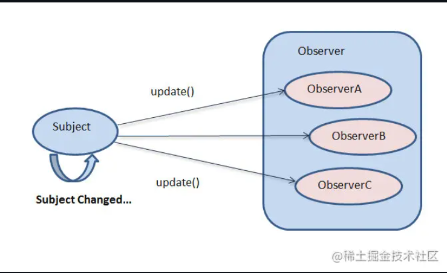

# 观察者模式

观察者模式（Observer Pattern）是一种行为设计模式，它定义了对象之间的一对多依赖关系，当一个对象（被观察对象，也称为主题或可观察对象）的状态发生变化时，所有依赖它的对象（观察者）都会收到通知并自动更新。这种模式在许多场景中都非常有用，比如图形用户界面（GUI）中的事件处理、消息通知系统等。

观察者模式所做的工作其实就是在解耦，让耦合的双方都依赖于抽象而不是具体，从而使得各自的变化都不会影响另一边的变化。当一个对象的改变需要改变其他对象的时候，而且它不知道具体有多少对象有待改变的时候，应该考虑使用观察者模式。一旦观察目标的状态发生改变，所有的观察者都将得到通知。

具体来说就是被观察者需要用一个容器比如vector存放所有观察者对象，以便状态发生变化时给观察着发通知。观察者内部需要实例化被观察者对象的实例（需要前向声明）




观察者模式中主要角色--2个接口,2个类

1. 抽象主题（Subject）角色(接口)：也称为可观察对象，它维护一个观察者列表，提供方法来注册、移除观察者，并且在自身状态发生变化时通知所有注册的观察者。

2. 抽象观察者（Observer）角色(接口)：定义了一个更新接口，当主题状态改变时，该接口会被调用以通知观察者进行相应的更新操作。

3. 具体主题（ConcreteSubject）角色(1个)：继承自主题，实现了主题的抽象方法，维护具体的状态，并在状态改变时调用通知方法。

4. 具体观察者（ConcretedObserver）角色(多个)：继承自观察者，实现了更新接口，在接收到主题的通知时执行具体的更新逻辑。

```cpp
#include <iostream>
#include <vector>
#include <memory>

// 前向声明
class Observer;

// 主题接口`
class Subject {
public:
    virtual void attach(std::shared_ptr<Observer> observer) = 0;
    virtual void detach(std::shared_ptr<Observer> observer) = 0;
    virtual void notify() = 0;
    virtual ~Subject() = default;
};

// 观察者接口
class Observer {
public:
    virtual void update() = 0;
    virtual ~Observer() = default;
};

// 具体主题类
class ConcreteSubject : public Subject {
private:
    std::vector<std::shared_ptr<Observer>> observers;
    int state;

public:
    void attach(std::shared_ptr<Observer> observer) override {
        observers.push_back(observer);
    }

    void detach(std::shared_ptr<Observer> observer) override {
        for (auto it = observers.begin(); it != observers.end(); ++it) {
            if (*it == observer) {
                observers.erase(it);
                break;
            }
        }
    }

    void notify() override {
        for (const auto& observer : observers) {
            observer->update();
        }
    }

    void setState(int newState) {
        state = newState;
        notify();
    }

    int getState() const {
        return state;
    }
};

// 具体观察者类
class ConcreteObserver : public Observer {
private:
    std::shared_ptr<ConcreteSubject> subject;
    int observerID;

public:
    ConcreteObserver(std::shared_ptr<ConcreteSubject> sub, int id) : subject(sub), observerID(id) {
        subject->attach(shared_from_this());
    }

    void update() override {
        std::cout << "Observer " << observerID << " received update. New state is: " << subject->getState() << std::endl;
    }
};

int main() {
    auto subject = std::make_shared<ConcreteSubject>();

    auto observer1 = std::make_shared<ConcreteObserver>(subject, 1);
    auto observer2 = std::make_shared<ConcreteObserver>(subject, 2);

    subject->setState(10);

    subject->detach(observer2);

    subject->setState(20);

    return 0;
}
```

优点
+ 观察者模式在被观察者和观察者之间建立一个抽象的耦合。被观察者角色所知道的只是一个具体观察者列表，每一个具体观察者都符合一个抽象观察者的接口。被观察者并不认识任何一个具体观察者，它只知道它们都有一个共同的接口。
+ 观察者模式支持广播通讯。被观察者会向所有的登记过的观察者发出通知

缺点
+ 通知顺序不确定：观察者接收到通知的顺序可能是不确定的，这在某些对顺序敏感的场景中可能会有问题。
+ 性能问题：如果有大量的观察者，通知所有观察者可能会导致性能下降。


shared_from_this(): shared_from_this() 是 std::enable_shared_from_this 类提供的一个成员函数，用于在对象内部安全地获取指向自身的 std::shared_ptr。

作用和使用场景 : 

在观察者模式的代码里，ConcreteObserver 类的构造函数中调用 subject->attach(shared_from_this());目的是将当前的 ConcreteObserver 对象注册到 ConcreteSubject 中。由于 ConcreteSubject 的 attach 方法接收的参数类型是 std::shared_ptr<Observer>，所以需要一个指向当前 ConcreteObserver 对象的 std::shared_ptr。然而，在对象的构造函数内部，直接使用 this 指针传递给 attach 方法是不安全的，因为此时可能还没有一个对应的 std::shared_ptr 来管理该对象，这可能会导致多个独立的 std::shared_ptr 管理同一个对象，进而引发未定义行为。shared_from_this() 函数就是为了解决这个问题而设计的，它能返回一个指向当前对象的有效 std::shared_ptr。


原理:
要使用 shared_from_this() 函数，类必须继承自 std::enable_shared_from_this。std::enable_shared_from_this 是一个模板类，它内部维护了一个弱引用（std::weak_ptr），当一个对象被 std::shared_ptr 管理时，std::shared_ptr 会自动更新 std::enable_shared_from_this 内部的弱引用。shared_from_this() 函数通过这个弱引用创建一个新的 std::shared_ptr，从而保证返回的 std::shared_ptr 与管理该对象的其他 std::shared_ptr 共享引用计数。


