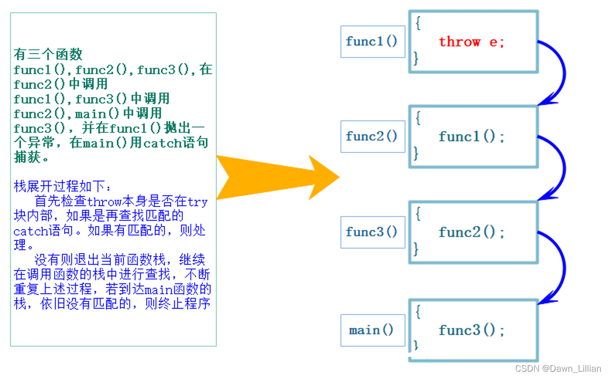

# throw
throw 是 C++ 中用于异常处理的关键字，它用于在程序运行时遇到错误或异常情况时抛出异常，以便程序能够捕获并处理这些异常，避免程序崩溃。

异常处理机制由三部分组成：
 1. 抛出异常：通过 throw 关键字将异常抛出。
 2. 捕获异常：通过 try-catch 语句捕获异常。
 3. 处理异常：在 catch 块中处理异常。

throw 的基本用法
当程序中发生了某些错误或不符合预期的情况时，throw 语句可以抛出异常。异常可以是任何数据类型（如 int、std::string，或用户定义的类）。
```cpp
void test(int value) {
    if (value < 0) {
        throw "Negative value not allowed";  // 抛出异常
    }
}

int main() {
    try {
        test(-5);  // 可能抛出异常的代码
    }
    catch (const char* e) {  // 捕获异常
        std::cout << "Exception caught: " << e << std::endl;
    }
    return 0;
}
```
在上面的例子中：
 + 当 test(-5) 被调用时，由于传入的值为负数，throw "Negative value not allowed" 被执行，抛出了一个异常。
 + catch 块捕获到了这个异常，并输出了异常信息。

## throw 的详细说明
1. 基本语法：
throw 语句的语法非常简单，使用 throw 关键字后跟要抛出的异常对象。
```cpp
throw exception_object;
```

2. 异常类型：
C++ 的异常可以是任意类型，包括内置类型和用户定义类型。常见的做法是抛出异常类的对象，如 std::exception 的派生类。
```cpp
throw 1;              // 抛出整数
throw "error";        // 抛出字符串
throw std::runtime_error("runtime error");  // 抛出异常类
```

3. 异常传播
 + 当异常被抛出后，它会沿着调用栈向上传播，直到找到相应的 catch 块。如果没有找到合适的 catch 块，程序会终止。
 + 例如，如果一个函数内部抛出异常，而它没有 catch 语句，那么它会跳到调用该函数的地方，继续寻找 catch 块。

>在函数调用链中异常栈展开匹配原则
> + 首先检查 throw 本身是否在 try 块内部，如果是再查找匹配的 catch 语句。如果有匹配的，则调到 catch 的地方进行处理。
> + 没有匹配的 catch 则退出当前函数栈，继续在调用函数的栈中进行查找匹配的 catch。
> + 如果到达 main 函数的栈，依旧没有匹配的，则终止程序。上述这个沿着调用链查找匹配的 catch子句的过程称为栈展开。所以实际中我们最后都要加一个 catch(...) 捕获任意类型的异常，否则当有异常没捕获，程序就会直接终止。
> + 找到匹配的catch子句并处理以后，会继续沿着catch子句后面继续执行。



4. 异常对象的类型：

抛出的异常对象可以是任何类型（如基本数据类型、指针、引用、类对象等），但通常建议抛出异常类的对象，尤其是 std::exception 类及其派生类，以便更好地描述错误。

5. 重新抛出异常：
异常可以在 catch 块中重新抛出，通过 throw; 语句，可以将捕获的异常重新抛出给上层处理。
```cpp
try {
    throw std::runtime_error("error");
}
catch (...) {
    std::cout << "Caught an exception, rethrowing..." << std::endl;
    throw;  // 重新抛出捕获的异常
}

```
## try-catch 语句
1. try 块：try 块用于包含可能会抛出异常的代码。它跟随一个或多个 catch 块，用于捕获异常。

2. catch 块：catch 块用于捕获和处理抛出的异常。它必须跟在 try 块之后。
 + 每个 catch 块可以捕获特定类型的异常。
 + 捕获到的异常可以是值类型、指针类型或者引用类型。
```cpp
try {
    // 可能抛出异常的代码
}
catch (int e) {
    // 处理int类型的异常
}
catch (std::runtime_error& e) {
    // 处理runtime_error类型的异常
}
```
3. 捕获所有异常：使用 catch (...) 可以捕获任何类型的异常。它通常用于作为最后的兜底方案，但无法获取异常的具体信息。
```cpp
catch (...) {
    std::cout << "An unknown exception occurred!" << std::endl;
}
```
## 常见的异常类
C++ 标准库提供了一些常见的异常类，它们是从 std::exception 类派生出来的：
 + std::exception: 所有异常类的基类。
 + std::runtime_error: 在运行时检测到的问题。
 + std::logic_error: 程序逻辑错误的异常，如 std::invalid_argument、std::out_of_range 等。

```cpp
#include <iostream>
#include <stdexcept>

int main() {
    try {
        throw std::runtime_error("Runtime error");
    }
    catch (const std::runtime_error& e) {
        std::cout << "Caught a runtime error: " << e.what() << std::endl;
    }
    return 0;
}
```

抛出类对象的规则
 1. 对象的副本： 当抛出类对象时，C++ 会创建该对象的副本。如果异常对象是一个类类型，通常建议该类具有复制构造函数，以确保异常对象在不同作用域之间安全传递。

 2. 析构函数的调用： 当异常抛出后，系统会自动调用当前作用域中已经构造的对象的析构函数，以便释放资源。因此需要注意资源管理和异常安全。

用户自定义的异常类
```cpp
class MyException : public std::exception {
public:
    const char* what() const noexcept override {
        return "My custom exception";
    }
};

```


## throw 和 noexcept
C++11 引入了 noexcept 关键字，用于标记某个函数不会抛出异常。标记为 noexcept 的函数，如果抛出异常，程序会调用 std::terminate 终止程序。
```cpp
void func() noexcept {
    throw std::runtime_error("error");  // 会导致程序终止
}

```


