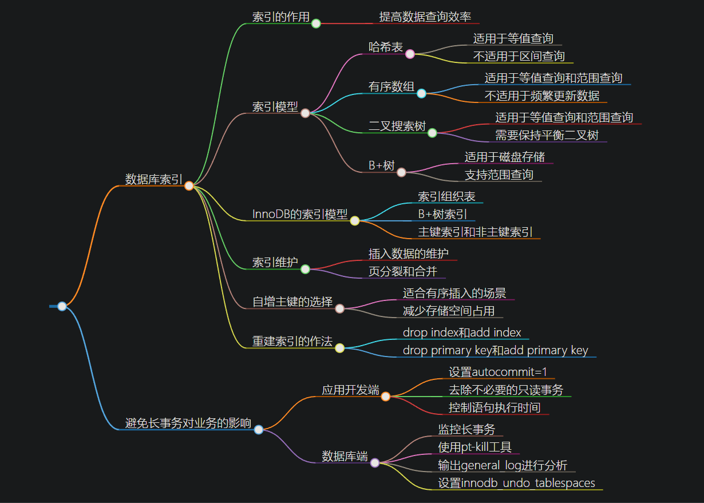
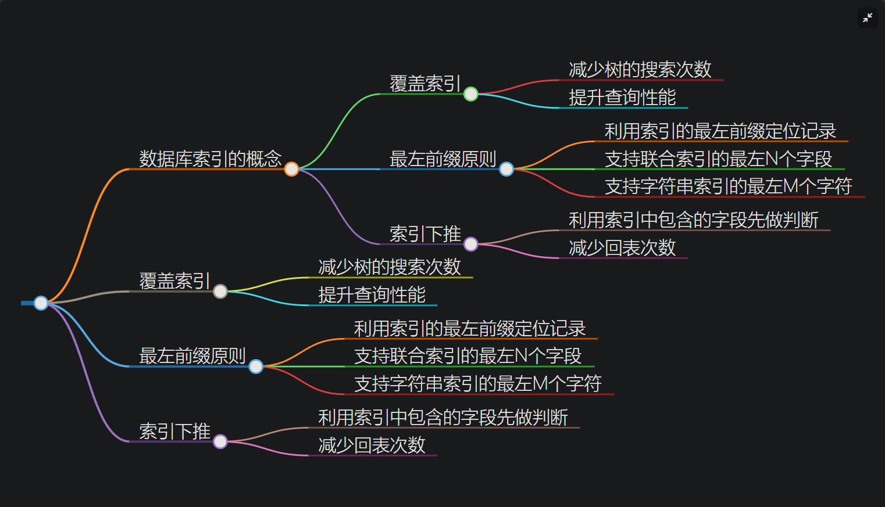

# 索引



索引的作用： 提高数据查询效率

## 索引模型：

+ 哈希表
    + 适合等值查询
    + 哈希值无序，所以不适合区间查询；只能通过变量才行
+ 有序数组
    + 适合等值查询和范围查询
    + 不适合频繁的更新数据，因为插入数据要移动
+ 二叉搜索树
    + 适合等值查询和范围查询
    + 因为索引要保持到磁盘上，保持平衡时要旋转等操作，磁盘IO要多次，时间从长
+ B+树
    + 使用磁盘存储，每个节点存多个key(1200)，加入4层的话就1200^3,查询时最多3次IO
    + 支持范围查询

## InnoDB索引模型（B+树）

+ 主键索引(聚簇索引)：叶子节点存储整行数据
+ 非主键索引(非聚簇索引)：叶子节点存储主键值
	
基于主键索引和普通索引的查询有什么区别？
+ 普通索引要回表；

建表语句里一定要有自增主键。哪些场景下应该使用自增主键，而哪些场景下不应该。

> NOT NULL PRIMARY KEY AUTO_INCREMENT。自增主键的插入数据模式，

+ 不会触发叶子节点的分裂。每次插入一条新记录，都是追加操作，都不涉及到挪动其他记录

+ 减少存储空间：如果用整型做主键，则只要 4 个字节，如果是长整型（bigint）则是 8 个字节。显然，主键长度越小，普通索引的叶子节点就越小，普通索引占用的空间也就越小。


什么场景适合用业务字段直接做主键的呢？

> 只有一个索引；
> 该索引必须是唯一索引。

由于没有其他索引，所以也就不用考虑其他索引的叶子节点大小的问题。

重建索引：

```sql
# 重建索引 k
alter table T drop index k;
alter table T add index(k);

重建主键索引
alter table T drop primary key;
alter table T add primary key(id);
```

为什么重建索引？
索引可能因为删除，或者页分裂等原因，导致数据页有空洞，重建索引的过程会创建一个新的索引，把数据按顺序插入，这样页面的利用率最高，也就是索引更紧凑、更省空间。

重建索引 k 的做法是合理的，可以达到省空间的目的。但是，重建主键的过程不合理。不论是删除主键还是创建主键，**都会将整个表重建**。所以连着执行这两个语句的话，第一个语句就白做了。这两个语句，你可以用这个语句代替 ： alter table T engine=InnoDB。


## 覆盖索引
主键为 ID 的表

select * from T where k between 3 and 5
上述通过k找到主键id，然后进行回表；

下面的就不需要，因为k的索引表保存到就是主键值；
select ID from T where k between 3 and 5

### 是否有必要在一个市民信息表上，是否有必要将身份证号和名字建立联合索引？

联合索引：把id和name创建B+树，先按id的排序，后按第二个name排序；

如果现在有一个高频请求，要根据市民的身份证号查询他的姓名，这个联合索引就有意义了。它可以在这个高频请求上用到覆盖索引，不再需要回表查整行记录，减少语句的执行时间。

## 最左前缀原则

索引项按照索引定义里面出现的字段顺序排序的，在索引中定位记录

### 在建立联合索引的时候，如何安排索引内的字段顺序。

评估指标：索引的复用能力。当已经有了 (a,b) 这个联合索引后，一般就不需要单独在 a 上建立索引了。因此，第一原则是，如果通过调整顺序，可以少维护一个索引，那么这个顺序往往就是需要优先考虑采用的。

查询条件里面只有 b 的语句，是**无法使用 (a,b) 这个联合索引**的，这时候你不得不维护另外一个索引，也就是说你需要同时维护 (a,b)、(b) 这两个索引。


## 索引下推

利用索引中包含的字段先判断，删除不需要的；


总结：
1、 覆盖索引：如果查询条件使用的是普通索引（或是联合索引的最左原则字段），查询结果是联合索引的字段或是主键，不用回表操作，直接返回结果，减少IO磁盘读写读取正行数据
2、最左前缀：联合索引的最左 N 个字段，也可以是字符串索引的最左 M 个字符
3、联合索引：根据创建联合索引的顺序，以最左原则进行where检索，比如（age，name）以age=1 或 age= 1 and name=‘张三’可以使用索引，单以name=‘张三’ 不会使用索引，考虑到存储空间的问题，还请根据业务需求，将查找频繁的数据进行靠左创建索引。
4、索引下推：like 'hello%’and age >10 检索，MySQL5.6版本之前，会对匹配的数据进行回表查询。5.6版本后，会先过滤掉age<10的数据，再进行回表查询，减少回表率，提升检索速度


