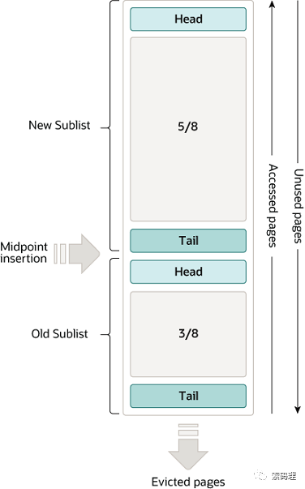

链接： https://cloud.tencent.com/developer/article/2114126

对应 cmu15445 project_1

InnoDB 存储引擎是以数据页为单位来管理存储空间的。InnoDB 存储引擎在处理客户端的请求时，当需要访问某个数据页的数据时，就会把完整的数据页的数据全部加载到内存中，也就是说即使我们只需要访问一个数据页的一条记录，那也需要先把整个数据页的数据加载到内存中。将整个数据页加载到内存中后就可以进行读写访问了，在进行完读写访问之后并不着急把该数据页对应的内存空间释放掉，而是将其缓存起来，这样将来有请求再次访问该页面时，就可以省去磁盘 IO 的开销了。这个缓存就称之为Buffer Pool。

## Buffer Pool

Buffer Pool(缓冲池)是主内存中的一个区域，主要缓存InnoDB 的表和索引数据，缓冲池允许直接从内存中访问经常使用的数据，从而加快处理速度。

为了提高大容量(high-volume)读操作的效率，缓冲池被划分为可能容纳多行的数据页。为了提高缓存管理的效率，缓冲池被实现为一个页面链表;使用最近最少使用(LRU)算法将最近最少使用的数据从缓存中淘汰。

了解如何利用缓冲池将频繁访问的数据保存在内存中是MySQL调优的一个重要方面。

**缓冲池组成**

缓冲池中默认的缓存页大小和在磁盘上默认的数据页大小是一样的，都是16KB。为了更好的管理这些在缓冲池中的缓存页，InnoDB 为每一个缓存页都创建了一些所谓的控制信息，这些控制信息包括该页所属的表空间编号、页号、缓存页在缓冲池中的地址、链表节点信息、一些锁信息以及 LSN 信息，当然还有一些别的控制信息。

缓冲池组成

每个控制块大约占用缓存页大小的5%，而我们设置的innodb_buffer_pool_size 并不包含这部分控制块占用的内存空间大小，也就是说InnoDB 在为 Buffer Pool 向操作系统申请连续的内存空间时，这片连续的内存空间一般会比 innodb_buffer_pool_size的值大 5%左右。

**缓冲池链表**
为了提高大容量读取效率，缓冲池使用链表管理缓冲池中数据页。

**Free List **
Free List(空闲链表)存放着未被使用的数据页。空闲链表通过控制缓冲池的控制块来管理数据页，实际上空闲链表是由控制块组成的。

初始化的缓冲池中所有的缓存页都是空闲的，所以每一个缓存页对应的控制块都会被加入到空闲链表中。这样当缓冲池需要加载一个数据页时就可以从空闲链表上取一个数据页，然后再把给该数据页从对应的链表节点上移除，表示该数据页已经被使用。

**Flush list**

Flush 链表中的所有节点都是脏页(Dirty page)，脏页就是这些数据页被修改过，但是还没来得及被刷新到磁盘上。如果频繁的将修改过的数据立即刷新到磁盘将会严重影响性能，所以有了脏页的存在。那这些脏页要放到哪里呢？所以就多了Flush链表来管理这些脏页。Flush 链表上的数据都是需要被刷新到磁盘中，所以叫Flush 链表。

**LRU list**

RU 链表是缓冲池最重要的链表，所有读取的数据页都会放到LRU链表上。缓冲池使用的LRU(least recently used,最近最少使用)算法是LRU算法的一种变体，当需要向缓冲池添加新数据页时，最近最少使用的数据页将被排除，新数据页将被添加到列表的中间。这种中点插入策略将一个列表分为两个子列表：

头部列表：存放最新的最近访问的数据页
尾部列表：存放旧的最近访问的数据页

该算法将缓冲池链表分为两个子链表：New Sublist和Old Sublist。New Sublist存放的是经常访问的数据页，热数据，可以称之为热链。Old Sublist存放旧的被访问过的数据，可以称之为冷链，冷链占缓冲池的3/8，冷链中的数据也是将要被踢出缓存的候选。

热链和冷链的数据会随着新数据的添加而变化，当新的数据页被添加进缓冲池中时，它会被插入到冷链的Head头部，当数据页被访问之后就会从冷链移动到热链的头部。

**其他链表**
除了以上三个比较重要的链表外，还有一些其他链表来管理缓冲池的数据。比如：
 + Unzip LRU List：存储的数据页都是解压页，也就是说，这个数据页是从一个压缩页通过解压而来的。
 + Zip Clean List：这个链表只在Debug模式下有，主要是存储没有被解压的压缩页。这些压缩页刚刚从磁盘读取出来，还没来得及被解压，一旦被解压后，就从此链表中删除，然后加入到Unzip LRU List中。
 + Zip Free：压缩页有不同的大小，比如8K，4K，InnoDB使用了类似内存管理的伙伴系统来管理压缩页。Zip Free可以理解为由5个链表构成的一个二维数组，每个链表分别存储了对应大小的内存碎片，例如8K的链表里存储的都是8K的碎片，如果新读入一个8K的页面，首先从这个链表中查找，如果有则直接返回，如果没有则从16K的链表中分裂出两个8K的块，一个被使用，另外一个放入8K链表中。

**脏页刷新**

InnoDB 会启动后台线程对buffer pool内的脏页进行刷新，避免用户线程同步刷新脏页。刷脏主要是针对LRU链表和Flush链表。刷新脏页的方式有三种：BUF_FLUSH_LRU、BUF_FLUSH_LIST和BUF_FLUSH_SINGLE_PAGE。

BUF_FLUSH_LRU 
BUF_FLUSH_LRU是批量刷新LRU链表的脏页。后台线程会定期清理出空闲的数据页(数量为innodb_LRU_scan_depth)并加入到Free List中，防止用户线程去做同步刷脏影响效率。线程每隔一定时间(默认是每秒钟)去做BUF_FLUSH_LRU，即首先尝试从LRU中驱逐部分数据页，如果不够则进行刷脏，从Flush List中驱逐。

线程执行的频率max_free_len = innodb_LRU_scan_depth * innodb_buf_pool_instances。

+ innodb_lru_scan_depth：LRU链表中空闲数据页的数量，默认值为1024。小于默认值的设置通常适用于大多数情况，显著高于必要的值可能会影响性能。只有在有备用 I/O容量时才考虑增加该值。相反，如果I/O密集型操作使得容量饱和，可以减小该值，尤其是在缓冲池较大的情况下。

**BUF_FLUSH_LIST**

BUF_FLUSH_LIST是批量刷新Flush链表的脏页。page cleaner线程主要负责Flush List的刷脏，避免用户线程同步刷脏页。

page cleaner线程的数量可以通过变量innodb_page_cleaners进行配置，Linux系统中默认为4，Windows系统中默认为1。如果变量innodb_page_cleaners配置的线程个数超过了buffer pool的实例个数，innodb_page_cleaners的个数会被自动调整为innodb_buffer_pool_instances个数。

buffer pool刷新脏页的百分比在初始化的时候可通过变量innodb_max_dirty_pages_pct_lwm配置，默认为0，也就说禁止前期的刷新行为。innodb_max_dirty_pages_pct_lwm的作用是控制buffer pool中脏页的百分比并且防止脏页的数量达到innodb_max_dirty_pages_pct的阈值，该变量的默认值为75。如果缓冲池中脏页的百分比达到 innodb_max_dirty_pages_pct 的阈值，则缓冲池会进行刷脏。innodb_max_dirty_pages_pct_lwm 必须小于innodb_max_dirty_pages_pct的值。

**BUF_FLUSH_SINGLE_PAGE**
有时候后台线程刷新脏页的进度比较慢，导致用户线程在准备加载一个磁盘页到 Buffer Pool时没有可用的缓存页，这时就会尝试看看LRU链表尾部有没有可以直接释放掉的未修改页面，如果没有的话会不得不将LRU链表尾部的一个脏页同步刷新到磁盘。这种刷新单个脏页到磁盘中的刷新方式被称之为 BUF_FLUSH_SINGLE_PAGE。

**预读Read-Ahead**
预读(Read-Ahead)是InnoDB预估执行当前的请求可能之后会读取某些数据页，就预先把它们加载到 Buffer Pool中。预读算法有两种线性预读和随机预读。

线性预读 
线性预读(Linear read-ahead)是InnoDB预估哪些数据页会被使用，如果会被使用就按照顺序将这些加载到缓冲池，线性预读是以extent为单位的。InnoDB 提供了一个系统变量 innodb_read_ahead_threshold，innodb_read_ahead_threshold控制InnoDB检测连续页面访问模式的敏感程度，如果顺序访问了某个区(extent)的页面超过这个系统变量的值，就会触发一次异步读取下一个区中全部的页面到缓冲池的请求。
innodb_read_ahead_threshold 系统变量取值范围是0-64，默认值是56，我们可以在服务器启动时通过启动参数或者服务器运行过程中直接调整该系统变量的值。

随机预读 
如果缓冲池中已经缓存了某个区的13个连续的数据页，不论这些数据页是不是顺序读取的，都会触发一次异步读取本区中所有其他的页面到缓冲池的请求，随机预读是针对当前extent的。InnoDB 同时提供了innodb_random_read_ahead系统变量，它的默认值为OFF。

