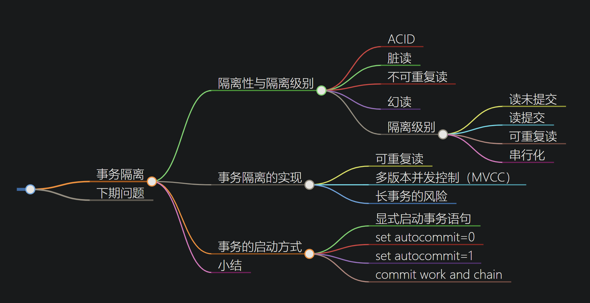
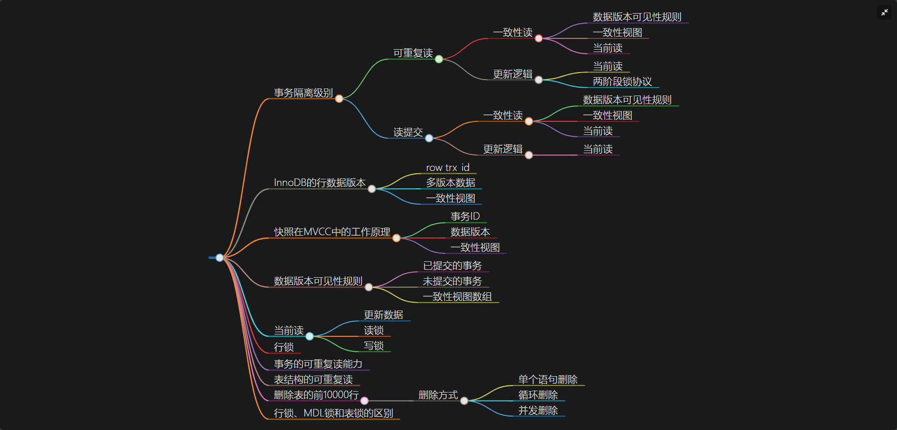
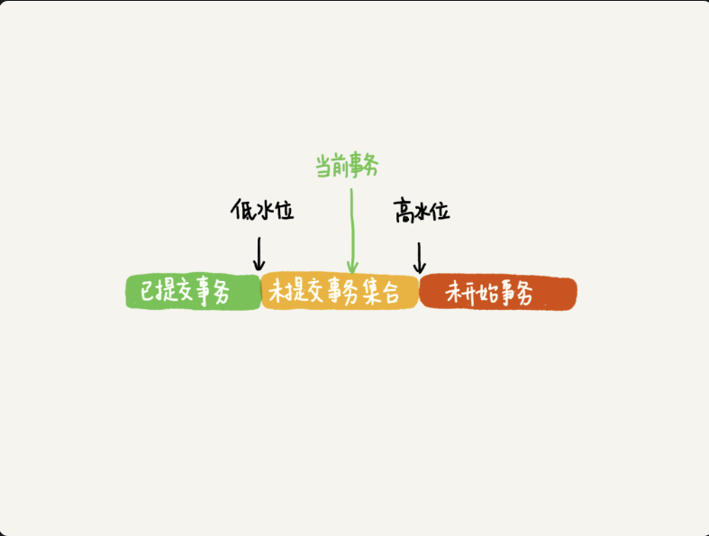

# 事务

## 事务隔离

### 隔离性与隔离级别

ACID：原子性，一致性，隔离性，持久性；

多个事务同时执行可能出现：脏读，不可重复读，幻读的问题

隔离级别：读未提交，读提交，可重复读，串行化（加读写锁）；
mysql隔离启动：transaction-isolation

Oracle默认隔离级别：读提交；

### 事务隔离的实现

在mysql中，每条记录在更新的时候都会同时记录一条回滚操作。记录上是最新值，通过回滚操作，可以得到前一个状态；

mvcc：同一条记录在系统中可以有多个版本；

回滚日志什么时候删除？维护一个 wartermark，记录当前事务读时间戳最小值，利用垃圾回收方式，删除回滚日志；

为什么尽量不要使用长事务？
+ 长事务意味着系统里面存在很老的事务视图。由于这些事务随时可能访问数据库里面的任何数据，所以这个事务提交之前，数据库里面可能用到的回滚记录都必须保留，这就会导致大量占用存储空间；

+ 长事务还占用锁资源

### 事务的启动方式

mysql事务启动方式：
1. 显示启动事务语句，begin 和 start transaction. 提交：commit； 回滚：rollback；
2. set autocommit=0,将线程的自动提交关闭。不会自动提交，事务执行到主动执行commit或rollback语句；

set autocommit=1,通过显式语句启动事务。
使用 commit work and chain,是提交事务并自动启动下一个事务，这样可以省去再次执行begin语句的开销。

### 问题：怎么避免和处理长事务？

在开发过程中，尽可能的减小事务范围，少用长事务，如果无法避免，保证逻辑日志空间足够用，并且支持动态日志空间增长。监控Innodb_trx表，发现长事务报警。

### 总结
1. 事务的概念？
2. mysql的事务隔离级别读未提交, 读已提交, 可重复读, 串行各是什么意思?
3. 读已提交, 可重复读是怎么通过视图构建实现的?
4. 可重复读的使用场景举例? 对账的时候应该很有用?
5. 事务隔离是怎么通过read-view(读视图)实现的?
6. 并发版本控制(MCVV)的概念是什么, 是怎么实现的?
7. 使用长事务的弊病? 为什么使用常事务可能拖垮整个库?
8. 事务的启动方式有哪几种? 
9. commit work and chain的语法是做什么用的? 
10. 怎么查询各个表中的长事务?
+ select * from information_schema.innodb_trx;
11. 如何避免长事务的出现?

    a.设置autocommit=1，不要设置为0。
    b.写脚本监控information_schemal.innodb_trx表中数据内容，发现长事务，kill掉它。
    c.配置SQL语句所能执行的最大运行时间，如果查过最大运行时间后，中断这个运行事情长的SQL语句。
    d.设置回滚表空单独存放，便于回收表空间。
从业务代码方面：
    a.确认是否使用了autocommit=0的配置，如果有关闭它，然后再业务代码中手动的使用begin;commit来操作。
    b.检查业务逻辑代码，能拆分为小事务的不要用大事务。
    c.检查代码，把没有必要的select语句被事务包裹的情况去掉。

## 事务隔离2

begin / start transaction 命令并不是一个事务的起点，在执行的后一个操作才是事务启动。

mysql有两个 视图 概念：
+ view：是一个用查询语句定义的虚拟表，在调用的时候执行查询语句并生成结果。
+ mvcc一致性视图，支持 RC（读提交）和RR（可重复读）隔离级别；

### 可重复读

### 读提交

### 快照在 MVCC 里怎么工作

在可重复读隔离级别下，事务在启动的时候拍"快照"

事务id：严格递增；

每行数据也有多个版本：每次事务更新数据的时候，都会生产一个新的数据版本，并把transaction id赋值给这个数据库版本的事务id，记为row trx_id。

undo log:看cmu15445，其实就是通过undo log来进行恢复版本的，有时间戳；

innodb为每个事务构造一个数组，用来保存这个事务启动瞬间，当前正在活跃的所有事务 ID（读还未提交数据）。数组中最小id为 watermark，系统中已经创建的事务ID的最大值+1为高水位；

这个视图数组和高水位，就组成当前事务的**一致性视图**；

+ 绿色：可见
+ 红色，不可见
+ 黄色：
    + 如果row trx_id在数组中，还没提交，不可见
    + 不在，已经提交，可见

InnoDB 利用了“所有数据都有多个版本”的这个特性，实现了“秒级创建快照”的能力。

当更新的时候，不能在历史版本上更新了，否则后面的事务就丢失了，因此事务的更新在最新事务上更新，所以：更新数据都是**先读后写**，而这个读，只能读当前值，称为“当前读”；

select加锁也叫当前读；

两阶段锁+MVCC

假如103事务更新还未提交，此时102事务要更新，会发生什么？
虽然103事务还未更新，但此时已经生成了，并且是当前最新版本，那么B更新怎么处理呢？

这个时候就要用到两阶段锁：事务103没有提交，也就是说tuple这个版本上的写锁还没有释放。而B是当前读，必须要读最新版本，而且必须加锁，因此就被锁住了，必须等到事务103释放这个锁，才能继续它的当前读。

### 事务的可重复读能力怎么实现？

核心：一致性读：而事务更新数据时，只能用当前读。如果当前记录的行锁被其他事务占用，就需要进入锁等待。

读提交和可重复读的最主要区别：
+ 可重复读：只需要在事务开始的时候创建一致性视图，之后事务里的其他查询都公用这一个视图；
+ 读提交：每一个语句执行前都会重新算出一个新的视图；

`start transaction with consistent snapshot;`：从这个语句开始，创建一个持续整个事务的一致性快照；读提交下，这个用法没有意义；

为什么表结构不支持 可重复读？
因为表结构没有对应的行数据，也没有row trx_id，因此只能遵循当前读的逻辑；

### 问题；

# 总结

1.innodb支持RC和RR隔离级别实现是用的一致性视图(consistent read view)

2.事务在启动时会拍一个快照,这个快照是基于整个库的.
基于整个库的意思就是说一个事务内,整个库的修改对于该事务都是不可见的(对于快照读的情况)
如果在事务内select t表,另外的事务执行了DDL t表,根据发生时间,要嘛锁住要嘛报错(参考第六章)

3.事务是如何实现的MVCC呢?
(1)每个事务都有一个事务ID,叫做transaction id(严格递增)
(2)事务在启动时,找到已提交的最大事务ID记为up_limit_id。
(3)事务在更新一条语句时,比如id=1改为了id=2.会把id=1和该行之前的row trx_id写到undo log里,
并且在数据页上把id的值改为2,并且把修改这条语句的transaction id记在该行行头
(4)再定一个规矩,一个事务要查看一条数据时,必须先用该事务的up_limit_id与该行的transaction id做比对,

如果up_limit_id>=transaction id,那么可以看.如果up_limit_id<transaction id,则只能去undo log里去取。去undo log查找数据的时候,也需要做比对,必须up_limit_id>transaction id,才返回数据

4.什么是当前读,由于当前读都是先读后写,只能读当前的值,所以为当前读.会更新事务内的up_limit_id为该事务的transaction id

5.为什么rr能实现可重复读而rc不能,分两种情况
(1)快照读的情况下,rr不能更新事务内的up_limit_id,而rc每次会把up_limit_id更新为快照读之前最新已提交事务的transaction id,则rc不能可重复读
(2)当前读的情况下,rr是利用record lock+gap lock来实现的,而rc没有gap,所以rc不能可重复读

