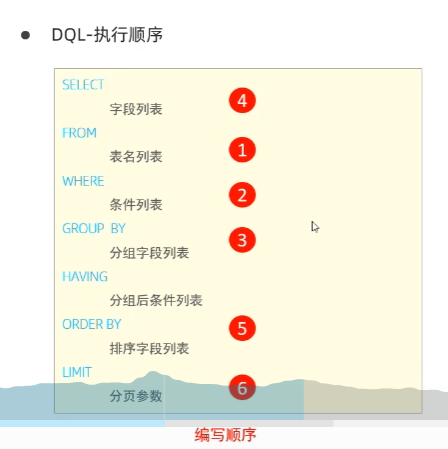

SELECT：选择要返回的列。
FROM：指定数据来源的表。
WHERE：过滤行，只选择满足条件的行。
GROUP BY：对结果集进行分组。
HAVING：过滤分组后的结果。
ORDER BY：对结果集进行排序。
LIMIT：限制返回的行数（某些数据库系统使用 TOP 而不是 LIMIT

## 1. 安装
启动：
net start mysql80

停止：
net stop mysql80

连接：
1. musql 提供的客户端命令工具

2. 系统自导命令行工具
   mysql -h 127.0.0.1 -p 3306 -u root -p 密码

3. linux 查看mysql版本
  `mysql --version`

通用语法：
  1. 以分号结尾
  2. 不区分大小写
  3. 单行注释： # 
  4. 多行注释 /**/

# mysql语法

##  1. DDL  
数据定义语言，用来定义数据库对象（数据库，表，字段）

1. 查询
  查询所有的数据库：`show databases`
  查询当前使用的数据库： `select database()`
2. 创建
  `create database [if not exists] 数据库名`
3. 删除
  `drop database [if exists]数据库名`
4. 使用
  `use 数据库名`

## 2. 表操作
1. 查询当前数据库所有表
  `show tables;`
2. 查询表结构   
  `desc 表名`
3. 查询指定表的建表语句
  `show create table 表名`

4. 创建表
创建 MySQL 数据表需要以下信息：
 + 表名
 + 表字段名
 + 定义每个表字段的数据类型

```sql
create table 表明(
    字段1 字段1类型 [commen 标注释],
    字段2 字段2类型 [commen 标注释],
    字段3 字段3类型 [commen 标注释]
)[commen 标注释];

# 比如
create table tb_user(
id int comment '编号',
age int,
gender varchar(1) comment '性别'
)comment '用户表';
``` 
 + 不能用 ""

5. 删除表
```sql
DROP TABLE [IF EXISTS] table_name;  -- 会检查是否存在，如果存在则删除

# 例子
DROP TABLE IF EXISTS mytable;
```
table_name 是要删除的表的名称。
IF EXISTS 是一个可选的子句，表示如果表存在才执行删除操作，避免因为表不存在而引发错误。

6. 修改表
添加字段
```sql
alter table 表名 add 类型（长度） [comment ""]
```

修改数据类型
```sql
alter table 表名 modify 字段名 新数据类型（长度）；
```

修改字段名和字段类型
```sql
alter table 表名 change 旧字段名 新字段名 类型（长度） [comment 注释][约束]；
```

删除字段
```sql
alter table 表名 drop 字段名;
```

修改表名
```sql
alter table 表名 rename to 表明
```

## 2. DML
DML 数据操作语言，用来对数据库中的表数据记录进行**增删改**操作；

关键字：
 + 添加数据 INSERT
 + 修改数据 UPDATE
 + 删除数据 DELETE

### 1. 添加数据
MySQL 表中使用 `INSERT INTO` 语句来插入数据。

```sql
INSERT INTO table_name (column1, column2, column3, ...)
VALUES (value1, value2, value3, ...);
```
参数说明：
  + table_name 是你要插入数据的表的名称。
  + column1, column2, column3, ... 是表中的列名。
  + value1, value2, value3, ... 是要插入的具体数值。

如果数据是字符型，必须使用单引号 ' 或者双引号 "，如： 'value1', "value1"。


插入多条数据：
```sql
INSERT INTO users (username, email, birthdate, is_active)
VALUES
    ('test1', 'test1@runoob.com', '1985-07-10', true),
    ('test2', 'test2@runoob.com', '1988-11-25', false),
    ('test3', 'test3@runoob.com', '1993-05-03', true);
```

### 2. 修改数据
```sql
UPDATE table_name
SET column1 = value1, column2 = value2, ...
WHERE condition;
```
参数说明：
  + table_name 是你要更新数据的表的名称。
  + column1, column2, ... 是你要更新的列的名称。
  + value1, value2, ... 是新的值，用于替换旧的值。
  + WHERE condition 是一个可选的子句，用于指定更新的行。如果省略 WHERE 子句，将更新表中的所有行。

比如：
```sql
UPDATE `user` SET is_active=0 WHERE id=1;
```

### 3. 删除数据
```sql
DELETE FROM table_name
WHERE condition;
```
参数说明：
  + table_name 是你要删除数据的表的名称。
  + WHERE condition 是一个可选的子句，用于指定删除的行。如果省略 WHERE 子句，将删除表中的所有行。

DELETE语句不能删除某一个字段的值（可以使用UPDATE）

## 3. DQL
数据查询语言，用来查询数据库中表的记录

### 1. 查询数据
```sql
SELECT column1, column2, ...
FROM table_name
[WHERE condition]
[ORDER BY column_name [ASC | DESC]]
[HAVING 条件列表]
[ORDER BY 排序字段]
[LIMIT number];
```
 + column1, column2, ... 是你想要选择的列的名称，如果使用 * 表示选择所有列。
 + table_name 是你要从中查询数据的表的名称。
 + WHERE condition 是一个可选的子句，用于指定过滤条件，只返回符合条件的行。
 + ORDER BY column_name [ASC | DESC] 是一个可选的子句，用于指定结果集的排序顺序， + 默认是升序（ASC）。
 + LIMIT number 是一个可选的子句，用于限制返回的行数。



设置别名：
```sql
SELECT 字段1[as 别名1]，字段2[as 别名2] ... FROM 表名；
```

去除重复记录
```sql
SELECT DISTINCT 字段列表 FROM 表名；
```


```sql
-- 选择所有列的所有行
SELECT * FROM users;

-- 选择特定列的所有行
SELECT username, email FROM users;

-- 添加 WHERE 子句，选择满足条件的行
SELECT * FROM users WHERE is_active = TRUE;

-- 添加 ORDER BY 子句，按照某列的升序排序
SELECT * FROM users ORDER BY birthdate;

-- 添加 ORDER BY 子句，按照某列的降序排序
SELECT * FROM users ORDER BY birthdate DESC;

-- 添加 LIMIT 子句，限制返回的行数
SELECT * FROM users LIMIT 10;
```

### 2.分组查询
```sql
SELECT 字段列表 FROM 表明 [WHERE 条件] GROUP BY 分组字段名 [HAVING 分组后过滤条件];
```
where与having区别
  执行时机不同：where 是分组之前进行过滤，不满足where条件，不参与分组；而having是分组之后对结果进行过滤；
  判断条件不同：where 不能对聚合函数进行判断，而having可以；

执行顺序： where > 聚合函数 > having；
分组后： 查询的字段一般为聚合函数和分组字段，查询其他字段无任何意义；

### 3. 子语句
##### 1. WHERE
如需有条件地从表中选取数据，可将 WHERE 子句添加到 SELECT 语句中。
WHERE 子句用于在 MySQL 中过滤查询结果，只返回满足特定条件的行。

```sql
SELECT column1, column2, ...
FROM table_name
WHERE condition;
```
  + column1, column2, ... 是你要选择的列的名称,返回的字段，如果使用 * 表示选择所有列。
  + table_name 是你要从中查询数据的表的名称。
  + WHERE condition 是用于指定过滤条件的子句。

WHERE 子句类似于程序语言中的 if 条件，根据 MySQL 表中的字段值来读取指定的数据。

可以使用逻辑运算符：
  AND(&&) OR(||) NOT(!)

条件运算符: > >= < <= != 
  BETWEEN AND (在某个范围之内，含最小最大值)
  IN 在in之后的列表中的值，多选一
  LIKE  模糊匹配（_ :匹配单个字符; % :匹配任意字符）
  IS NULL  

```sql
# 等于条件：
SELECT * from `user` WHERE is_active=1;
```

##### 2. 聚合函数
将一列数据作为一个整体，进行纵向计算；
常见的聚合函数：
 + count  统计数量
 + max    最大值
 + min    最小值
 + avg    平均值
 + sum    求和

语法： 
```SQL
SELECT 聚合函数(字段列表) FROM 表明；
```
注意： null值不参与所有聚合函数运算

##### 3. LIKE 子句
LIKE 子句是在 MySQL 中用于在 WHERE 子句中进行模糊匹配的关键字。它通常与通配符一起使用，用于搜索符合某种模式的字符串。
LIKE 子句中使用百分号 `%` 字符来表示任意字符，类似于UNIX或正则表达式中的星号 *。
如果没有使用百分号 `%`, LIKE 子句与等号 = 的效果是一样的。

语法：
```sql
SELECT column1, column2, ...
FROM table_name
WHERE column_name LIKE pattern;
```
参数说明：
 + column1, column2, ... 是你要选择的列的名称，如果使用 * 表示选择所有列。
 + table_name 是你要从中查询数据的表的名称。
 + column_name 是你要应用 LIKE 子句的列的名称。
 + pattern 是用于匹配的模式，可以包含通配符。
  可以使用LIKE子句代替等号 =;可以使用LIKE子句代替等号 =

使用 "_"和"%" 搭配；
`SELECT * FROM products WHERE product_name LIKE '_a%';`


##### 5. GROUP BY
GROUP BY 语句根据一个或多个列对结果集进行分组。GROUP BY 子句用于将查询结果集中的行按照一个或多个列的值进行分组。

在分组的列上我们可以使用 COUNT, SUM, AVG,等函数。

```sql
SELECT column1, aggregate_function(column2) # 显示结果
FROM table_name
WHERE condition
GROUP BY column1;  # 指定分组的列。
```
 + column1：指定分组的列。
 + aggregate_function(column2)：对分组后的每个组执行的聚合函数。
 + table_name：要查询的表名。
 + condition：可选，用于筛选结果的条件。

**HAVING**:HAVING 子句用于筛选聚合后的结果集，通常与 GROUP BY 子句一起使用。HAVING 子句允许你在查询结果被分组之后，对分组的结果应用条件过滤。
```SQL
SELECT ...
FROM table_name
GROUP BY column1, column2, ...
HAVING condition;
```
HAVING 与 WHERE 的区别
1. WHERE 子句：
用于在查询结果被分组之前筛选行。
可以包含任何条件表达式，包括列名和常量。
2. HAVING 子句：
用于在查询结果被分组之后筛选分组。
可以包含聚合函数（如 COUNT, SUM, AVG, MAX, MIN 等）

##### 6. ORDER BY
如果我们需要对读取的数据进行排序，我们就可以使用 MySQL 的 ORDER BY 子句来设定你想按哪个字段哪种方式来进行排序，再返回搜索结果。

MySQL ORDER BY(排序) 语句可以按照一个或多个列的值进行升序（ASC）或降序（DESC）排序。
```sql
SELECT column1, column2, ...
FROM table_name
ORDER BY column1 [ASC | DESC], column2 [ASC | DESC], ...;
```
 + column1, column2, ... 是你要选择的列的名称，如果使用 * 表示选择所有列。
 + table_name 是你要从中查询数据的表的名称。
 + ORDER BY column1 [ASC | DESC], column2 [ASC | DESC], ... 是用于指定排序顺序的子句。ASC 表示升序（默认），DESC 表示降序。

注意：如果是多字段排序，当第一个字段值相同时，才会根据第二个字段进行排序；

##### 7. LIMIT
分页查询
```sql
SELECT 字段列表 FROM 表名 起始索引，查询记录数;
```
注意：
  起始索引从0开始，起始索引=（查询页码-1）*每页显示记录数；
  分页查询是数据库的方言，不同的数据库有不同的实现；
  如果查询的是第一页数据，起始索引可以省略；


## 4. DCL
数据控制语言，用来创建数据库用户、控制数据库的访问权限

1. 查询用户
```sql
USE mysql;
SELECT * FROM user;
```
用户数据保存在 mysql 表中，

2. 创建用户
```sql
CREATE USER '用户名'@'主机名' IDENTIFIED BY '密码'；
```
只有'主机名'这个主机可以访问，当要使得所有主机都能访问的话，改为 '%';

3. 修改用户密码
```sql
ALTER USER '用户名'@'主机名' IDENTIFIED WITH mysql_native_password BY '新密码';
```

4. 删除用户
```sql
DROP USER '用户名'@'主机名';
```

### 修改权限：
1. 查询权限
```sql
SHOW GRANTS FOR '用户名'@'主机名';
```

2. 授予权限
```sql
GRANT 权限表 ON 数据库名.表名 TO '用户名'@'主机名';
```

3. 撤销权限
```sql
REVOKE 权限列表 ON 数据库名.表名 FROM '用户名'@'主机名';
```

## 5. 函数
### 1. 字符串函数
```sql
CONCAT(S1,S1..) #字符串拼接
LOWER(str) # 将字符串str转化为小写
UPPER(str) # 将字符串str转化为大写

LPAD(str,n,pad) # 左填充，用字符串pad对str的左边进行填充，使得str达到n个字符串长度
RPAD(str,n,pad) # 左填充，用字符串pad对str的左边进行填充，使得str达到n个字符串长度

TRIM(str) #去掉字符串的头部和尾部空格
SUBSTRING(str,start,len) #返回从字符串str从start位置起的len个长度的字符串
```

### 2. 数值函数
```sql
CEL(x) # 向上取整
FLOOR(x) # 向下取整
MOD(x,y) # 返回x/y的模
RAND() # 返回0~1内的随机数
ROUND(x,y) # 求参数x的四舍五入的值，保留y位小数
```

### 3.日期函数
```sql
CURDATE() # 返回当前日期
CURTIME() # 返回当前时间
NOW() # 返回当前日期和时间
YEAR(data) # 返回指定date的年份
MONTH(data) # 返回指定data的月份
DAT(data) # 获取指定data的日期
DATE_ADD(data,INTERVAL expr type) # 返回一个日期/时间值加上一个时间间隔expr后的时间值
DATEDIFF(date1,date2) # 返回起始时间date1和结束时间date2之间的天数
```

### 4. 流程函数
```SQL
IF(value,t,f);  # 如果value为true，则返回t，否则返回f
IFNULL(value1,value2);  # 如果value不为空，返回value1，否则返回value2
CASE WHEN [val1] THEN [res1] ... ELSE [default] END; # 如果val1为true，返回res1，..否则返回default默认值
CASE [expt] WHEN [val1] THEN [res1] ... ELSE [default] END; # 如果expr的值等于val1，返回res1，...否则返回default默认值
```

## 6. 约束
约束是作用于表中**字段上**的规则，用于限制存储在表中的数据；
目的：保证数据库中数据的正确、有效性和完整行；
```sql
# | 关键字 | 约束 | 描述|
NOT NULL # 非空约束 ： 限制改字段的数据不能为null
UNIQUE # 唯一约束 ： 保证该字段的所有数据都是唯一、不重复的
PRIMARY KEY # 主键约束：主键是一行数据的唯一标识、要求非空且唯一
DEFAULT # 默认约束 ： 保存数据时，如果未指定该字段的值，则采用默认值
CHECK # 检查约束 ： 保证字段值满足某一个条件
FOREIGN KEY # 外键约束 ： 用来让两张表的数据之间建立连接，保证数据的一致性和完整性
```

例如：
```sql
create table user(
    id int primary key auto_increment comment '主键',
    name varchar(10) not null unique comment '姓名',
    age int check (age > 0 && age <=20) comment 'age',
    status char(1) default '1' comment '状态',
    gender char(1) comment '性别'
);
```

**外键约束**
外键用来让两张表的数据之间建立连接，从而保证数据的一致性和完整性

添加外键语法：
```sql
CREATE TABLE 表名(
    字段名 数据类型，
    ...
    [CONSTRAINT] [外键名称] FOREIGN KEY（外键字段）REFERENCES 主表（主表列名）;
);
```

```sql
ALTER TABLE 表名 
ADD CONSTRAINT 外键名称 
FOREIGN KEY（外键字段）REFERENCES 主表（主表列名）;
```

删除外键
```sql
ALTER TABLE 表名 
DROP FOREIGN KEY 外键名称;
```

删除/更新行为
```sql
NO ACTION # 当在父表中删除/更新对应记录时，首先检查改记录是否有对应外键，如果有则不允许删除/更新。
RESTRICT # 当在父表中删除/更新对应记录时，首先检查改记录是否有对应外键，如果有则不允许删除/更新。

CASCADE # 当在父表中删除/更新对应记录时，首先检查改记录是否有对应外键，如果有,则也删除/更新外键在子表中的记录
SET NULL # 当在父表中删除/更新对应记录时，首先检查改记录是否有对应外键，如果有则设置子表中改外键值为null（这就要求该外键允许取null）

SET DEFAULT # 父表有变更时，子表将外键列设置成一个默认的值（innodb不支持）
```

语法:
```sql
ALTER TABLE 表名 
ADD CONSTRAINT 外键名称 
FOREIGN KEY(外键字段) 
REFERENCES 主表名(主表字段名) 
ON UPDATE CASCADE 
ON DELETE CASCADE;
```

## 7. 多表查询
多表关系：
  + 一对多
  + 多对多 ： 建立第三张中间表，中间表至少包含两个外键，分别关联两方主键
  + 一对一 ： 在任意一方加入外键，关联另外一方的主键，并且设置外键为唯一的 UNIQUE

多表查询分类：
 连接查询：
  1. 内连接： 交集
  2. 外连接：左外连接、右外连接
  3. 自连接： 当前表与自身的连接查询，自连接必须使用表别名
 子查询：


### 1. MYSQL 连接的使用
在真正的应用中经常需要从多个数据表中读取数据。

你可以在 SELECT, UPDATE 和 DELETE 语句中使用 MySQL 的 JOIN 来联合多表查询。

JOIN 按照功能大致分为如下三类：
  + INNER JOIN（内连接,或等值连接）：获取两个表中字段匹配关系的记录。
  + LEFT JOIN（左连接）：获取左表所有记录，即使右表没有对应匹配的记录。
  + RIGHT JOIN（右连接）： 与 LEFT JOIN 相反，用于获取右表所有记录，即使左表没有对应匹配的记录。

#### 1. INNER JOIN (交集)
INNER JOIN 返回两个表中满足连接条件的匹配行，以下是 INNER JOIN 语句的基本语法：
```sql
SELECT column1, column2, ...
FROM table1
INNER JOIN table2 ON table1.column_name = table2.column_name;
```
参数说明：
 + column1, column2, ... 是你要选择的列的名称，如果使用 * 表示选择所有列。
 + table1, table2 是要连接的两个表的名称。
 + table1.column_name = table2.column_name 是连接条件，指定了两个表中用于匹配的列。

多表 INNER JOIN：
```sql
SELECT orders.order_id, customers.customer_name, products.product_name
FROM orders
INNER JOIN customers ON orders.customer_id = customers.customer_id
INNER JOIN order_items ON orders.order_id = order_items.order_id
INNER JOIN products ON order_items.product_id = products.product_id;
```
以上 SQL 语句涉及了 orders、customers、order_items 和 products 四个表的连接。它选择了订单 ID、客户名称和产品名称，连接了这些表的关联列。

#### 2. LEFT JOIN (left table)
LEFT JOIN 返回左表的所有行，并包括右表中匹配的行，如果右表中没有匹配的行，将返回 NULL 值，以下是 LEFT JOIN 语句的基本语法：
```SQL
SELECT column1, column2, ...
FROM table1
LEFT JOIN table2 ON table1.column_name = table2.column_name;
```

#### 3. RIGHT JOIN (right table)
RIGHT JOIN 返回右表的所有行，并包括左表中匹配的行，如果左表中没有匹配的行，将返回 NULL 值，以下是 RIGHT JOIN 语句的基本语法：：
```sql
SELECT column1, column2, ...
FROM table1
RIGHT JOIN table2 ON table1.column_name = table2.column_name;
```

### 2. 自连接
自连接查询语法
```sql
SELECT 字段列表
FROM 表a 别名A
JOIN 表a 别名B ON 条件;
```

### 3. UNION 操作符
MySQL UNION 操作符用于连接两个以上的 SELECT 语句的结果组合到一个结果集合，并去除重复的行。

UNION 操作符必须由两个或多个 SELECT 语句组成，每个 SELECT 语句的列数和对应位置的数据类型必须相同。

语法：
```sql
SELECT column1, column2, ...
FROM table1
WHERE condition1
UNION
SELECT column1, column2, ...
FROM table2
WHERE condition2
[ORDER BY column1, column2, ...];
```
参数说明：
 + column1, column2, ... 是你要选择的列的名称，如果使用 * 表示选择所有列。
 + table1, table2, ... 是你要从中查询数据的表的名称。
 + condition1, condition2, ... 是每个 SELECT 语句的过滤条件，是可选的。
 + ORDER BY 子句是一个可选的子句，用于指定合并后的结果集的排序顺序。

+ UNION ALL：将两个表查询的结果直接合并；
+ UNION ：将两个表查询的结果**去重**后合并；

注意：对于联合查询的多张表的列数必须保持一致，字段类型也需要保持一致。

### 4. 子查询
SQL语句中嵌套SELECT语句，称为嵌套查询，又称子查询；
```sql
SELECT * 
FROM table
WHERE column1 = (SELECT column1 FROM tabl2);
```
子查询外部的语句可以是 INSERT/UADATE/DELETE/SELECT的任何一个

根据子查询的结果不同，分为：
 + 标量子查询（子查询结果为单个值）
 + 列子查询（子查询结果为一列）
 + 行子查询（子查询结果为一行）
 + 表子查询（子查询结果为多行多列）

子查询的位置，可以出现在： WHERER FROM SELECT之后；

操作符： 
+ IN : 在指定的集合范围之内，多选一
+ NOT IN : 不在指定的集合范围之内
  
+ ANY : 子查询返回列表中，有任何一个满足即可
+ SOME : 与ANY等同，使用SOME的地方都可以使用ANY
+ ALL : 子查询返回列表的所有值都必须满足

## 8. 事务

一般来说，事务是必须满足4个条件（ACID）：：原子性（Atomicity，或称不可分割性）、一致性（Consistency）、隔离性（Isolation，又称独立性）、持久性（Durability）。

 + 原子性：一个事务（transaction）中的所有操作，要么全部完成，要么全部不完成，不会结束在中间某个环节。事务在执行过程中发生错误，会被回滚（Rollback）到事务开始前的状态，就像这个事务从来没有执行过一样。

 + 一致性：在事务开始之前和事务结束以后，数据库的完整性没有被破坏。这表示写入的资料必须完全符合所有的预设规则，这包含资料的精确度、串联性以及后续数据库可以自发性地完成预定的工作。

 + 隔离性：数据库允许多个并发事务同时对其数据进行读写和修改的能力，隔离性可以防止多个事务并发执行时由于交叉执行而导致数据的不一致。事务隔离分为不同级别，包括读未提交（Read uncommitted）、读提交（read committed）、可重复读（repeatable read）和串行化（Serializable）。

 + 持久性：事务处理结束后，对数据的修改就是永久的，即便系统故障也不会丢失。

事务是一组操作的集合，他是一个不可分割的工作单位，事物会把所有的操作作为一个整体一起向系统提交或撤销操作请求，即这些操作要么同时成功，要么同时失败。

在 MySQL 中只有使用了 Innodb 数据库引擎的数据库或表才支持事务。

1、用 BEGIN, ROLLBACK, COMMIT 来实现
 + BEGIN 或 START TRANSACTION：开用于开始一个事务。
 + ROLLBACK 事务回滚，取消之前的更改。
 + COMMIT：事务确认，提交事务，使更改永久生效。
2、直接用 SET 来改变 MySQL 的自动提交模式:
 + SET AUTOCOMMIT=0 禁止自动提交
 + SET AUTOCOMMIT=1 开启自动提交

```sql
# BEGIN 或 START TRANSACTION -- 用于开始一个事务
BEGIN; -- 或者使用 START TRANSACTION;

# COMMIT -- 用于提交事务，将所有的修改永久保存到数据库：
COMMIT;

# ROLLBACK -- 用于回滚事务，撤销自上次提交以来所做的所有更改：
ROLLBACK;

# SAVEPOINT -- 用于在事务中设置保存点，以便稍后能够回滚到该点：
SAVEPOINT savepoint_name;

RELEASE SAVEPOINT savepoint_name;  # 删除指定保留点

# ROLLBACK TO SAVEPOINT -- 用于回滚到之前设置的保存点：
ROLLBACK TO SAVEPOINT savepoint_name;
```

```sql
-- 开始事务
START TRANSACTION;

-- 执行一些SQL语句
UPDATE accounts SET balance = balance - 100 WHERE user_id = 1;
UPDATE accounts SET balance = balance + 100 WHERE user_id = 2;

-- 判断是否要提交还是回滚
IF (条件) THEN
    COMMIT; -- 提交事务
ELSE
    ROLLBACK; -- 回滚事务
END IF;
```


