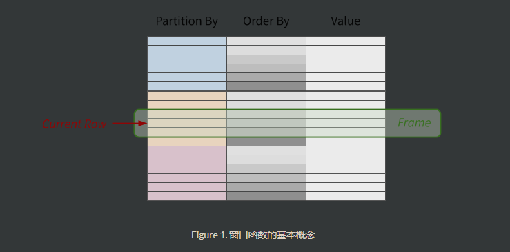
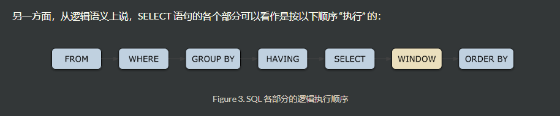

# 窗口函数
https://ericfu.me/sql-window-function/

[cmu15445 project3中有详细讲](../../项目/cmu15445/project3.md)

SQL中的窗口函数（Window Functions）是一种非常强大的功能，它允许你在查询中执行复杂的计算，同时保持数据的清晰性和可读性。窗口函数可以在一组相关的行（称为窗口）上执行聚合操作，而不改变查询的结果集。这使得你可以轻松地执行如排名、行号分配、移动平均计算、累计总和等操作。

窗口函数的一般语法如下：
```sql
function_name([argument_list]) OVER (
    [PARTITION BY partition_expression_list]
    [ORDER BY order_list]
    [ROWS BETWEEN start AND end | RANGE BETWEEN start AND end]
)
```
这里的 function_name 是具体的窗口函数名，如 SUM, AVG, COUNT, RANK, ROW_NUMBER, LEAD, LAG 等。

常见的窗口函数
+ SUM：计算窗口内所有行的总和。
+ AVG：计算窗口内所有行的平均值。
+ COUNT：计算窗口内符合条件的行数。
+ MIN 和 MAX：找到窗口内的最小值或最大值。
+ RANK, DENSE_RANK, ROW_NUMBER：对结果集中的行进行排序并分配排名。
+ LAG 和 LEAD：获取前一行或后一行的值。
+ FIRST_VALUE 和 LAST_VALUE：获取窗口中第一个或最后一个值。

窗口定义
+ PARTITION BY：将结果集分割成多个分区，每个分区独立进行窗口函数计算。
+ ORDER BY：定义窗口内的排序方式。
+ ROWS BETWEEN 或 RANGE BETWEEN：定义窗口的范围，可以选择当前行前后一定数量的行作为窗口范围。



**窗口边界**
preceding：用于指定从当前行向前的行数或数值范围
following：用于指定从当前行向后的行数或数值范围
current row：当前行
unbounded：无界窗口
unbounded preceding：数据表前面的起点
unbounded following：数据表后面的终点

**ROWS BETWEEN 或 RANGE BETWEEN**
ROWS BETWEEN 和 RANGE BETWEEN 都用于定义窗口函数的窗口框架（window frame），但是它们之间有一些重要的区别，主要在于它们是如何确定窗口中包含的行数的。

1) ROWS BETWEEN
使用 ROWS BETWEEN 时，窗口的大小是基于当前行的位置来确定的，而不是基于行的实际值。这意味着无论行中的实际数据如何变化，窗口总是包含固定数量的行。
```sql
ROWS BETWEEN [start] AND [end]
```
其中，start和end可以采用以下形式之一：
+ UNBOUNDED PRECEDING：窗口从数据表的第一行开始
+ CURRENT ROW：窗口包括当前行
+ value PRECEDING：窗口从当前行向前value行开始
+ value FOLLOWING：窗口从当前行向后value行结束

ROWS BETWEEN 3 PRECEDING AND 4 FOLLOWING：表示在当前顺序的前提下，往前3行数据和往后4行数据，总计8行，当然这个8行不是绝对的，比如排序后的第一条数据亦或排序后的最后一条数据，根据行数判定肯定不会是8行。这个可以理解为**物理行数**。


RANGE BETWEEN
range between用于指定窗口的范围，它根据条件筛选出一些符合数据范围的行，并对它们进行聚合操作。range between的语法如下：
```sql
RANGE BETWEEN [start] AND [end]
```
其中，start和end同样可以采用形式与rows between一样。
range表示的是 具体的值，比这个值小 value 的行，比这个值大 value 的行。

RANGE BETWEEN 3 PRECEDING AND 4 FOLLOWING：表示在当前顺序的前提下，当前的数值进行加减的一个范围。比如我是以年龄进行排序，当前的记录为5岁，那么实际取值的范围是[2,9]之间的所有数据，这里可能根据数据情况的情况不止8条数据哦，可多可少。这个可以理解为**逻辑行数。**


假设有一个销售记录表 sales，包含 sale_id, employee_id, sale_date, amount 字段，下面是一些使用窗口函数的例子：

计算每个员工的累计销售额
```sql
SELECT 
    sale_id, employee_id, sale_date, amount,
    SUM(amount) OVER (PARTITION BY employee_id ORDER BY sale_date) AS cumulative_sales
FROM 
    sales;
```

## 窗口函数 VS. 聚合函数

聚合函数 = 聚合窗口函数 + DISTINCT
一定注意：窗口函数只有分区，没有分组功能（分组=分区+去重）
聚合函数是将多条记录聚合为一条数据。它们通常用于对一组值进行计算，并返回计算后的单个值。聚合函数包括求和（SUM）、求平均数（AVG）、求最大值（MAX）、求最小值（MIN）以及计数（COUNT）等。聚合函数的结果是对一组数据进行汇总后的单一输出，且除了COUNT外，聚合函数会忽略空值。聚合函数经常与SELECT语句的GROUP BY子句一同使用，以按指定的列对数据进行分组后进行聚合计算。

窗口函数则是每条记录都会执行，有多少条数据还会返回多少条数据。窗口函数兼具分组和排序的两种功能，但不具备汇总功能。窗口函数可以在原表上增加字段，并在新字段上显示结果，为每一行数据都返回一个结果。窗口函数不会改变原始数据的行数，而是在每行数据上应用计算或排名等操作。常见的窗口函数包括RANK、DENSE_RANK、ROW_NUMBER等，这些函数用于在分组内进行排名或计算累计值等。


从聚合这个意义上出发，似乎窗口函数和 Group By 聚合函数都能做到同样的事情。但是，它们之间的相似点也仅限于此了！这其中的关键区别在于：**窗口函数仅仅只会将结果附加到当前的结果上，它不会对已有的行或列做任何修改**。而 Group By 的做法完全不同：对于各个 Group 它仅仅会保留一行聚合结果。

加了窗口函数之后返回结果的顺序明显发生了变化，这不算一种修改吗？因为 SQL 及关系代数都是以 multi-set 为基础定义的，结果集本身并没有顺序可言，ORDER BY 仅仅是最终呈现结果的顺序。




聚合函数用于汇总数据并返回单个值，而窗口函数用于在一组行上进行计算并返回多个值。