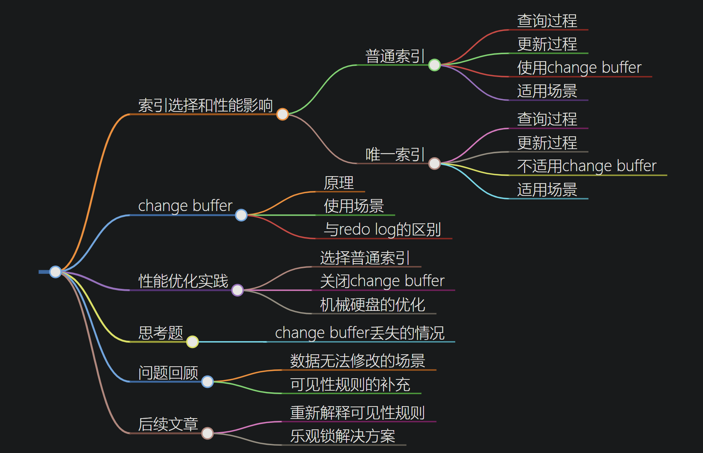

# 普通索引和唯一索引

## 索引选择和性能影响

### 查询过程

+ 普通索引：查找到满足条件的第一个记录后，需要查找下一个记录，直到碰到第一个不满足条件的记录；
+ 唯一索引：由于索引的唯一性，查找到第一个满足条件的记录后，就会停止检索；

性能差距：很小

### 更新过程

change buffer:
> 当需要更新一个数据页时，如果数据页在内存中就直接更新；
> 不在内存中：在不影响数据一致性的前提下，InnoDB会将这些更新操作缓存在change buffer中，这样就不需要从磁盘中读入这个数据页。在下次查询需要访问这个数据页时，将数据页读入内存，然后执行change buffe中与这个页有关的操作。

change buffer：实际上是持久化数据，也就是说，在内存中有拷贝，也会写入到磁盘中；

merge：将change buffer的操作应用到原数据页；
+ merge触发条件：1.访问该数据页 2. 系统有后台线程定期merge 3. 数据库正常关闭也有merge

什么条件下可以使用 change buffer？
+ 唯一索引不需要；因为要插入的时候要判断表中是否已经存在k，要把内存页全部读入内存才能判断；
+ 普通索引使用；

change buffer用的是buffer pool中的内存，且最大不能超过buffer pool的50%；

插入数据的处理流程：
+ 这个记录更新目标页在内存中
    + 对于唯一索引：判断有无冲突，找到位置插入
    + 普通索引：找到位置插入
+ 目标页不在内存中
    + 唯一索引：将数据页读入内存，判断有无冲突，插入
    + 普通索引：将更新记录放入change buffer，语句执行结束

普通索引性能高；

### change buffer的使用场景

change buffer对更新加速作用；且只限于普通索引；

写多读少的业务，change buffer效果好。如：账单类、日志类；

写完立马查询,change buffer多一次写入change buffer的过程，副作用；

### 索引选择和实践

查询能力没有差别，主要是更新对性能的影响；首先选择普通索引；

如果所有的更新后面，都马上对这个记录查询，那么应该change buffer。

### change buffer和redo loge

redo log:主要节省的是随机写磁盘的IO消耗（转成顺序写）；
change buffer:主要节省的是随机读磁盘的IO消耗；

## 问题

change buffer 一开始是写内存的，那么如果这个时候机器掉电重启，会不会导致 change buffer 丢失呢？change buffer 丢失可不是小事儿，再从磁盘读入数据可就没有了 merge 过程，就等于是数据丢失了。会不会出现这种情况呢？

