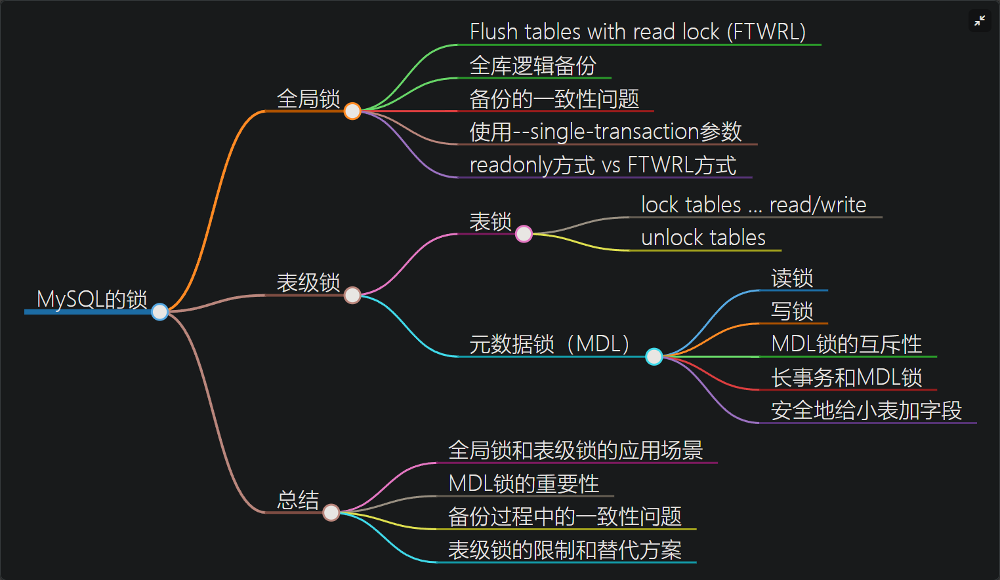

# 锁

## 全局锁

全局锁就是对整个数据库实例加锁。命令是 `Flush tables with read lock (FTWRL)`。

FTWRL工作原理：
+ 刷新表缓存：首先刷新所有表的缓存，并关闭所有打开的表，确保所有未提交的更改都被写入磁盘。
+ 获取全局读锁：然后，它会对所有表施加一个全局读锁，阻止新的写事务开始，同时等待当前正在进行的写事务完成。
+ 保持锁定状态：一旦锁生效，只有读取操作（如 SELECT）可以继续执行，而所有试图修改数据的操作（如 INSERT、UPDATE 或 DELETE）将被阻塞直到锁被释放。

缺点：
+ 主库上备份：不能执行更新，业务停止；
+ 从库备份：备份期间从库不能执行主库同步过来的binlog，会导致主从延迟；

使用场景： 全库逻辑备份；

如果不加锁的话：备份系统备份的库不是一个逻辑时间点，这个视图是逻辑不一致的。；

拿到一致性视图：在可重复读隔离级别下开启一个事务。

有了 可重复读隔离级事务， 为什么还要 FTWRL？
+ 有些引起没有这个隔离级别，只适用于所有的表使用事务引擎的库；

为什么不使用：set global readonly=true 的方式呢？
+ 1. readonly 的值会被用来做其他逻辑,如判断库是主库还是备库
+ 2. 在异常处理机制上有差异。使用FTWRL，如果客户端发生异常断开，mysql会自动释放全局锁。而readonly会一直保持readonly状态，导致库不可写状态。

## 表级锁

表锁，元数据锁

### 表锁

一般是在数据库引擎不支持行锁的时候才会被用到的。

语法是 `lock tables … read/write；`
可以用 `unlock tables` 主动释放锁，也可以在客户端断开的时候自动释放；
不仅限制别的线程读写，也限定本线的操作：不能访问其他的表；

### 元数据锁 metadata lock

MDL 不需要显式使用，在访问一个表的时候会被自动加上。
作用：保证读写的正确性；

锁的类型：读锁和写锁

MDL 会直到事务提交才释放

### 补充：mysql主从和主备

数据库主主：两台都是主数据库，同时对外提供读写操作。客户端访问任意一台。数据存在双向同步。

数据库主从：一台是主数据库，同时对外提供读写操作。一台是 从数据库，对外提供读的操作。数据从主库同步到从库。

数据库主备：台是主数据库，同时对外提供读写操作。一台是 备库，只作为备份作用，不对外提供读写，主机挂了它就取而代之。数据从主库同步到备库。

### 问题

当备库用–single-transaction 做逻辑备份的时候，如果从主库的 binlog 传来一个 DDL 语句会怎么样？

## 行锁

不支持行锁意味着并发控制只能使用表锁；

行锁：针对数据表中记录的锁。

### 两阶段锁

行锁是在需要的时候加上，但并不是不需要了就立刻释放，而是等到事务结束时才释放。这就是两阶段锁协议。

对使用事务有什么帮助？
如果事务需要锁住多个行，要把最可能造成锁冲突、最可能影响并发度的锁尽量往后放。
减少事务之间的锁等待，提高并发；

### 死锁和死锁检测

两个更新操作：事务A，更新id=1和id=2两条语句；事务B，更新id=2和id=1两条语句。可能会发生死锁；

当出现死锁，有两种策略：
+ 等待，直到超时；innodb_lock_wait_timeout
+ 发起死锁检测，发现死锁后，主动回滚死锁链条中的某一条事务，让其他事务继续运行。将参数 innodb_deadlock_detect 设置为 on，表示开启这个逻辑。

死锁检测负担：
每当一个事务被锁时，就要看它所依赖的线程有没有被别人锁住，如此循环，最后判断是否出现了循环等待，也就是死锁。

假设有 1000 个并发线程要同时更新同一行，那么死锁检测操作就是 100 万这个量级的。
怎么解决由这种热点行更新导致的性能问题？死锁检测耗费大量cpu资源
+ 1. 临时关闭死锁检测，但是有风险；
+ 2. 控制并发度；比如同一行同时只有10个线程更新
+ 3. 将一行改为逻辑上的多行减少冲突；放在多个记录上，每次修改时随机选择一条记录，这样每次冲突变成原来的1/n；

### 问题

如果你要删除一个表里面的前 10000 行数据，有以下三种方法可以做到：

第一种，直接执行 delete from T limit 10000;

第二种，在一个连接中循环执行 20 次 delete from T limit 500;

第三种，在 20 个连接中同时执行 delete from T limit 500。

你会选择哪一种方法呢？为什么呢？

第二种好：
第一种：时间长，锁占用时间长，容易产生大事务还会导致延迟
第三种：造成锁冲突

## 

#### 增强半同步复制和异步复制

增强半同步复制和异步复制是MySQL中用于实现**主从复制**的两种常见方式。

**增强半同步复制**是一种同步策略，它确保至少有一个备库已经接收并确认了主库的事务日志，然后主库才会提交事务。这种方式可以提高数据同步的可靠性，但也会引入一定的延迟。具体延迟情况取决于网络延迟、备库的处理能力以及主库的负载情况等因素。

**异步复制**不要求备库确认接收和应用主库的事务日志，主库在提交事务后立即返回给客户端。这种方式的优势是主库的写操作不会受到备库的影响，但同时也存在数据同步滞后的可能性。由于不需要等待备库的确认，异步复制通常具有更低的延迟

**因此，在采用增强半同步复制和异步复制的架构中，备库支持主备切换，意味着备库可以在主库故障时接管成为新的主库。由于备库采用增强半同步复制，其与主库之间的数据同步更可靠，并且可以更快地进行主备切换。而从库采用异步复制，因此可能存在一定的数据同步延迟，它仅用于读取目的，并不参与主备切换操作。**

增强半同步复制不能保证binglog同步到备库吗？

增强半同步复制可以提高主库到备库的同步可靠性，但仍然无法完全保证binlog能够同步到备库。增强半同步复制是一种MySQL复制机制，在传统的异步复制基础上引入了同步确认机制。

在增强半同步复制中，主库在将binlog事件发送给备库后，会等待至少一个备库成功接收并应用该事件，然后才会继续进行下一个事件的提交。这样可以减小数据丢失的可能性，因为如果主库发生故障，只有已经完成同步的binlog事件才会丢失。

虽然增强半同步复制提供了更高的同步可靠性，但仍存在以下情况导致binlog无法同步到备库：

+ 备库网络故障：如果备库出现网络问题，导致主库无法收到备库的同步确认信息，主库可能会继续提交新的binlog事件，而备库无法及时进行同步。

+ 主库故障：如果主库发生故障，并且还没有将binlog事件成功发送到备库，那么这些未同步的binlog事件将会丢失。

+ 配置问题：如果配置不正确或者存在一些特殊情况，可能导致增强半同步复制无法正常工作，从而无法保证binlog同步到备库。

因此，虽然增强半同步复制可以提高复制的可靠性，但它并不能完全保证binlog能够100%同步到备库。为了更可靠地保证备库的一致性，可以考虑使用同步复制技术，如半同步或者全同步复制，并且定期进行备份以防止数据丢失。

#### Oracle ADG（Automatic Data Guard）和MySQL的增强半同步复制

Oracle ADG（Automatic Data Guard）和MySQL的增强半同步复制是两种不同数据库系统中提供的数据复制技术，它们有一些区别

+ 数据库系统：Oracle ADG是Oracle数据库的一个功能，而MySQL的增强半同步复制则是MySQL数据库的一个特性。

+ 同步性：Oracle ADG是基于物理备份的方法，它提供了更高的数据同步性。当主数据库提交事务时，ADG会确保至少一个辅助数据库（也称为备用数据库）已经**接收并应用**了这个事务，从而在主备数据库之间实现了同步。相比之下，MySQL的增强半同步复制只能提供更低级别的同步，即主数据库提交事务后，至少一个备用数据库接收到了这个事务，但不保证其应用。

+ 故障恢复：Oracle ADG在主数据库发生故障时，可以自动将**辅助数据库升级为新的主数据库**，从而提供高可用性和灾难恢复能力。MySQL的增强半同步复制没有内置的自动故障恢复机制，需要手动进行故障切换。

+ 配置和管理：Oracle ADG的配置和管理比较复杂，需要额外的许可证和专业知识。相比之下，MySQL的增强半同步复制相对简单，易于配置和管理。

+ 可用性：Oracle ADG提供更高的可用性，因为它可以在主备数据库之间实现快速故障切换。MySQL的增强半同步复制在故障切换时需要手动操作，可能会导致一些停机时间。

总体而言，Oracle ADG在数据同步性、故障恢复和可用性方面提供了更强大的功能，但同时也更加复杂和昂贵。MySQL的增强半同步复制则是一种较为简单和经济实惠的选择，适合中小型应用环境。选择哪种技术取决于具体的需求和预算。
 
原文链接：https://blog.csdn.net/hezuijiudexiaobai/article/details/120992712

##

