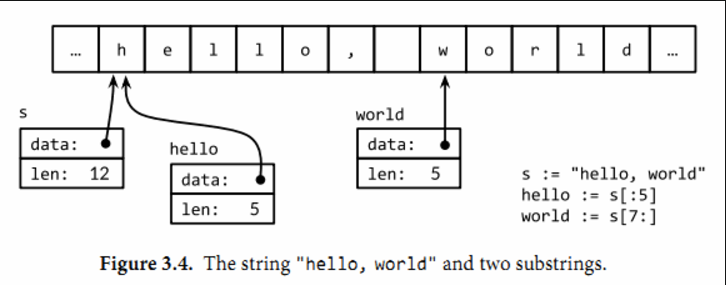
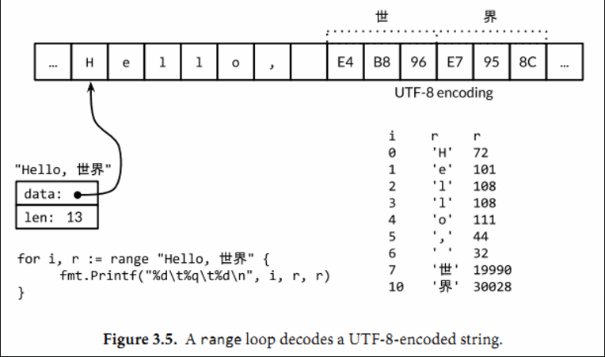

# 基础数据

只能显示转换：T(V)

## 3.1 整型

算术运算符+、-、*和/可以适用于整数、浮点数和复数，但是取模运算符%仅用于整数间的运算。对于不同编程语言，%取模运算的行为可能并不相同。在Go语言中，%取模运算符的符号和被取模数的符号总是一致的，因此-5%3和-5%-3结果都是-2。除法运算符/的行为则依赖于操作数是否全为整数，比如5.0/4.0的结果是1.25，但是5/4的结果是1，因为整数除法会**向着0方向截断余数**。

一个算术运算的结果，不管是有符号或者是无符号的，如果需要更多的bit位才能正确表示的话，就说明计算结果是溢出了。超出的高位的bit位部分将被丢弃。如果原始的数值是有符号类型，而且最左边的bit位是1的话，那么最终结果可能是负的，例如int8的例子：

```go
var u uint8 = 255
fmt.Println(u, u+1, u*u) // "255 0 1"

var i int8 = 127
fmt.Println(i, i+1, i*i) // "127 -128 1"
```

对于整数，+x是0+x的简写，-x则是0-x的简写；对于浮点数和复数，+x就是x，-x则是x 的负数。

Go语言还提供了以下的bit位操作运算符，前面4个操作运算符并不区分是有符号还是无符号数：

```go
&      位运算 AND
|      位运算 OR
^      位运算 XOR
&^     位清空（AND NOT）
<<     左移
>>     右移
```

位操作运算符^作为二元运算符时是按位异或（XOR），当用作一元运算符时表示按位取反；也就是说，它返回一个每个bit位都取反的数。位操作运算符&^用于按位置零（AND NOT）：如果对应y中bit位为1的话，表达式z = x &^ y结果z的对应的bit位为0，否则z对应的bit位等于x相应的bit位的值。

在 x << n 和 x>>n 移位运算中，决定了移位操作的bit数部分必须是无符号数；被操作的x可以是有符号数或无符号数。算术上，一个x << n 左移运算等价于乘以 $2^n$ ，一个 x>>n 右移运算等价于除以$2^n$。

左移运算用零填充右边空缺的bit位，无符号数的右移运算也是用0填充左边空缺的bit位，但是有符号数的右移运算会用符号位的值填充左边空缺的bit位。因为这个原因，最好用无符号运算，这样你可以将整数完全当作一个bit位模式处理。

浮点数到整数的转换将丢失任何小数部分，然后向数轴零方向截断。

任何大小的整数字面值都可以用以0开始的八进制格式书写，例如0666；或用以0x或0X开头的十六进制格式书写，例如0xdeadbeef。十六进制数字可以用大写或小写字母。

当使用fmt包打印一个数值时，我们可以用%d、%o或%x参数控制输出的进制格式;

```go
o := 0666
fmt.Printf("%d %[1]o %#[1]o\n", o) // "438 666 0666"
x := int64(0xdeadbeef)
fmt.Printf("%d %[1]x %#[1]x %#[1]X\n", x)
// Output:
// 3735928559 deadbeef 0xdeadbeef 0XDEADBEEF

```

请注意fmt的两个使用技巧。通常Printf格式化字符串包含多个%参数时将会包含对应相同数量的额外操作数，但是%之后的[1]副词告诉Printf函数再次使用第一个操作数。第二，%后的#副词告诉Printf在用%o、%x或%X输出时生成0、0x或0X前缀。

字符面值通过一对单引号直接包含对应字符。最简单的例子是ASCII中类似'a'写法的字符面值，但是我们也可以通过转义的数值来表示任意的Unicode码点对应的字符，马上将会看到这样的例子。

字符使用%c参数打印，或者是用%q参数打印带单引号的字符：

```go
ascii := 'a'
unicode := '国'
newline := '\n'
fmt.Printf("%d %[1]c %[1]q\n", ascii)   // "97 a 'a'"
fmt.Printf("%d %[1]c %[1]q\n", unicode) // "22269 国 '国'"
fmt.Printf("%d %[1]q\n", newline)       // "10 '\n'"

```

取模：a%b = a - a/b*b;

## 3.2 浮点型

Go语言提供了两种精度的浮点数，float32和float64。

一个float32类型的浮点数可以提供大约6个十进制数的精度，而float64则可以提供约15个十进制数的精度；通常应该优先使用float64类型，因为float32类型的累计计算误差很容易扩散，并且float32能精确表示的正整数并不是很大（译注：因为float32的有效bit位只有23个，其它的bit位用于指数和符号；当整数大于23bit能表达的范围时，float32的表示将出现误差）：

小数点前面或后面的数字都可能被省略（例如.707或1.）。很小或很大的数最好用科学计数法书写，通过e或E来指定指数部分：

用Printf函数的%g参数打印浮点数，将采用更紧凑的表示形式打印，并提供足够的精度，但是对应表格的数据，使用%e（带指数）或%f的形式打印可能更合适。所有的这三个打印形式都可以指定打印的宽度和控制打印精度。

```go
for x := 0; x < 8; x++ {
    fmt.Printf("x = %d e^x = %8.3f\n", x, math.Exp(float64(x)))
}

/* 
x = 0       e^x =    1.000
x = 1       e^x =    2.718
x = 2       e^x =    7.389
x = 3       e^x =   20.086
x = 4       e^x =   54.598
x = 5       e^x =  148.413
x = 6       e^x =  403.429
x = 7       e^x = 1096.633 */
```

math包中除了提供大量常用的数学函数外，还提供了IEEE754浮点数标准中定义的特殊值的创建和测试：正无穷大和负无穷大，分别用于表示太大溢出的数字和除零的结果；还有NaN非数，一般用于表示无效的除法操作结果0/0或Sqrt(-1).

```go
var z float64
fmt.Println(z, -z, 1/z, -1/z, z/z) // "0 -0 +Inf -Inf NaN"
```

函数math.IsNaN用于测试一个数是否是非数NaN，math.NaN则返回非数对应的值。虽然可以用math.NaN来表示一个非法的结果，但是测试一个结果是否是非数NaN则是充满风险的，因为NaN和任何数都是不相等的（译注：在浮点数中，NaN、正无穷大和负无穷大都不是唯一的，每个都有非常多种的bit模式表示）;

## 3.3 bool

布尔值并不会隐式转换为数字值0或1，反之亦然。必须使用一个显式的if语句辅助转换：

```go
i := 0
if b {
    i = 1
}
```

## 3.5 字符串

内置的len函数可以返回一个字符串中的字节数目（不是rune字符数目），索引操作s[i]返回第i个字节的字节值，i必须满足0 ≤ i< len(s)条件约束。

第i个字节并不一定是字符串的第i个字符，因为对于非ASCII字符的UTF8编码会要两个或多个字节。

子字符串操作s[i:j]基于原始的s字符串的**第i个字节开始到第j个字节**（并不包含j本身）生成一个新字符串。生成的新字符串将包含j-i个字节。

不管i还是j都可能被忽略，当它们被忽略时将采用0作为开始位置，采用len(s)作为结束的位置。

其中+操作符将两个字符串连接构造一个新字符串：

字符串可以用==和<进行比较；比较通过逐个字节比较完成的，因此比较的结果是字符串自然编码的顺序。

因为字符串是不可修改的，因此尝试修改字符串内部数据的操作也是被禁止的：

不变性意味着如果两个字符串共享相同的底层数据的话也是安全的，这使得复制任何长度的字符串代价是低廉的。同样，一个字符串s和对应的子字符串切片s[7:]的操作也可以安全地共享相同的内存，因此字符串切片操作代价也是低廉的。在这两种情况下都没有必要分配新的内存。 图3.4演示了一个字符串和两个子串共享相同的底层数据。

### 3.5.1 字符串面值

字符串值也可以用字符串面值方式编写，只要将一系列字节序列包含在双引号内即可：



因为Go语言源文件总是用UTF8编码，并且Go语言的文本字符串也以UTF8编码的方式处理，因此我们可以将Unicode码点也写到字符串面值中。

在一个双引号包含的字符串面值中，可以用以反斜杠\开头的转义序列插入任意的数据。下面的换行、回车和制表符等是常见的ASCII控制代码的转义方式：

```go
\a      响铃
\b      退格
\f      换页
\n      换行
\r      回车
\t      制表符
\v      垂直制表符
\'      单引号（只用在 '\'' 形式的rune符号面值中）
\"      双引号（只用在 "..." 形式的字符串面值中）
\\      反斜杠
```

一个原生的字符串面值形式是`...`，使用反引号代替双引号。在原生的字符串面值中，没有转义操作；全部的内容都是字面的意思，包含退格和换行，因此一个程序中的原生字符串面值可能跨越多行（译注：在原生字符串面值内部是无法直接写`字符的，可以用八进制或十六进制转义或+"`"连接字符串常量完成）。唯一的特殊处理是会删除回车以保证在所有平台上的值都是一样的，包括那些把回车也放入文本文件的系统（译注：Windows系统会把回车和换行一起放入文本文件中）。

原生字符串面值用于编写正则表达式会很方便，因为正则表达式往往会包含很多反斜杠。原生字符串面值同时被广泛应用于HTML模板、JSON面值、命令行提示信息以及那些需要扩展到多行的场景。

### 3.5.2 Unicode

Unicode（ http://unicode.org ），它收集了这个世界上所有的符号系统，包括重音符号和其它变音符号，制表符和回车符，还有很多神秘的符号，每个符号都分配一个唯一的Unicode码点，Unicode码点对应Go语言中的rune整数类型（译注：rune是int32等价类型）。

可以将一个符文序列表示为一个int32序列。这种编码方式叫UTF-32或UCS-4，每个Unicode码点都使用同样大小的32bit来表示。这种方式比较简单统一，但是它会浪费很多存储空间，因为大多数计算机可读的文本是ASCII字符，本来每个ASCII字符只需要8bit或1字节就能表示。而且即使是常用的字符也远少于65,536个，也就是说用16bit编码方式就能表达常用字符。但是，还有其它更好的编码方法吗？

### 3.5.3 UTF-8

UTF8是一个将Unicode码点编码为字节序列的变长编码。

UTF8编码使用1到4个字节来表示每个Unicode码点，ASCII部分字符只使用1个字节，常用字符部分使用2或3个字节表示。每个符号编码后第一个字节的高端bit位用于表示编码总共有多少个字节。如果第一个字节的高端bit为0，则表示对应7bit的ASCII字符，ASCII字符每个字符依然是一个字节，和传统的ASCII编码兼容。如果第一个字节的高端bit是110，则说明需要2个字节；后续的每个高端bit都以10开头。更大的Unicode码点也是采用类似的策略处理。

```txt
0xxxxxxx                             runes 0-127    (ASCII)
110xxxxx 10xxxxxx                    128-2047       (values <128 unused)
1110xxxx 10xxxxxx 10xxxxxx           2048-65535     (values <2048 unused)
11110xxx 10xxxxxx 10xxxxxx 10xxxxxx  65536-0x10ffff (other values unused)
```

Unicode转义也可以使用在rune字符中。下面三个字符是等价的：

>'世' '\u4e16' '\U00004e16'

对于小于256的码点值可以写在一个十六进制转义字节中，例如\x41对应字符'A'，但是对于更大的码点则必须使用\u或\U转义形式。因此，\xe4\xb8\x96并不是一个合法的rune字符，虽然这三个字节对应一个有效的UTF8编码的码点。

得益于UTF8编码优良的设计，诸多字符串操作都不需要解码操作。我们可以不用解码直接测试一个字符串是否是另一个字符串的前缀：

```go
func HasPrefix(s, prefix string) bool {
    return len(s) >= len(prefix) && s[:len(prefix)] == prefix
}
```

或者是后缀测试：

```go
func HasSuffix(s, suffix string) bool {
    return len(s) >= len(suffix) && s[len(s)-len(suffix):] == suffix
}
```

另一方面，如果我们真的关心每个Unicode字符，我们可以使用其它处理方式。考虑前面的第一个例子中的字符串，它混合了中西两种字符。图3.5展示了它的内存表示形式。字符串包含13个字节，以UTF8形式编码，但是只对应9个Unicode字符：



```go
import "unicode/utf8"

s := "Hello, 世界"
fmt.Println(len(s))                    // "13"
fmt.Println(utf8.RuneCountInString(s)) // "9"
```

为了处理这些真实的字符，我们需要一个UTF8解码器。unicode/utf8包提供了该功能，我们可以这样使用：

```go
for i := 0; i < len(s); {
    r, size := utf8.DecodeRuneInString(s[i:])
    fmt.Printf("%d\t%c\n", i, r)
    i += size
}

```

每一次调用DecodeRuneInString函数都返回一个r和长度，r对应字符本身，长度对应r采用UTF8编码后的编码字节数目。长度可以用于更新第i个字符在字符串中的字节索引位置。但是这种编码方式是笨拙的，我们需要更简洁的语法。幸运的是，Go语言的range循环在处理字符串的时候，**会自动隐式解码UTF8字符串**。下面的循环运行如图3.5所示；需要注意的是对于非ASCII，索引更新的步长将超过1个字节

```go
for i, r := range "Hello, 世界" {
    fmt.Printf("%d\t%q\t%d\n", i, r, r)
}

```

我们可以使用一个简单的循环来统计字符串中字符的数目，像这样：

```go
n := 0
for _, _ = range s {
    n++
}

```

像其它形式的循环那样，我们也可以忽略不需要的变量：

```go
n := 0
for range s {
    n++
}

```

或者我们可以直接调用utf8.RuneCountInString(s)函数

正如我们前面提到的，文本字符串采用UTF8编码只是一种惯例，但是对于循环的真正字符串并不是一个惯例，这是正确的。如果用于循环的字符串只是一个普通的二进制数据，或者是含有错误编码的UTF8数据，将会发生什么呢？

每一个UTF8字符解码，不管是显式地调用utf8.DecodeRuneInString解码或是在range循环中隐式地解码，如果遇到一个错误的UTF8编码输入，**将生成一个特别的Unicode字符\uFFFD**，在印刷中这个符号通常是一个黑色六角或钻石形状，里面包含一个白色的问号"?"。当程序遇到这样的一个字符，通常是一个危险信号，说明输入并不是一个完美没有错误的UTF8字符串。

UTF8字符串作为交换格式是非常方便的，但是在程序内部采用rune序列可能更方便，因为rune大小一致，支持数组索引和方便切割。

将[]rune类型转换应用到UTF8编码的字符串，将返回字符串编码的Unicode码点序列：

```go
// "program" in Japanese katakana
s := "プログラム"
fmt.Printf("% x\n", s) // "e3 83 97 e3 83 ad e3 82 b0 e3 83 a9 e3 83 a0"
r := []rune(s)
fmt.Printf("%x\n", r)  // "[30d7 30ed 30b0 30e9 30e0]"

```

在第一个Printf中的% x参数用于在每个十六进制数字前插入一个空格。）
如果是将一个[]rune类型的Unicode字符slice或数组转为string，则对它们进行UTF8编码：

> fmt.Println(string(r)) // "プログラム"

将**一个整数转型为字符串**意思是生成以只包含对应Unicode码点字符的UTF8字符串：

> fmt.Println(string(65))     // "A", not "65"
> fmt.Println(string(0x4eac)) // "京"

如果对应码点的字符是无效的，则用\uFFFD无效字符作为替换：
> fmt.Println(string(1234567)) // "?"

### 字符串和 byte切片

标准库中有四个包对字符串处理尤为重要：bytes、strings、strconv和unicode包。strings包提供了许多如字符串的查询、替换、比较、截断、拆分和合并等功能。

bytes包也提供了很多类似功能的函数，但是针对和字符串有着相同结构的[]byte类型。因为字符串是只读的，因此逐步构建字符串会导致很多分配和复制。在这种情况下，使用bytes.Buffer类型将会更有效，稍后我们将展示。

strconv包提供了布尔型、整型数、浮点数和对应字符串的相互转换，还提供了双引号转义相关的转换

unicode包提供了IsDigit、IsLetter、IsUpper和IsLower等类似功能，它们用于给字符分类。每个函数有一个单一的rune类型的参数，然后返回一个布尔值。而像ToUpper和ToLower之类的转换函数将用于rune字符的大小写转换。所有的这些函数都是遵循Unicode标准定义的字母、数字等分类规范。strings包也有类似的函数，它们是ToUpper和ToLower，将原始字符串的每个字符都做相应的转换，然后返回新的字符串。

字符串和字节slice之间可以相互转换：

s := "abc"
b := []byte(s)
s2 := string(b)

从概念上讲，一个[]byte(s)转换是分配了一个新的字节数组用于保存字符串数据的拷贝，然后引用这个底层的字节数组。编译器的优化可以避免在一些场景下分配和复制字符串数据，但总的来说需要确保在变量b被修改的情况下，原始的s字符串也不会改变。将一个字节slice转换到字符串的string(b)操作则是构造一个字符串拷贝，以确保s2字符串是只读的。

为了避免转换中不必要的内存分配，bytes包和strings同时提供了许多实用函数。

bytes包还提供了Buffer类型用于字节slice的缓存。一个Buffer开始是空的，但是随着string、byte或[]byte等类型数据的写入可以动态增长，一个bytes.Buffer变量并不需要初始化，因为零值也是有效的：

### 字符串和数字的转换

除了字符串、字符、字节之间的转换，字符串和数值之间的转换也比较常见。由strconv包提供这类转换功能。

将一个整数转为字符串，一种方法是用fmt.Sprintf返回一个格式化的字符串；另一个方法是用strconv.Itoa(“整数到ASCII”)：

```go
x := 123
y := fmt.Sprintf("%d", x)
fmt.Println(y, strconv.Itoa(x)) // "123 123"
```

FormatInt和FormatUint函数可以用不同的进制来格式化数字：

> fmt.Println(strconv.FormatInt(int64(x), 2)) // "1111011"

fmt.Printf函数的%b、%d、%o和%x等参数提供功能往往比strconv包的Format函数方便很多，特别是在需要包含有附加额外信息的时候：

> s := fmt.Sprintf("x=%b", x) // "x=1111011"

如果要将一个字符串解析为整数，可以使用strconv包的Atoi或ParseInt函数，还有用于解析无符号整数的ParseUint函数：

>x, err := strconv.Atoi("123")             // x is an int
>y, err := strconv.ParseInt("123", 10, 64) // base 10, up to 64 bits

ParseInt函数的第三个参数是用于指定整型数的大小；例如16表示int16，0则表示int。在任何情况下，返回的结果y总是int64类型，你可以通过强制类型转换将它转为更小的整数类型。

## 3.6 常量

常量表达式的值在编译期计算，而不是在运行期。每种常量的潜在类型都是基础类型：boolean、string或数字。

所有常量的运算都可以在编译期完成，这样可以减少运行时的工作，也方便其他编译优化。当操作数是常量时，一些运行时的错误也可以在编译时被发现，例如整数除零、字符串索引越界、任何导致无效浮点数的操作等。

因为它们的值是在编译期就确定的，因此常量可以是构成类型的一部分，例如用于指定数组类型的长度：

```go
const IPv4Len = 4

// parseIPv4 parses an IPv4 address (d.d.d.d).
func parseIPv4(s string) IP {
    var p [IPv4Len]byte
    // ...
}

```

一个常量的声明也可以包含一个类型和一个值，但是如果没有显式指明类型，那么将从右边的表达式推断类型。在下面的代码中，time.Duration是一个命名类型，底层类型是int64，time.Minute是对应类型的常量。下面声明的两个常量都是time.Duration类型，可以通过%T参数打印类型信息：

```go
const noDelay time.Duration = 0
const timeout = 5 * time.Minute
fmt.Printf("%T %[1]v\n", noDelay)     // "time.Duration 0"
fmt.Printf("%T %[1]v\n", timeout)     // "time.Duration 5m0s"
fmt.Printf("%T %[1]v\n", time.Minute) // "time.Duration 1m0s"

```

如果是批量声明的常量，除了第一个外其它的常量右边的初始化表达式都可以省略，如果省略初始化表达式则表示使用前面常量的初始化表达式写法，对应的常量类型也一样的。例如：

```go
const (
    a = 1
    b
    c = 2
    d
)

fmt.Println(a, b, c, d) // "1 1 2 2"

```

### 3.6.1 iota 常量生成器

常量声明可以使用iota常量生成器初始化，它用于生成一组以相似规则初始化的常量，但是不用每行都写一遍初始化表达式。在一个const声明语句中，在第一个声明的常量所在的行，iota将会被置为0，然后在每一个有常量声明的行**加一**。

不过iota常量生成规则也有其局限性。例如，它并不能用于产生1000的幂（KB、MB等），因为Go语言并没有计算幂的运算符。

### 3.6.2. 无类型常量

许多常量并没有一个明确的基础类型。编译器为这些没有明确基础类型的数字常量提供比基础类型更高精度的算术运算；你可以认为至少有256bit的运算精度。这里有六种未明确类型的常量类型，分别是无类型的布尔型、无类型的整数、无类型的字符、无类型的浮点数、无类型的复数、无类型的字符串。


