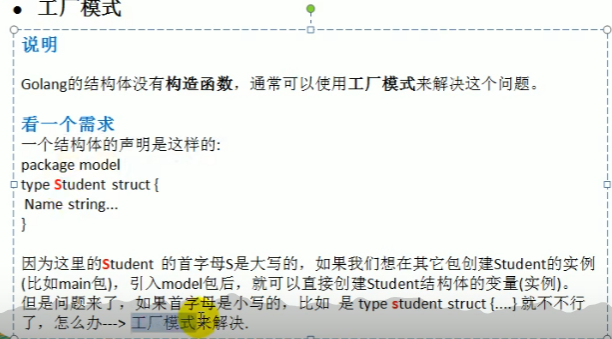

# 工厂模式

go中struct相当于class；
go中没有构造函数，通常使用工厂模式来解决；



假如一个包中定义结构体，且首字母大写，则导入包可直接使用这个包；
如果想要首字母不大写，怎么使用呢？
可以使用工厂模式解决

也就是定义一个函数，函数负责创建结构体，且暴露给外面；
如下，定义Get函数，获取得到student结构体；
```go
// model
package tempconv

import (
	"fmt"
)
type student struct {
	Name string
	age  int
}
func Get(s string, a int) *student {
	fmt.Println("ok")
	return &student{s, a}
}
func Getage(s *student) int {
	return s.age
}
```
```go
package main

import (
	"fmt"
	"project/project1/tempconv"
)

func main() {
	stu := tempconv.Get("aa", 10)
	fmt.Println(stu, stu.Name, tempconv.Getage(stu))
}
```


