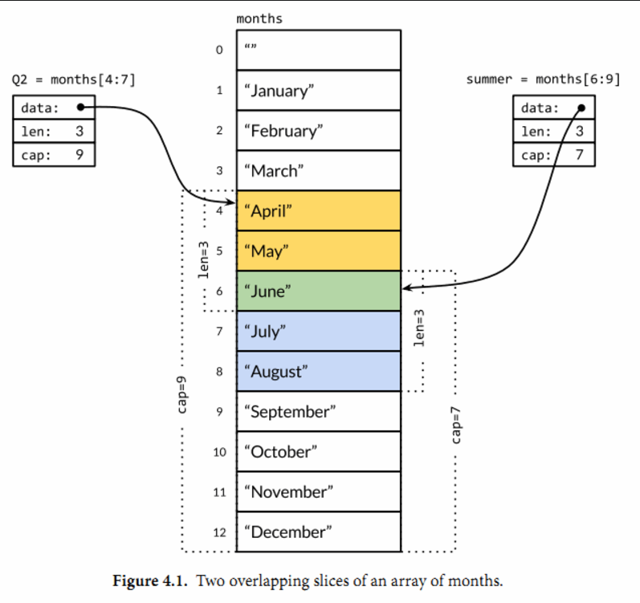

# 复合数据类型

## 4.1 数组

> 声明

声明需要指定元素类型及元素个数，语法格式如下：
var arrayName [size]dataType

在声明时，数组中的每个元素都会根据其数据类型进行默认初始化，对于整数类型，初始值为 0。

> 初始化
```go
var numbers = [5]int{1, 2, 3, 4, 5}
numbers := [5]int{1, 2, 3, 4, 5}
```
如果数组长度不确定，可以使用 ... 代替数组的长度，编译器会根据元素个数自行推断数组的长度：
```go
var balance = [...]float32{1000.0, 2.0, 3.4, 7.0, 50.0}
或
balance := [...]float32{1000.0, 2.0, 3.4, 7.0, 50.0}
```
如果设置了数组的长度，我们还可以通过指定下标来初始化元素：
```go
//  将索引为 1 和 3 的元素初始化
balance := [5]float32{1:2.0,3:7.0}
```


数组是一个由**固定长度**的特定类型元素组成的序列，一个数组可以由零个或多个元素组成。因为数组的长度是固定的，因此在Go语言中很少直接使用数组。和数组对应的类型是Slice（切片），它是可以增长和收缩的动态序列，slice功能也更灵活，但是要理解slice工作原理的话需要先理解数组。

数组的每个元素可以通过索引下标来访问，索引下标的范围是从0开始到数组长度减1的位置。内置的**len函数**将返回数组中元素的个数。

默认情况下，数组的每个元素都被初始化为元素类型对应的零值，对于数字类型来说就是0。我们也可以使用数组字面值语法用一组值来初始化数组：

```go
var q [3]int = [3]int{1, 2, 3}
var r [3]int = [3]int{1, 2}
fmt.Println(r[2]) // "0"
```

在数组字面值中，如果在数组的长度位置出现的是“...”省略号，则表示数组的长度是根据初始化值的个数来计算。因此，上面q数组的定义可以简化为

```go
q := [...]int{1, 2, 3}
fmt.Printf("%T\n", q) // "[3]int"
```

**数组的长度是数组类型的一个组成部分**，因此[3]int和[4]int是两种不同的数组类型。数组的长度必须是常量表达式，因为数组的长度需要在**编译阶段确定**。

数组、slice、map和结构体字面值的写法都很相似。上面的形式是直接提供顺序初始化值序列，但是也可以指定一个索引和对应值列表的方式初始化，就像下面这样：

```go
type Currency int

const (
    USD Currency = iota // 美元
    EUR                 // 欧元
    GBP                 // 英镑
    RMB                 // 人民币
)

symbol := [...]string{USD: "$", EUR: "€", GBP: "￡", RMB: "￥"}

fmt.Println(RMB, symbol[RMB]) // "3 ￥"

```

### 二维数组

定义：
var arr [4][5]int; 4行5列;

直接初始化：
var arr [][]int = [][]int{{},{}};


## slice

定义切片
你可以声明一个未指定大小的数组来定义切片：
> var identifier []type

切片不需要说明长度。

或使用 make() 函数来创建切片:
```go
var slice1 []type = make([]type, len)

也可以简写为

slice1 := make([]type, len)

```
也可以指定容量，其中 capacity 为可选参数。
```go
make([]T, length, capacity)
```

使用
```go
// 1. 引用数组
var arr [5]int = [...]int {1,2,3,4,5}
var slice = arr [1:3]

// 2. make创建切片
make([]T, length, capacity)

// 3. 直接指向数组
var slice []int = []int{1,23,3}
```

append() 和 copy() 函数
如果想增加切片的容量，我们必须创建一个新的更大的切片并把原分片的内容都拷贝过来。


Slice（切片）代表变长的序列，序列中每个元素都有相同的类型。一个slice类型一般写作[]T，其中T代表slice中元素的类型；slice的语法和数组很像，只是**没有固定长度**而已。

slice的底层确实引用一个数组对象。

一个slice由三个部分构成：**指针、长度和容量**。指针指向第一个slice元素对应的底层数组元素的地址，要注意的是slice的第一个元素并不一定就是数组的第一个元素。长度对应slice中元素的数目；长度不能超过容量，容量一般是从slice的开始位置到底层数据的结尾位置。内置的len和cap函数分别返回slice的长度和容量。

多个slice之间可以共享底层的数据，并且引用的数组部分区间可能重叠。图4.1显示了表示一年 

> months := [...]string{1: "January", /* ... */, 12: "December"}

因此一月份是months[1]，十二月份是months[12]。通常，数组的第一个元素从索引0开始，但是月份一般是从1开始的，因此我们声明数组时直接跳过第0个元素，第0个元素会被自动初始化为空字符串。



slice的切片操作s[i:j]，其中0 ≤ i≤ j≤ cap(s)，用于创建一个新的slice，引用s的从第i个元素开始到第j-1个元素的子序列。新的slice将只有j-i个元素。如果i位置的索引被省略的话将使用0代替，如果j位置的索引被省略的话将使用len(s)代替。months[1:13]切片操作将引用全部有效的月份，和months[1:]操作等价；months[:]切片操作则是引用整个数组。

如果切片操作超出cap(s)的上限将导致一个panic异常，但是超出len(s)则是意味着扩展了slice，因为新slice的长度会变大：

另外，字符串的切片操作和[]byte字节类型切片的切片操作是类似的。都写作x[m:n]，并且都是返回一个**原始字节序列的子序列**，底层都是**共享**之前的底层数组，因此这种操作都是常量时间复杂度。x[m:n]切片操作对于字符串则生成一个新字符串，如果x是[]byte的话则生成一个新的[]byte。

因为slice值包含指向第一个slice元素的指针，因此**向函数传递slice**将允许在函数内部修改底层数组的元素。换句话说，复制一个slice只是对底层的数组创建了一个新的slice**别名**（§2.3.2）。下面的reverse函数在原内存空间将[]int类型的slice反转，而且它可以用于任意长度的slice。

### 1. 追加 append

每次调用appendInt函数，必须先检测slice底层数组是否有足够的容量来保存新添加的元素。如果有足够空间的话，直接扩展slice（依然在原有的底层数组之上），将新添加的y元素复制到新扩展的空间，并返回slice。因此，输入的x和输出的z共享相同的底层数组。

如果没有足够的增长空间的话，appendInt函数则会先分配一个足够大的slice用于保存新的结果，先将输入的x复制到新的空间，然后添加y元素。结果z和输入的x引用的将是不同的底层数组。

内置的copy函数可以方便地将一个slice复制另一个相同类型的slice。copy函数的第一个参数是要复制的目标slice，第二个参数是源slice，目标和源的位置顺序和dst = src赋值语句是一致的。两个slice可以共享同一个底层数组，甚至有重叠也没有问题。copy函数将返回成功复制的元素的个数（我们这里没有用到），等于两个slice中较小的长度，所以我们不用担心覆盖会超出目标slice的范围。

## map

在获取 Map 的值时，如果键不存在，返回该类型的零值，例如 int 类型的零值是 0，string 类型的零值是 ""。

Map 是**引用类型**，如果将一个 Map 传递给一个函数或赋值给另一个变量，它们都指向同一个底层数据结构，因此对 Map 的修改会影响到所有引用它的变量。

定义 Map
```go
/* 使用 make 函数 */
map_variable := make(map[KeyType]ValueType, initialCapacity)

//声明，声明不会分配内存，初始化需要make，分配内存后才能赋值和使用
var name map[keytype]valuetype 
name = makemap[KeyType]ValueType, initialCapacity()
```
其中 KeyType 是键的类型，ValueType 是值的类型，initialCapacity 是可选的参数，用于指定 Map 的初始容量。Map 的容量是指 Map 中可以保存的键值对的数量，当 Map 中的键值对数量达到容量时，Map 会自动扩容。如果不指定 initialCapacity，Go 语言会根据实际情况选择一个合适的值。

也可以使用字面量创建 Map：
```go
// 使用字面量创建 Map
m := map[string]int{
    "apple": 1,
    "banana": 2,
    "orange": 3,
}
```

v2, ok := m["pear"]  // 如果键不存在，ok 的值为 false，v2 的值为该类型的零值

删除元素：
```go
// 删除键值对
delete(m, "banana")
```

不能一次清空，只能遍历删除；

如果一个查找失败将返回value类型对应的零值;

map中的元素并不是一个变量，因此我们不能对map的元素进行取址操作：

禁止对map元素取址的原因是map可能随着元素数量的增长而重新分配更大的内存空间，从而可能导致之前的地址无效。

要想遍历map中全部的key/value对的话，可以使用range风格的for循环实现，和之前的slice遍历语法类似。

```go
for name, age := range ages {
    fmt.Printf("%s\t%d\n", name, age)
}
```

如果要按顺序遍历key/value对，我们必须**显式地对key进行排序**，可以使用sort包的Strings函数对字符串slice进行排序。下面是常见的处理方式：

```go
import "sort"

var names []string
for name := range ages {
    names = append(names, name)
}
sort.Strings(names)
for _, name := range names {
    fmt.Printf("%s\t%d\n", name, ages[name])
}
```

map类型的零值是nil，也就是没有引用任何哈希表。

通过key作为索引下标来访问map将产生一个value。如果key在map中是存在的，那么将得到与key对应的value；如果key不存在，那么将得到value对应类型的零值.但是有时候可能需要知道对应的元素是否真的是在map之中。例如，如果元素类型是一个数字，你可能需要区分一个已经存在的0，和不存在而返回零值的0，可以像下面这样测试：

```go
age, ok := ages["bob"]
if !ok { /* "bob" is not a key in this map; age == 0. */ }

if age, ok := ages["bob"]; !ok { /* ... */ }
```

在这种场景下，map的下标语法将产生两个值；第二个是一个布尔值，用于报告元素是否真的存在。布尔变量一般命名为ok，特别适合马上用于if条件判断部分。

和slice一样，map之间也不能进行相等比较；唯一的例外是和nil进行比较。要判断两个map是否包含相同的key和value，我们必须通过一个循环实现：

```go
func equal(x, y map[string]int) bool {
    if len(x) != len(y) {
        return false
    }
    for k, xv := range x {
        if yv, ok := y[k]; !ok || yv != xv {
            return false
        }
    }
    return true
}
```

Go语言中并没有提供一个set类型，但是map中的key也是不相同的，可以用map实现类似set的功能。为了说明这一点，下面的dedup程序读取多行输入，但是只打印第一次出现的行。

```go
func main() {
    seen := make(map[string]bool) // a set of strings
    input := bufio.NewScanner(os.Stdin)
    for input.Scan() {
        line := input.Text()
        if !seen[line] {
            seen[line] = true
            fmt.Println(line)
        }
    }

    if err := input.Err(); err != nil {
        fmt.Fprintf(os.Stderr, "dedup: %v\n", err)
        os.Exit(1)
    }
}
```

### map切片

map的个数可以动态增长；

ma := []map[string]string 


## 结构体

没有class，使用struct；
值拷贝；

结构体定义需要使用 type 和 struct 语句。struct 语句定义一个新的数据类型，结构体中有一个或多个成员。type 语句设定了结构体的名称。结构体的格式如下：

```go
type struct_variable_type struct {
   member definition
   member definition
   ...
   member definition
}
```

声明：
```go
var stu student = Student{"aa",12}
stu2 := Student{"bb",11}

var stu3 = Student{
    Name: "cc",
    Age: 12
}
stu4 := Student{
    Name: "cc",
    Age: 12
}

```

如果要访问结构体成员，需要使用点号 . 操作符，格式为：

> 结构体.成员名

结构体指针
你可以定义指向结构体的指针类似于其他指针变量，格式如下：

var struct_pointer *Books
struct_pointer = &Book1

使用结构体指针访问结构体成员，使用 "." 操作符：
struct_pointer.title

如果结构体成员名字是以大写字母开头的，那么该成员就是**导出的**；这是Go语言导出规则决定的。一个结构体可能同时包含导出和未导出的成员。

一个命名为S的结构体类型将不能再包含S类型的成员：因为一个聚合的值不能包含它自身。（该限制同样适用于数组。）但是S类型的结构体可以包含*S指针类型的成员，这可以让我们创建递归的数据结构，比如链表和树结构等。

结构体类型的零值是每个成员都是零值。通常会将零值作为最合理的默认值。

如果结构体没有任何成员的话就是空结构体，写作struct{}。它的大小为0，也不包含任何信息，但是有时候依然是有价值的。有些Go语言程序员用map来模拟set数据结构时，用它来代替map中布尔类型的value，只是强调key的重要性，但是因为节约的空间有限，而且语法比较复杂，所以我们通常会避免这样的用法。


如何结构体的字段类型是：指针，slice和map的零值都是nil，及没有分配空间；
如果需要使用，需要make，才能使用；


### 内存分配

结构体内存是连续分布的；
结构体转换，一定要字段相同：结构体变量名字，个数都相同;

struct 的每个字段上，可以写上一个 tag，该tag可以通过反射机制获取，常用的使用场景是 序列化和反序列化；

```go
import (
	"encoding/json"
	"fmt"
)

type Sur struct {
	Name string `json:"name"`
	Age  int    `json:"age"`
}

func main() {

	m := Sur{"aaa", 22}
	jsonstr, _ := json.Marshal(m)
	println("str:", string(jsonstr))
}
// 这样就可以使得输出： str: {"name":"aaa","age":22} 不包含大写首字母了
```

如果一个类型实现了String()这个方法，那么fmt.Println,默认会调用这个变量的String()进行输出；


## JSON

JSON是对JavaScript中各种类型的值——字符串、数字、布尔值和对象——Unicode本文编码。

基本的JSON类型有数字（十进制或科学记数法）、布尔值（true或false）、字符串，其中字符串是以双引号包含的Unicode字符序列，支持和Go语言类似的反斜杠转义特性，不过JSON使用的是\Uhhhh转义数字来表示一个UTF-16编码


