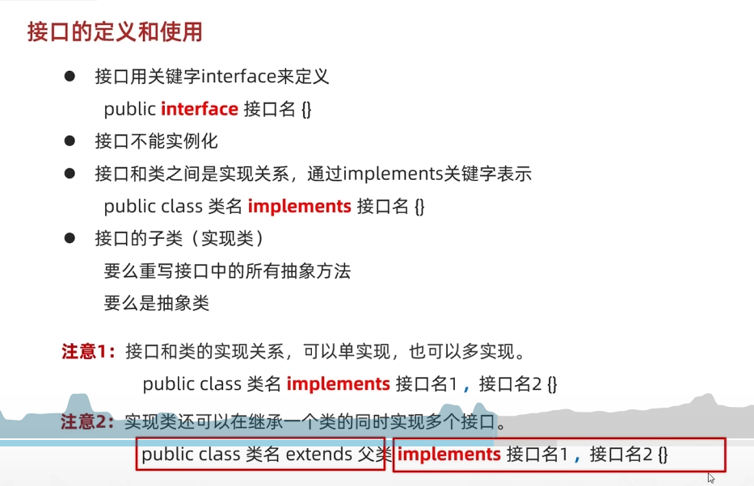
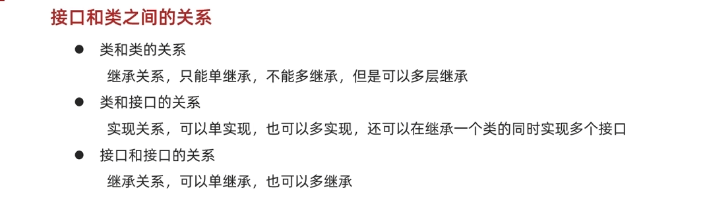
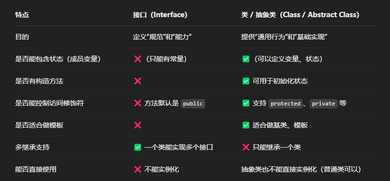

关于java中的抽象类和接口理解:


1. 多继承限制

+ 抽象类：Java 中类只能单继承，一个类继承了抽象类就无法再继承其他类（不考虑间接继承），这在一定程度上限制了类的扩展能力。例如，一个 Car 类已经继承了 Vehicle 抽象类，就不能再继承 Flyable 抽象类来表示能飞行的汽车，因为这会导致类继承结构的混乱。

+ 接口：接口允许多实现，一个类可以同时实现多个接口，从而轻松地组合多种不同的行为或功能。例如，Car 类可以同时实现 Driveable 接口和 Honkable 接口，分别表示可驾驶和可鸣笛的行为，这样就可以灵活地为类添加多种功能，而不受单继承的限制。

java 使用接口来规避 C++ 多继承的问题，同时保留多态与组合能力的灵活性。

2. 设计理念差异

+ 抽象类：抽象类通常用于表示一组相关的类所共有的属性和行为，它更强调类的本质和内在联系，是一种 “is - a” 关系的体现。例如，Animal 抽象类中定义了 eat() 和 sleep() 等方法，因为这些是动物共有的行为，具体的动物类如 Dog、Cat 等继承自 Animal 抽象类，它们是动物的一种具体类型。

+ 接口：接口更侧重于定义一组行为规范，而不关心实现类的具体类型和内部结构，是一种 “can - do” 关系的体现。例如，Runnable 接口定义了 run() 方法，只要一个类实现了 Runnable 接口，就表示这个类的对象可以执行 “跑” 这个行为，而不管这个类是 Person 类还是 Robot 类，重点在于它具备了可运行的能力。

### 0. 抽象类

抽象类 ≈ C++ 中带有 至少一个纯虚函数 的类

和c++不同，java用 `abstract` 关键字代替；

> 抽象类的定义格式

```java
abstract class 类名 {
    // 类的成员变量
    // 类的普通方法
    // 抽象方法
}
```

> 抽象方法的定义格式

```java
abstract 返回值类型 方法名(参数列表);
```

抽象方法不能有主体（body）”

> 子类继承抽象类之后，如何重写抽象方法

```java
// 抽象类
abstract class Animal {
    protected String name;

    public Animal(String name) {
        this.name = name;
    }

    public void eat() {
        System.out.println(name + "正在吃东西");
    }

    // 抽象方法
    public abstract void makeSound();
}

// 子类继承抽象类
class Dog extends Animal {
    public Dog(String name) {
        super(name);
    }

    // 实现抽象方法
    @Override
    public void makeSound() {
        System.out.println(name + "汪汪汪");
    }
}

public class Main {
    public static void main(String[] args) {
        // 创建子类对象
        Dog dog = new Dog("旺财");
        dog.eat();
        dog.makeSound();
    }
}
```

注意：
+ 抽象类不能实例化
+ 抽象类中不一定有抽象方法，由抽象方法的类一定是抽象类
+ 可以有构造方法
+ 抽象类的子类
    + 要么重写抽象类中的所有抽象方法
    + 要么是抽象类


### 1. 接口

抽象类：是代表子类的共性；是一类事务
接口：就是一种规则，是对行为的抽象；

> 1. 如何定义一个接口
```java
[访问修饰符] interface 接口名 [extends 父接口名列表] {
    // 常量定义
    [public static final] 数据类型 常量名 = 常量值;
    // 抽象方法定义
    [public abstract] 返回值类型 方法名(参数列表);
    // 默认方法定义（Java 8 及以后）
    [public] default 返回值类型 方法名(参数列表) {
        // 方法体
    }
    // 静态方法定义（Java 8 及以后）
    [public] static 返回值类型 方法名(参数列表) {
        // 方法体
    }
    // 私有方法定义（Java 9 及以后）
    private 返回值类型 方法名(参数列表) {
        // 方法体
    }
}
```

> 2. 如何使用一个接口

+ 实现接口：类使用 implements 关键字来实现接口，实现类必须实现接口中的所有抽象方法，除非该类是抽象类。
+ 多实现：一个类可以实现多个接口，用逗号分隔。
+ 接口继承：接口可以继承多个父接口，使用 extends 关键字，子接口会继承父接口的所有抽象方法。
+ 接口引用：可以使用接口类型的引用变量来引用实现类的对象，实现多态。

注意事项
+ 接口不能实例化，但可以作为类型使用。
+ 接口中的方法默认是 public 的，不能使用其他访问修饰符。
+ 接口中的常量默认是 public static final 的，不能修改。



```java
// 定义一个接口
interface Shape {
    // 常量定义
    double PI = 3.14;

    // 抽象方法
    double area();

    // 默认方法
    default void printInfo() {
        System.out.println("这是一个形状");
    }

    // 静态方法
    static void printWelcome() {
        System.out.println("欢迎使用形状计算系统");
    }
}

// 实现接口的类
class Circle implements Shape {
    private double radius;

    public Circle(double radius) {
        this.radius = radius;
    }

    // 实现抽象方法
    @Override
    public double area() {
        return PI * radius * radius;
    }
}

public class Main {
    public static void main(String[] args) {
        // 调用接口的静态方法
        Shape.printWelcome();

        // 创建实现类的对象
        Circle circle = new Circle(5);

        // 调用实现类实现的抽象方法
        System.out.println("圆的面积: " + circle.area());

        // 调用接口的默认方法
        circle.printInfo();
    }
}
```

> 3. 接口和抽象类的区别

共同点：

a) 接口和抽象类都不能被实例化
b) 抽象类和接口都是用来抽象具体对象的，要面向接口（抽象）编程，而不要面向具体编程。虽然都进行了不同程度的抽象，但是接口的抽象级别最高。

不同点：
a) 抽象类要被子类继承，而接口是用来被子类实现的。

b) 接口只能做方法声明，不能有方法的实现（接口默认方法实现除外），抽象类中不仅可以作方法声明，也可以做方法实现。

c) 实现接口的关键字为implements，继承抽象类的关键字为extends。一个类可以实现多个接口，但一个类只能继承一个抽象类。接口一方面解决java的单继承问题，另一方面，实现了强大的可插拔性（多态机制）。

d) 抽象类可以有抽象方法、具体的方法和属性，而接口只能有抽象方法和不可变常量。接口里定义的变量只能是公共的静态的常量(public static final)，抽象类中的变量是普通变量。

e) 接口是设计的结果，抽象类是重构的结果。抽象类主要用来抽象类别，强调的是所属关系，接口主要用来抽象功能，强调的是特定功能的实现。

使用总结

a) 抽象类的存在主要是可以把公共的代码移植到抽象类中。

b) 使用时，优先选择接口（因为继承抽象类后，此类将无法再继承，所以会丧失此类的灵活性）

> 4. 代替c++中的什么功能？

C++ 支持多重继承，即一个类可以从多个父类派生。然而，多重继承会引发一些问题，比如菱形继承问题（钻石问题），会造成代码的复杂性和二义性。在 Java 中，没有多重继承，但通过接口可以实现类似的功能。一个类可以实现多个接口，从而获得多个接口所定义的行为。以下是一个简单对比：

C++ 多重继承示例：

```c++
#include <iostream>

class A {
public:
    void funcA() {
        std::cout << "Function A" << std::endl;
    }
};

class B {
public:
    void funcB() {
        std::cout << "Function B" << std::endl;
    }
};

class C : public A, public B {
};

int main() {
    C c;
    c.funcA();
    c.funcB();
    return 0;
}
```

Java 接口实现类似功能示例：
```java
interface A {
    void funcA();
}

interface B {
    void funcB();
}

class C implements A, B {
    @Override
    public void funcA() {
        System.out.println("Function A");
    }

    @Override
    public void funcB() {
        System.out.println("Function B");
    }
}

public class Main {
    public static void main(String[] args) {
        C c = new C();
        c.funcA();
        c.funcB();
    }
}
```

在 Java 中，通过实现多个接口，C 类获得了 A 和 B 接口所定义的行为，避免了 C++ 多重继承带来的问题。

2. 纯虚函数
在 C++ 中，纯虚函数用于定义抽象类，要求派生类必须实现这些纯虚函数。Java 中的接口可以看作是纯抽象类，接口中的方法默认都是抽象方法，实现接口的类必须实现这些方法，这和 C++ 中纯虚函数的作用类似。


> 5. 接口里面成员的特点

+ 成员变量
    + 只能是常量
    + 默认修饰符： public static final
    因为接口是一种规则，是不能发生改变的，所以都是常量
+ 构造方法：无
+ 成员方法：
    + 默认：public abstract
    + 可以定义有方法体的方法
    + 可以定义私有方法
```java
[访问修饰符] interface 接口名 [extends 父接口名列表] {
    // 常量定义
    [public static final] 数据类型 常量名 = 常量值;
    // 抽象方法定义
    [public abstract] 返回值类型 方法名(参数列表);

    // 默认方法定义（Java 8 及以后）
    [public] default 返回值类型 方法名(参数列表) {
        // 方法体
    }
    // 静态方法定义（Java 8 及以后）
    [public] static 返回值类型 方法名(参数列表) {
        // 方法体
    }
    // 私有方法定义（Java 9 及以后）
    private 返回值类型 方法名(参数列表) {
        // 方法体
    }
}
```

#### 11.5.1 接口默认方法的使用

注意：
+ 默认方法不是抽象方法，所以不强制被重写。但是如果被重写，**重写的时候去掉default**关键字；
+ 如果实现了多个接口，多个接口中存在相同名字的默认方法，子类就必须对该方法进行重写；

1. 实现类直接调用
实现类可以直接调用接口的默认方法，无需重写。示例如下：
```java
interface Vehicle {
    default void start() {
        System.out.println("车辆启动");
    }
}

class Car implements Vehicle {
    // 无需重写 start 方法
}

public class Main {
    public static void main(String[] args) {
        Car car = new Car();
        car.start(); // 直接调用接口的默认方法
    }
}
```

2. 实现类重写默认方法
实现类也可以重写接口的默认方法，以提供自己的实现。示例如下：
```java
interface Vehicle {
    default void start() {
        System.out.println("车辆启动");
    }
}

class Car implements Vehicle {
    @Override
    public void start() {
        // 不需要加上 default
        System.out.println("汽车启动，发动机轰鸣");
    }
}

public class Main {
    public static void main(String[] args) {
        Car car = new Car();
        car.start(); // 调用重写后的方法
    }
}
```

3. 调用父接口的默认方法
如果一个类实现了多个接口，且这些接口中有同名的默认方法，那么实现类需要显式指定调用哪个接口的默认方法。示例如下：
```java
interface LandVehicle {
    default void move() {
        System.out.println("陆地车辆移动");
    }
}

interface WaterVehicle {
    default void move() {
        System.out.println("水上车辆移动");
    }
}

class AmphibiousVehicle implements LandVehicle, WaterVehicle {
    @Override
    public void move() {
        LandVehicle.super.move(); // 调用 LandVehicle 接口的默认方法
    }
}

public class Main {
    public static void main(String[] args) {
        AmphibiousVehicle vehicle = new AmphibiousVehicle();
        vehicle.move();
    }
}
```
#### 11.5.2 接口静态方法的使用

在 Java 8 及之后的版本中，接口支持定义静态方法。接口中的静态方法是属于接口本身的，它有自己独立的实现，并且不需要依赖接口的实现类来调用。

在接口里使用 static 关键字来定义静态方法，格式如下：

```java
public interface 接口名 {
    static 返回值类型 方法名(参数列表) {
        // 方法体
        return 返回值;
    }
}
```

使用场景
1. 提供工具方法
接口静态方法可以用来提供一些与接口相关的通用工具方法，这些方法不需要实例化接口的实现类就可以直接调用。例如，在一个集合操作的接口中，可以定义静态方法来对集合进行排序、查找等操作。
2. 封装接口内部逻辑
将一些与接口紧密相关但又不需要在实现类中实现的逻辑封装在静态方法中，使接口的功能更加清晰和模块化。

调用方式
接口静态方法只能通过接口名直接调用，不能通过实现类的实例或者实现类名来调用。示例如下：
```java
interface MathUtils {
    static int add(int a, int b) {
        return a + b;
    }
}

public class Main {
    public static void main(String[] args) {
        int result = MathUtils.add(3, 5); // 通过接口名调用静态方法
        System.out.println("3 + 5 的结果是: " + result);
    }
}
```

注意事项
+ 不能被重写：接口的静态方法不能在实现类中被重写，因为静态方法属于接口本身，而不是属于实现类。
+ 访问限制：接口的静态方法只能访问接口中定义的静态成员（如静态常量），不能访问接口中的非静态成员，也不能使用 this 或 super 关键字。
+ 与类的静态方法区别：虽然接口的静态方法和类的静态方法都可以通过类名或接口名直接调用，但它们的作用范围不同。类的静态方法可以被继承和重写，而接口的静态方法不能被实现类继承或重写。

#### 11.5.3 接口中私有方法的使用

在 Java 9 及之后的版本中，接口支持定义私有方法。接口中的私有方法主要用于将接口内默认方法或静态方法里的重复代码进行封装，以此提升代码的复用性和可维护性

定义接口私有方法
在接口里使用 private 关键字来定义私有方法，可分为私有实例方法和私有静态方法，格式如下：
```java
// 私有实例方法
private 返回值类型 方法名(参数列表) {
    // 方法体
    return 返回值;
}
// 私有静态方法
private static 返回值类型 方法名(参数列表) {
    // 方法体
    return 返回值;
}

```

示例代码如下：
```java
interface Calculator {
    private int add(int a, int b) {
        return a + b;
    }

    private static int multiply(int a, int b) {
        return a * b;
    }

    default int calculateSumAndProduct(int a, int b) {
        int sum = add(a, b);
        int product = multiply(a, b);
        return sum + product;
    }
}
```

使用场景
1. 代码复用
当接口中的默认方法或静态方法存在重复的代码逻辑时，可以把这些重复代码提取到私有方法中，避免代码冗余。
2. 封装细节
将一些不希望暴露给实现类的内部逻辑封装在私有方法中，保证接口的简洁性和安全性。


调用方式
接口的私有方法只能在接口内部被调用，具体来说：
+ 私有实例方法：可以被接口中的默认方法调用。
+ 私有静态方法：可以被接口中的默认方法和静态方法调用。

注意事项
+ 访问限制：接口的私有方法不能被实现类访问，也不能在接口外部被调用，只能在接口内部的默认方法或静态方法中使用。
+ 不能使用 abstract 修饰：私有方法必须有具体的实现，不能使用 abstract 关键字修饰。
+ 与类的私有方法区别：接口的私有方法和类的私有方法类似，都是为了封装内部逻辑，但接口的私有方法主要是为接口内的默认方法和静态方法服务。

```java
interface Calculator {
    private int add(int a, int b) {
        return a + b;
    }

    private static int multiply(int a, int b) {
        return a * b;
    }

    default int calculateSumAndProduct(int a, int b) {
        int sum = add(a, b);
        int product = multiply(a, b);
        return sum + product;
    }

    static int calculateProductTwice(int a, int b) {
        return multiply(a, b) * 2;
    }
}

class MyCalculator implements Calculator {
    // 可以使用接口的默认方法和静态方法
}

public class Main {
    public static void main(String[] args) {
        MyCalculator calculator = new MyCalculator();
        int result1 = calculator.calculateSumAndProduct(2, 3);
        System.out.println("和与积的和: " + result1);

        int result2 = Calculator.calculateProductTwice(2, 3);
        System.out.println("积的两倍: " + result2);
    }
}
```

#### 11.5.4 接口和类之间的关系

类实现多个接口，如果接口之间有重名的，只需要实现一次即可；

接口间是继承关系，可以多继承；


#### 11.5.5 接口的应用

接口的多态：

```java
// 定义接口
public interface Animal {
    void speak();
}

// 实现类1
public class Dog implements Animal {
    public void speak() {
        System.out.println("汪汪！");
    }
}

// 实现类2
public class Cat implements Animal {
    public void speak() {
        System.out.println("喵喵！");
    }
}

// 测试接口多态
public class Test {
    public static void makeAnimalSpeak(Animal animal) {
        animal.speak(); // 多态调用
    }

    public static void main(String[] args) {
        Animal dog = new Dog(); // 接口引用指向 Dog 对象
        Animal cat = new Cat(); // 接口引用指向 Cat 对象

        makeAnimalSpeak(dog); // 输出：汪汪！
        makeAnimalSpeak(cat); // 输出：喵喵！
    }
}

```

> 接口可以替换类吗？



总结一句话：
接口不能完全替代类，就像说明书不能替代产品。
接口是能力的承诺，类是功能的实现。它们是互补的，而不是替代的。

📌 怎么理解接口是“类型”？
在 Java 中，接口不仅仅是方法声明的集合，它也是一种“引用类型”，可以：

作为变量类型

作为方法的参数类型

作为返回值类型

作为数组元素类型

用于多态（多种类统一用一个接口处理）

Java 的接口类型用法 ≈ C++ 的抽象基类指针/引用


#### 11.5.6 适配器模式

它的核心作用就是：让原本不兼容的接口协同工作。

你可以把它想象成插头转换器：
家里的电器是圆插头（A接口），但插座是扁插头（B接口），你不能直接插——这时候你就用一个“转换头”，让它俩接上了。这就是“适配器”在软件中的作用。

> ✅ 适配器模式的三要素：

```txt
目标接口（Target）: 希望使用的接口
被适配者（Adaptee）: 已有的老接口
适配器（Adapter）: 把 Adaptee 转换成 Target 的类
```

💡 经典示例：充电器转换头
比如我们有一个 USB 接口的手机，但只有一个 TypeC 的充电头 —— 我们用适配器就能兼容：

1. Target（期望的接口）
```java
interface USB {
    void connectWithUsbCable();
}
```

2. Adaptee（已有的接口）
```java
class TypeCPhone {
    public void connectWithTypeCCable() {
        System.out.println("Type-C 手机连接成功！");
    }
}
```

3. Adapter（适配器类）
```java
class TypeCToUSBAdapter implements USB {
    private TypeCPhone phone;

    public TypeCToUSBAdapter(TypeCPhone phone) {
        this.phone = phone;
    }

    @Override
    public void connectWithUsbCable() {
        System.out.print("使用适配器: ");
        phone.connectWithTypeCCable();  // 实际调用的是 TypeC 的接口
    }
}
```

4. 客户端调用（Client）
```java
public class Main {
    public static void main(String[] args) {
        TypeCPhone phone = new TypeCPhone();
        USB usbAdapter = new TypeCToUSBAdapter(phone); // 使用适配器
        usbAdapter.connectWithUsbCable();              // 看上去是 USB，其实调用 Type-C
    }
}
```

#### 11.5.7 接口中没有抽象放大

✅ 如果接口中没有抽象方法，它的含义可能有以下几种：
1. 标记接口（Marker Interface）
这是最常见的用法 —— 没有方法，只起标记作用的接口，用来告诉 JVM 或工具某个类具有某种“特征”或“能力”。

✅ 举个例子：java.io.Serializable

```java
public interface Serializable {
    // 没有任何方法
}
```

一个类实现了 Serializable 接口，表示它的对象可以被序列化（即可以被转换成字节流进行保存、传输等）。

```java
public class MyClass implements Serializable {
    // 这个类就具备了序列化的能力
}
```

关键点：

+ 这种接口 不靠代码行为来影响程序，而是通过 JVM 或框架识别是否实现了某个接口 来做出不同的处理。

+ 通常和反射、注解、类加载器、序列化机制等配合使用。

2. 使用默认方法或静态方法的接口
从 Java 8 开始，接口中可以有：

default 方法（带有实现）

static 方法（静态工具方法）

所以一个接口即使没有抽象方法，也可以作为工具类使用。

示例：
```java
public interface MyHelper {
    static void log(String msg) {
        System.out.println("日志: " + msg);
    }

    default void hello() {
        System.out.println("你好，这是默认方法！");
    }
}
```

虽然它没有抽象方法，但依然可以在类中实现并使用。
接口可以像工具类一样提供一组方法，而不是强制子类实现。

3. 作为未来扩展的占位符
有时接口会先设计出来，但暂时没有抽象方法，仅仅是一个占位符，等待将来补充行为。


