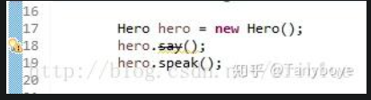

# 注解

什么是注解（Annotation）？注解是放在Java源码的类、方法、字段、参数前的一种特殊“注释”：

作用类似于 C++ 中的宏（如 __attribute__）或者元信息系统，但比 C++ 更加标准化和强大。


```java
// this is a component:
@Resource("hello")
public class Hello {
    @Inject
    int n;

    @PostConstruct
    public void hello(@Param String name) {
        System.out.println(name);
    }

    @Override
    public String toString() {
        return "Hello";
    }
}

```

注释会被编译器直接忽略，注解则可以被编译器打包进入class文件，因此，注解是一种用作标注的“元数据”。

注解的作用

从JVM的角度看，注解本身对代码逻辑没有任何影响，如何使用注解完全由工具决定。而注解在代码运行时是可以被反射读取并进行相应的操作，而如果没有使用反射或者其他检查，那么注解是没有任何真实作用的，也不会影响到程序的正常运行结果。

📚 常用的标准注解

注解名 | 作用
@Override | 表示当前方法重写了父类方法
@Deprecated | 表示当前方法不推荐使用
@SuppressWarnings | 抑制编译器警告
@FunctionalInterface | 限定接口只能有一个抽象方法（函数式接口）
@SafeVarargs | 用于泛型可变参数方法，消除警告

🔧 注解分类
✅ 按是否带参数
```java
// 不带参数
@Override

// 带参数
@SuppressWarnings("unchecked")
```

✅ 按使用场景分为 3 类：

类型 | 说明 | 示例
---|---|---
编译时注解 | 给编译器使用 | @Override, @SuppressWarnings
运行时注解 | 程序运行时通过反射读取 | @Retention(RUNTIME) 定义的注解
源码注解 | 仅在源码中生效，不进入 class 文件 | 文档注解


Java的注解可以分为三类：

第一类是由编译器使用的注解，例如：

+ @Override：让编译器检查该方法是否正确地实现了覆写；
+ @SuppressWarnings：告诉编译器忽略此处代码产生的警告。

这类注解不会被编译进入.class文件，它们在编译后就被编译器扔掉了。

第二类是由工具处理.class文件使用的注解，比如有些工具会在加载class的时候，对class做动态修改，实现一些特殊的功能。这类注解会被编译进入.class文件，但加载结束后并不会存在于内存中。这类注解只被一些底层库使用，一般我们不必自己处理。

第三类是在程序运行期能够读取的注解，它们在加载后一直存在于JVM中，这也是最常用的注解。例如，一个配置了@PostConstruct的方法会在调用构造方法后自动被调用（这是Java代码读取该注解实现的功能，JVM并不会识别该注解）。


定义一个注解时，还可以定义配置参数。配置参数可以包括：

+ 所有基本类型；
+ String；
+ 枚举类型；
+ 基本类型、String、Class以及枚举的数组。

因为配置参数必须是常量，所以，上述限制保证了注解在定义时就已经确定了每个参数的值。

注解的配置参数可以有默认值，缺少某个配置参数时将使用默认值。

此外，大部分注解会有一个名为value的配置参数，对此参数赋值，可以只写常量，相当于省略了value参数。

如果只写注解，相当于全部使用默认值。

举个栗子，对以下代码：

```java
public class Hello {
    @Check(min=0, max=100, value=55)
    public int n;

    @Check(value=99)
    public int p;

    @Check(99) // @Check(value=99)
    public int x;

    @Check
    public int y;
}
```

@Check就是一个注解。第一个@Check(min=0, max=100, value=55)明确定义了三个参数，第二个@Check(value=99)只定义了一个value参数，它实际上和@Check(99)是完全一样的。最后一个@Check表示所有参数都使用默认值。


## 1. 定义注解@interface）

java语言使用@interface语法来定义注解（Annotation），它的格式如下：

```java
public @interface Report {
    int type() default 0;
    String level() default "info";
    String value() default "";
}
```

注解的参数类似无参数方法，可以用default设定一个默认值（强烈推荐）。最常用的参数应当命名为value。

## 2. 元注解

有一些注解可以修饰其他注解，这些注解就称为元注解（meta annotation）。Java标准库已经定义了一些元注解，我们只需要使用元注解，通常不需要自己去编写元注解。

元标签有 @Retention、@Documented、@Target、@Inherited、@Repeatable 5 种。

### 2.1 @Retention

@Retention定义了Annotation的生命周期：

+ RetentionPolicy.SOURCE 注解只在源码阶段保留，在编译器进行编译时它将被丢弃忽视。

+ RetentionPolicy.CLASS 注解只被保留到编译进行的时候，它并不会被加载到 JVM 中。

+ RetentionPolicy.RUNTIME 注解可以保留到程序运行的时候，它会被加载进入到 JVM 中，所以在程序运行时可以获取到它们。

如果@Retention不存在，则该Annotation默认为CLASS。因为通常我们自定义的Annotation都是RUNTIME，所以，务必要加上@Retention(RetentionPolicy.RUNTIME)这个元注解：

```java
@Retention(RetentionPolicy.RUNTIME)
public @interface Report {
    int type() default 0;
    String level() default "info";
    String value() default "";
}
```

上面的代码中，我们指定 Report 可以在程序运行周期被获取到，因此它的生命周期非常的长。

### 2.2 @Documented

它的作用是能够将注解中的元素包含到 Javadoc 中去。

### 2.3 @Target


最常用的元注解是@Target。使用@Target可以定义Annotation能够被应用于源码的哪些位置：

可以这样理解，当一个注解被 @Target 注解时，这个注解就被限定了运用的场景。

+ 类或接口：ElementType.TYPE；
+ 字段：ElementType.FIELD；
+ 方法：ElementType.METHOD；
+ 构造方法：ElementType.CONSTRUCTOR；
+ 方法参数：ElementType.PARAMETER。

例如，定义注解@Report可用在方法上，我们必须添加一个@Target(ElementType.METHOD)：

```java
@Target(ElementType.METHOD)
public @interface Report {
    int type() default 0;
    String level() default "info";
    String value() default "";
}
```

定义注解@Report可用在方法或字段上，可以把@Target注解参数变为数组{ ElementType.METHOD, ElementType.FIELD }：

```java
@Target({
    ElementType.METHOD,
    ElementType.FIELD
})
public @interface Report {
    ...
}
```

实际上@Target定义的value是ElementType[]数组，只有一个元素时，可以省略数组的写法。

### 2.4 @Inherited

Inherited 是继承的意思，但是它并不是说注解本身可以继承，而是说如果一个超类被 @Inherited 注解过的注解进行注解的话，那么如果它的子类没有被任何注解应用的话，那么这个子类就继承了超类的注解。

说的比较抽象。代码来解释。

```java
@Inherited
@Retention(RetentionPolicy.RUNTIME)
@interface Test {}

@Test
public class A {}

public class B extends A {}
```

注解 Test 被 @Inherited 修饰，之后类 A 被 Test 注解，类 B 继承 A,类 B 也拥有 Test 这个注解。

### 2.5  @Repeatable

使用@Repeatable这个元注解可以定义Annotation是否可重复。

举个例子:

```java
@interface Persons {
    Person[]  value();
}

@Repeatable(Persons.class)
@interface Person{
    String role default "";
}

@Person(role="artist")
@Person(role="coder")
@Person(role="PM")
public class SuperMan{
}
```

注意上面的代码，@Repeatable 注解了 Person。而 @Repeatable 后面括号中的类相当于一个容器注解。

什么是容器注解呢？就是用来存放其它注解的地方。它本身也是一个注解。

我们再看看代码中的相关容器注解。

```java
@interface Persons {
    Person[]  value();
}
```

按照规定，它里面必须要有一个 value 的属性，属性类型是一个被 @Repeatable 注解过的注解数组，注意它是数组。

如果不好理解的话，可以这样理解。Persons 是一张总的标签，上面贴满了 Person 这种同类型但内容不一样的标签。把 Persons 给一个 SuperMan 贴上，相当于同时给他贴了程序员、产品经理、画家的标签。

我们可能对于 @Person(role=”PM”) 括号里面的内容感兴趣，它其实就是给 Person 这个注解的 role 属性赋值为 PM ，大家不明白正常，马上就讲到注解的属性这一块。

**注解的属性**

注解的属性也叫做成员变量。注解只有成员变量，没有方法。注解的成员变量在注解的定义中以“无形参的方法”形式来声明，其方法名定义了该成员变量的名字，其返回值定义了该成员变量的类型。

```java
@Target(ElementType.TYPE)
@Retention(RetentionPolicy.RUNTIME)
public @interface TestAnnotation {
    int id();
    String msg();
}
```

上面代码定义了 TestAnnotation 这个注解中拥有 id 和 msg 两个属性。在使用的时候，我们应该给它们进行赋值。

赋值的方式是在注解的括号内以 value=”” 形式，多个属性之前用 ，隔开。

```java
@TestAnnotation(id=3,msg="hello annotation")
public class Test {
}
```

需要注意的是，在注解中定义属性时它的类型必须是 8 种基本数据类型外加 类、接口、注解及它们的数组。

注解中属性可以有默认值，默认值需要用 default 关键值指定。比如：

```java
@Target(ElementType.TYPE)
@Retention(RetentionPolicy.RUNTIME)
public @interface TestAnnotation {
    public int id() default -1;
    public String msg() default "Hi";
}
```

TestAnnotation 中 id 属性默认值为 -1，msg 属性默认值为 Hi。
它可以这样应用。

```java
@TestAnnotation()
public class Test {}
```

因为有默认值，所以无需要再在 @TestAnnotation 后面的括号里面进行赋值了，这一步可以省略。

另外，还有一种情况。如果一个注解内仅仅只有一个名字为 value 的属性时，应用这个注解时可以直接接属性值填写到括号内。

```java
public @interface Check {
    String value();
}
```

上面代码中，Check 这个注解只有 value 这个属性。所以可以这样应用。

```java
@Check("hi")
int a;
```

这和下面的效果是一样的

```java
@Check(value="hi")
int a;
```

最后，还需要注意的一种情况是一个注解没有任何属性。比如

```java
public @interface Perform {}
```

那么在应用这个注解的时候，括号都可以省略。

```java
@Perform
public void testMethod(){}
```


## 3. 如何定义Annotation
我们总结一下定义Annotation的步骤：

第一步，用@interface定义注解：

```java
public @interface Report {
}
```

第二步，添加参数、默认值：
```java
public @interface Report {
    int type() default 0;
    String level() default "info";
    String value() default "";
}

```

把最常用的参数定义为value()，推荐所有参数都尽量设置默认值。

第三步，用元注解配置注解：
```java
@Target(ElementType.TYPE)
@Retention(RetentionPolicy.RUNTIME)
public @interface Report {
    int type() default 0;
    String level() default "info";
    String value() default "";
}

```

其中，必须设置@Target和@Retention，@Retention一般设置为RUNTIME，因为我们自定义的注解通常要求在运行期读取。一般情况下，不必写@Inherited和@Repeatable。


## 4. Java 预置的注解

### 4.1 @Deprecated

这个元素是用来标记过时的元素，想必大家在日常开发中经常碰到。编译器在编译阶段遇到这个注解时会发出提醒警告，告诉开发者正在调用一个过时的元素比如过时的方法、过时的类、过时的成员变量。

```java
public class Hero {
    @Deprecated
    public void say(){
        System.out.println("Noting has to say!");
    }
    public void speak(){
        System.out.println("I have a dream!");
    }
}
```

定义了一个 Hero 类，它有两个方法 say() 和 speak() ，其中 say() 被 @Deprecated 注解。然后我们在 IDE 中分别调用它们。



可以看到，say() 方法上面被一条直线划了一条，这其实就是编译器识别后的提醒效果。

### 4.2 @Override

这个大家应该很熟悉了，提示子类要复写父类中被 @Override 修饰的方法

### 4.3 @SuppressWarnings

阻止警告的意思。之前说过调用被 @Deprecated 注解的方法后，编译器会警告提醒，而有时候开发者会忽略这种警告，他们可以在调用的地方通过 @SuppressWarnings 达到目的。

```java
@SuppressWarnings("deprecation")
public void test1(){
    Hero hero = new Hero();
    hero.say();
    hero.speak();
}
```

### 4.4 @SafeVarargs

参数安全类型注解。它的目的是提醒开发者不要用参数做一些不安全的操作,它的存在会阻止编译器产生 unchecked 这样的警告。它是在 Java 1.7 的版本中加入的。

```java
@SafeVarargs // Not actually safe!
    static void m(List<String>... stringLists) {
    Object[] array = stringLists;
    List<Integer> tmpList = Arrays.asList(42);
    array[0] = tmpList; // Semantically invalid, but compiles without warnings
    String s = stringLists[0].get(0); // Oh no, ClassCastException at runtime!
}
```

上面的代码中，编译阶段不会报错，但是运行时会抛出 ClassCastException 这个异常，所以它虽然告诉开发者要妥善处理，但是开发者自己还是搞砸了。

Java 官方文档说，未来的版本会授权编译器对这种不安全的操作产生错误警


### 4.5 @FunctionalInterface

函数式接口注解，这个是 Java 1.8 版本引入的新特性。函数式编程很火，所以 Java 8 也及时添加了这个特性。

函数式接口 (Functional Interface) 就是一个具有一个方法的普通接口。
比如

```java
@FunctionalInterface
public interface Runnable {
    /**
     * When an object implementing interface <code>Runnable</code> is used
     * to create a thread, starting the thread causes the object's
     * <code>run</code> method to be called in that separately executing
     * thread.
     * <p>
     * The general contract of the method <code>run</code> is that it may
     * take any action whatsoever.
     *
     * @see     java.lang.Thread#run()
     */
    public abstract void run();
}
```

我们进行线程开发中常用的 Runnable 就是一个典型的函数式接口，上面源码可以看到它就被 @FunctionalInterface 注解。

可能有人会疑惑，函数式接口标记有什么用，这个原因是函数式接口可以很容易转换为 Lambda 表达式。这是另外的主题了，有兴趣的同学请自己搜索相关知识点学习。
### 4.6 @Component 

这是 Spring 中的一个 通用组件注解，作用是把类标记为 Spring 容器中的一个 Bean，相当于告诉 Spring：

> “嘿，这个类交给你来管理！”

它的核心作用：

✅ 被自动扫描（配合 @ComponentScan）
✅ 自动注入到其他 Bean 中（配合 @Autowired）

📌 示例

```java
@Component
public class UserService {
    public void sayHello() {
        System.out.println("Hello, User!");
    }
}
```

当 Spring Boot 启动时，它会扫描到 @Component 标注的类，并把它放入 Spring 容器，变成一个单例 Bean。

这样你就可以在其他地方这样使用：

```java
@Autowired
private UserService userService;
```

📚 相关注解

实际上，Spring 还提供了几个更细分的注解，它们 本质上也是 @Component 的特化版：

+ @Service → 表示业务逻辑层组件

+ @Repository → 表示数据访问层组件

+ @Controller → 表示 Web 控制层组件

它们在功能上等价于 @Component，只是语义更明确。

### 4.7 @Aspect 注解

这是 Spring AOP（面向切面编程）的核心注解，作用是：

> 把一个类标记为 切面（Aspect），用于定义横切逻辑（比如日志、权限、事务等）。

简单说，@Aspect 是用来写 AOP 代码的。

📌 示例

```java
@Aspect
@Component
public class LogAspect {

    @Before("execution(* com.example.service.*.*(..))")
    public void beforeMethod() {
        System.out.println("Before method execution...");
    }
}

```

解释：

✅ @Aspect → 声明这是一个切面

✅ @Before → 定义一个前置通知，拦截目标方法前执行

✅ execution(...) → 切入点表达式，指定拦截哪些方法

> 注意：@Aspect 必须和 @Component 搭配使用，因为切面本质也是一个 Spring Bean。

📚 常用 AOP 注解

| 注解                | 作用                |
| ----------------- | ----------------- |
| `@Before`         | 方法前执行             |
| `@After`          | 方法后执行（无论是否异常）     |
| `@AfterReturning` | 方法成功返回后执行         |
| `@AfterThrowing`  | 方法抛出异常后执行         |
| `@Around`         | 包裹整个方法（可控制是否继续执行） |


## 5. 注解与反射。

注解通过反射获取。首先可以通过 Class 对象的 isAnnotationPresent() 方法判断它是否应用了某个注解

```java
public boolean isAnnotationPresent(Class<? extends Annotation> annotationClass) {}
```

然后通过 getAnnotation() 方法来获取 Annotation 对象。

```java
public <A extends Annotation> A getAnnotation(Class<A> annotationClass) {}
```

或者是 getAnnotations() 方法。

```java
public Annotation[] getAnnotations() {}
```


前一种方法返回指定类型的注解，后一种方法返回注解到这个元素上的所有注解。

如果获取到的 Annotation 如果不为 null，则就可以调用它们的属性方法了。比如

```java
@TestAnnotation()
public class Test {
    public static void main(String[] args) {
        boolean hasAnnotation = Test.class.isAnnotationPresent(TestAnnotation.class);
        if ( hasAnnotation ) {
            TestAnnotation testAnnotation = Test.class.getAnnotation(TestAnnotation.class);
            System.out.println("id:"+testAnnotation.id());
            System.out.println("msg:"+testAnnotation.msg());
        }
    }
}
```

程序的运行结果是：

```java
id:-1
msg:
```

这个正是 TestAnnotation 中 id 和 msg 的默认值。

上面的例子中，只是检阅出了注解在类上的注解，其实属性、方法上的注解照样是可以的。同样还是要假手于反射。

```java
@TestAnnotation(msg="hello")
public class Test {
    @Check(value="hi")
    int a;
    @Perform
    public void testMethod(){}
    @SuppressWarnings("deprecation")
    public void test1(){
        Hero hero = new Hero();
        hero.say();
        hero.speak();
    }
    public static void main(String[] args) {
        boolean hasAnnotation = Test.class.isAnnotationPresent(TestAnnotation.class);
        if ( hasAnnotation ) {
            TestAnnotation testAnnotation = Test.class.getAnnotation(TestAnnotation.class);
            //获取类的注解
            System.out.println("id:"+testAnnotation.id());
            System.out.println("msg:"+testAnnotation.msg());
        }
        try {
            Field a = Test.class.getDeclaredField("a");
            a.setAccessible(true);
            //获取一个成员变量上的注解
            Check check = a.getAnnotation(Check.class);
            if ( check != null ) {
                System.out.println("check value:"+check.value());
            }
            Method testMethod = Test.class.getDeclaredMethod("testMethod");
            if ( testMethod != null ) {
                // 获取方法中的注解
                Annotation[] ans = testMethod.getAnnotations();
                for( int i = 0;i < ans.length;i++) {
                    System.out.println("method testMethod annotation:"+ans[i].annotationType().getSimpleName());
                }
            }
        } catch (NoSuchFieldException e) {
            // TODO Auto-generated catch block
            e.printStackTrace();
            System.out.println(e.getMessage());
        } catch (SecurityException e) {
            // TODO Auto-generated catch block
            e.printStackTrace();
            System.out.println(e.getMessage());
        } catch (NoSuchMethodException e) {
            // TODO Auto-generated catch block
            e.printStackTrace();
            System.out.println(e.getMessage());
        }
    }
}
```

它们的结果如下：

```java
id:-1
msg:hello
check value:hi
method testMethod annotation:Perform
```

需要注意的是，如果一个注解要在运行时被成功提取，那么 @Retention(RetentionPolicy.RUNTIME) 是必须的。

## 6. 注解的使用场景

注解是一系列元数据，它提供数据用来解释程序代码，但是注解并非是所解释的代码本身的一部分。注解对于代码的运行效果没有直接影响。

注解有许多用处，主要如下：

+ 提供信息给编译器： 编译器可以利用注解来探测错误和警告信息

+ 编译阶段时的处理： 软件工具可以用来利用注解信息来生成代码、Html文档或者做其它相应处理。

+ 运行时的处理： 某些注解可以在程序运行的时候接受代码的提取
值得注意的是，注解不是代码本身的一部分。

### 6.1 demo

我要写一个测试框架，测试程序员的代码有无明显的异常。

—— 程序员 A : 我写了一个类，它的名字叫做 NoBug，因为它所有的方法都没有错误。

—— 我：自信是好事，不过为了防止意外，让我测试一下如何？

—— 程序员 A: 怎么测试？

—— 我：把你写的代码的方法都加上 @Jiecha 这个注解就好了。

—— 程序员 A: 好的。

```java
package ceshi;
import ceshi.Jiecha;
public class NoBug {
    @Jiecha
    public void suanShu(){
        System.out.println("1234567890");
    }
    @Jiecha
    public void jiafa(){
        System.out.println("1+1="+1+1);
    }
    @Jiecha
    public void jiefa(){
        System.out.println("1-1="+(1-1));
    }
    @Jiecha
    public void chengfa(){
        System.out.println("3 x 5="+ 3*5);
    }
    @Jiecha
    public void chufa(){
        System.out.println("6 / 0="+ 6 / 0);
    }
    public void ziwojieshao(){
        System.out.println("我写的程序没有 bug!");
    }
}
```

上面的代码，有些方法上面运用了 @Jiecha 注解。

这个注解是我写的测试软件框架中定义的注解。

```java
package ceshi;
import java.lang.annotation.Retention;
import java.lang.annotation.RetentionPolicy;
@Retention(RetentionPolicy.RUNTIME)
public @interface Jiecha {
}
```

然后，我再编写一个测试类 TestTool 就可以测试 NoBug 相应的方法了。

```java
package ceshi;
import java.lang.reflect.InvocationTargetException;
import java.lang.reflect.Method;
public class TestTool {
    public static void main(String[] args) {
        // TODO Auto-generated method stub
        NoBug testobj = new NoBug();
        Class clazz = testobj.getClass();
        Method[] method = clazz.getDeclaredMethods();
        //用来记录测试产生的 log 信息
        StringBuilder log = new StringBuilder();
        // 记录异常的次数
        int errornum = 0;
        for ( Method m: method ) {
            // 只有被 @Jiecha 标注过的方法才进行测试
            if ( m.isAnnotationPresent( Jiecha.class )) {
                try {
                    m.setAccessible(true);
                    m.invoke(testobj, null);
                } catch (Exception e) {
                    // TODO Auto-generated catch block
                    //e.printStackTrace();
                    errornum++;
                    log.append(m.getName());
                    log.append(" ");
                    log.append("has error:");
                    log.append("\n\r  caused by ");
                    //记录测试过程中，发生的异常的名称
                    log.append(e.getCause().getClass().getSimpleName());
                    log.append("\n\r");
                    //记录测试过程中，发生的异常的具体信息
                    log.append(e.getCause().getMessage());
                    log.append("\n\r");
                } 
            }
        }
        log.append(clazz.getSimpleName());
        log.append(" has  ");
        log.append(errornum);
        log.append(" error.");
        // 生成测试报告
        System.out.println(log.toString());
    }
}
```

测试的结果是：

```java
1234567890
1+1=11
1-1=0
3 x 5=15
chufa has error:
  caused by ArithmeticException
/ by zero
NoBug has  1 error.
```

提示 NoBug 类中的 chufa() 这个方法有异常，这个异常名称叫做 ArithmeticException，原因是运算过程中进行了除 0 的操作。

所以，NoBug 这个类有 Bug。

这样，通过注解我完成了我自己的目的，那就是对别人的代码进行测试。

所以，再问我注解什么时候用？我只能告诉你，这取决于你想利用它干什么用。


