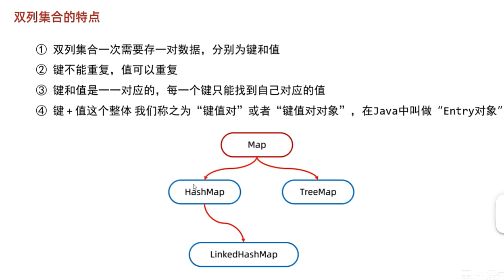

# 双列集合



Java | C++ | 说明
HashMap | unordered_map | 哈希表实现，键值对存储
TreeMap | map | 红黑树（有序映射）
HashSet | unordered_set | 基于哈希的集合
TreeSet | set | 有序集合
Queue / Deque | queue / deque | 队列结构


## 1.Map

🎯 一、什么是 Map？
Map<K, V> 是一个接口，用来存储键值对，每个 key 对应一个 value，且：

+ key 不能重复（使用 equals() 和 hashCode() 判断）
+ value 可以重复
+ 通过 key 来快速获取对应的 value（查找效率高）


🧭 二、Map 的常见实现类对比

类名 | 是否有序 | 是否线程安全 | 是否允许 null | 底层结构 | 说明
HashMap | ❌ 无序 | ❌ 否 | ✅ 允许 1 个 null key，多 null value | 哈希表 | 最常用，查找快
LinkedHashMap | ✅ 插入顺序 | ❌ 否 | ✅ | 哈希表 + 双向链表 | 维护插入顺序
TreeMap | ✅ 排序（key） | ❌ 否 | ❌ key 不允许 null | 红黑树 | key 有序
Hashtable | ❌ 无序 | ✅ 是 | ❌ | 哈希表 | 线程安全，老版本
ConcurrentHashMap | ❌ 无序 | ✅ 是 | ❌ | 分段锁哈希表 | 并发下使用

🔧 三、基本用法（以 HashMap 为例）

✅ 1. 添加和访问
```java
import java.util.*;

public class MapDemo {
    public static void main(String[] args) {
        Map<String, Integer> map = new HashMap<>();

        map.put("apple", 10);
        map.put("banana", 5);
        map.put("orange", 7);

        System.out.println(map.get("apple")); // 输出 10
        System.out.println(map.containsKey("banana")); // true
        System.out.println(map.containsValue(7)); // true
    }
}

```

✅ 2. 遍历 Map 的 3 种方式

🔸方式1：遍历 entrySet()（推荐）
```java
for (Map.Entry<String, Integer> entry : map.entrySet()) {
    System.out.println(entry.getKey() + " = " + entry.getValue());
}

```

🔸方式2：只遍历 key
```java
for (String key : map.keySet()) {
    System.out.println(key + " -> " + map.get(key));
}
```

🔸方式3：forEach + Lambda 表达式（Java 8+）
```java
map.forEach((key, value) -> System.out.println(key + ":" + value));

```


✨ 四、常用方法总结

方法 | 功能
put(K, V) | 添加/修改键值对
get(K) | 通过 key 获取 value
remove(K) | 删除 key 及其 value
containsKey(K) | 判断是否有某个 key
containsValue(V) | 判断是否包含某个值
keySet() | 获取所有 key（返回 Set<K>）
values() | 获取所有 value（返回 Collection<V>）
entrySet() | 获取键值对集合（返回 Set<Map.Entry<K,V>>）
clear() | 清空 map
size() | 获取大小


🧠 五、Map 的底层原理（以 HashMap 为例）
使用数组 + 链表 + 红黑树 实现（JDK 8 开始优化）

put() 时先算出 key 的 hashCode()，再压缩成数组下标，存放在对应桶中

当冲突较多时链表长度超过阈值会转为红黑树（优化查询速度）

⚠️ 六、Map 中使用自定义对象作为 key 时的注意事项
如果你用自己定义的类作为 Map 的 key：

必须重写 equals() 和 hashCode() 方法！

否则无法正确判断是否“相同 key”，会出现重复 key 被当成不同的 key 插入的情况。

🧪 七、例子：使用对象作为 key
```java
class Student {
    String name;

    public Student(String name) {
        this.name = name;
    }

    @Override
    public boolean equals(Object obj) {
        if (obj instanceof Student s) {
            return name.equals(s.name);
        }
        return false;
    }

    @Override
    public int hashCode() {
        return name.hashCode(); // 简单返回 name 的哈希
    }
}

// 使用
Map<Student, Integer> map = new HashMap<>();
map.put(new Student("Tom"), 90);
map.put(new Student("Tom"), 95); // 会覆盖前一个（因为 equals 相等）

System.out.println(map.size()); // 输出 1

```


🧮 八、与 C++ 的 map 类比

Java | C++ | 说明
HashMap | unordered_map | 基于哈希表，快速查找
TreeMap | map | 有序，基于红黑树
ConcurrentHashMap | concurrent_unordered_map（C++ 没标准实现） | 并发线程安全


## 2. HashMap

底层是基于 哈希表（数组 + 链表 + 红黑树） 实现的。

🧠 二、HashMap 的特点

特性 | 描述
键唯一 | 不能有重复 key，使用 equals() 和 hashCode() 判断
值可重复 | value 没有唯一性限制
存取效率高 | 平均时间复杂度 O(1)
无序 | 默认不保证插入顺序（除非用 LinkedHashMap）
允许 null | 允许一个 null key，多个 null value

🔧 三、基本使用示例

```java
import java.util.*;

public class Demo {
    public static void main(String[] args) {
        Map<String, Integer> map = new HashMap<>();

        map.put("apple", 3);
        map.put("banana", 5);
        map.put("apple", 6); // 会覆盖旧值

        System.out.println(map.get("apple"));   // 6
        System.out.println(map.containsKey("banana")); // true
        System.out.println(map.containsValue(5)); // true

        map.remove("banana");
        System.out.println(map); // {apple=6}
    }
}
```

🛠️ 四、常用 API 一览

方法 | 说明
put(K, V) | 插入或更新 key 的 value
get(K) | 获取 key 对应的 value
remove(K) | 删除某个 key 及其 value
containsKey(K) | 是否包含该 key
containsValue(V) | 是否包含该 value
size() | 键值对数量
clear() | 清空所有键值对
isEmpty() | 是否为空
keySet() | 所有 key（Set<K>）
values() | 所有 value（Collection<V>）
entrySet() | 所有键值对（Set<Map.Entry<K, V>>）

🔁 五、遍历方式

🔸 遍历 entrySet（推荐）
```java
for (Map.Entry<String, Integer> entry : map.entrySet()) {
    System.out.println(entry.getKey() + " = " + entry.getValue());
}
```

🔸 遍历 keySet + get（不推荐）
```java
for (String key : map.keySet()) {
    System.out.println(key + " = " + map.get(key));
}
```
🔸 Lambda 表达式
```java
map.forEach((k, v) -> System.out.println(k + ":" + v));
```

🧱 六、底层结构详解（JDK 8）

HashMap 的底层数据结构： **数组 + 链表（冲突时）+ 红黑树（冲突严重时）**

put() 操作流程：
1. 调用 hashCode() 计算 key 的哈希值
2. 通过 (n - 1) & hash 算出数组下标（n 是数组长度）
3. 如果该位置是空的，就直接放进去
4. 如果冲突（已有元素）：
    + 如果是相同 key，则覆盖旧值（通过 equals() 判断）
    + 如果不是，则以链表或红黑树的形式挂在该位置

⚙️ 为什么用链表 + 红黑树？
JDK 1.8 做了优化，当链表长度超过 8 且数组长度超过 64 时，链表会转换为红黑树，避免链表过长导致性能下降（O(n) → O(log n)）

🧪 七、哈希冲突与 key 的规则
❗ key 的条件：
+ 必须是不可变对象
+ 必须重写 hashCode() 和 equals()
    + hashCode() 用于定位数组桶
    + equals() 用于判断是否为“同一个 key

🧮 八、扩容机制
+ 默认初始大小是 16
+ 负载因子是 0.75
+ 当实际元素数 > 16 * 0.75（即 12）时，触发扩容（新容量是原来的 2 倍）
+ 扩容代价比较高：需要重新计算所有 key 的位置，所以要尽量避免频繁扩容。

🔐 九、线程安全问题
+ HashMap 是 非线程安全的
+ 多线程并发写可能导致数据丢失、死循环
+ ✅ 可用替代方案：
    + ConcurrentHashMap（高性能并发）
    + Collections.synchronizedMap()（低并发下可用）

🔍 十、与其他 Map 对比

类 | 有序？ | 排序？ | 线程安全？ | 适用场景
HashMap | ❌ 无序 | ❌ | ❌ | 通用最快的 key-value 映射结构
LinkedHashMap | ✅ 按插入顺序 | ❌ | ❌ | 要保留插入顺序
TreeMap | ✅ 按 key 排序 | ✅ | ❌ | 需要排序的场景
ConcurrentHashMap | ❌ | ❌ | ✅ | 高并发读写场景

## 3. LinkedHashMap

LinkedHashMap 是 HashMap 的一个子类，它结合了 哈希表 和 双向链表 的特性，在保留了哈希表查找效率的同时，还维护了元素的插入顺序或者访问顺序。

🧠 一、LinkedHashMap 是什么？

LinkedHashMap<K, V> 是 HashMap 的子类，用于存储键值对，并且可以保持元素的顺序。

它的底层结构是：**数组 + 链表（哈希冲突） + 双向链表（维护顺序）**

🧾 二、LinkedHashMap 的顺序特性
它有两种顺序模式：

模式 | 描述
插入顺序（默认） | 元素按插入的先后顺序排列
访问顺序 | 每次访问一个元素，它就会被移动到链表末尾（可以用于 LRU 缓存）


```java
// 默认：插入顺序
LinkedHashMap<String, Integer> map = new LinkedHashMap<>();

// 指定为访问顺序（true）
LinkedHashMap<String, Integer> accessMap = new LinkedHashMap<>(16, 0.75f, true);

```

✅ 三、LinkedHashMap 的特点总结

特性 | 说明
有序 | 默认是插入顺序，也可设为访问顺序
查找效率 | 和 HashMap 一样，O(1) 时间复杂度
允许 null | key 和 value 都允许为 null（和 HashMap 一样）
线程不安全 | 多线程下需使用 Collections.synchronizedMap 或 ConcurrentHashMap
用途 | 常用于需要记录元素顺序，或实现 LRU 缓存

💡 四、示例代码

访问顺序示例（实现 LRU 缓存基础）
```java
LinkedHashMap<String, String> lruMap = new LinkedHashMap<>(16, 0.75f, true);

lruMap.put("A", "Apple");
lruMap.put("B", "Banana");
lruMap.put("C", "Cat");

lruMap.get("A"); // 访问了 A，它现在会排在最后

System.out.println(lruMap.keySet());
// 输出顺序为：B → C → A
```

🧰 五、自定义删除策略：实现 LRU 缓存
LinkedHashMap 有一个方法可以重写来自定义“移除最老元素”的逻辑：

```java
@Override
protected boolean removeEldestEntry(Map.Entry<K,V> eldest) {
    return size() > 最大缓存数;
}
```

举个例子：
```java
class LRUCache<K, V> extends LinkedHashMap<K, V> {
    private int capacity;

    public LRUCache(int capacity) {
        super(capacity, 0.75f, true); // 访问顺序
        this.capacity = capacity;
    }

    @Override
    protected boolean removeEldestEntry(Map.Entry<K, V> eldest) {
        return size() > capacity; // 超出容量就移除最旧的
    }
}

```

🧪 七、适合使用 LinkedHashMap 的场景

+ 需要保持数据的插入顺序（比如打印时顺序不乱）
+ 需要实现 LRU 缓存功能
+ 日志记录、访问历史追踪
+ 数据加载顺序一致性要求

## 4. TreeMap

TreeMap<K, V> 是基于 红黑树（Red-Black Tree） 实现的 Map。它能够根据键（key）自动按顺序（自然排序或自定义排序）进行排序。

📦 二、主要特点

特性 | 描述
有序 | 按 key 的 自然顺序 或提供的 Comparator 顺序 排序
不允许 null key | 会抛出 NullPointerException
允许 null value | ✅
查找、插入、删除 | 时间复杂度是 O(log n)
线程不安全 | 多线程使用需手动加锁或使用 Collections.synchronizedSortedMap

🔍 三、基本使用示例

```java
import java.util.*;

public class TreeMapExample {
    public static void main(String[] args) {
        TreeMap<Integer, String> map = new TreeMap<>();

        map.put(3, "three");
        map.put(1, "one");
        map.put(2, "two");

        System.out.println(map); // 输出：{1=one, 2=two, 3=three}

        System.out.println("First key: " + map.firstKey());  // 1
        System.out.println("Last key: " + map.lastKey());    // 3

        // 遍历
        for (Map.Entry<Integer, String> entry : map.entrySet()) {
            System.out.println(entry.getKey() + " => " + entry.getValue());
        }
    }
}
```

⚙️ 四、使用自定义排序（Comparator）

```java
TreeMap<String, Integer> customMap = new TreeMap<>(new Comparator<String>() {
    public int compare(String s1, String s2) {
        return s2.compareTo(s1); // 降序排序
    }
});
customMap.put("apple", 1);
customMap.put("banana", 2);
customMap.put("orange", 3);

System.out.println(customMap); // 输出：{orange=3, banana=2, apple=1}

```

🎯 五、常用方法

方法 | 描述
firstKey() | 返回最小的 key
lastKey() | 返回最大的 key
ceilingKey(k) | 返回 ≥ k 的最小 key
floorKey(k) | 返回 ≤ k 的最大 key
higherKey(k) | 返回 > k 的最小 key
lowerKey(k) | 返回 < k 的最大 key
subMap(from, to) | 获取子映射
descendingMap() | 返回逆序视图


📊 六、TreeMap 与 HashMap、LinkedHashMap 区别

特性 | HashMap | LinkedHashMap | TreeMap
顺序 | 无序 | 插入顺序 / 访问顺序 | key 有序
底层结构 | 数组 + 链表/红黑树 | HashMap + 双向链表 | 红黑树
查找效率 | O(1) | O(1) | O(log n)
适用场景 | 快速访问 | 顺序敏感访问 | 需要有序访问

📌 七、常见应用场景
数据需要按 key 排序输出（比如：时间轴、排行榜）

实现范围查询（subMap / headMap / tailMap）

实现有序的缓存或日志管理系统

LRU 缓存的按时间清除策略


🧠 总结一句话：
TreeMap 是一个有序的 Map，它的 key 会自动排序（基于红黑树），适用于需要范围查询和排序输出的场景。


