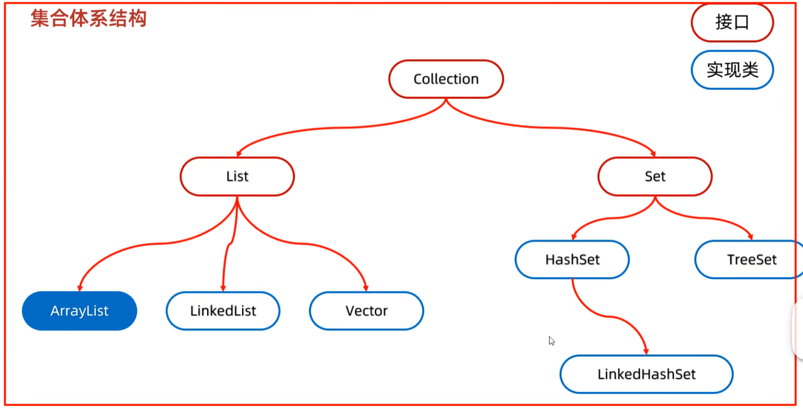

list集合：添加元素是有序、可重复、有索引

set集合：无序、不重复、无索引

一. Collection
    1. 遍历
        1.1 迭代器遍历
        1.2 增强for遍历
        1.3 lambda遍历

# 一. Collection
## 1. 遍历
### 1.1. 迭代器遍历

使用 Iterator 遍历
Iterator 仅支持在遍历过程中删除元素，而不支持修改元素的值。要是尝试在 Iterator 遍历期间修改元素，代码会报错。以下是示例代码：

```java
import java.util.ArrayList;
import java.util.Iterator;
import java.util.List;

public class IteratorExample {
    public static void main(String[] args) {
        List<String> list = new ArrayList<>();
        list.add("apple");
        list.add("banana");
        list.add("cherry");

        Iterator<String> iterator = list.iterator();
        while (iterator.hasNext()) {
            String element = iterator.next();
            // 以下代码会报错，因为 Iterator 不支持修改元素
            // element = "new value"; 
            iterator.remove(); // 支持删除元素
        }
        System.out.println(list);
    }
}
```

ListIterator 是 Iterator 的子接口，它提供了双向遍历的功能，同时支持在遍历过程中修改元素的值。以下是使用 ListIterator 修改元素值的示例代码：

```java
import java.util.ArrayList;
import java.util.List;
import java.util.ListIterator;

public class ListIteratorExample {
    public static void main(String[] args) {
        List<String> list = new ArrayList<>();
        list.add("apple");
        list.add("banana");
        list.add("cherry");

        ListIterator<String> listIterator = list.listIterator();
        while (listIterator.hasNext()) {
            String element = listIterator.next();
            if ("banana".equals(element)) {
                listIterator.set("new banana"); // 修改元素的值
            }
        }
        System.out.println(list);
    }
}    
```

Collection: 实现了Iterator
List：实现ListIterator

注意：在使用Ieterator时，不能使用自身的 remove 方法来删除元素
下面是错误的：
```java
        ArrayList<String> a = new ArrayList<>();
        a.add("a");
        a.add("b");
        a.add("c");
        a.add("d");
        a.set(1,"adsf");
        Iterator<String> it = a.iterator();
        while (it.hasNext()) {
            String s = it.next();
            if(s.equals("a")){
                a.remove(s);
            }
        }
```

异常产生的原理
+ 迭代器的快速失败机制：Iterator 是 Java 集合框架中用于遍历集合元素的工具，它有一个快速失败（fail - fast）机制。当创建一个 Iterator 时，它会记录集合的初始状态，这个状态通常通过一个内部的计数器（如 modCount）来表示，该计数器记录了集合结构被修改的次数。

+ 结构修改的定义：在 ArrayList 中，调用 add、remove 等方法会改变集合的结构，此时 modCount 会增加。而 Iterator 在每次调用 hasNext() 或 next() 方法时，会检查当前集合的 modCount 是否与创建 Iterator 时记录的状态一致。

+ 异常触发：在你的代码里，当执行 a.remove(s) 时，ArrayList 的结构被修改，modCount 会增加。但 Iterator 内部记录的状态并未更新，当 Iterator 下一次调用 hasNext() 或 next() 方法时，会发现 modCount 与记录的状态不一致，就会抛出 ConcurrentModificationException 异常，以此来提示开发者集合在迭代过程中被非法修改了。


### 1.2 增强for遍历

+ 增强for的底层就是迭代器，为了简化迭代器的代码书写
+ 内部原理 Iterator迭代器
+ 所有的单列集合和数组才能用增强for遍历

Java 的 for-each 是 按值复制引用，不是引用传递

```java
for (String s : list) {
    System.out.println(s);
}
```

相当于编译器会“翻译”成下面这样的形式（假设是集合类型）：

```java
Iterator<String> it = list.iterator();
while (it.hasNext()) {
    String s = it.next();
    System.out.println(s);
}
```

所以说修改增强for中的变量，不会改变集合中原本的数据

🔍 三、为什么数组也能增强 for？
Java 编译器对数组是特殊处理的，它会直接变成下标访问：

```java
for (int num : arr)
```

```java
for (int i = 0; i < arr.length; i++) {
    int num = arr[i];
    ...
}
```

🧩 四、接口支持：Iterable 接口
凡是想被增强 for 使用的“集合类”，必须实现接口：

```java
public interface Iterable<T> {
    Iterator<T> iterator();
}
```

🔁 拓展一下：自己写个类支持增强 for？
只需要实现 Iterable<T>，比如你写一个类：
```java
class MyCollection implements Iterable<String> {
    private String[] data = {"a", "b", "c"};

    @Override
    public Iterator<String> iterator() {
        return Arrays.asList(data).iterator(); // 用 List 的迭代器
    }
}
```

现在你就可以增强 for：
```java
for (String s : new MyCollection()) {
    System.out.println(s);
}
```

### 1.3 lambda遍历

```java
        Collection<String> a = new ArrayList<>();
        a.add("a");
        a.add("b");
        a.add("c");
        a.add("d");

        a.forEach(new Consumer<String>() {
            @Override
            public void accept(String s) {
                System.out.println(s);
            }
        });

        a.forEach (s -> System.out.println(s));
```
## 总结

1. Collection是顶层接口，所有方法被List和Set集合公用
2. 常见方法：

add
clear
remove
contains
isEmpty
size

3. 通用遍历方法
+ 迭代器： 在遍历的过程中需要删除元素，使用迭代器
+ 增强for Lambda:仅仅遍历

# 二. list

List 是 Java 集合框架的一部分，是一个接口，继承自 Collection，表示一个有序、可重复的元素集合。


## 2. ArrayList 的简单实现

实现类， 数组， 随机访问， 没有同步， 线程不安全

```cpp
import java.util.Arrays;

// 自定义的 ArrayList 类
class MyArrayList<E> {
    // 默认初始容量
    private static final int DEFAULT_CAPACITY = 10;
    // 存储元素的数组
    private Object[] elementData;
    // 当前元素数量
    private int size;

    // 无参构造函数，使用默认容量
    public MyArrayList() {
        this.elementData = new Object[DEFAULT_CAPACITY];
    }

    // 指定初始容量的构造函数
    public MyArrayList(int initialCapacity) {
        if (initialCapacity < 0) {
            throw new IllegalArgumentException("Illegal Capacity: " + initialCapacity);
        }
        this.elementData = new Object[initialCapacity];
    }

    // 添加元素到列表末尾
    public boolean add(E e) {
        ensureCapacityInternal(size + 1);
        elementData[size++] = e;
        return true;
    }

    // 获取指定索引位置的元素
    public E get(int index) {
        rangeCheck(index);
        return (E) elementData[index];
    }

    // 删除指定索引位置的元素
    public E remove(int index) {
        rangeCheck(index);
        E oldValue = (E) elementData[index];
        int numMoved = size - index - 1;
        if (numMoved > 0) {
            System.arraycopy(elementData, index + 1, elementData, index, numMoved);
        }
        elementData[--size] = null; // 帮助垃圾回收
        return oldValue;
    }

    // 获取列表的元素数量
    public int size() {
        return size;
    }

    // 检查索引是否越界
    private void rangeCheck(int index) {
        if (index >= size) {
            throw new IndexOutOfBoundsException("Index: " + index + ", Size: " + size);
        }
    }

    // 确保内部容量足够
    private void ensureCapacityInternal(int minCapacity) {
        if (minCapacity > elementData.length) {
            grow(minCapacity);
        }
    }

    // 扩容操作
    private void grow(int minCapacity) {
        int oldCapacity = elementData.length;
        int newCapacity = oldCapacity + (oldCapacity >> 1);
        if (newCapacity - minCapacity < 0) {
            newCapacity = minCapacity;
        }
        elementData = Arrays.copyOf(elementData, newCapacity);
    }

    @Override
    public String toString() {
        StringBuilder sb = new StringBuilder();
        sb.append("[");
        for (int i = 0; i < size; i++) {
            sb.append(elementData[i]);
            if (i < size - 1) {
                sb.append(", ");
            }
        }
        sb.append("]");
        return sb.toString();
    }
}

// 测试类
public class Main {
    public static void main(String[] args) {
        MyArrayList<Integer> list = new MyArrayList<>();
        list.add(1);
        list.add(2);
        list.add(3);
        System.out.println("List: " + list);
        System.out.println("Element at index 1: " + list.get(1));
        list.remove(1);
        System.out.println("List after removing index 1: " + list);
    }
}    
```

## 3. LinkedList

基于双向链表实现的

特点：

1. 双向链表：

+ LinkedList 由节点组成，每个节点包含三个部分：元素值（数据）、指向前一个节点的指针（prev）和指向下一个节点的指针（next）。

+ 头节点和尾节点分别指向第一个和最后一个元素，空链表时，头和尾指针均为空。

2. 动态大小：

+ LinkedList 的大小是动态调整的，添加或删除元素不需要像数组那样扩容或缩容，所以在频繁进行插入或删除操作时，它比 ArrayList 更加高效。

3. 插入和删除效率：

+ 在链表中插入或删除元素时，只需更改相邻节点的指针，因此它的插入和删除操作的时间复杂度是 O(1)，只要你能直接访问到该位置。

+ 然而，查找某个元素时，LinkedList 需要从头或尾遍历链表，时间复杂度是 O(n)。

4. 随机访问性能差：

+ LinkedList 不支持快速的随机访问。要访问某个位置的元素，需要从头节点或尾节点开始遍历，因此访问某个元素的时间复杂度是 O(n)。

常见方法：
+ 添加元素：
    + add(E e)：将元素添加到列表末尾。
    + addFirst(E e)：将元素添加到列表的开头。
    + addLast(E e)：将元素添加到列表的末尾（与 add 相同）。

+ 删除元素：
    + remove()：移除并返回列表的第一个元素。
    + removeFirst()：移除并返回列表的第一个元素。
    + removeLast()：移除并返回列表的最后一个元素。

+ 获取元素：
    + get(int index)：返回指定位置的元素。
    + getFirst()：返回第一个元素。
    + getLast()：返回最后一个元素。

+ 其它操作：
    + clear()：移除所有元素。
    + size()：返回链表中的元素个数。
    + contains(Object o)：检查链表中是否包含指定的元素。


