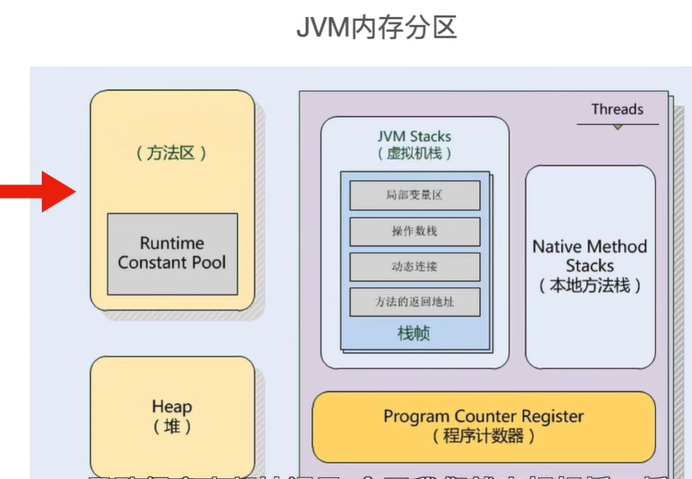

# jvm

Java Virtual Machine 

## 1. JVM 内存分区（Java Memory Model，JMM）




```java
┌────────────────────────────┐
│     方法区（Method Area）     │ ← 存类信息、常量、静态变量
├────────────────────────────┤
│         堆（Heap）           │ ← 存放对象实例（共享）
├────────────────────────────┤
│  Java 虚拟机栈（Stack）      │ ← 每个线程一个，方法调用用
├────────────────────────────┤
│ 本地方法栈（Native Stack）   │ ← native 方法调用
├────────────────────────────┤
│ 程序计数器（PC Register）   │ ← 当前线程执行的字节码行号
└────────────────────────────┘
```

### 1. 堆（Heap）

+ 存放对象实例（new 出来的东西）
+ 所有线程共享
+ 垃圾回收器（GC）主要管理的区域
+ 被进一步划分为：
    + 年轻代（Young Generation）
        + Eden 区（出生地）
        + Survivor 区（S0/S1）
    + 老年代（Old Generation）

📌 内存管理策略：
+ 对象首先在 Eden 创建
+ 经过多次 GC 后（年龄提升），进入老年代

### 2. 方法区（Method Area） / 元空间（Metaspace）

+ 存放：
    + 类的结构信息（类名、方法、字段）
    + 静态变量
    + 常量池（运行时常量池）

+ 早期在 JVM 内部（JDK8 前），叫永久代（PermGen）
+ JDK8 之后 → 改为 元空间（Metaspace），存储在本地内存中，而非 JVM 内存中


### 3. 虚拟机栈（JVM Stack）
+ 每个线程一个（线程私有）
+ 包含若干个 栈帧（Stack Frame），每次方法调用都会创建一个栈帧
+ 栈帧包含：
    + 局部变量表
    + 操作数栈
    + 方法返回地址
    + 一些附加信息


### 4. 本地方法栈（Native Method Stack）

+ 给 native 方法（用 C/C++ 写的）使用
+ 结构和 JVM 栈类似，但用于本地代码

### 5. 程序计数器（PC Register）

+ 每个线程一个（线程私有）
+ 记录当前线程正在执行的字节码的行号（地址）
+ 支持线程之间的上下文切换（恢复执行位置）

📌 JVM 内存结构图

```java
            ┌────────────────────────────┐
            │        本地方法栈           │ ← native 调用
            ├────────────────────────────┤
            │         JVM 栈（线程1）      │
            │   ┌──────────────┐         │
线程1 ─────►│   │   栈帧(Frame)   │         │
            │   └──────────────┘         │
            ├────────────────────────────┤
            │         JVM 栈（线程2）      │
            └────────────────────────────┘

            ┌────────────────────────────┐
            │         程序计数器          │ ← 每线程一个
            ├────────────────────────────┤
            │             堆              │ ← new 对象都在这
            ├────────────────────────────┤
            │         方法区（元空间）     │ ← 类信息、静态变量等
            └────────────────────────────┘

```


📎 补充：为什么要分区？

+ 不同区域有不同的生命周期、访问频率
+ 便于 GC 针对不同内存区做优化（比如：新生代回收频繁，老年代回收少）


