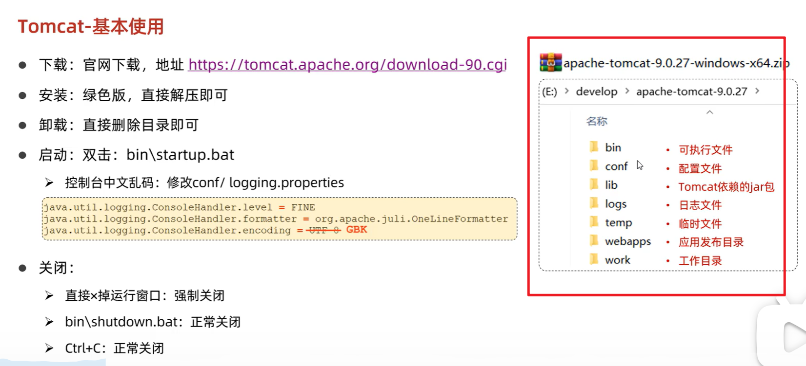
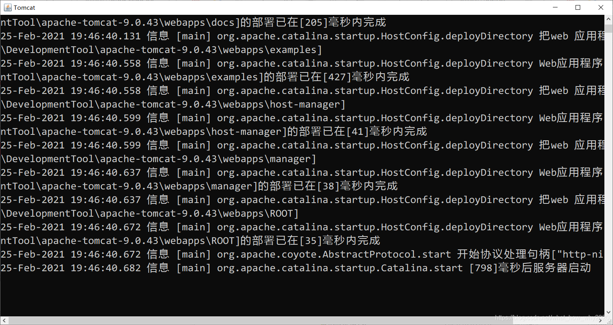
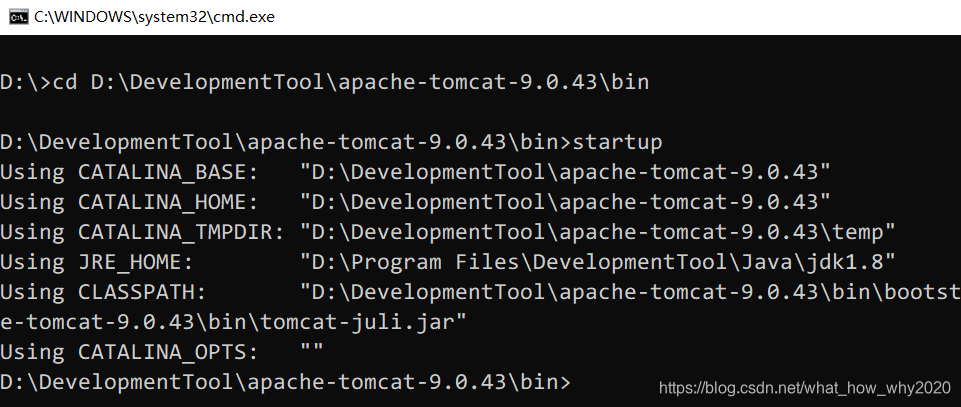
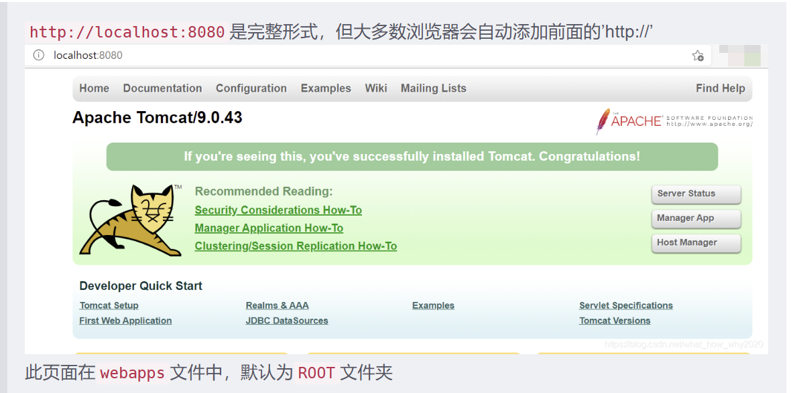

# Tomcat 的使用

https://blog.csdn.net/what_how_why2020/article/details/114100385




启动Tomcat
方法一：在.\apache-tomcat-9.0.43\bin目录下，双击startup.bat打开窗口，双击shutdown.bat关闭窗口。

> 如果点startup.bat窗口的×直接关闭，可能会造成关闭异常




方法二：通过命令行窗口打开。cmd命令cd到.\apache-tomcat-9.0.43\bin，然后输入命令：startup，出现如下对话框，表明服务启动成功。



常见问题
1.闪退
可能原因是：环境变量配置不正确

+ JAVA_HOME中的路径不能用分号结尾，如C:\Program Files\Java\jdk1.8.0_121
+ JAVA_HOME的路径是JDK路径，而不是JRE的路径。
+ CATALINA_HOME中的路径不能以\结尾。
+ 在环境变量中修改添加变量时，一定要注意分号、空格，是否有多余的字母。

2. 乱码
问题描述：打开startup.bat后汉字乱码
解决方法：在.\apache-tomcat-9.0.43\conf下打开logging.properties文件

将java.util.logging.ConsoleHandler.encoding = UTF-8
替换为java.util.logging.ConsoleHandler.encoding = GBK

3. 与其他服务的端口号冲突
tomcat端口号默认8080，如果和其他服务的端口号冲突，则可对端口号进行修改
在.\apache-tomcat-9.0.43\conf下打开server.xml文件，在文件的69行左右，将port="8080"修改为指定的某一端口号，重新启动。

```java
    <Connector port="8080" protocol="HTTP/1.1"
               connectionTimeout="20000"
               redirectPort="8443" />

```

## 访问Tomcat

先打开startup.bat，再打开浏览器，在地址栏中输入http://localhost:8080或localhost:8080回车，如果看到Tomcat自带的一个JSP页面，说明JDK和Tomcat已搭建成功。



无法在浏览器中访问Tomcat

+ 检查./bin目录下startup.bat是否启动成功
+ 检查端口号是否正确
+ 更换浏览器重新访问
+ 检查环境变量是否正确


常见状态码
200：一切正常
300/301：页面重定向 （跳转）
404：资源不存在
403：权限不足 （如果访问a目录，但是a目录设置 不可见）
500：服务器内部错误（代码有误）
其他编码：积累

## Tomcat 基本使用

Tomcat部署项目：将项目放置到webapps目录下，级部署完成；


