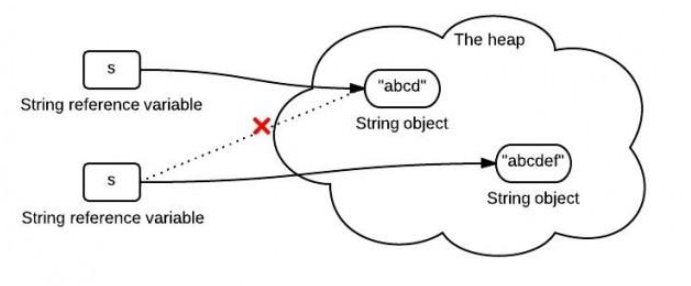

# String=String谈到StringBuilder和StringBuffer

https://www.cnblogs.com/xrq730/p/4841518.html

有这么一段代码：

```java
public class TestMain
{
    public static void main(String[] args)
    {
        String str0 = "123";
        String str1 = "123";
        System.out.println(str0 == str1);
    }
}
```

运行结果是什么？答案当然是true。对，答案的确是true，但是这是为什么呢？很多人第一反应肯定是两个"123"的String当然相等啊，这还要想。但是"=="在Java比较的不是两个对象的值，而是比较两个对象的引用是否相等，和两个String都是"123"又有什么关系呢？或者我们把程序修改一下

```java
public class TestMain
{
    public static void main(String[] args)
    {
        String str2 = new String("234");
        String str3 = new String("234");
        System.out.println(str2 == str3);
    }
}
```

这时候运行结果就是false了，因为尽管两个String对象都是"234"，但是str2和str3是两个不同的引用，所以返回的false。OK，围绕第一段代码返回true，第二段代码返回false，开始文章的内容。

## 1. 为什么String=String？

在JVM中有一块区域叫做常量池.常量池中的数据是那些**在编译期间被确定，并被保存在已编译的.class文件中的一些数据**。除了包含所有的8种基本数据类型（char、byte、short、int、long、float、double、boolean）外，还有String及其数组的常量值，另外还有一些以文本形式出现的符号引用。

Java栈的特点是存取速度快（比堆块），但是空间小，数据生命周期固定，只能生存到方法结束。我们定义的boolean b = true、char c = 'c'、String str = “123”，这些语句，我们拆分为几部分来看：

1、true、c、123，这些等号右边的指的是编译期间可以被确定的内容，都被维护在常量池中

2、b、c、str这些等号左边第一个出现的指的是一个引用，引用的内容是等号右边数据在常量池中的地址

3、boolean、char、String这些是引用的类型

栈有一个特点，就是数据共享。回到我们第一个例子，第五行String str0 = "123"，编译的时候，在常量池中创建了一个常量"123"，然后走第六行String str1 = "123"，先去常量池中找有没有这个"123"，发现有，str1也指向常量池中的"123"，所以第七行的str0 == str1返回的是true，因为str0和str1指向的都是常量池中的"123"这个字符串的地址。当然如果String str1 = "234"，就又不一样了，因为常量池中没有"234"，所以会在常量池中创建一个"234"，然后str1代表的是这个"234"的地址。分析了String，其实其他基本数据类型也都是一样的：先看常量池中有没有要创建的数据，有就返回数据的地址，没有就创建一个。

第二个例子呢？Java虚拟机的解释器每遇到一个new关键字，都会在堆内存中开辟一块内存来存放一个String对象，所以str2、str3指向的堆内存中虽然存储的是相等的"234"，但是由于是两块不同的堆内存，因此str2 == str3返回的仍然是false，网上找到一张图表示一下这个概念



## 2. 为什么要使用StringBuilder和StringBuffer拼接字符串？

大家在开发中一定有一个原则是"利用StringBuilder和StringBuffer拼接字符串"，但是为什么呢？用一段代码来分析一下：

```java
public class StringTest {

    @Test
    public void testStringPlus() {
        String str = "111";
        str += "222";
        str += "333";
        System.out.println(str);
    }
```

这段代码，我们找到编译后的StringTest.class文件，使用"javap -verbose StringTest"或者"javap -c StringTest"都可以，反编译一下class获取到对应的字节码：

```java
public void testStringPlus();
    Code:
       0: ldc           #17                 // String 111
       2: astore_1
       3: new           #19                 // class java/lang/StringBuilder
       6: dup
       7: aload_1
       8: invokestatic  #21                 // Method java/lang/String.valueOf:(Ljava/lang/Object;)L
java/lang/String;
      11: invokespecial #27                 // Method java/lang/StringBuilder."<init>":(Ljava/lang/S
tring;)V
      14: ldc           #30                 // String 222
      16: invokevirtual #32                 // Method java/lang/StringBuilder.append:(Ljava/lang/Str
ing;)Ljava/lang/StringBuilder;
      19: invokevirtual #36                 // Method java/lang/StringBuilder.toString:()Ljava/lang/
String;
      22: astore_1
      23: new           #19                 // class java/lang/StringBuilder
      26: dup
      27: aload_1
      28: invokestatic  #21                 // Method java/lang/String.valueOf:(Ljava/lang/Object;)L
java/lang/String;
      31: invokespecial #27                 // Method java/lang/StringBuilder."<init>":(Ljava/lang/S
tring;)V
      34: ldc           #40                 // String 333
      36: invokevirtual #32                 // Method java/lang/StringBuilder.append:(Ljava/lang/Str
ing;)Ljava/lang/StringBuilder;
      39: invokevirtual #36                 // Method java/lang/StringBuilder.toString:()Ljava/lang/
String;
      42: astore_1
      43: getstatic     #42                 // Field java/lang/System.out:Ljava/io/PrintStream;
      46: aload_1
      47: invokevirtual #48                 // Method java/io/PrintStream.println:(Ljava/lang/String
;)V
      50: return
}
```

这段字节码不用看得很懂，大致上能明白就好，意思很明显：编译器每次碰到"+"的时候，会new一个StringBuilder出来，接着调用append方法，在调用toString方法，生成新字符串。

那么，这意味着，如果代码中有很多的"+"，就会每个"+"生成一次StringBuilder，这种方式对内存是一种浪费，效率很不好。

在Java中还有一种拼接字符串的方式，就是String的concat方法，其实这种方式拼接字符串也不是很好，具体原因看一下concat方法的实现：


```java
public String concat(String str) {
    int otherLen = str.length();
    if (otherLen == 0) {
        return this;
    }
    int len = value.length;
    char buf[] = Arrays.copyOf(value, len + otherLen);
    str.getChars(buf, len);
    return new String(buf, true);
}
```

意思就是通过两次字符串的拷贝，产生一个新的字符数组buf[]，再根据字符数组buf[]，new一个新的String对象出来，这意味着concat方法调用N次，将发生N*2次数组拷贝以及new出N个String对象，无论对于时间还是空间都是一种浪费。

根据上面的解读，由于"+"拼接字符串与String的concat方法拼接字符串的低效，我们才需要使用StringBuilder和StringBuffer来拼接字符串。以StringBuilder为例：


```java
public class TestMain
{
    public static void main(String[] args)
    {
        StringBuilder sb = new StringBuilder("111");
        sb.append("222");
        sb.append("111");
        sb.append("111");
        sb.append("444");
        System.out.println(sb.toString());
    }
}
```

StringBuffer和StringBuilder原理一样，无非是在底层维护了一个char数组，每次append的时候就往char数组里面放字符而已，在最终sb.toString()的时候，用一个new String()方法把char数组里面的内容都转成String，这样，整个过程中只产生了一个StringBuilder对象与一个String对象，非常节省空间。StringBuilder唯一的性能损耗点在于char数组不够的时候需要进行扩容，扩容需要进行数组拷贝，一定程度上降低了效率。

StringBuffer和StringBuilder用法一模一样，唯一的区别只是StringBuffer是线程安全的，它对所有方法都做了同步，StringBuilder是线程非安全的，所以在不涉及线程安全的场景，比如方法内部，尽量使用StringBuilder，避免同步带来的消耗。

另外，StringBuffer和StringBuilder还有一个优化点，上面说了，扩容的时候有性能上的损耗，那么如果可以估计到要拼接的字符串的长度的话，尽量利用构造函数指定他们的长度。

## 3. 真的不能用"+"拼接字符串？

虽然说不要用"+"拼接字符串，因为会产生大量的无用StringBuilder对象，但也不是不可以，比如可以使用以下的方式：

```java
public class TestMain
{
    public static void main(String[] args)
    {
        String str = "111" + "222" + "333" + "444";
        System.out.println(str);
    }
}
```

就这种连续+的情况，实际上编译的时候JVM会只产生一个StringBuilder并连续append等号后面的字符串。

不过上面的例子要注意一点，因为"111"、"222"、"333"、"444"都是编译期间即可得知的常量，因为第5行的代码JVM在编译的时候并不会生成一个StringBuilder而是直接生成字符串"111222333444"。

但是这么写得很少，主要原因有两点：

1、例子比较简单，但实际上大量的“+”会导致代码的可读性非常差

2、待拼接的内容可能从各种地方获取，比如调用接口、从.properties文件中、从.xml文件中，这样的场景下尽管用多个“+”的方式也不是不可以，但会让代码维护性不太好


