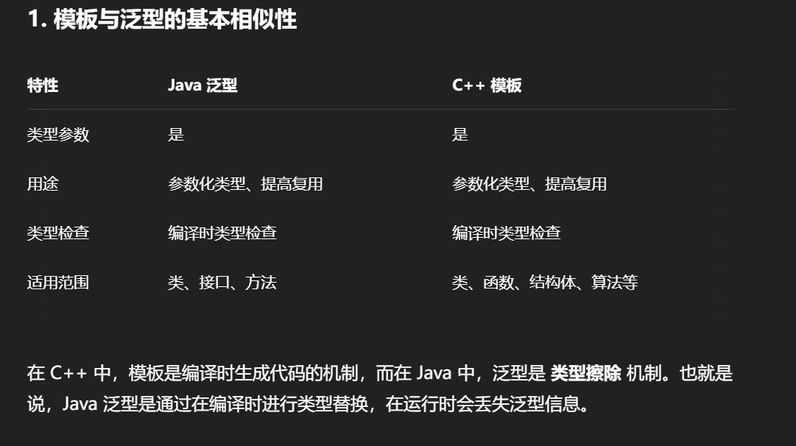

# 什么是泛型

1. 什么是泛型
2. 使用泛型
3. 编写泛型
4. 擦拭法
5. extends通配符
6. super通配符
7. 泛型和反射

抄自:https://liaoxuefeng.com/books/java/generics/use-generics/index.html

Java 中的 泛型（Generics） 和 C++ 中的 模板（Templates） 确实有很多相似之处。它们都是 参数化类型 的机制，允许你编写更加通用的代码，在保持类型安全的同时，提高代码的复用性。虽然它们的实现方式和底层机制不同，但概念是相似的。

## 🧩 1、基本概念：什么是泛型？

Java 中的泛型允许你在编写类、接口、方法时，不指定具体的类型，而是通过占位符（通常是字母 T、E、K 等）来代替。

```java
// 定义一个泛型类
class Box<T> {
    private T value;

    public T getValue() {
        return value;
    }

    public void setValue(T value) {
        this.value = value;
    }
}

// 使用泛型类
Box<Integer> box = new Box<>();
box.setValue(42);
int value = box.getValue(); // 自动类型推导
```

📦 与 C++ 模板的相似性



```cpp
template <typename T>
class Box {
public:
    T value;
    T getValue() { return value; }
    void setValue(T value) { this->value = value; }
};

// 使用模板类
Box<int> box;
box.setValue(42);
int value = box.getValue();
```

### 向上转型

在Java标准库中的ArrayList<T>实现了List<T>接口，它可以向上转型为List<T>：

```java
public class ArrayList<T> implements List<T> {
    ...
}

List<String> list = new ArrayList<String>();
```

即类型ArrayList<T>可以向上转型为List<T>。

要特别注意：不能把ArrayList<Integer>向上转型为ArrayList<Number>或List<Number>。

这是为什么呢？假设ArrayList<Integer>可以向上转型为ArrayList<Number>，观察一下代码：

```java
// 创建ArrayList<Integer>类型：
ArrayList<Integer> integerList = new ArrayList<Integer>();
// 添加一个Integer：
integerList.add(new Integer(123));
// “向上转型”为ArrayList<Number>：
ArrayList<Number> numberList = integerList;
// 添加一个Float，因为Float也是Number：
numberList.add(new Float(12.34));
// 从ArrayList<Integer>获取索引为1的元素（即添加的Float）：
Integer n = integerList.get(1); // ClassCastException!
```

我们把一个ArrayList<Integer>转型为ArrayList<Number>类型后，这个ArrayList<Number>就可以接受Float类型，因为Float是Number的子类。但是，ArrayList<Number>实际上和ArrayList<Integer>是同一个对象，也就是ArrayList<Integer>类型，它不可能接受Float类型， 所以在获取Integer的时候将产生ClassCastException。

实际上，编译器为了避免这种错误，根本就不允许把ArrayList<Integer>转型为ArrayList<Number>。

## 2. 使用泛型

使用ArrayList时，如果不定义泛型类型时，泛型类型实际上就是Object：

```java
// 编译器警告:
List list = new ArrayList();
list.add("Hello");
list.add("World");
String first = (String) list.get(0);
String second = (String) list.get(1);
```

此时，只能把<T>当作Object使用，没有发挥泛型的优势。

当我们定义泛型类型<String>后，List<T>的泛型接口变为强类型List<String>：

```java
// 无编译器警告:
List<String> list = new ArrayList<String>();
list.add("Hello");
list.add("World");
// 无强制转型:
String first = list.get(0);
String second = list.get(1);
```

当我们定义泛型类型<Number>后，List<T>的泛型接口变为强类型List<Number>：
```java
List<Number> list = new ArrayList<Number>();
list.add(new Integer(123));
list.add(new Double(12.34));
Number first = list.get(0);
Number second = list.get(1);
```

编译器如果能自动推断出泛型类型，就可以省略后面的泛型类型。例如，对于下面的代码：

```java
List<Number> list = new ArrayList<Number>();
```

编译器看到泛型类型List<Number>就可以自动推断出后面的ArrayList<T>的泛型类型必须是ArrayList<Number>，因此，可以把代码简写为：

```java
// 可以省略后面的Number，编译器可以自动推断泛型类型：
List<Number> list = new ArrayList<>();
```

泛型接口
除了ArrayList<T>使用了泛型，还可以在接口中使用泛型。例如，Arrays.sort(Object[])可以对任意数组进行排序，但待排序的元素必须实现Comparable<T>这个泛型接口：

```cpp
public interface Comparable<T> {
    /**
     * 返回负数: 当前实例比参数o小
     * 返回0: 当前实例与参数o相等
     * 返回正数: 当前实例比参数o大
     */
    int compareTo(T o);
}
```

可以直接对String数组进行排序：
```java
// sort
import java.util.Arrays;

public class Main {
    public static void main(String[] args) {
        String[] ss = new String[] { "Orange", "Apple", "Pear" };
        Arrays.sort(ss);
        System.out.println(Arrays.toString(ss));
    }
}
```

这是因为String本身已经实现了Comparable<String>接口。如果换成我们自定义的Person类型试试：

```java
// sort
import java.util.Arrays;

public class Main {
    public static void main(String[] args) {
        Person[] ps = new Person[] {
            new Person("Bob", 61),
            new Person("Alice", 88),
            new Person("Lily", 75),
        };
        Arrays.sort(ps);
        System.out.println(Arrays.toString(ps));
    }
}


class Person implements Comparable<Person> {
    String name;
    int score;
    Person(String name, int score) {
        this.name = name;
        this.score = score;
    }

    public int compareTo(Person other) {
        return this.name.compareTo(other.name);
    }

    public String toString() {
        return this.name + "," + this.score;
    }
}

```

## 3. 编写泛型

可以按照以下步骤来编写一个泛型类。

首先，按照某种类型，例如：String，来编写类：
```java
public class Pair {
    private String first;
    private String last;
    public Pair(String first, String last) {
        this.first = first;
        this.last = last;
    }
    public String getFirst() {
        return first;
    }
    public String getLast() {
        return last;
    }
}
```

然后，标记所有的特定类型，这里是String，把特定类型String替换为T，并申明<T>：

```java
public class Pair<T> {
    private T first;
    private T last;
    public Pair(T first, T last) {
        this.first = first;
        this.last = last;
    }
    public T getFirst() {
        return first;
    }
    public T getLast() {
        return last;
    }
}
```

静态方法
编写泛型类时，要特别注意，泛型类型<T>不能用于静态方法。例如：
```java
public class Pair<T> {
    private T first;
    private T last;
    public Pair(T first, T last) {
        this.first = first;
        this.last = last;
    }
    public T getFirst() { ... }
    public T getLast() { ... }

    // 对静态方法使用<T>:
    public static Pair<T> create(T first, T last) {
        return new Pair<T>(first, last);
    }
}
```

上述代码会导致编译错误，我们无法在静态方法create()的方法参数和返回类型上使用泛型类型T。
这是因为泛型类型参数的作用域仅限于类的实例级别，而静态方法属于类级别，与具体的实例无关。

可以在static修饰符后面加一个<T>，编译就能通过：

```java
public class Pair<T> {
    private T first;
    private T last;
    public Pair(T first, T last) {
        this.first = first;
        this.last = last;
    }
    public T getFirst() { ... }
    public T getLast() { ... }

    // 可以编译通过:
    public static <T> Pair<T> create(T first, T last) {
        return new Pair<T>(first, last);
    }
}
```

但实际上，这个<T>和Pair<T>类型的<T>已经没有任何关系了。

对于静态方法，我们可以单独改写为“泛型”方法，只需要使用另一个类型即可。对于上面的create()静态方法，我们应该把它改为另一种泛型类型，例如，<K>：

```java
public class Pair<T> {
    private T first;
    private T last;
    public Pair(T first, T last) {
        this.first = first;
        this.last = last;
    }
    public T getFirst() { ... }
    public T getLast() { ... }

    // 静态泛型方法应该使用其他类型区分:
    public static <K> Pair<K> create(K first, K last) {
        return new Pair<K>(first, last);
    }
}
```

> 多个泛型类型

泛型还可以定义多种类型。例如，我们希望Pair不总是存储两个类型一样的对象，就可以使用类型<T, K>：

```java
public class Pair<T, K> {
    private T first;
    private K last;
    public Pair(T first, K last) {
        this.first = first;
        this.last = last;
    }
    public T getFirst() { ... }
    public K getLast() { ... }
}
```

使用的时候，需要指出两种类型：

```java
Pair<String, Integer> p = new Pair<>("test", 123);
```

Java标准库的Map<K, V>就是使用两种泛型类型的例子。它对Key使用一种类型，对Value使用另一种类型。

## 4. 擦拭法

泛型是一种类似”模板代码“的技术，不同语言的泛型实现方式不一定相同。

Java语言的泛型实现方式是擦拭法（Type Erasure）。它是 Java 为了实现 向后兼容性（和旧版本 JVM 兼容） 而采用的策略。

所谓擦拭法是指，虚拟机对泛型其实一无所知，所有的工作都是编译器做的。Java 编译器在编译带有泛型的代码时，会在编译后 移除泛型类型信息，并替换为 限定的类型（通常是 Object 或类型边界）。

例如，我们编写了一个泛型类Pair<T>，这是编译器看到的代码：

```java
public class Pair<T> {
    private T first;
    private T last;
    public Pair(T first, T last) {
        this.first = first;
        this.last = last;
    }
    public T getFirst() {
        return first;
    }
    public T getLast() {
        return last;
    }
}
```

而虚拟机根本不知道泛型。这是虚拟机执行的代码：

```java
public class Pair {
    private Object first;
    private Object last;
    public Pair(Object first, Object last) {
        this.first = first;
        this.last = last;
    }
    public Object getFirst() {
        return first;
    }
    public Object getLast() {
        return last;
    }
}
```

因此，Java使用擦拭法实现泛型，导致了：

+ 编译器把类型<T>视为Object；
+ 编译器根据<T>实现安全的强制转型。

使用泛型的时候，我们编写的代码也是编译器看到的代码：

```java
Pair<String> p = new Pair<>("Hello", "world");
String first = p.getFirst();
String last = p.getLast();
```

而虚拟机执行的代码并没有泛型：
```java
Pair p = new Pair("Hello", "world");
String first = (String) p.getFirst();
String last = (String) p.getLast();
```

所以，Java的泛型是由编译器在编译时实行的，编译器内部永远把所有类型T视为Object处理，但是，在需要转型的时候，编译器会根据T的类型自动为我们实行安全地强制转型。

局限一：<T>不能是基本类型，例如int，因为实际类型是Object，Object类型无法持有基本类型：

```java
Pair<int> p = new Pair<>(1, 2); // compile error!
```

限二：无法取得带泛型的Class。观察以下代码：
```java
public class Main {
    public static void main(String[] args) {
        Pair<String> p1 = new Pair<>("Hello", "world");
        Pair<Integer> p2 = new Pair<>(123, 456);
        Class c1 = p1.getClass();
        Class c2 = p2.getClass();
        System.out.println(c1==c2); // true
        System.out.println(c1==Pair.class); // true
    }
}

class Pair<T> {
    private T first;
    private T last;
    public Pair(T first, T last) {
        this.first = first;
        this.last = last;
    }
    public T getFirst() {
        return first;
    }
    public T getLast() {
        return last;
    }
}
```

因为T是Object，我们对Pair<String>和Pair<Integer>类型获取Class时，获取到的是同一个Class，也就是Pair类的Class。

换句话说，所有泛型实例，无论T的类型是什么，getClass()返回同一个Class实例，因为编译后它们全部都是Pair<Object>。

> .getClass() 

.getClass() 是 Java 中每个对象都可以调用的方法，它定义在 Java 的根类 java.lang.Object 中。这个方法的作用是 返回运行时对象的类对象（Class 实例）。

局限三：无法判断带泛型的类型

```java
List<String> list = new ArrayList<>();
if (list instanceof List<String>) { ... }  // ❌ 编译错误
```

正确做法是：
```java
if (list instanceof List) { ... }  // ✅ 只能检测原始类型
```

局限四：不能实例化T类型：

```java
public class Pair<T> {
    private T first;
    private T last;
    public Pair() {
        // Compile error:
        first = new T();
        last = new T();
    }
}
```

上述代码无法通过编译，因为构造方法的两行语句：

```java
first = new T();
last = new T();
```

擦拭后实际上变成了：
```java
first = new Object();
last = new Object();
```

这样一来，创建new Pair<String>()和创建new Pair<Integer>()就全部成了Object，显然编译器要阻止这种类型不对的代码。

要实例化T类型，我们必须借助额外的Class<T>参数：

```java
public class Pair<T> {
    private T first;
    private T last;
    public Pair(Class<T> clazz) {
        first = clazz.newInstance();
        last = clazz.newInstance();
    }
}
```

上述代码借助Class<T>参数并通过反射来实例化T类型，使用的时候，也必须传入Class<T>。例如：

```java
Pair<String> pair = new Pair<>(String.class);
```

因为传入了Class<String>的实例，所以我们借助String.class就可以实例化String类型。


### 不恰当的覆写方法

有些时候，一个看似正确定义的方法会无法通过编译。例如：
```java
public class Pair<T> {
    public boolean equals(T t) {
        return this == t;
    }
}
```

这是因为，定义的equals(T t)方法实际上会被擦拭成equals(Object t)，而这个方法是继承自Object的，编译器会阻止一个实际上会变成覆写的泛型方法定义。

换个方法名，避开与Object.equals(Object)的冲突就可以成功编译：
```java
public class Pair<T> {
    public boolean same(T t) {
        return this == t;
    }
}
```

### 泛型继承

一个类可以继承自一个泛型类。例如：父类的类型是Pair<Integer>，子类的类型是IntPair，可以这么继承：

```java
public class IntPair extends Pair<Integer> {
}
```

使用的时候，因为子类IntPair并没有泛型类型，所以，正常使用即可：

```java
IntPair ip = new IntPair(1, 2);
```

前面讲了，我们无法获取Pair<T>的T类型，即给定一个变量Pair<Integer> p，无法从p中获取到Integer类型。

但是，在父类是泛型类型的情况下，编译器就必须把类型T（对IntPair来说，也就是Integer类型）保存到子类的class文件中，不然编译器就不知道IntPair只能存取Integer这种类型。

在继承了泛型类型的情况下，子类可以获取父类的泛型类型。例如：IntPair可以获取到父类的泛型类型Integer。获取父类的泛型类型代码比较复杂：

```java
import java.lang.reflect.ParameterizedType;
import java.lang.reflect.Type;

public class Main {
    public static void main(String[] args) {
        Class<IntPair> clazz = IntPair.class;
        Type t = clazz.getGenericSuperclass();
        if (t instanceof ParameterizedType) {
            ParameterizedType pt = (ParameterizedType) t;
            Type[] types = pt.getActualTypeArguments(); // 可能有多个泛型类型
            Type firstType = types[0]; // 取第一个泛型类型
            Class<?> typeClass = (Class<?>) firstType;
            System.out.println(typeClass); // Integer
        }
    }
}

class Pair<T> {
    private T first;
    private T last;
    public Pair(T first, T last) {
        this.first = first;
        this.last = last;
    }
    public T getFirst() {
        return first;
    }
    public T getLast() {
        return last;
    }
}

class IntPair extends Pair<Integer> {
    public IntPair(Integer first, Integer last) {
        super(first, last);
    }
}
```

## 5. 泛型继承

📌 1. 泛型类之间没有继承关系！

```java
List<Object> objList = new ArrayList<String>(); // ❌ 编译错误
```

上面这段代码是错误的，即使 String 是 Object 的子类，List<String> 也不是 List<Object> 的子类。

👉 原因是为了 类型安全：
假设允许了上述赋值，那么你可能会往 objList 里加个 Integer，但实际它是 ArrayList<String>，就崩了！

✅ 正确的做法：使用通配符 ?
❓ ? extends T 表示：某种 T 的子类型 包含自身

```java
List<? extends Number> list = new ArrayList<Integer>(); // ✅ 正确
```

+ 你可以读取元素，返回的是 Number
+ 不能往里加元素（除了 null）

❓ ? super T 表示：某种 T 的父类型 包含自身

```java
List<? super Integer> list = new ArrayList<Number>(); // ✅ 正确
```

+ 你可以往里面加 Integer 或其子类
+ 取出元素时，只能当作 Object

💡 类的继承中使用泛型

```java
class Animal {}
class Dog extends Animal {}

class Box<T> {
    T value;
}

Box<Dog> dogBox = new Box<>();
Box<Animal> animalBox = dogBox; // ❌ 错误！泛型没有协变
```


