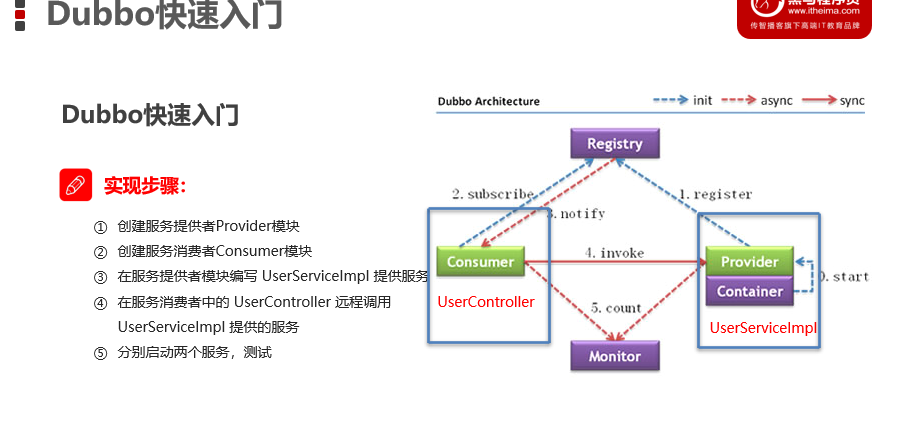
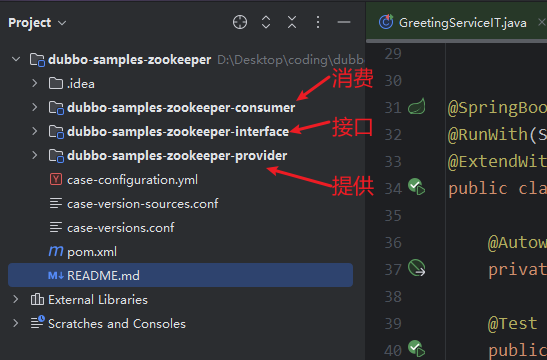
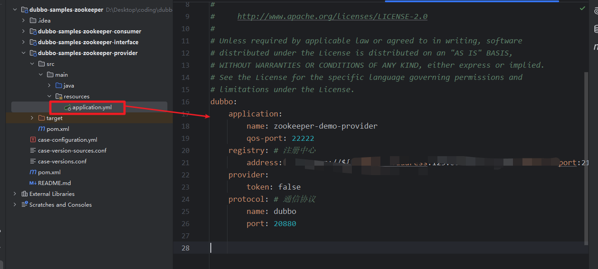
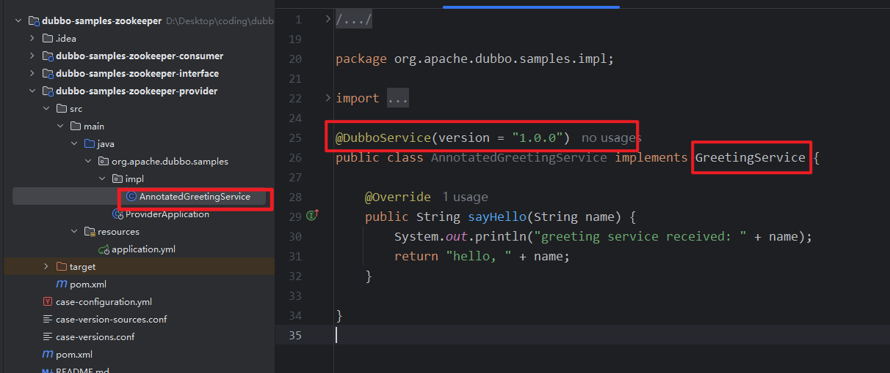
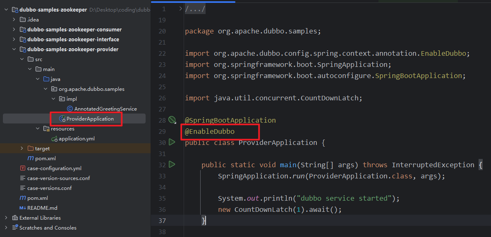
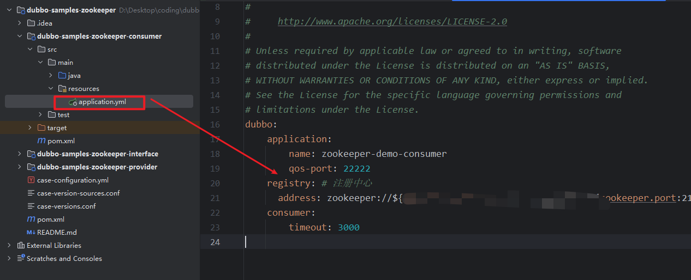
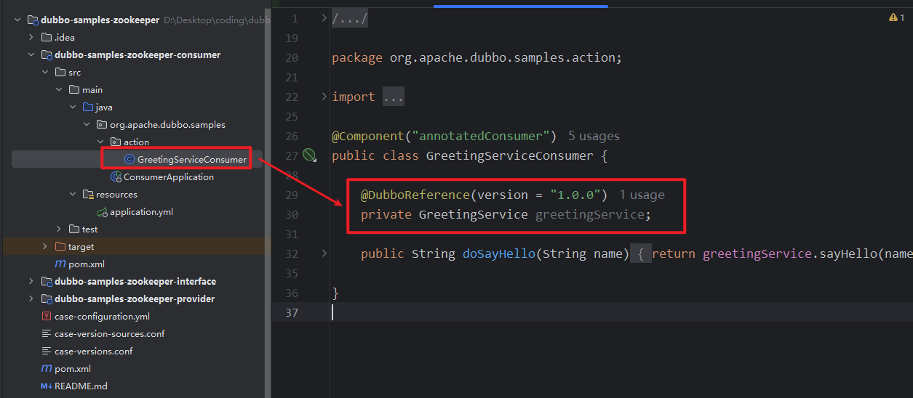
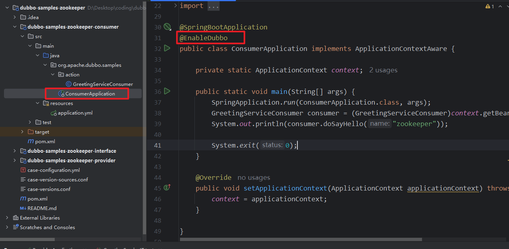
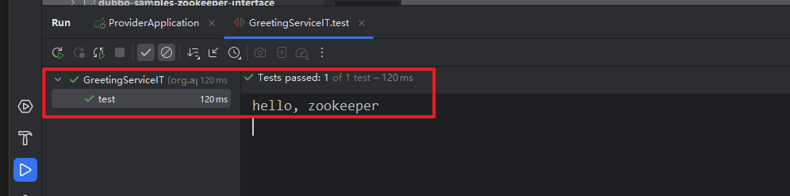
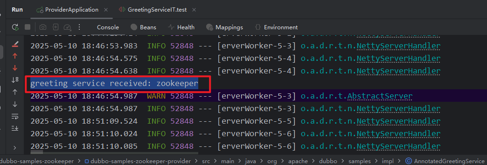

# dubbo



就是在 web和service分开，通过 dubbo 连接；

## 1. 快速开始

这里直接跑官方的案例

1. 先把zookeeper 启动

这里采用docker ，配置很简单：确保状态为 up

2. 文件结构



2.1 父目录 pom ：

这里的版本采用：jdk-1.8, springboot:2.7.12

```xml
<?xml version="1.0" encoding="UTF-8"?>
<project xmlns="http://maven.apache.org/POM/4.0.0"
         xmlns:xsi="http://www.w3.org/2001/XMLSchema-instance"
         xsi:schemaLocation="http://maven.apache.org/POM/4.0.0 http://maven.apache.org/xsd/maven-4.0.0.xsd">
    <groupId>org.apache.dubbo</groupId>
    <version>1.0-SNAPSHOT</version>

    <modelVersion>4.0.0</modelVersion>
    <!-- 注意 父是 pom -->
    <packaging>pom</packaging>

    <artifactId>dubbo-samples-zookeeper</artifactId>
    <name>Dubbo Samples Zookeeper</name>
    <description>Dubbo Samples Zookeeper</description>
  <!--定义属性-->
    <properties>
        <maven.compiler.source>1.8</maven.compiler.source>
        <maven.compiler.target>1.8</maven.compiler.target>
        <project.build.sourceEncoding>UTF-8</project.build.sourceEncoding>

        <dubbo.version>3.3.1</dubbo.version>
        <spring-boot.version>2.7.12</spring-boot.version>

        <junit5.version>5.10.1</junit5.version>
        <junit.platform>1.9.3</junit.platform>
    </properties>
  <!--聚合-->
    <modules>
        <module>dubbo-samples-zookeeper-provider</module>
        <module>dubbo-samples-zookeeper-consumer</module>
        <module>dubbo-samples-zookeeper-interface</module>
    </modules>
  <!--  版本锁定-->
    <dependencyManagement>
        <dependencies>
            <dependency>
                <groupId>org.springframework.boot</groupId>
                <artifactId>spring-boot-dependencies</artifactId>
                <version>${spring-boot.version}</version>
                <type>pom</type>
                <scope>import</scope>
            </dependency>
            <dependency>
                <groupId>org.springframework.boot</groupId>
                <artifactId>spring-boot-starter</artifactId>
                <version>${spring-boot.version}</version>
                <exclusions>
                    <exclusion>
                        <artifactId>spring-boot-starter-logging</artifactId>
                        <groupId>org.springframework.boot</groupId>
                    </exclusion>
                </exclusions>
            </dependency>
            <dependency>
                <groupId>org.apache.dubbo</groupId>
                <artifactId>dubbo-bom</artifactId>
                <version>${dubbo.version}</version>
                <type>pom</type>
                <scope>import</scope>
            </dependency>
        </dependencies>
    </dependencyManagement>

    <dependencies>
        <dependency>
            <groupId>junit</groupId>
            <artifactId>junit</artifactId>
            <scope>test</scope>
        </dependency>
    </dependencies>

    <build>
    <!-- 管理插件的版本和配置 -->
        <pluginManagement>
            <plugins>
                <plugin> 
                    <groupId>org.springframework.boot</groupId>
                    <artifactId>spring-boot-maven-plugin</artifactId>
                    <version>${spring-boot.version}</version>
                    <executions>
                        <execution>
                            <goals>
                                <goal>repackage</goal>
                            </goals>
                        </execution>
                    </executions>
                </plugin>
            </plugins>
        </pluginManagement>
    </build>
</project>

```

2.2 interface

定义接口 供使用，这里声明了一个 GreetingService

```java
public interface GreetingService {
    String sayHello(String name);
}
```

2.3 provider 功能提供者

实现这个接口，后续给消费者使用：

pom:

```xml
<?xml version="1.0" encoding="UTF-8"?>
<project xmlns="http://maven.apache.org/POM/4.0.0"
         xmlns:xsi="http://www.w3.org/2001/XMLSchema-instance"
         xsi:schemaLocation="http://maven.apache.org/POM/4.0.0 http://maven.apache.org/xsd/maven-4.0.0.xsd">
    <modelVersion>4.0.0</modelVersion>
    <!-- 继承 <relativePath>../pom.xml</relativePath> 默认 -->
    <parent>
        <groupId>org.apache.dubbo</groupId>
        <artifactId>dubbo-samples-zookeeper</artifactId>
        <version>1.0-SNAPSHOT</version>
    </parent>

    <artifactId>dubbo-samples-zookeeper-provider</artifactId>

    <properties>
        <maven.compiler.source>1.8</maven.compiler.source>
        <maven.compiler.target>1.8</maven.compiler.target>
        <project.build.sourceEncoding>UTF-8</project.build.sourceEncoding>
    </properties>

    <dependencies>
      <!--      引入 interface 模块-->
        <dependency>
            <groupId>org.apache.dubbo</groupId>
            <artifactId>dubbo-samples-zookeeper-interface</artifactId>
            <version>1.0-SNAPSHOT</version>
        </dependency>
        <!-- dubbo -->
        <dependency>
            <groupId>org.apache.dubbo</groupId>
            <artifactId>dubbo-spring-boot-starter</artifactId>
        </dependency>
        <dependency>
            <groupId>org.apache.dubbo</groupId>
            <artifactId>dubbo-zookeeper-curator5-spring-boot-starter</artifactId>
        </dependency>

        <!-- spring starter -->
        <dependency>
            <groupId>org.springframework.boot</groupId>
            <artifactId>spring-boot-starter</artifactId>
        </dependency>

        <dependency>
            <groupId>org.springframework.boot</groupId>
            <artifactId>spring-boot-starter-log4j2</artifactId>
        </dependency>

        <dependency>
            <groupId>org.springframework.boot</groupId>
            <artifactId>spring-boot-starter-test</artifactId>
            <scope>test</scope>
        </dependency>
      <dependency>
        <groupId>com.alibaba</groupId>
        <artifactId>fastjson</artifactId>
        <version>1.2.83</version> <!-- 注意：用合适的新版本，注意安全漏洞问题 -->
      </dependency>

    </dependencies>

    <build>
        <plugins>
            <plugin>
                <groupId>org.springframework.boot</groupId>
                <artifactId>spring-boot-maven-plugin</artifactId>
            </plugin>
        </plugins>
    </build>

</project>

```

然后配置公共信息



配置实现类：



在启动加上dubbo扫描



2.4 consumer

```xml
<?xml version="1.0" encoding="UTF-8"?>
<project xmlns="http://maven.apache.org/POM/4.0.0"
         xmlns:xsi="http://www.w3.org/2001/XMLSchema-instance"
         xsi:schemaLocation="http://maven.apache.org/POM/4.0.0 http://maven.apache.org/xsd/maven-4.0.0.xsd">
    <modelVersion>4.0.0</modelVersion>
    <parent>
        <groupId>org.apache.dubbo</groupId>
        <artifactId>dubbo-samples-zookeeper</artifactId>
        <version>1.0-SNAPSHOT</version>
    </parent>

    <artifactId>dubbo-samples-zookeeper-consumer</artifactId>


    <properties>
        <maven.compiler.source>1.8</maven.compiler.source>
        <maven.compiler.target>1.8</maven.compiler.target>
        <project.build.sourceEncoding>UTF-8</project.build.sourceEncoding>
    </properties>
    <dependencies>
        <dependency>
            <groupId>org.apache.dubbo</groupId>
            <artifactId>dubbo-samples-zookeeper-interface</artifactId>
            <version>1.0-SNAPSHOT</version>
        </dependency>
        <!-- dubbo -->
        <dependency>
            <groupId>org.apache.dubbo</groupId>
            <artifactId>dubbo-spring-boot-starter</artifactId>
        </dependency>
        <dependency>
            <groupId>org.apache.dubbo</groupId>
            <artifactId>dubbo-zookeeper-curator5-spring-boot-starter</artifactId>
        </dependency>

        <!-- spring starter -->
        <dependency>
            <groupId>org.springframework.boot</groupId>
            <artifactId>spring-boot-starter</artifactId>
        </dependency>

        <dependency>
            <groupId>org.springframework.boot</groupId>
            <artifactId>spring-boot-starter-log4j2</artifactId>
        </dependency>

        <dependency>
            <groupId>org.springframework.boot</groupId>
            <artifactId>spring-boot-starter-test</artifactId>
            <scope>test</scope>
        </dependency>
    </dependencies>

    <build>
        <plugins>
            <plugin>
                <groupId>org.springframework.boot</groupId>
                <artifactId>spring-boot-maven-plugin</artifactId>
            </plugin>
        </plugins>
    </build>

</project>

```

配置公共服务：



使用：






至此，整个配置完成，先启动 provider 然后启动cosumer test：







## 2. 知识

provider :功能提供者

consumer :功能调用者

commons-aip :通用内容(entry, service),是provider和consumer公用的内容；

registy ：注册中心


项目开始准备：maven->complier


