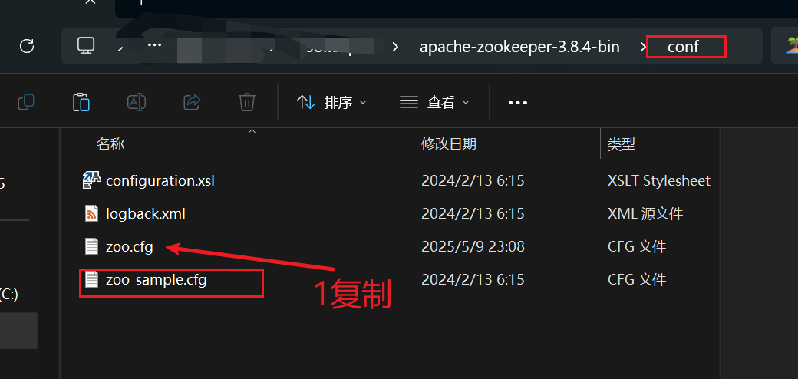
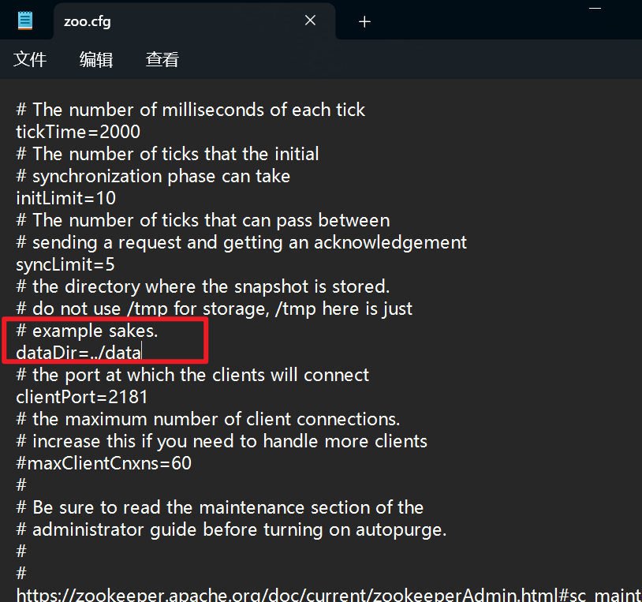
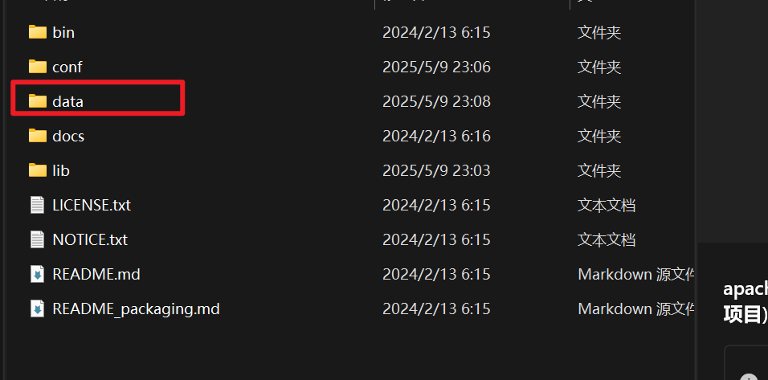

# 配置

解压后,复制zoo_sample.cfg 到 zoo.cfg

更改zoo.cfg 配置文件：

在外层创建文件夹 data

* 测试

在bin文件下启动cmd，启动服务：zkServer.cmd

测试zkcli,启动服务：zkCli.cmd: 

## linux 配置

https://blog.csdn.net/fengxiandada/article/details/124697818

