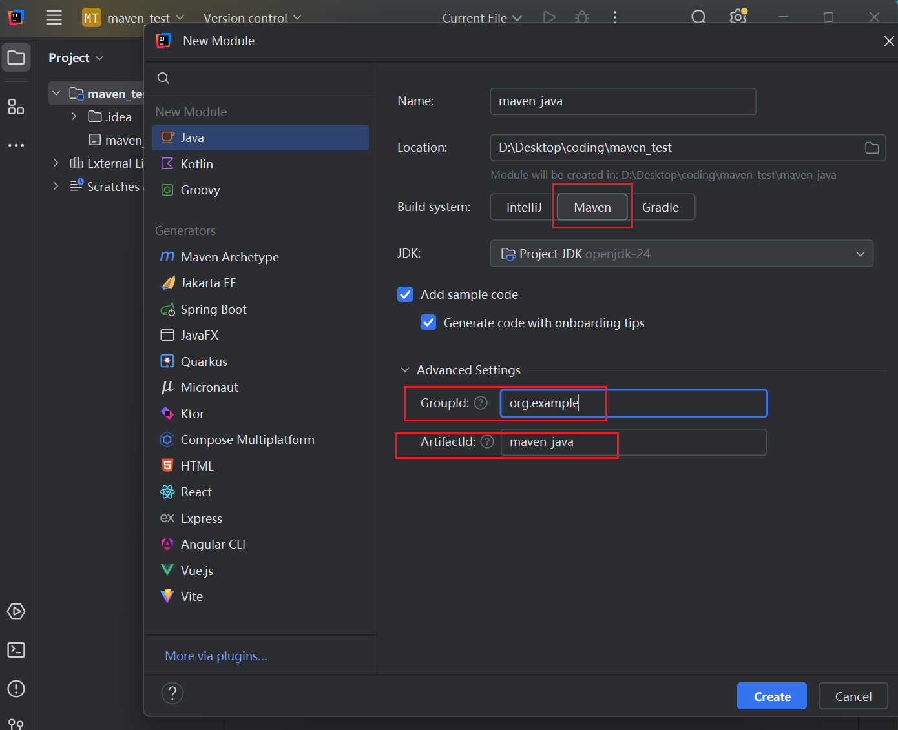
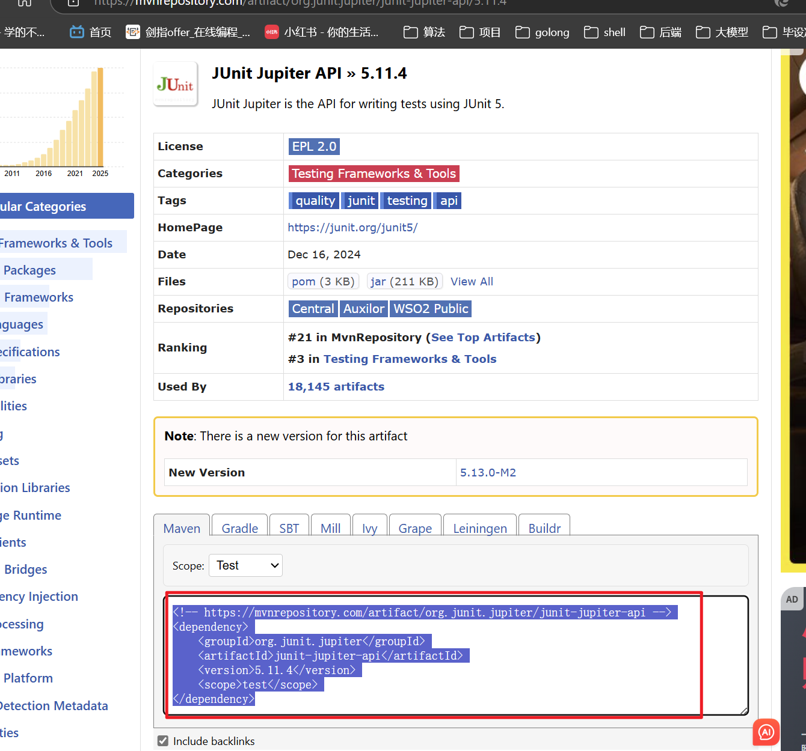
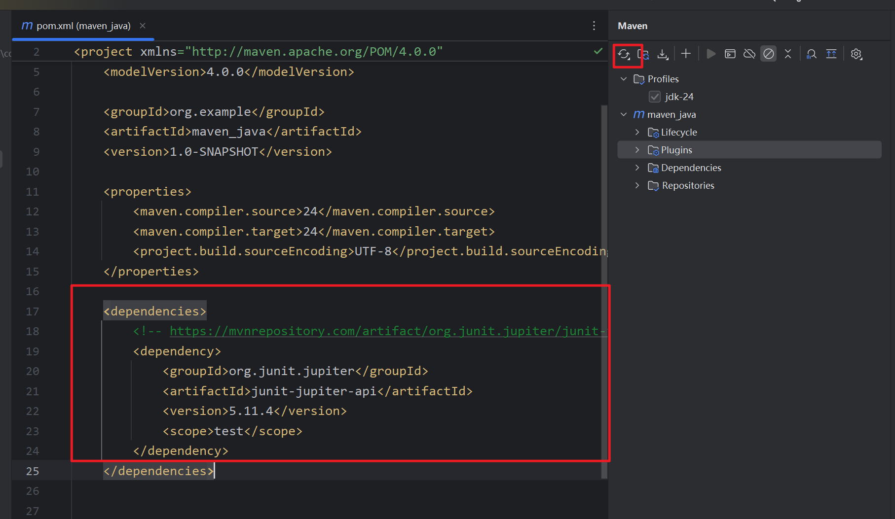
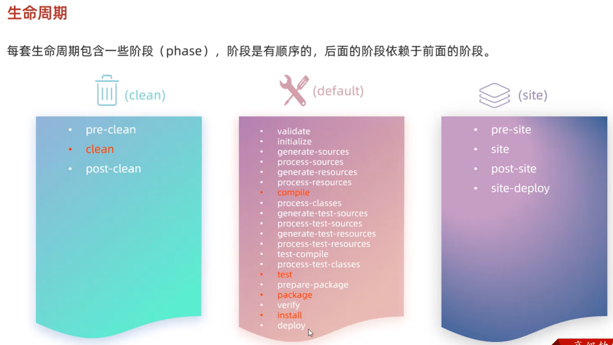
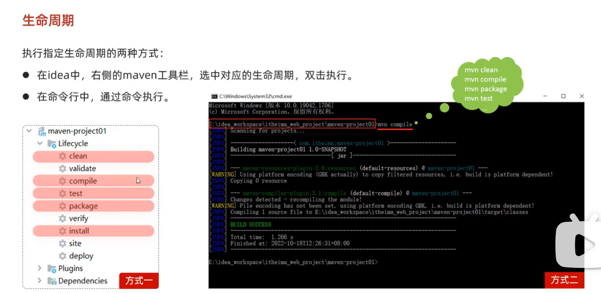

# Maven介绍

安装：https://blog.csdn.net/MSDCP/article/details/127680844

2：
https://blog.csdn.net/m0_73804764/article/details/139898041

创建工程：

https://blog.csdn.net/qq_42057154/article/details/106114515

## 使用

缩写 | 全称 | 作用
G | groupId | 项目所属组织或公司（类似命名空间）com.BU.业务线.子业务线
A | artifactId | 构件（模块）名，唯一标识某个项目或模块 
V | version | 版本号，用于区分构件的不同版本
P | packaging | 打包类型，如 jar、war、pom 等（可选，默认是 jar）


1. 创建


2. 项目结构


src/main/java 项目的源代码所在的目录
src/main/resources 项目的资源文件所在的目录
src/main/filters 项目的资源过滤文件所在的目录
src/main/webapp 如果是web项目，则该目录是web应用源代码所在的目录，比如html文件和web.xml等都在该目录下。

src/test/java 测试代码所在的目录
src/test/resources 测试相关的资源文件所在的目录
src/test/filters 测试相关的资源过滤文件所在的目录

3. 下载jar包

先找到资源：


放到配置文件中,然后刷新加载：


```java
<project ...>
	<modelVersion>4.0.0</modelVersion>
	<groupId>com.itranswarp.learnjava</groupId>
	<artifactId>hello</artifactId>
	<version>1.0</version>
	<packaging>jar</packaging>
	<properties>
        <project.build.sourceEncoding>UTF-8</project.build.sourceEncoding>
		<maven.compiler.release>17</maven.compiler.release>
	</properties>
	<dependencies>
        <dependency>
            <groupId>org.slf4j</groupId>
            <artifactId>slf4j-simple</artifactId>
            <version>2.0.16</version>
        </dependency>
	</dependencies>
</project>
```

其中，groupId类似于Java的包名，通常是公司或组织名称，artifactId类似于Java的类名，通常是项目名称，再加上version，一个Maven工程就是由groupId，artifactId和version作为唯一标识。

我们在引用其他第三方库的时候，也是通过这3个变量确定。例如，依赖org.slfj4:slf4j-simple:2.0.16：

```java
<dependency>
    <groupId>org.slf4j</groupId>
    <artifactId>slf4j-simple</artifactId>
    <version>2.0.16</version>
</dependency>
```

使用<dependency>声明一个依赖后，Maven就会自动下载这个依赖包并把它放到classpath中。

另外，注意到<properties>定义了一些属性，常用的属性有：

+ project.build.sourceEncoding：表示项目源码的字符编码，通常应设定为UTF-8；
+ maven.compiler.release：表示使用的JDK版本，例如21；
+ maven.compiler.source：表示Java编译器读取的源码版本；
+ maven.compiler.target：表示Java编译器编译的Class版本。


## 依赖管理

依赖关系
Maven定义了几种依赖关系，分别是compile、test、runtime和provided：


scope	说明	示例
compile	编译时需要用到该jar包（默认）	commons-logging
test	编译Test时需要用到该jar包	junit
runtime	编译时不需要，但运行时需要用到	mysql
provided	编译时需要用到，但运行时由JDK或某个服务器提供	servlet-api
其中，默认的compile是最常用的，Maven会把这种类型的依赖直接放入classpath。

其中，默认的compile是最常用的，Maven会把这种类型的依赖直接放入classpath。

test依赖表示仅在测试时使用，正常运行时并不需要。最常用的test依赖就是JUnit：

```java
<dependency>
    <groupId>org.junit.jupiter</groupId>
    <artifactId>junit-jupiter-api</artifactId>
    <version>5.3.2</version>
    <scope>test</scope>
</dependency>
```

runtime依赖表示编译时不需要，但运行时需要。最典型的runtime依赖是JDBC驱动，例如MySQL驱动：

```java
<dependency>
    <groupId>mysql</groupId>
    <artifactId>mysql-connector-java</artifactId>
    <version>5.1.48</version>
    <scope>runtime</scope>
</dependency>
```

provided依赖表示编译时需要，但运行时不需要。最典型的provided依赖是Servlet API，编译的时候需要，但是运行时，Servlet服务器内置了相关的jar，所以运行期不需要：

```java
<dependency>
    <groupId>jakarta.servlet</groupId>
    <artifactId>jakarta.servlet-api</artifactId>
    <version>4.0.0</version>
    <scope>provided</scope>
</dependency>

```

最后一个问题是，Maven如何知道从何处下载所需的依赖？也就是相关的jar包？答案是Maven维护了一个中央仓库（repo1.maven.org），所有第三方库将自身的jar以及相关信息上传至中央仓库，Maven就可以从中央仓库把所需依赖下载到本地。

Maven并不会每次都从中央仓库下载jar包。一个jar包一旦被下载过，就会被Maven自动缓存在本地目录（用户主目录的.m2目录），所以，除了第一次编译时因为下载需要时间会比较慢，后续过程因为有本地缓存，并不会重复下载相同的jar包。


## 构建流程




在实际开发过程中，经常使用的命令有：

mvn clean：清理所有生成的class和jar；
mvn clean compile：先清理，再执行到compile；
mvn clean test：先清理，再执行到test，因为执行test前必须执行compile，所以这里不必指定compile；
mvn clean package：先清理，再执行到package。
大多数phase在执行过程中，因为我们通常没有在pom.xml中配置相关的设置，所以这些phase什么事情都不做。

经常用到的phase其实只有几个：

+ clean：清理
+ compile：编译
+ test：运行测试
+ package：打包



## 模块管理

在软件开发中，把一个大项目分拆为多个模块是降低软件复杂度的有效方法：

                        ┌ ─ ─ ─ ─ ─ ─ ┐
                          ┌─────────┐
                        │ │Module A │ │
                          └─────────┘
┌──────────────┐ split  │ ┌─────────┐ │
│Single Project│───────▶  │Module B │
└──────────────┘        │ └─────────┘ │
                          ┌─────────┐
                        │ │Module C │ │
                          └─────────┘
                        └ ─ ─ ─ ─ ─ ─ ┘
对于Maven工程来说，原来是一个大项目：

single-project
├── pom.xml
└── src

现在可以分拆成3个模块：

multiple-projects
├── module-a
│   ├── pom.xml
│   └── src
├── module-b
│   ├── pom.xml
│   └── src
└── module-c
    ├── pom.xml
    └── src
Maven可以有效地管理多个模块，我们只需要把每个模块当作一个独立的Maven项目，它们有各自独立的pom.xml。

例如，模块A的pom.xml：

```java
<project xmlns="http://maven.apache.org/POM/4.0.0"
    xmlns:xsi="http://www.w3.org/2001/XMLSchema-instance"
    xsi:schemaLocation="http://maven.apache.org/POM/4.0.0 http://maven.apache.org/xsd/maven-4.0.0.xsd">
    <modelVersion>4.0.0</modelVersion>

    <groupId>com.itranswarp.learnjava</groupId>
    <artifactId>module-a</artifactId>
    <version>1.0</version>
    <packaging>jar</packaging>

    <name>module-a</name>

    <properties>
        <project.build.sourceEncoding>UTF-8</project.build.sourceEncoding>
        <project.reporting.outputEncoding>UTF-8</project.reporting.outputEncoding>
        <maven.compiler.source>11</maven.compiler.source>
        <maven.compiler.target>11</maven.compiler.target>
        <java.version>11</java.version>
    </properties>

    <dependencies>
        <dependency>
            <groupId>org.slf4j</groupId>
            <artifactId>slf4j-api</artifactId>
            <version>1.7.28</version>
        </dependency>
        <dependency>
            <groupId>ch.qos.logback</groupId>
            <artifactId>logback-classic</artifactId>
            <version>1.2.3</version>
            <scope>runtime</scope>
        </dependency>
        <dependency>
            <groupId>org.junit.jupiter</groupId>
            <artifactId>junit-jupiter-engine</artifactId>
            <version>5.5.2</version>
            <scope>test</scope>
        </dependency>
    </dependencies>
</project>

```

模块B的pom.xml：
```java
<project xmlns="http://maven.apache.org/POM/4.0.0"
    xmlns:xsi="http://www.w3.org/2001/XMLSchema-instance"
    xsi:schemaLocation="http://maven.apache.org/POM/4.0.0 http://maven.apache.org/xsd/maven-4.0.0.xsd">
    <modelVersion>4.0.0</modelVersion>

    <groupId>com.itranswarp.learnjava</groupId>
    <artifactId>module-b</artifactId>
    <version>1.0</version>
    <packaging>jar</packaging>

    <name>module-b</name>

    <properties>
        <project.build.sourceEncoding>UTF-8</project.build.sourceEncoding>
        <project.reporting.outputEncoding>UTF-8</project.reporting.outputEncoding>
        <maven.compiler.source>11</maven.compiler.source>
        <maven.compiler.target>11</maven.compiler.target>
        <java.version>11</java.version>
    </properties>

    <dependencies>
        <dependency>
            <groupId>org.slf4j</groupId>
            <artifactId>slf4j-api</artifactId>
            <version>1.7.28</version>
        </dependency>
        <dependency>
            <groupId>ch.qos.logback</groupId>
            <artifactId>logback-classic</artifactId>
            <version>1.2.3</version>
            <scope>runtime</scope>
        </dependency>
        <dependency>
            <groupId>org.junit.jupiter</groupId>
            <artifactId>junit-jupiter-engine</artifactId>
            <version>5.5.2</version>
            <scope>test</scope>
        </dependency>
    </dependencies>
</project>

```

可以看出来，模块A和模块B的pom.xml高度相似，因此，我们可以提取出共同部分作为parent：

```java
<project xmlns="http://maven.apache.org/POM/4.0.0"
    xmlns:xsi="http://www.w3.org/2001/XMLSchema-instance"
    xsi:schemaLocation="http://maven.apache.org/POM/4.0.0 http://maven.apache.org/xsd/maven-4.0.0.xsd">
    <modelVersion>4.0.0</modelVersion>

    <groupId>com.itranswarp.learnjava</groupId>
    <artifactId>parent</artifactId>
    <version>1.0</version>
    <packaging>pom</packaging>

    <name>parent</name>

    <properties>
        <project.build.sourceEncoding>UTF-8</project.build.sourceEncoding>
        <project.reporting.outputEncoding>UTF-8</project.reporting.outputEncoding>
        <maven.compiler.source>11</maven.compiler.source>
        <maven.compiler.target>11</maven.compiler.target>
        <java.version>11</java.version>
    </properties>

    <dependencies>
        <dependency>
            <groupId>org.slf4j</groupId>
            <artifactId>slf4j-api</artifactId>
            <version>1.7.28</version>
        </dependency>
        <dependency>
            <groupId>ch.qos.logback</groupId>
            <artifactId>logback-classic</artifactId>
            <version>1.2.3</version>
            <scope>runtime</scope>
        </dependency>
        <dependency>
            <groupId>org.junit.jupiter</groupId>
            <artifactId>junit-jupiter-engine</artifactId>
            <version>5.5.2</version>
            <scope>test</scope>
        </dependency>
    </dependencies>
</project>

```

注意到parent的<packaging>是pom而不是jar，因为parent本身不含任何Java代码。编写parent的pom.xml只是为了在各个模块中减少重复的配置。现在我们的整个工程结构如下：

multiple-project
├── pom.xml
├── parent
│   └── pom.xml
├── module-a
│   ├── pom.xml
│   └── src
├── module-b
│   ├── pom.xml
│   └── src
└── module-c
    ├── pom.xml
    └── src
这样模块A就可以简化为：

```java
<project xmlns="http://maven.apache.org/POM/4.0.0"
    xmlns:xsi="http://www.w3.org/2001/XMLSchema-instance"
    xsi:schemaLocation="http://maven.apache.org/POM/4.0.0 http://maven.apache.org/xsd/maven-4.0.0.xsd">
    <modelVersion>4.0.0</modelVersion>

    <parent>
        <groupId>com.itranswarp.learnjava</groupId>
        <artifactId>parent</artifactId>
        <version>1.0</version>
        <relativePath>../parent/pom.xml</relativePath>
    </parent>

    <artifactId>module-a</artifactId>
    <packaging>jar</packaging>
    <name>module-a</name>
</project>

```

模块B、模块C都可以直接从parent继承，大幅简化了pom.xml的编写。

如果模块A依赖模块B，则模块A需要模块B的jar包才能正常编译，我们需要在模块A中引入模块B：

```java
    ...
    <dependencies>
        <dependency>
            <groupId>com.itranswarp.learnjava</groupId>
            <artifactId>module-b</artifactId>
            <version>1.0</version>
        </dependency>
    </dependencies>
```

最后，在编译的时候，需要在根目录创建一个pom.xml统一编译：

```java
<project xmlns="http://maven.apache.org/POM/4.0.0"
    xmlns:xsi="http://www.w3.org/2001/XMLSchema-instance"
    xsi:schemaLocation="http://maven.apache.org/POM/4.0.0 http://maven.apache.org/maven-v4_0_0.xsd">

    <modelVersion>4.0.0</modelVersion>
    <groupId>com.itranswarp.learnjava</groupId>
    <artifactId>build</artifactId>
    <version>1.0</version>
    <packaging>pom</packaging>
    <name>build</name>

    <modules>
        <module>parent</module>
        <module>module-a</module>
        <module>module-b</module>
        <module>module-c</module>
    </modules>
</project>

```

这样，在根目录执行mvn clean package时，Maven根据根目录的pom.xml找到包括parent在内的共4个<module>，一次性全部编译。


