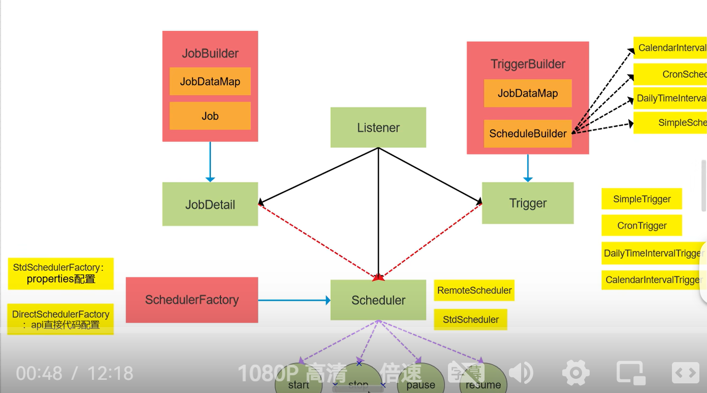
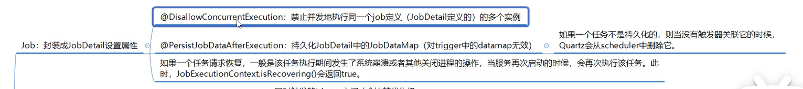
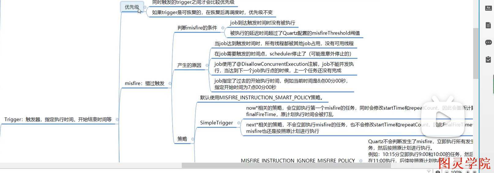
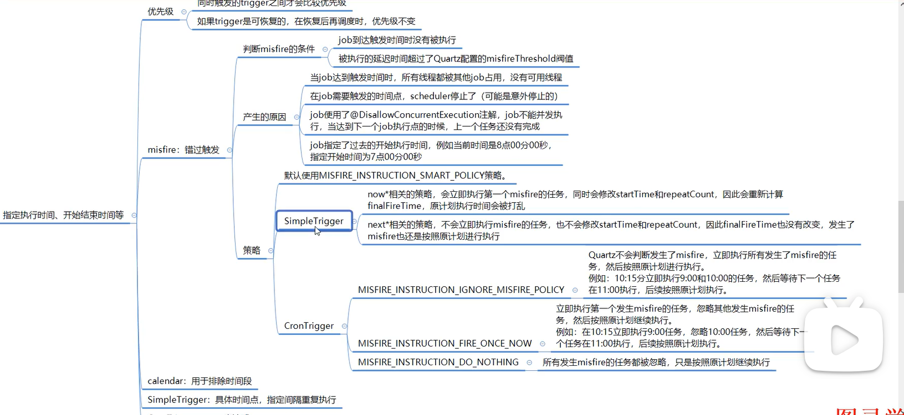
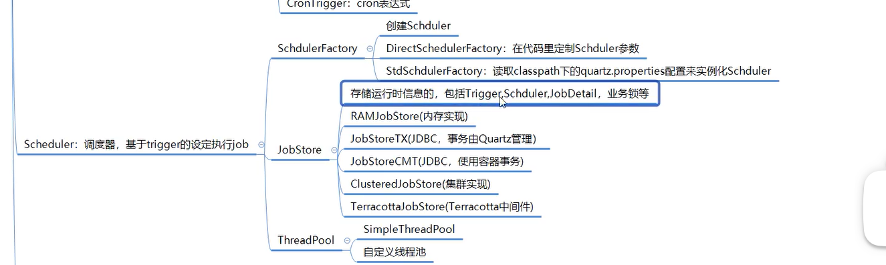

# quart



## 1. 简单使用

1、导入依赖的jar包：

```java
<!-- https://mvnrepository.com/artifact/org.quartz-scheduler/quartz -->
<dependency>
    <groupId>org.quartz-scheduler</groupId>
    <artifactId>quartz</artifactId>
    <version>2.3.0</version>
</dependency>
```

2、新建一个能够打印任意内容的Job：

```java
public class PrintWordsJob implements Job{

    @Override
    public void execute(JobExecutionContext jobExecutionContext) throws JobExecutionException {
        String printTime = new SimpleDateFormat("yy-MM-dd HH-mm-ss").format(new Date());
        System.out.println("PrintWordsJob start at:" + printTime + ", prints: Hello Job-" + new Random().nextInt(100));

    }
}
```

3、创建Schedule，执行任务：

```java
public class MyScheduler {

    public static void main(String[] args) throws SchedulerException, InterruptedException {
        // 1、创建调度器Scheduler
        SchedulerFactory schedulerFactory = new StdSchedulerFactory();
        Scheduler scheduler = schedulerFactory.getScheduler();
        // 2、创建JobDetail实例，并与PrintWordsJob类绑定(Job执行内容)
        JobDetail jobDetail = JobBuilder.newJob(PrintWordsJob.class)
                                        .withIdentity("job1", "group1").build();
        // 3、构建Trigger实例,每隔1s执行一次
        Trigger trigger = TriggerBuilder.newTrigger().withIdentity("trigger1", "triggerGroup1")
                .startNow()//立即生效
                .withSchedule(SimpleScheduleBuilder.simpleSchedule()
                .withIntervalInSeconds(1)//每隔1s执行一次
                .repeatForever()).build();//一直执行

        //4、执行
        scheduler.scheduleJob(jobDetail, trigger);
        System.out.println("--------scheduler start ! ------------");
        scheduler.start();

        //睡眠
        TimeUnit.MINUTES.sleep(1);
        scheduler.shutdown();
        System.out.println("--------scheduler shutdown ! ------------");


    }
}
```

## 2. Quartz核心详解

下面就程序中出现的几个参数，看一下Quartz框架中的几个重要参数：

+ Job和JobDetail
+ JobExecutionContext
+ JobDataMap
+ Trigger、SimpleTrigger、CronTrigger


（1）Job和JobDetail
Job是Quartz中的一个接口，接口下只有execute方法，在这个方法中编写业务逻辑。

JobDetail用来绑定Job，为Job实例提供许多属性：

JobDetail绑定指定的Job，每次Scheduler调度执行一个Job的时候，首先会拿到对应的Job，然后创建该Job实例，再去执行Job中的execute()的内容，任务执行结束后，关联的Job对象实例会被释放，且会被JVM GC清除。

为什么设计成JobDetail + Job，不直接使用Job

> JobDetail定义的是任务数据，而真正的执行逻辑是在Job中。
这是因为任务是有可能并发执行，如果Scheduler直接使用Job，就会存在对同一个Job实例并发访问的问题。而JobDetail & Job 方式，Sheduler每次执行，都会根据JobDetail创建一个新的Job实例，这样就可以规避并发访问的问题。


（2）JobExecutionContext

JobExecutionContext中包含了Quartz运行时的环境以及Job本身的详细数据信息。

当Schedule调度执行一个Job的时候，就会将JobExecutionContext传递给该Job的execute()中，Job就可以通过JobExecutionContext对象获取信息。

3）JobExecutionContext

JobDataMap实现了JDK的Map接口，可以以Key-Value的形式存储数据。

JobDetail、Trigger都可以使用JobDataMap来设置一些参数或信息，
Job执行execute()方法的时候，JobExecutionContext可以获取到JobExecutionContext中的信息：

如：

```java
JobDetail jobDetail = JobBuilder.newJob(PrintWordsJob.class)                        .usingJobData("jobDetail1", "这个Job用来测试的")
                  .withIdentity("job1", "group1").build();

 Trigger trigger = TriggerBuilder.newTrigger().withIdentity("trigger1", "triggerGroup1")
      .usingJobData("trigger1", "这是jobDetail1的trigger")
      .startNow()//立即生效
      .withSchedule(SimpleScheduleBuilder.simpleSchedule()
      .withIntervalInSeconds(1)//每隔1s执行一次
      .repeatForever()).build();//一直执行

```

Job执行的时候，可以获取到这些参数信息：

```java
    @Override
    public void execute(JobExecutionContext jobExecutionContext) throws JobExecutionException {

        System.out.println(jobExecutionContext.getJobDetail().getJobDataMap().get("jobDetail1"));
        System.out.println(jobExecutionContext.getTrigger().getJobDataMap().get("trigger1"));
        String printTime = new SimpleDateFormat("yy-MM-dd HH-mm-ss").format(new Date());
        System.out.println("PrintWordsJob start at:" + printTime + ", prints: Hello Job-" + new Random().nextInt(100));


    }
```

（4）Trigger、SimpleTrigger、CronTrigger

Trigger : Trigger是Quartz的触发器，会去通知Scheduler何时去执行对应Job。

```java
new Trigger().startAt():表示触发器首次被触发的时间;
new Trigger().endAt():表示触发器结束触发的时间;
```

SimpleTrigger : SimpleTrigger可以实现在一个指定时间段内执行一次作业任务或一个时间段内多次执行作业任务。

下面的程序就实现了程序运行5s后开始执行Job，执行Job 5s后结束执行：


```java
Date startDate = new Date();
startDate.setTime(startDate.getTime() + 5000);

 Date endDate = new Date();
 endDate.setTime(startDate.getTime() + 5000);

        Trigger trigger = TriggerBuilder.newTrigger().withIdentity("trigger1", "triggerGroup1")
                .usingJobData("trigger1", "这是jobDetail1的trigger")
                .startNow()//立即生效
                .startAt(startDate)
                .endAt(endDate)
                .withSchedule(SimpleScheduleBuilder.simpleSchedule()
                .withIntervalInSeconds(1)//每隔1s执行一次
                .repeatForever()).build();//一直执行

```

CronTrigger

CronTrigger功能非常强大，是基于日历的作业调度，而SimpleTrigger是精准指定间隔，所以相比SimpleTrigger，CroTrigger更加常用。CroTrigger是基于Cron表达式的，先了解下Cron表达式：

由7个子表达式组成字符串的，格式如下：

[秒] [分] [小时] [日] [月] [周] [年]


可通过在线生成Cron表达式的工具：http://cron.qqe2.com/ 来生成自己想要的表达式。


原文链接：https://blog.csdn.net/noaman_wgs/article/details/80984873

## 3. 基础原理

小顶堆 和 时间轮； 待补充

两个注解：
@DisallowConcurrenExecution
@PersisJobDataAferExecution










## 3. SpringBoot定时任务 - 集成quartz实现定时任务（单实例和分布式两种方式)

### 3.1 实现案例 - 单实例方式

引入POM依赖

```java
<dependency>
    <groupId>org.springframework.boot</groupId>
    <artifactId>spring-boot-starter-quartz</artifactId>
</dependency>
```

定义Job:

只需要继承QuartzJobBean，并重载executeInternal方法即可定义你自己的Job执行逻辑。

```java
@Slf4j
public class HelloJob extends QuartzJobBean {

    @Override
    protected void executeInternal(JobExecutionContext context) throws JobExecutionException {
        // get parameters
        context.getJobDetail().getJobDataMap().forEach(
                (k, v) -> log.info("param, key:{}, value:{}", k, v)
        );
        // your logics
        log.info("Hello Job执行时间: " + new Date());
    }
}

```

配置Job:

JobDetail, Trigger, Schedule(这里采用CronScheduleBuilder)

```java
/**
 * @author pdai
 */
@Configuration
public class QuartzConfig {

    @Bean("helloJob")
    public JobDetail helloJobDetail() {
        return JobBuilder.newJob(HelloJob.class)
                .withIdentity("DateTimeJob")
                .usingJobData("msg", "Hello Quartz")
                .storeDurably()//即使没有Trigger关联时，也不需要删除该JobDetail
                .build();
    }

    @Bean
    public Trigger printTimeJobTrigger() {
        // 每秒执行一次
        CronScheduleBuilder cronScheduleBuilder = CronScheduleBuilder.cronSchedule("0/1 * * * * ?");
        return TriggerBuilder.newTrigger()
                .forJob(helloJobDetail())
                .withIdentity("quartzTaskService")
                .withSchedule(cronScheduleBuilder)
                .build();
    }
}

```

### 3.2 实现案例 - 分布式方式

待学

https://www.cnblogs.com/pengdai/p/16538853.html


