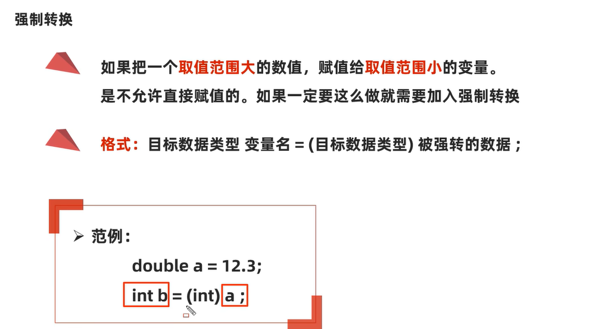
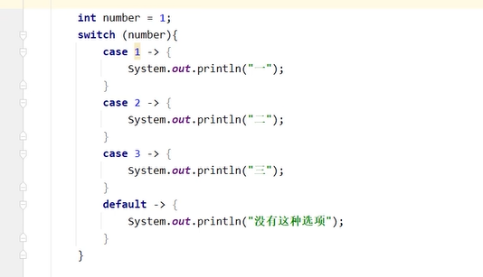
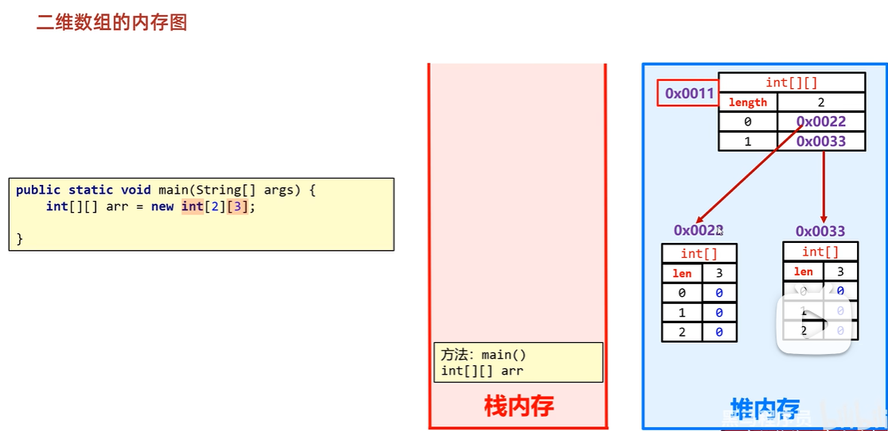
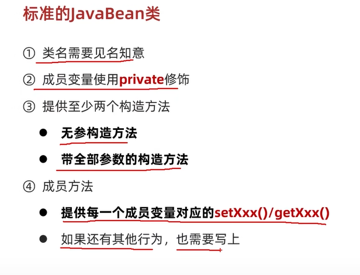
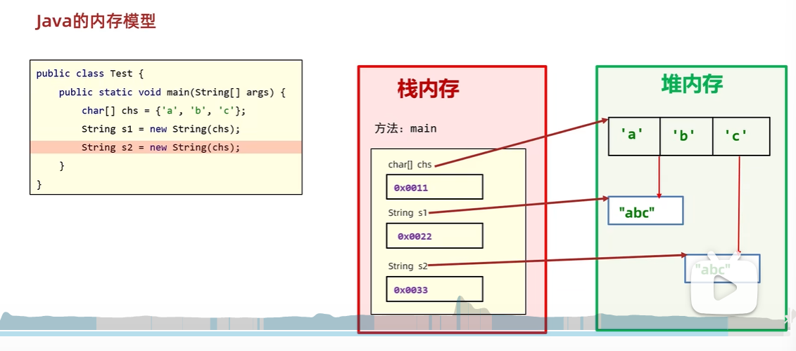

# java 基础

1. java加载与执行
2. 变量
3. 项目结构
    3.1 一些设置
    3.2 类、模块、项目操作
4. 运算符
    4.1 + - * / %
    4.2 自增自减 赋值运算符 关系运算符 逻辑运算符 三元运算符 原码，反码，补码
5. 条件 switch
6. 数组
    6.1 数组的内存图
7. 方法
    7.1 方法重载
    7.2 Java 内存分配
    7.3 java 传参 <-> 引用和c++不同，显然没有c++灵活
    7.4 二维数组
8. 面向对象
    8.1 java和c++面向对象的区别
    8.2 java中的this指针 和c++的区别
    8.3 java和c++的构造函数差异
    8.4 java和c++类中的static区别
    8.5 JavaBean
    8.6 对象的内存图
9. 字符串 api


## 1. java加载与执行

JDK -> JRE -> JVM

jdk：工具包；
    javac.exe : 编译器
    java.exe : 负责运行
JRE:运行环境
jvm：java虚拟机，用于在不同操作系统上运行；


两个阶段： 编译，运行


编译：.java -> .class （字节码文件，不是纯粹的二进制文件）
运行：java.exe 命令启动java虚拟机，JVM会启动类加载器ClassLoder
    ClassLoder会去搜索A.class文件，找到文件将该字节码文件装载到JVM中。
    JVM将A.class字节码文件解释成二进制数据；
    然后操作系统执行二进制文件；

比如： HelloWorld.java 文件

```bash
javac HelloWorld.java
java HelloWorld
```


配置Path环境变量的目的：可以在任意目录下都可以打开指定的软件。


在JAVA_HOME中配置：


然后在 path中配置：


## 2. 变量


### Scanner 输入类

步骤：
+ 导包     import java.util.Scanner
+ 创建对象  Scanner sc = new Scanner(System.in);
+ 接受数据  int i = sc.nextInt();

## 3. 项目结构

project -> module -> package -> class

1. 创建project后，然后创建 module：


2. 然后再 src 下面就可以创建package了:

包名：
+ 公司域名的反写+功能；
+ 比如： com.heima.demo1


创建好的目录结构如下


3. 然后就可以写 class 了


### 3.1 一些设置

提示不区分大小写：


字体大小：


注释颜色


### 3.2 类、模块、项目操作

1. 类操作

新建类 删除类 修改类名

文件名和类名保持一致；

2. 模块操作 

+ 新建模块 : file -> project structure -> module ->  + 
+ 删除模块
+ 修改模块
+ 导入模块


3. 项目

+ 1. 关闭项目
+ 2. 新建项目
+ 3. 打开项目
+ 4. 修改项目


## 4. 运算符

### 4.1 + - * / %


隐士转换：范围小 -> 范围大




有字符串相加就是拼接，没有字符串就是运算；


字符 + 数字，转化为 ascall


### 4.2 自增自减 赋值运算符 关系运算符 逻辑运算符 三元运算符 原码，反码，补码


## 5. 条件 switch


swich 可以使用 ->{} 来代替 break;



## 6. 数组

数组的定义：


数组的初始化：
在内存中，为数组开辟空间，并将数据存入容器中的过程；

> 静态初始化


两种方式：
```java
int[] arr1 = new int[]{11,12,12};
int[] arr2 = {1,23,4};
```

数组名就是首地址：
```java
int[] arr = {1,2,3,4,5,6,7,8,9,10};
System.out.println(arr);
[I@f6f4d33
```

这里：
+ [ : 代表数组
+ I ：代表元素int类型
+ @ ：代表间隔符号
+ f6f4d33 ： 才是数组真正的地址值

> 数组元素访问

```java
arr1[i]
```

数组的长度 ： arr1.length

> 动态初始化


动态数组和静态数组的区别：


### 6.1 数组的内存图


+ 栈：方法运行时使用的内存，比如main方法运行，进入方法栈中执行
+ 堆：存储对象或者数组，new来创建的，都存储再堆内存
+ 方法区：存储可以运行的class文件
+ 本地方法栈：JVM再使用操作系统功能的时候使用，和开发无关
+ 寄存器：给CPU使用，和开发无关

## 7. 方法

方法：是程序中最小的执行单元

```java
public static 返回值 方法名(参数) {
    return 返回值；
}
```

### 7.1 方法重载


### 7.2 Java 内存分配


java 里面的引用和 c++不同：

在 Java 中，基本数据类型（如 int、double 等）是按值传递的，但对象是按引用传递的。数组在 Java 中也是对象，按引用传递。

### 7.3 java 传参

+ 基本数据类型的参数传递
基本数据类型（如 byte、short、int、long、float、double、char、boolean）在作为参数传递时，传递的是该值的副本。也就是说，在方法内部对参数的修改不会影响到原始变量的值。

+ 对象类型的参数传递
当传递对象类型的参数时，传递的是对象引用的副本。这个副本和原始引用指向同一个对象，所以在方法内部可以通过这个副本引用修改对象的状态，但不能改变原始引用本身。


### 7.4 二维数组

二维静态数组：


二维动态数组：


二维数组内存图：



注意：Java 支持不规则二维数组，即每行的列数可以不同。
```java
int[][] irregularArray = new int[3][];
irregularArray[0] = new int[2];
irregularArray[1] = new int[3];
irregularArray[2] = new int[4];
```

## 8. 面向对象

分为两种类：Javabean类、测试类


注意：一个文件最好只写一个类名


对象成员变量的默认值规则：


### 8.1 java和c++面向对象的区别

封装
+ 访问控制：
    + Java：拥有四种访问修饰符，分别是public、protected、private和默认（无修饰符）。默认访问权限意味着只有同一个包内的类能够访问。
    + C++：有三种访问修饰符，即public、protected和private。不存在像 Java 那样基于包的默认访问权限。
+ 类和成员：
    + Java：所有代码都必须写在类中，不支持全局变量和函数。
    + C++：允许全局变量和函数的存在，并且可以直接在类外部定义和使用。


继承
+ 单继承与多继承：
    + Java：类只支持单继承，不过可以通过实现多个接口来达到类似多继承的效果。
    + C++：支持类的多继承，一个类可以从多个父类继承属性和方法。
+ 继承方式：
    + Java：只有一种继承方式，子类会继承父类的非私有成员。
    + C++：继承方式有public、protected和private三种，不同的继承方式会影响父类成员在子类中的访问权限。


多态
+ 虚函数与抽象方法：
    + Java：使用abstract关键字来定义抽象方法，包含抽象方法的类必须是抽象类。子类必须实现抽象类中的所有抽象方法。普通方法可以使用final关键字防止被重写。
    + C++：使用virtual关键字来定义虚函数，通过在基类中声明虚函数，派生类可以重写该函数。同时，C++ 有纯虚函数的概念，包含纯虚函数的类是抽象类。
+ 运行时多态：
    + Java：方法默认是虚函数，运行时多态主要通过方法重写和接口实现来实现。
    + C++：需要显式地使用virtual关键字来实现运行时多态。

### 8.2 java中的this指针 和c++的区别

相同点

+ 代表当前对象：在 C++ 和 Java 里，this都用于表示当前对象。也就是说，在对象的成员函数里，this能让你访问当前对象的成员变量与成员函数。
+ 解决命名冲突：当成员变量名和局部变量名或者函数参数名相同时，this可以用来明确指定访问的是成员变量。


不同点

语法形式
+ C++：this是一个指针，所以要使用->操作符来访问成员。
+ Java：this是一个引用，使用.操作符来访问成员。

可修改性
+ C++：this指针本身是可以被修改的，不过这种情况比较少见。例如，在某些复杂的指针操作里，可以通过一些手段改变this指针的指向。
+ Java：this引用是不能被修改的，它始终指向当前对象。

用途差异
+ C++：在拷贝构造函数、赋值运算符重载等场景中，this指针常常被用来处理自我赋值的情况。
+ Java：除了常规的访问成员，this还可以用于在构造函数里调用其他构造函数，这种用法叫做构造函数的重载调用。


总的来讲：
在 Java 里，this 是当前对象的引用。引用在 Java 里可看作是一种较为安全、经过封装的指针。Java 语言为了简化编程、增强安全性，对底层的指针操作进行了封装，开发者无法直接操作内存地址，也不能像在 C++ 里那样进行指针的算术运算等操作。

this 引用指向调用该方法的对象，它提供了一种访问当前对象成员的途径，保证了方法能够正确处理当前对象的数据。

C++ 里的 this 是一个指针，指向调用该成员函数的对象。

### 8.3 java和c++的构造函数差异

不同之处
+ 调用其他构造函数：
    + Java：可以使用 this() 语句在构造函数中调用同一个类的其他构造函数，且 this() 必须是构造函数中的第一条语句。
    创建对象，由虚拟机自动调用，进行初始化

    + C++：使用成员初始化列表来调用其他构造函数，也可以在构造函数体中调用其他构造函数，但成员初始化列表的方式更高效，因为它在对象构造时就进行初始化，而不是先默认初始化再赋值。

### 8.4 java和c++类中的static区别

**相似之处**

> 静态成员变量

+ 存储特性：
在 Java 和 C++ 里，静态成员变量都属于类，而非类的实例。这意味着无论创建多少个类的对象，静态成员变量都只有一份副本，所有对象共享该变量。

+ 访问方式：
都可以通过类名直接访问静态成员变量，不过也能通过对象访问，但不推荐这种方式，因为可能会造成混淆。

> 静态成员函数

+ 所属关系：
二者的静态成员函数都属于类，而不是类的实例。可以直接通过类名调用，无需创建对象。

+ 访问限制：
静态成员函数只能访问类的静态成员（静态变量和静态函数），不能直接访问实例成员（实例变量和实例函数），因为静态成员函数不依赖于类的实例。


**不同之处**

> 静态成员变量的初始化

+ Java 中的静态成员变量可以在声明时直接初始化，也能在静态代码块中进行初始化。静态代码块在类加载时执行，且只执行一次。

```java
class MyClass {
    // 声明时直接初始化
    public static int staticVar1 = 10;
    public static int staticVar2;

    // 静态代码块初始化
    static {
        staticVar2 = 20;
    }
}
```

+ C++ 的静态成员变量在类内声明，必须在类外进行初始化，除非它是 const 类型的静态成员变量。

> 静态代码块

Java 有静态代码块，使用 static 关键字加代码块来定义，用于在类加载时执行一些初始化操作，比如加载配置文件、初始化静态变量等。

```java
class MyClass {
    public static int staticVar;

    static {
        // 加载配置文件等操作
        staticVar = 30;
        System.out.println("Static block executed.");
    }
}
```

C++ 没有专门的静态代码块语法，但可以通过在类外定义全局变量和函数来实现类似的初始化操作。

> 静态成员函数对 this 指针的使用

Java 的静态成员函数中不能使用 this 引用，因为 this 代表当前对象，而静态成员函数不依赖于对象。


C++ 的静态成员函数中没有 this 指针，因为它不与特定的对象关联。如果尝试在静态成员函数中使用 this 指针，编译器会报错。

### 8.5 JavaBean




### 8.6 对象的内存图


## 9. 字符串 api

Scanner 键盘录入
    Scanner 类默认使用空白字符（如空格、制表符、换行符等）作为分隔符，将输入数据分割成多个标记（token）。可以使用 useDelimiter() 方法自定义分隔符。
Random 随机数

### 9.1 string stringbuilder stringjonier stringbuffer pattern matcher

注意：字符串的内容是不会发生改变的，他的对象在创建后不能被改变。

创建string的方式：


串池：
当使用双引号直接赋值时，系统会检查该字符串在串池中是否存在。
+ 不存在： 创建新的
+ 存在： 复用


每 new 一次，都是创建一块新的空间：



1. String 类

+ 不可变性：String 类的对象是不可变的，一旦创建，其内容就无法改变。每次对 String 对象进行修改操作（如拼接、替换等）时，实际上是创建了一个新的 String 对象。
+ 线程安全：由于 String 对象不可变，所以它是线程安全的。多个线程可以同时访问同一个 String 对象而不会产生数据不一致的问题。
+ 使用场景：适用于字符串内容不经常变化的场景，例如存储固定的配置信息、常量字符串等。

2. StringBuilder 类

+ 可变性：StringBuilder 类的对象是可变的，它内部维护了一个可变的字符序列。对 StringBuilder 对象进行修改操作（如追加、插入、删除等）时，不会创建新的对象，而是直接在原对象上进行修改。
+ 线程不安全：StringBuilder 不是线程安全的，在多线程环境下使用可能会导致数据不一致的问题。
+ 使用场景：适用于单线程环境下频繁进行字符串拼接、修改等操作的场景，例如在循环中动态拼接字符串。

```java
public class StringBuilderExample {
    public static void main(String[] args) {
        StringBuilder sb = new StringBuilder();
        sb.append("Hello");
        sb.append(" World");
        String result = sb.toString();
        System.out.println(result);
    }
}
```

3. StringJoiner 类

+ 特定用途：StringJoiner 主要用于将多个字符串用指定的分隔符连接起来，还可以指定前缀和后缀。它提供了更方便的方式来处理字符串连接，特别是在需要添加分隔符的场景下。
+ 线程不安全：和 StringBuilder 一样，StringJoiner 也是线程不安全的。
+ 使用场景：适用于需要将多个字符串用特定分隔符连接的场景，例如将数组元素用逗号连接成一个字符串。

```java
import java.util.StringJoiner;

public class StringJoinerExample {
    public static void main(String[] args) {
        StringJoiner sj = new StringJoiner(", ", "[", "]");
        sj.add("apple");
        sj.add("banana");
        sj.add("cherry");
        String result = sj.toString();
        System.out.println(result);
    }
}
```


### 9.2 字符串比较

== 号比较：
+ 基本类型，比较值
+ 引用类型，比较地址


字符串比较：
+ boolean equals
+ boolean equalsignoreCase


注意：键盘录入底层是 new

### 9.3 字符串遍历

+ charAt(int index) 
+ length();
+ compareTo(String anotherString) 按字典顺序比较两个字符串。
+ compareToIgnoreCase(String str)   按字典顺序比较两个字符串，不考虑大小写。
+ concat(String str) 
+ contains(CharSequence s) 


### 9.4 stringbuilder

是一个容器，创建之后里面的内容是可变的；拼接效率高；

stringbuilder 构造方法：


常用的方法：


注意：打印StringBuild不是地址，而是变量值。

### 9.5 stringjonier

stringjonier 构造函数：


stringjoiner 成员函数


### 9.6 字符串原理

+ 扩展底层原理1:字符串存储的内存原理
    + 直接赋值会复用字符串常量池中的
    + new出来不会复用，而是开辟一个新的空间

+ 扩展底层原理2: == 号比较的到底是什么?
    + 基本数据类型比较数据值
    + 引用数据类型比较地址值

+ 扩展底层原理3:字符串拼接的底层原理


如果没有变量参与，都是字符串直接相加，编译之后就是拼接之后的结果，会复用串池中的字符串。
如果有变量参与，每一行拼接的代码，都会在内存中创建新的字符串，浪费内存。

等号右边没有变量：


等号右边有变量：
jdk8以前：使用StringBuilder实现，先创建stringbuilder对象，然后使用tostring创建string对象。而tostring方法的底层是直接new一个字符串对象。


jdk8以后，先预估长度，然后进行拼接


所以拼接尽可能用 StringBuilder;

+ 扩展底层原理4:StringBuilder提高效率原理图


+ 扩展底层原理5：StringBuilder源码分析


