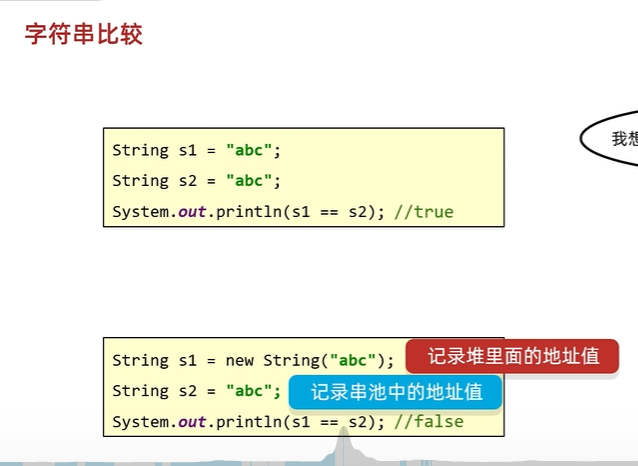
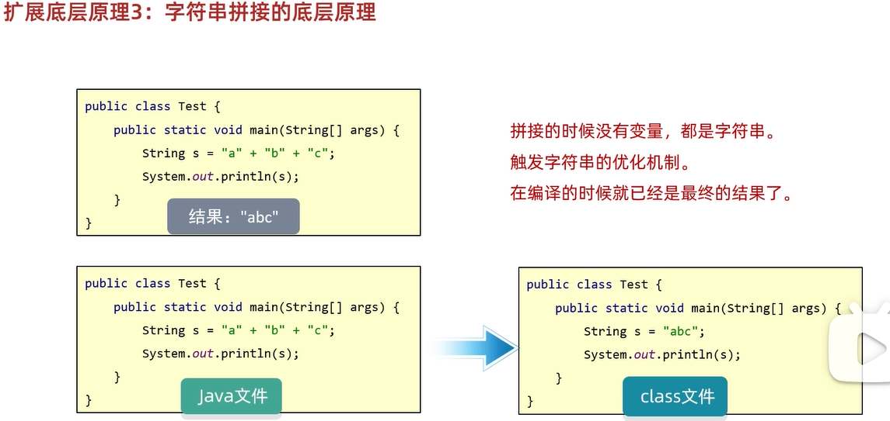

# java 基础

1. java加载与执行
2. 变量
3. 项目结构
    3.1 一些设置
    3.2 类、模块、项目操作
4. 运算符
    4.1 + - * / %
    4.2 自增自减 赋值运算符 关系运算符 逻辑运算符 三元运算符 原码，反码，补码
5. 条件 switch
6. 数组
    6.1 数组的内存图
7. 方法
    7.1 方法重载
    7.2 Java 内存分配
    7.3 java 传参 <-> 引用和c++不同，显然没有c++灵活
    7.4 二维数组
8. 面向对象
    8.1 java和c++面向对象的区别
    8.2 java中的this指针 和c++的区别
    8.3 java和c++的构造函数差异
    8.4 java和c++类中的static区别
    8.5 JavaBean
    8.6 对象的内存图
9. 字符串 api


## 1. java加载与执行

JDK -> JRE -> JVM

jdk：工具包；
    javac.exe : 编译器
    java.exe : 负责运行
JRE:运行环境
jvm：java虚拟机，用于在不同操作系统上运行；


两个阶段： 编译，运行


编译：.java -> .class （字节码文件，不是纯粹的二进制文件）
运行：java.exe 命令启动java虚拟机，JVM会启动类加载器ClassLoder
    ClassLoder会去搜索A.class文件，找到文件将该字节码文件装载到JVM中。
    JVM将A.class字节码文件解释成二进制数据；
    然后操作系统执行二进制文件；

比如： HelloWorld.java 文件

```bash
javac HelloWorld.java
java HelloWorld
```


配置Path环境变量的目的：可以在任意目录下都可以打开指定的软件。


在JAVA_HOME中配置：


然后在 path中配置：


## 2. 变量


### Scanner 输入类

步骤：
+ 导包     import java.util.Scanner
+ 创建对象  Scanner sc = new Scanner(System.in);
+ 接受数据  int i = sc.nextInt();

## 3. 项目结构

project -> module -> package -> class

1. 创建project后，然后创建 module：


2. 然后再 src 下面就可以创建package了:

包名：
+ 公司域名的反写+功能；
+ 比如： com.heima.demo1


创建好的目录结构如下


3. 然后就可以写 class 了


### 3.1 一些设置

提示不区分大小写：


字体大小：


注释颜色


### 3.2 类、模块、项目操作

1. 类操作

新建类 删除类 修改类名

文件名和类名保持一致；

2. 模块操作 

+ 新建模块 : file -> project structure -> module ->  + 
+ 删除模块
+ 修改模块
+ 导入模块


3. 项目

+ 1. 关闭项目
+ 2. 新建项目
+ 3. 打开项目
+ 4. 修改项目


## 4. 运算符

### 4.1 + - * / %


隐士转换：范围小 -> 范围大


有字符串相加就是拼接，没有字符串就是运算；


字符 + 数字，转化为 ascall


### 4.2 自增自减 赋值运算符 关系运算符 逻辑运算符 三元运算符 原码，反码，补码


## 5. 条件 switch


swich 可以使用 ->{} 来代替 break;


## 6. 数组

数组的定义：


数组的初始化：
在内存中，为数组开辟空间，并将数据存入容器中的过程；

> 静态初始化


两种方式：
```java
int[] arr1 = new int[]{11,12,12};
int[] arr2 = {1,23,4};
```

数组名就是首地址：
```java
int[] arr = {1,2,3,4,5,6,7,8,9,10};
System.out.println(arr);
[I@f6f4d33
```

这里：
+ [ : 代表数组
+ I ：代表元素int类型
+ @ ：代表间隔符号
+ f6f4d33 ： 才是数组真正的地址值

> 数组元素访问

```java
arr1[i]
```

数组的长度 ： arr1.length

> 动态初始化


动态数组和静态数组的区别：


### 6.1 数组的内存图


+ 栈：方法运行时使用的内存，比如main方法运行，进入方法栈中执行
+ 堆：存储对象或者数组，new来创建的，都存储再堆内存
+ 方法区：存储可以运行的class文件
+ 本地方法栈：JVM再使用操作系统功能的时候使用，和开发无关
+ 寄存器：给CPU使用，和开发无关

## 7. 方法

方法：是程序中最小的执行单元

```java
public static 返回值 方法名(参数) {
    return 返回值；
}
```

### 7.1 方法重载


### 7.2 Java 内存分配


java 里面的引用和 c++不同：

在 Java 中，基本数据类型（如 int、double 等）是按值传递的，但对象是按引用传递的。数组在 Java 中也是对象，按引用传递。

### 7.3 java 传参

+ 基本数据类型的参数传递
基本数据类型（如 byte、short、int、long、float、double、char、boolean）在作为参数传递时，传递的是该值的副本。也就是说，在方法内部对参数的修改不会影响到原始变量的值。

+ 对象类型的参数传递
当传递对象类型的参数时，传递的是对象引用的副本。这个副本和原始引用指向同一个对象，所以在方法内部可以通过这个副本引用修改对象的状态，但不能改变原始引用本身。


### 7.4 二维数组

二维静态数组：


二维动态数组：


二维数组内存图：


注意：Java 支持不规则二维数组，即每行的列数可以不同。
```java
int[][] irregularArray = new int[3][];
irregularArray[0] = new int[2];
irregularArray[1] = new int[3];
irregularArray[2] = new int[4];
```

## 8. 面向对象

分为两种类：Javabean类、测试类


注意：一个文件最好只写一个类名


对象成员变量的默认值规则：


### 8.1 java和c++面向对象的区别

封装
+ 访问控制：
    + Java：拥有四种访问修饰符，分别是public、protected、private和默认（无修饰符）。默认访问权限意味着只有同一个包内的类能够访问。
    + C++：有三种访问修饰符，即public、protected和private。不存在像 Java 那样基于包的默认访问权限。
+ 类和成员：
    + Java：所有代码都必须写在类中，不支持全局变量和函数。
    + C++：允许全局变量和函数的存在，并且可以直接在类外部定义和使用。


继承
+ 单继承与多继承：
    + Java：类只支持单继承，不过可以通过实现多个接口来达到类似多继承的效果。
    + C++：支持类的多继承，一个类可以从多个父类继承属性和方法。
+ 继承方式：
    + Java：只有一种继承方式，子类会继承父类的非私有成员。
    + C++：继承方式有public、protected和private三种，不同的继承方式会影响父类成员在子类中的访问权限。


多态
+ 虚函数与抽象方法：
    + Java：使用abstract关键字来定义抽象方法，包含抽象方法的类必须是抽象类。子类必须实现抽象类中的所有抽象方法。普通方法可以使用final关键字防止被重写。
    + C++：使用virtual关键字来定义虚函数，通过在基类中声明虚函数，派生类可以重写该函数。同时，C++ 有纯虚函数的概念，包含纯虚函数的类是抽象类。
+ 运行时多态：
    + Java：方法默认是虚函数，运行时多态主要通过方法重写和接口实现来实现。
    + C++：需要显式地使用virtual关键字来实现运行时多态。

### 8.2 java中的this指针 和c++的区别

相同点

+ 代表当前对象：在 C++ 和 Java 里，this都用于表示当前对象。也就是说，在对象的成员函数里，this能让你访问当前对象的成员变量与成员函数。
+ 解决命名冲突：当成员变量名和局部变量名或者函数参数名相同时，this可以用来明确指定访问的是成员变量。


不同点

语法形式
+ C++：this是一个指针，所以要使用->操作符来访问成员。
+ Java：this是一个引用，使用.操作符来访问成员。

可修改性
+ C++：this指针本身是可以被修改的，不过这种情况比较少见。例如，在某些复杂的指针操作里，可以通过一些手段改变this指针的指向。
+ Java：this引用是不能被修改的，它始终指向当前对象。

用途差异
+ C++：在拷贝构造函数、赋值运算符重载等场景中，this指针常常被用来处理自我赋值的情况。
+ Java：除了常规的访问成员，this还可以用于在构造函数里调用其他构造函数，这种用法叫做构造函数的重载调用。


总的来讲：
在 Java 里，this 是当前对象的引用。引用在 Java 里可看作是一种较为安全、经过封装的指针。Java 语言为了简化编程、增强安全性，对底层的指针操作进行了封装，开发者无法直接操作内存地址，也不能像在 C++ 里那样进行指针的算术运算等操作。

this 引用指向调用该方法的对象，它提供了一种访问当前对象成员的途径，保证了方法能够正确处理当前对象的数据。

C++ 里的 this 是一个指针，指向调用该成员函数的对象。

### 8.3 java和c++的构造函数差异

不同之处
+ 调用其他构造函数：
    + Java：可以使用 this() 语句在构造函数中调用同一个类的其他构造函数，且 this() 必须是构造函数中的第一条语句。
    创建对象，由虚拟机自动调用，进行初始化

    + C++：使用成员初始化列表来调用其他构造函数，也可以在构造函数体中调用其他构造函数，但成员初始化列表的方式更高效，因为它在对象构造时就进行初始化，而不是先默认初始化再赋值。

### 8.4 java和c++类中的static区别

**相似之处**

> 静态成员变量

+ 存储特性：
在 Java 和 C++ 里，静态成员变量都属于类，而非类的实例。这意味着无论创建多少个类的对象，静态成员变量都只有一份副本，所有对象共享该变量。

+ 访问方式：
都可以通过类名直接访问静态成员变量，不过也能通过对象访问，但不推荐这种方式，因为可能会造成混淆。

> 静态成员函数

+ 所属关系：
二者的静态成员函数都属于类，而不是类的实例。可以直接通过类名调用，无需创建对象。

+ 访问限制：
静态成员函数只能访问类的静态成员（静态变量和静态函数），不能直接访问实例成员（实例变量和实例函数），因为静态成员函数不依赖于类的实例。


**不同之处**

> 静态成员变量的初始化

+ Java 中的静态成员变量可以在声明时直接初始化，也能在静态代码块中进行初始化。静态代码块在类加载时执行，且只执行一次。

```java
class MyClass {
    // 声明时直接初始化
    public static int staticVar1 = 10;
    public static int staticVar2;

    // 静态代码块初始化
    static {
        staticVar2 = 20;
    }
}
```

+ C++ 的静态成员变量在类内声明，必须在类外进行初始化，除非它是 const 类型的静态成员变量。

> 静态代码块

Java 有静态代码块，使用 static 关键字加代码块来定义，用于在类加载时执行一些初始化操作，比如加载配置文件、初始化静态变量等。

```java
class MyClass {
    public static int staticVar;

    static {
        // 加载配置文件等操作
        staticVar = 30;
        System.out.println("Static block executed.");
    }
}
```

C++ 没有专门的静态代码块语法，但可以通过在类外定义全局变量和函数来实现类似的初始化操作。

> 静态成员函数对 this 指针的使用

Java 的静态成员函数中不能使用 this 引用，因为 this 代表当前对象，而静态成员函数不依赖于对象。


C++ 的静态成员函数中没有 this 指针，因为它不与特定的对象关联。如果尝试在静态成员函数中使用 this 指针，编译器会报错。

### 8.5 JavaBean


### 8.6 对象的内存图


## 9. 字符串 api

Scanner 键盘录入
    Scanner 类默认使用空白字符（如空格、制表符、换行符等）作为分隔符，将输入数据分割成多个标记（token）。可以使用 useDelimiter() 方法自定义分隔符。
Random 随机数

### 9.1 string stringbuilder stringjonier stringbuffer pattern matcher

注意：字符串的内容是不会发生改变的，他的对象在创建后不能被改变。

创建string的方式：


串池：
当使用双引号直接赋值时，系统会检查该字符串在串池中是否存在。
+ 不存在： 创建新的
+ 存在： 复用


每 new 一次，都是创建一块新的空间：


1. String 类

+ 不可变性：String 类的对象是不可变的，一旦创建，其内容就无法改变。每次对 String 对象进行修改操作（如拼接、替换等）时，实际上是创建了一个新的 String 对象。
+ 线程安全：由于 String 对象不可变，所以它是线程安全的。多个线程可以同时访问同一个 String 对象而不会产生数据不一致的问题。
+ 使用场景：适用于字符串内容不经常变化的场景，例如存储固定的配置信息、常量字符串等。

2. StringBuilder 类

+ 可变性：StringBuilder 类的对象是可变的，它内部维护了一个可变的字符序列。对 StringBuilder 对象进行修改操作（如追加、插入、删除等）时，不会创建新的对象，而是直接在原对象上进行修改。
+ 线程不安全：StringBuilder 不是线程安全的，在多线程环境下使用可能会导致数据不一致的问题。
+ 使用场景：适用于单线程环境下频繁进行字符串拼接、修改等操作的场景，例如在循环中动态拼接字符串。

```java
public class StringBuilderExample {
    public static void main(String[] args) {
        StringBuilder sb = new StringBuilder();
        sb.append("Hello");
        sb.append(" World");
        String result = sb.toString();
        System.out.println(result);
    }
}
```

3. StringJoiner 类

+ 特定用途：StringJoiner 主要用于将多个字符串用指定的分隔符连接起来，还可以指定前缀和后缀。它提供了更方便的方式来处理字符串连接，特别是在需要添加分隔符的场景下。
+ 线程不安全：和 StringBuilder 一样，StringJoiner 也是线程不安全的。
+ 使用场景：适用于需要将多个字符串用特定分隔符连接的场景，例如将数组元素用逗号连接成一个字符串。

```java
import java.util.StringJoiner;

public class StringJoinerExample {
    public static void main(String[] args) {
        StringJoiner sj = new StringJoiner(", ", "[", "]");
        sj.add("apple");
        sj.add("banana");
        sj.add("cherry");
        String result = sj.toString();
        System.out.println(result);
    }
}
```


### 9.2 字符串比较

== 号比较：
+ 基本类型，比较值
+ 引用类型，比较地址





字符串比较：
+ boolean equals
+ boolean equalsignoreCase


注意：键盘录入底层是 new

### 9.3 字符串遍历

+ charAt(int index) 
+ length();
+ compareTo(String anotherString) 按字典顺序比较两个字符串。
+ compareToIgnoreCase(String str)   按字典顺序比较两个字符串，不考虑大小写。
+ concat(String str) 
+ contains(CharSequence s) 


### 9.4 stringbuilder

是一个容器，创建之后里面的内容是可变的；拼接效率高；

stringbuilder 构造方法：


常用的方法：


注意：打印StringBuild不是地址，而是变量值。

### 9.5 stringjonier

stringjonier 构造函数：


stringjoiner 成员函数


### 9.6 字符串原理

+ 扩展底层原理1:字符串存储的内存原理
    + 直接赋值会复用字符串常量池中的
    + new出来不会复用，而是开辟一个新的空间

+ 扩展底层原理2: == 号比较的到底是什么?
    + 基本数据类型比较数据值
    + 引用数据类型比较地址值

+ 扩展底层原理3:字符串拼接的底层原理


如果没有变量参与，都是字符串直接相加，编译之后就是拼接之后的结果，会复用串池中的字符串。
如果有变量参与，每一行拼接的代码，都会在内存中创建新的字符串，浪费内存。

等号右边没有变量：


等号右边有变量：
jdk8以前：使用StringBuilder实现，先创建stringbuilder对象，然后使用tostring创建string对象。而tostring方法的底层是直接new一个字符串对象。


jdk8以后，先预估长度，然后进行拼接


所以拼接尽可能用 StringBuilder;

+ 扩展底层原理4:StringBuilder提高效率原理图


+ 扩展底层原理5：StringBuilder源码分析


## 10.集合 ArrayList

集合：长度可变；只能存放对象，不能存放基本类型；


基本成员方法：
+ 增：add
+ 删：remove
+ 改：set
+ 查：get


> 基本数据类型对应的包装类


> 把数组转化为list用 Arrays 这个工具包：

```java
import java.util.ArrayList;
import java.util.Arrays;
import java.util.List;

public class ArrayToListExample {
    public static void main(String[] args) {
        // 定义一个 String 数组
        String[] stringArray = {"apple", "banana", "cherry"};

        // 使用 Arrays.asList() 方法将数组转换为 List，再将其传递给 ArrayList 的构造函数
        List<String> arrayList = new ArrayList<>(Arrays.asList(stringArray));

        // 输出转换后的 ArrayList
        System.out.println(arrayList);
    }
}    
```

## 11.面向对象

快捷键：
+ alt + shift + 上下键 移动代码
+ alt + insert 快速插入代码
+ ctrl + n 搜索类
+ ctrl + f12 查看类的列表
    + m 方法
    + f 属性
    + c 内部类


> 工具类


static注意事项：


### 11.1 继承

格式：
public class 子类 extends 父类 {}


继承内容：


#### 11.2 继承的特点

只支持单继承，不支持多继承，但支持多层继承；

注意：每一个类都直接或间接的继承与Object

#### 11.3 继承的内容

构造方法：不能继承
成员变量：父类非私有和私有都能继承，但是私有的不能直接用
成员函数：非死有能，私有不能（和c++很像）

能添加到虚函数表中的函数才能继承：非private,非final，非static


继承中：成员变量的访问特点 就近原则；

##### 11.3.1 java中的super

super 是一个关键字，主要用于在子类里访问父类的成员，包含成员变量、方法和构造方法。

1. 访问父类的成员变量

当子类中定义的成员变量和父类的成员变量同名时，可使用 super 关键字来访问父类的成员变量。

```java
class Parent {
    int num = 10;
}

class Child extends Parent {
    int num = 20;

    public void printNumbers() {
        System.out.println("父类的 num: " + super.num);
        System.out.println("子类的 num: " + this.num);
    }
}

public class Main {
    public static void main(String[] args) {
        Child child = new Child();
        child.printNumbers();
    }
}
```

2. 调用父类的方法
当子类重写了父类的方法时，能够使用 super 关键字调用父类的原方法。

```java
class Animal {
    public void makeSound() {
        System.out.println("动物发出声音");
    }
}

class Dog extends Animal {
    @Override
    public void makeSound() {
        super.makeSound(); 
        System.out.println("汪汪汪");
    }
}

public class Main {
    public static void main(String[] args) {
        Dog dog = new Dog();
        dog.makeSound();
    }
}
```

3. 调用父类的构造方法
在子类的构造方法中，可以使用 super() 调用父类的构造方法。**super() 必须是子类构造方法中的第一条语句。**

```java
class Person {
    String name;

    public Person(String name) {
        this.name = name;
    }
}

class Student extends Person {
    int studentId;

    public Student(String name, int studentId) {
        super(name); 
        this.studentId = studentId;
    }

    public void displayInfo() {
        System.out.println("姓名: " + name + ", 学号: " + studentId);
    }
}

public class Main {
    public static void main(String[] args) {
        Student student = new Student("张三", 123);
        student.displayInfo();
    }
}
```

> 接口中super的含义

当一个类实现多个接口，且这些接口有同名的默认方法时，使用 接口名.super.方法名() 来明确指定调用哪个接口的默认方法。接口名.super 表明从指定的接口处开始查找并调用该方法，而不是产生歧义。

```java
interface LandVehicle {
    default void move() {
        System.out.println("陆地车辆移动");
    }
}

interface WaterVehicle {
    default void move() {
        System.out.println("水上车辆移动");
    }
}

class AmphibiousVehicle implements LandVehicle, WaterVehicle {
    @Override
    public void move() {
        LandVehicle.super.move(); // 调用 LandVehicle 接口的默认方法
    }
}
```

LandVehicle.super.move() 表示调用 LandVehicle 接口里定义的 move 默认方法。之所以要加上 super，是因为这是 Java 规定的语法，用于消除多个接口同名默认方法带来的调用歧义，确保能准确调用到期望的接口方法。

在接口默认方法调用的场景下，接口名.super 只是一个语法标记，用于告诉编译器你想要调用的是指定接口中的默认方法。

它本质上是一种静态绑定机制，在编译时就确定了要调用的方法实现。super 并没有实际存储任何对象信息，它只是一种明确调用路径的方式，确保编译器能找到正确的接口方法实现。

例如在 LandVehicle.super.move() 中，LandVehicle.super 就是指示编译器去调用 LandVehicle 接口里定义的 move 方法的默认实现。所以，super 在这里是一种语法层面的约定，用于消除多接口同名默认方法调用的歧义。

##### 11.3.2 成员方法的访问特点

也是就近原则；

方法重写，格式：加上 @Override放在重写的方法上，校验子类重写语法是否正确；

```java
class Dog extends Animal {
    @Override
    public void makeSound() {
        super.makeSound(); 
        System.out.println("汪汪汪");
    }
}
```


##### 11.3.3 构造方法


this() 用于在一个构造方法中调用同一个类的其他构造方法，以此来避免代码重复。

使用规则
+ 位置：this() 必须作为构造方法的第一条语句，这是因为在初始化对象时，要保证先完成其他构造方法所执行的初始化操作。
+ 避免递归调用：不能出现构造方法之间的循环调用，不然会导致栈溢出错误。

```java
class Person {
    private String name;
    private int age;
    private String address;

    // 第一个构造方法，只接收姓名参数
    public Person(String name) {
        this.name = name;
    }

    // 第二个构造方法，接收姓名和年龄参数
    public Person(String name, int age) {
        this(name); // 调用第一个构造方法来初始化姓名
        this.age = age;
    }

    // 第三个构造方法，接收姓名、年龄和地址参数
    public Person(String name, int age, String address) {
        this(name, age); // 调用第二个构造方法来初始化姓名和年龄
        this.address = address;
    }

    // 显示信息的方法
    public void displayInfo() {
        System.out.println("姓名: " + name);
        System.out.println("年龄: " + age);
        System.out.println("地址: " + address);
    }
}

public class Main {
    public static void main(String[] args) {
        // 使用第三个构造方法创建对象
        Person person = new Person("张三", 25, "北京市");
        person.displayInfo();
    }
}
```

### 11.2 多态

用于接受不同的子类，通过一个对象调用不同的子类；


多态语法： Fu f = new Zi();

调用成员变量：编译看左，运行看左
编译看左：javac编译代码的时候，会看左边父类中有没有这个变量，如果有则编译成功。否则失败；
运行看左：java运行代码的时候，实际获取的就是左边父类中成员变量的值；

调用成员方法：编译看左 运行看右
编译看左：javac编译代码的时候，会看左边的父类中有没有这个方法，如果有，则编译成功，如果没有则编译失败；
运行看右：java运行代码的时候，实际上运行的是子类的方法

> 多态的优势


父类不能调用子类中独有的方法；

判断一个对象是不是某一个class ：
+ `a instanceof Cat` 返回true || false
+ `a instanceof Cat d` 如果a的类型是Cat，则转化为d，返回true

Student s = (Student)p; 强转；


#### 11.2.3 java中多态的实现

1. Java 的对象在 JVM 中长什么样？

JVM 中的每个对象在内存中都有一段结构，简化一下：

```java
对象在内存中：
+----------------------+  
| 对象头（包含类指针） | ← 指向 Class 对象（类元数据）
+----------------------+
| 实例变量             |
+----------------------+
```

这个“类指针”就像 C++ 对象中的 vptr，用于查找类信息、方法表等。

2. Class 对象中的结构（HotSpot 为例）

每个 Java 类在加载时，都会被 JVM 转换为一个 Class 对象，里面包含：

```java
Class 对象中：
+------------------------+
| 方法表（method table）|
| 字段信息               |
| 常量池                 |
| 类加载器              |
+------------------------+
```

方法表 ≈ vtable：
它记录了每个虚方法（包括从父类继承并可能被重写的方法）在内存中的入口地址。

3. 方法调用背后的字节码指令

当你写下：

```java
Animal a = new Dog();
a.speak();
```

这段代码被编译为字节码时，调用方法的部分会是：

```java
invokevirtual #xx // xx是常量池中指向Animal.speak()的方法符号引用
```

invokevirtual 做了什么？
JVM 做以下几步：

+ 找到 a 引用的实际对象（即 Dog 实例）+
+ 找到这个对象的类（通过对象头中的“类指针”）+
+ 进入该类的方法表（vtable）+
+ 定位到 speak() 的真正实现（Dog.speak）+
+ 跳转执行该方法+
+ 看看实际的字节码吧！

4. 看看实际的字节码吧！

我们用 javap -c 查看编译后的 .class 文件：

```java
public class Main {
    public static void main(String[] args) {
        Animal a = new Dog();
        a.speak();
    }
}
```

运行：
```java
javac Main.java
javap -c Main
```

输出会类似：
```java
  public static void main(java.lang.String[]);
    Code:
       0: new           #2       // class Dog
       3: dup
       4: invokespecial #4       // Method Dog.<init>:()V
       7: astore_1
       8: aload_1
       9: invokevirtual #5       // Method Animal.speak:()V
      12: return

```

关键在第 9 行：invokevirtual 指令——它实现了 运行时动态绑定，这就是 Java 多态的核心。

指令	          用途
invokevirtual	调用虚方法（多态支持）
invokespecial	调用构造函数、私有方法、父类方法（非虚）
invokestatic	调用静态方法（编译期确定）
invokeinterface	调用接口方法（更复杂，查找路径多一步）

5. 再看看接口调用是怎么实现的？
```java
interface Flyable {
    void fly();
}

class Bird implements Flyable {
    public void fly() {
        System.out.println("Bird flying");
    }
}
```

接口方法调用会使用字节码指令 invokeinterface，它比 invokevirtual 多一步——在运行时先找出对象的实际类型，然后在接口方法表中解析出实现类方法的地址。


### 11.3 final && 包

#### 11.3.1 包：


使用其他包需要导包：


导包规则：


小结：


#### 11.3.2 final

final：
+ 方法：表明改方法是最终方法，不能被重写
+ 类：表明该类是最终类，不能被继承
+ 变量：叫做常量，只能被赋值一次
    基本数据类型：变量的不能修改
    引用数据类型：地址值不能修改，内部的属性值可以修改


#### 11.3.3 权限修饰符

private < 空着 < protected < public


构造代码块：
+ 写在成员位置的代码块
+ 作用：可以把多个构造方法中重复的代码抽取出来
+ 执行时机：在创建本类对象的时候会先执行构造代码块再执行构造方法

构造代码块是用花括号 {} 括起来的代码段，它位于类中但不在任何方法或构造方法内部。例如
```java
class MyClass {
    // 构造代码块
    {
        System.out.println("构造代码块被执行");
    }
    // 类的其他成员
}
```

特点
1. 执行时机：每次创建对象时，构造代码块都会先于构造方法执行。如果一个类有多个构造方法，无论使用哪个构造方法创建对象，构造代码块都会执行。
2. 多次执行：每创建一个新对象，构造代码块就会执行一次。
3. 作用范围：构造代码块主要用于初始化对象的通用属性，这些初始化操作可能会被多个构造方法复用。


构造代码块被下面替代：


> 静态代码块：

静态代码块是用 static 关键字修饰，由花括号 {} 括起来的代码段，它位于类中但不在任何方法或构造方法内部。其基本形式如下：
```java
class MyClass {
    static {
        // 静态代码块中的代码
    }
}
```

特点
1. 执行时机：静态代码块在类被加载时执行，而且只会执行一次。类加载一般发生在创建类的对象、调用类的静态方法、访问类的静态成员变量等情况时。
2. 静态属性：静态代码块只能访问类的静态成员（静态变量和静态方法），不能访问实例成员，因为实例成员需要在对象创建后才存在，而静态代码块在类加载时就执行了。
3. 优先执行：静态代码块的执行优先级高于构造代码块和构造方法。

使用场景
+ 类的初始化：当类需要进行一些一次性的初始化操作，如加载配置文件、初始化静态变量等，可以使用静态代码块。
+ 静态资源的初始化：例如加载数据库驱动、初始化一些全局的静态常量等。


### 11.6 内部类

Java 的 内部类（Inner Class） 是一个定义在另一个类内部的类，它是 Java 提供的一种 逻辑上绑定在一起的类结构。可以更好地组织代码、封装细节，同时方便访问外部类的成员。

✅ 简单定义
内部类就是在一个类的内部再定义一个类：
```java
class Outer {
    class Inner {
        void sayHello() {
            System.out.println("Hello from Inner class!");
        }
    }
}
```

🔍 为什么用内部类？

主要有几个优点：

优点	| 说明
更好的封装 |内部类可以隐藏在外部类中，只服务于它
结构清晰|	逻辑上相关的类组织在一起
访问方便|	内部类可以直接访问外部类的所有成员（包括 private）

🔧 分类：Java 中的 4 种内部类

类型	简介
1. 成员内部类	定义在类中、方法外
2. 静态内部类	加 static，不依赖外部类实例
3. 局部内部类	定义在方法内部
4. 匿名内部类	没有名字，通常用来快速实现接口或抽象类

🧪 示例 1：成员内部类

内部类可以直接访问外部类的成员，包括私有；
外部类要访问内部类的成员，必须创建对象；


```java
class Outer {
    private String msg = "Outer message";
    private int a = 1;
    class Inner {
        private int a = 2;
        void show() {
            int a =3;
            System.out.println("访问外部类成员：" + msg);
            System.out.println(a);
            System.out.println(this.a);
            System.out.println(Outer.this.a);
        }
    }

    public Inner getInstance(){
        return new Inner();
    }

}

public class Main {
    public static void main(String[] args) {
        Outer outer = new Outer();
        Outer.Inner inner = outer.new Inner(); // 通过外部类创建内部类
        inner.show();
    }
}
```


⚡ 示例 2：静态内部类

✅ 静态内部类的特点：
1. 独立于外部类实例： 静态内部类可以在没有外部类实例的情况下创建，因为它是静态的，不需要外部类的对象来实例化。

2. 只能访问外部类的静态成员： 静态内部类不能访问外部类的实例成员（非静态成员），只能访问外部类的静态成员。

3. 对象创建： 创建静态内部类的对象时，不需要外部类的实例。可以直接使用 OuterClass.StaticInnerClass 的方式创建。

调用非静态方法的格式：先创建对象，用对象调用；
调用静态方法的格式：外部类名.内部类名.方法名()；


```java
class Outer {
    private static String msg = "外部类的静态成员";

    // 静态内部类
    static class StaticInner {
        void show() {
            // 只能访问外部类的静态成员
            System.out.println("访问外部类静态成员: " + msg);
        }
    }
}

public class Main {
    public static void main(String[] args) {
        // 创建静态内部类的对象，不需要外部类的实例
        Outer.StaticInner inner = new Outer.StaticInner();
        inner.show();
    }
}

```


⚡ 示例 2：局部内部类

✅ 主要特点：
1. 作用范围有限： 局部内部类的作用范围仅限于它所在的方法或构造器，外部无法直接访问它。

2. 无法拥有静态成员： 因为局部内部类是定义在方法内部的，它不能有静态成员（包括静态方法、静态字段等）。

3. 可以访问外部方法的局部变量（final 或 effectively final）： 局部内部类可以访问它所在方法的局部变量，但这些变量必须是 final 或 "effectively final"（即在方法内未被修改）。

```java
class Outer {
    void outerMethod() {
        // 定义局部内部类
        class Inner {
            void show() {
                System.out.println("这是局部内部类!");
            }
        }
        
        // 创建并使用局部内部类
        Inner inner = new Inner();
        inner.show();
    }
}

public class Main {
    public static void main(String[] args) {
        Outer outer = new Outer();
        outer.outerMethod();  // 调用外部类方法，进而创建并调用局部内部类
    }
}
```


💥 示例 3：匿名内部类（最常见于回调、监听器）

匿名内部类（Anonymous Inner Class）是没有名字的内部类，通常用于实现接口或继承某个类，尤其在需要快速创建一个类的实例并且不需要多次使用时。它允许你在创建对象的同时定义该类的实现，而不必事先创建一个类。

匿名内部类最常见的用途是用来实现接口或继承类的一个简单实例。它在代码中非常简洁，适用于那些只需要使用一次的类。

本质上就是隐藏了名字的内部类；


格式：
```java
new 类名或接口名() {
    重写方法
};
```

```java
public interface Swim{
    public abstract void swim();
};

// 正常
public class Student implements Swim{
    @override
    public void swim(){
        System.out.println("a");
    }
}

// 匿名抽象类,这里的 Swim 就是接口的名字，也就是说"{}"是这个接口的实现；
// 实现关系：{}里面的内容
// 方法重写：override
// 创建对象:new
// 参数：（） 无

new Swim(){
    @override
    public void swim(){
        System.out.println("a");
    }
}
```


✅ 匿名内部类的特点：
1. 没有类名： 匿名内部类的名字是省略的，它是一个匿名的类。

2. 快速实现接口或继承类： 匿名内部类常常用来实现接口或者继承类，只需要在创建对象的同时定义类的行为。

3. 一次性使用： 匿名内部类通常用于临时创建一个类，使用后即不再需要，因此没有类名。

4. 必须在方法内创建： 匿名内部类必须在创建对象的地方立即定义。


✅ 示例：使用匿名内部类实现接口
假设我们有一个接口 Animal，并且我们想实现它：

```java
interface Animal {
    void sound();
}

public class Main {
    public static void main(String[] args) {
        // 使用匿名内部类来实现接口
        Animal dog = new Animal() {
            public void sound() {
                System.out.println("汪汪");
            }
        };
        dog.sound();  // 调用匿名内部类的方法
    }
}
```

✅ 示例：使用匿名内部类继承类
除了实现接口，匿名内部类也可以继承一个类，并覆盖其中的方法。
```java
class Animal {
    void sound() {
        System.out.println("动物发出声音");
    }
}

public class Main {
    public static void main(String[] args) {
        // 使用匿名内部类继承类
        Animal dog = new Animal() {
            @Override
            void sound() {
                System.out.println("汪汪");
            }
        };
        dog.sound();  // 调用匿名内部类的方法
    }
}
```

✅ 何时使用匿名内部类？
1. 快速实现接口或类： 如果你只需要实现接口或继承一个类一次，那么匿名内部类非常方便。

2. 简洁代码： 它允许你在一行代码中定义类的行为，而不需要多余的类定义。

3. GUI 编程： 在 GUI 程序中，常常用匿名内部类来处理事件监听（例如按钮点击、窗口变化等）。


## 12.常用的api

### 12.1 Math

常用的：
+ abs()
+ ceil(double a) 该值大于等于参数，并等于某个整数
+ floor(double a) 该值小于等于参数，并等于某个整数。
+ round(double a) 四舍五入
+ max(int a, int b) 
+ min(int a, int b)
+ pow(double a, double b) a^b
+ random() [0.0, 1.0)

### 12.2 System

提供一些与系统相关的方法

+ exit(int status) 终止当前正在运行的 Java 虚拟机。
+ arraycopy(Object src, int srcPos, Object dest, int destPos, int length) 从指定源数组中复制一个数组，复制从指定的位置开始，到目标数组的指定位置结束。

注意：
+ 如果数据源数组和目的地数组都是基本数据类型，那么两者的类型必须保持一致，否则会报错
+ 在拷贝的时候需要考虑数组的长度，如果超出范围也会报错
+ 如果数据源数组和目的地数组都是引用数据类型，那么子类类型可以赋值给父类类型；

### 12.3 Runtime

+ getRuntime() 返回与当前 Java 应用程序相关的运行时对象。
+ exit()
+ availableProcessors() 向 Java 虚拟机返回可用处理器的数目。
+ maxMemory() 返回 Java能从系统中获取总内存大小。
+ totalMemory() 返回 Java 已经从系统中获取总内存大小。 
+ freeMemory() 返回 Java 虚拟机中的空闲内存量。
+ exec(String command) 在单独的进程中执行指定的字符串命令。

### 12.4 object

+ String toString() 
    object里面返回 类@地址值;
    重写返回元素值；
+ boolean equals(Object obj) 
    object里面是比较地址值；
    重写，比较元素值；
+ protected  Object clone() 


