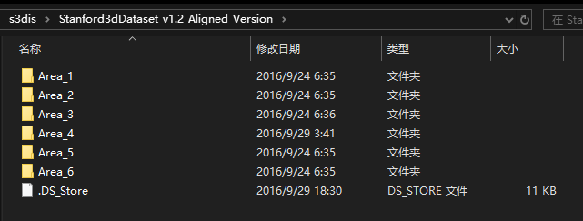
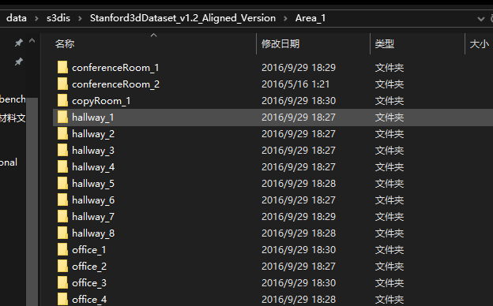
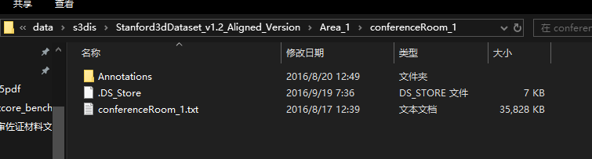
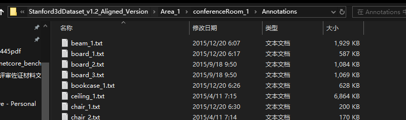
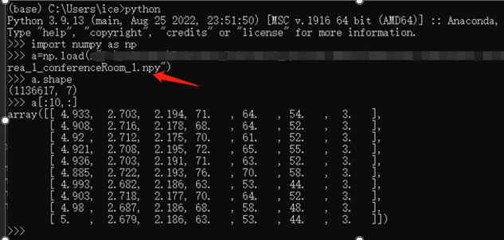
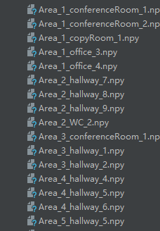

# 1. 数据保存

每个Area代表一个场景:


一个场景下面有很多区域，每一个文件代表一个区域；其实就是把一个大的场景分为相应的区域分开。


一个区域下面包含一个Annotations文件夹，一个conferenceRoom_1.txt文件
+ Annotations里保存的是会议室1中所有物品的xyzrgb坐标，均为n行6列的数据，而文件名则表示该物品的标签。比如chair_1.txt中共6729行6列，表示该物品由6729个点组成，且包含xyzrgb六个参数，标签为chair
+ 另外一个ConferenceRoom_1.txt保存的是这个会议室中所有的点。




# 2. 数据转换
因为S3DIS数据集只是存储一些点，并没有标签（标签是存储在文件名上的），而collect_indoor3d_data脚本所做的事情就是将每一个Area下的每一个场景的点和标签进行合并，并且保存为 .npy 格式，加速读取的速度。转换后的结果从6列变为7列，第七列表示类别。



最后数据都变成 n*7 的数据了，并且全为npy


# 3. 构建数据

训练的时候使用的S3DISDataset来构建数据集（如下所示），测试的时候使ScannetDatasetWholeScene来构造数据集，两者是有区别的，

```cpp

train_dataset =  S3DISDataset(split='train', data_root=args.seg_path, num_point=args.seg_point, test_area=args.test_area, block_size=1.0, sample_rate=1.0, transform=None)

test_dataset =   S3DISDataset(split='test',  data_root=args.seg_path, num_point=args.seg_point,test_area=args.test_area, block_size=1.0, sample_rate=1.0, transform=None)

trainDataLoader = torch.utils.data.DataLoader(train_dataset, batch_size=args.seg_batch_size, shuffle=True, num_workers=0, drop_last=True, pin_memory=True, worker_init_fn=worker_init_fn)

testDataLoader = torch.utils.data.DataLoader(test_dataset, batch_size=args.seg_batch_size, shuffle=False, num_workers=0, drop_last=True)
```

S3DISDataset 是一个自定义的数据集类，它应该实现了PyTorch的 torch.utils.data.Dataset 接口。为了使 torch.utils.data.DataLoader 能够正常工作，S3DISDataset 需要满足以下条件：
1.	实现 __len__ 方法：
	这个方法需要返回数据集中样本的总数。DataLoader 会使用这个信息来知道何时完成一个epoch。
2.	实现 __getitem__ 方法
	这个方法需要接受一个索引参数，并返回该索引对应的样本数据。对于点云数据集来说，这可能包括点的位置、颜色、标签等信息。
3.	初始化函数__init_()


**torch.utils.data.DataLoader**是 PyTorch 提供的一个用于加载数据的工具类，它可以帮助我们从数据集中高效地读取和预处理数据。
```cpp
# 假设 dataset 是已经定义好的 Dataset 对象
train_loader = DataLoader(
    dataset,              # 数据集
    batch_size=32,        # 每个批次的大小
    shuffle=True,         # 是否在每个 epoch 开始时打乱数据
    num_workers=4,        # 加载数据的工作进程数量
    drop_last=True,       # 如果最后一个批次小于 batch_size 是否丢弃
    pin_memory=True       # 是否使用固定内存
)
```

## 1. __init__()函数
```cpp
def __init__(self, split='train', data_root='trainval_fullarea', num_point=4096, test_area=5, block_size=1.0, sample_rate=1.0, transform=None):
```
split: 表示构建数据集的类型，有train和test两种，分别表示训练集和测试集；
如果是测试集，那么会使用test_area参数，比如test_area=5这个参数将指定Area5作为测试集,可以当成是5:1划分数据集了

data_root: 表示数据的路径，调用的就是第二节中转换而来得到的全是.npy文件的路径，即s3dis\Stanford3dDataset_v1.2_Aligned_Version。

num_point: 表示经过预处理后输入网络的点的数量，比如默认设置为4096，则表示输入网络的点数为4096。

block_size为随机选择区域的宽高。

sample_rate: 是用来控制用作训练数据的数量的。

