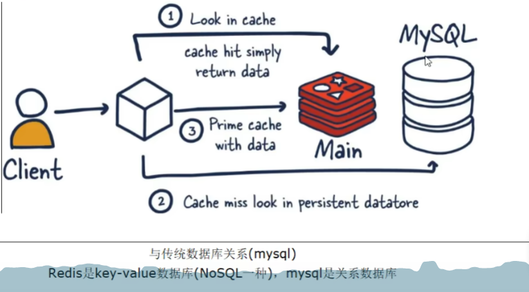
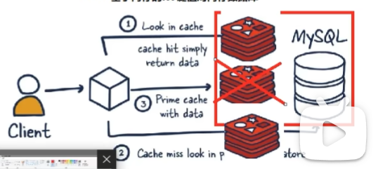

# redis

## redis 简单了解
### 1. redis与mysql的关系

相互配合：
+ 1. 先从内存 redis中查找，如果找到直接返回
+ 2. 没找到，去mysql中找，找到后写回redis 

redis与mysql的对比：
+ redis的kv数据库，mysql是关系型数据库
+ redis在内存，mysql在磁盘
+ 两者相互配合使用。redis在某些场景优于mysql，比如计数器、排行榜等方面

### 2. 内存存储和持久化

### 3. 高可用架构

如果一个redis崩溃，使用另一个redis；

## redis 10大数据类型

### string

