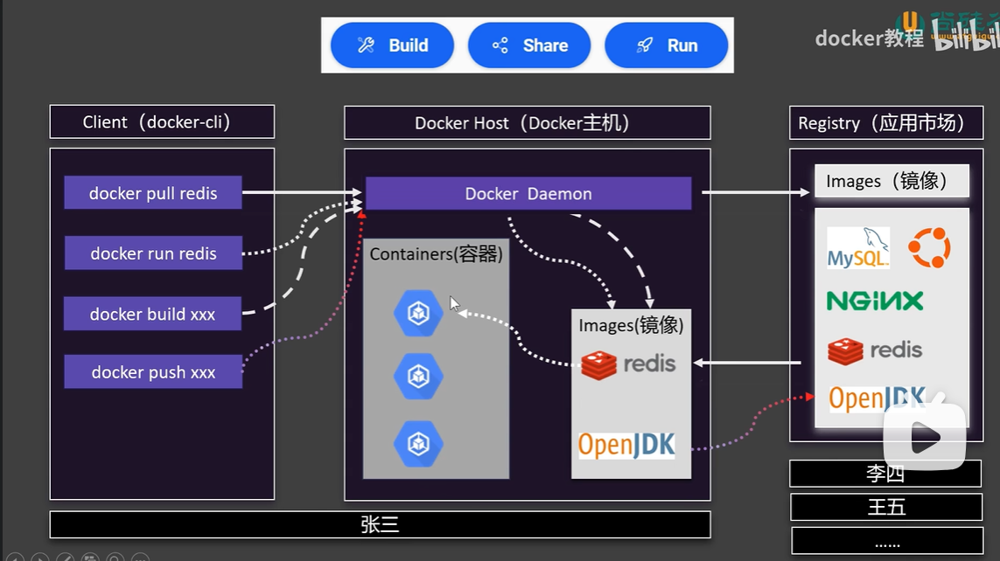
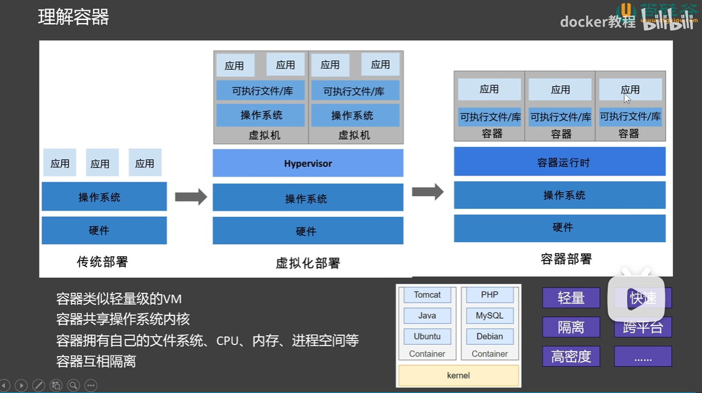
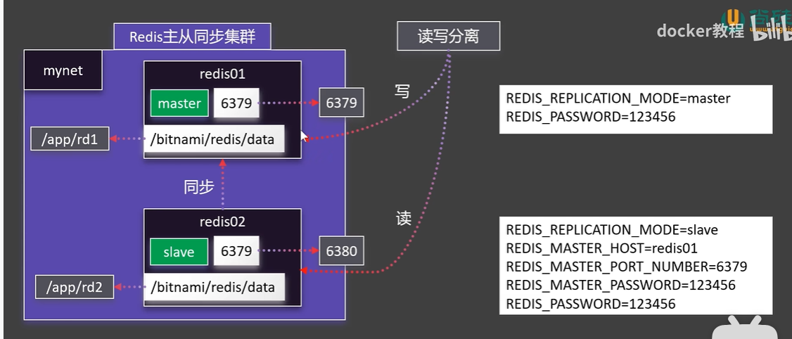
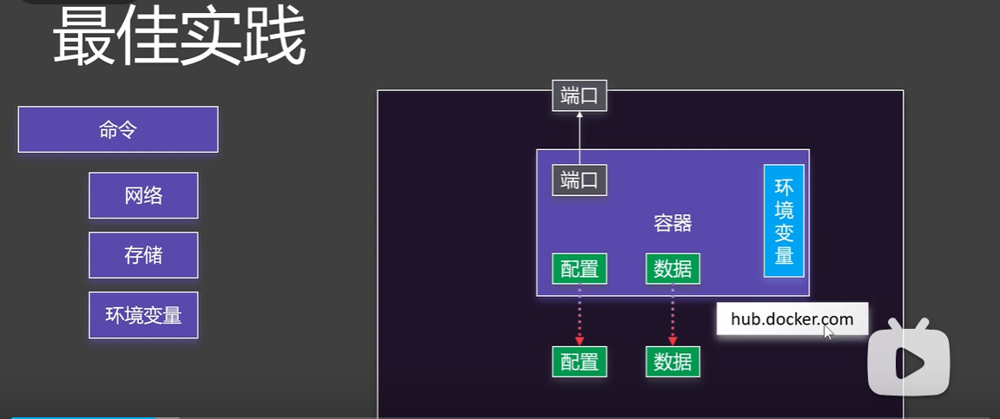
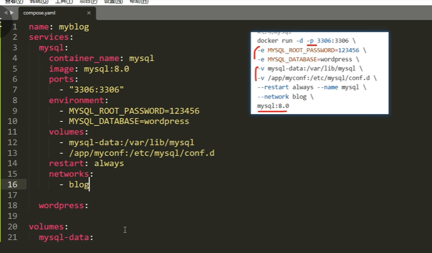
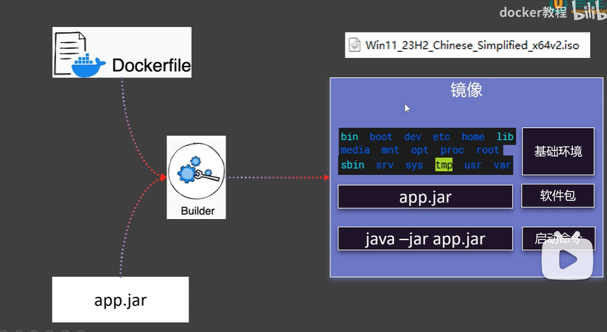
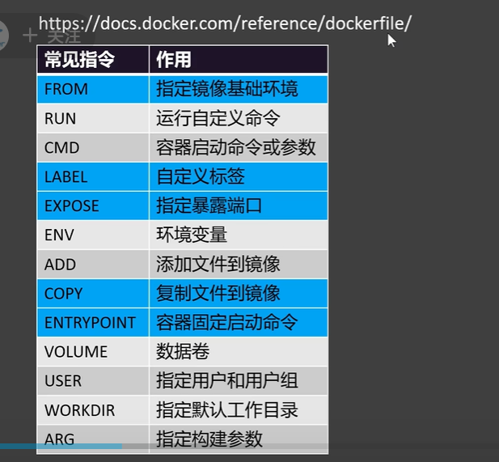
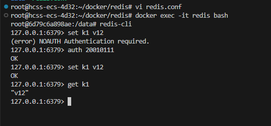
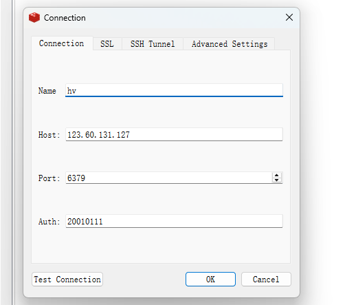
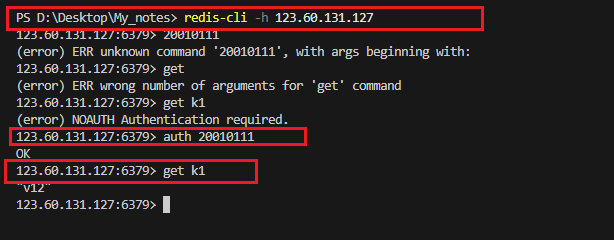

# docker


## docker 的使用

总体框架：



什么是容器：




## 0. 安装

https://blog.csdn.net/u011278722/article/details/137673353

准备条件
```bash
#安装前先卸载操作系统默认安装的docker，
sudo apt-get remove docker docker-engine docker.io containerd runc

#安装必要支持
sudo apt install apt-transport-https ca-certificates curl software-properties-common gnupg lsb-release
```

准备安装
```bash
#添加 Docker 官方 GPG key （可能国内现在访问会存在问题）
curl -fsSL https://download.docker.com/linux/ubuntu/gpg | sudo gpg --dearmor -o /usr/share/keyrings/docker-archive-keyring.gpg

# 阿里源（推荐使用阿里的gpg KEY）
curl -fsSL https://mirrors.aliyun.com/docker-ce/linux/ubuntu/gpg | sudo gpg --dearmor -o /usr/share/keyrings/docker-archive-keyring.gpg


#添加 apt 源:
#Docker官方源
echo "deb [arch=$(dpkg --print-architecture) signed-by=/usr/share/keyrings/docker-archive-keyring.gpg] https://download.docker.com/linux/ubuntu $(lsb_release -cs) stable" | sudo tee /etc/apt/sources.list.d/docker.list > /dev/null


#阿里apt源
echo "deb [arch=$(dpkg --print-architecture) signed-by=/usr/share/keyrings/docker-archive-keyring.gpg] https://mirrors.aliyun.com/docker-ce/linux/ubuntu $(lsb_release -cs) stable" | sudo tee /etc/apt/sources.list.d/docker.list > /dev/null


#更新源
sudo apt update
sudo apt-get update
```

安装Docker
```bash
#安装最新版本的Docker
sudo apt install docker-ce docker-ce-cli containerd.io
#等待安装完成

#查看Docker版本
sudo docker version

#查看Docker运行状态
sudo systemctl status docker
```

安装Docker 命令补全工具
```bash
sudo apt-get install bash-completion

sudo curl -L https://raw.githubusercontent.com/docker/docker-ce/master/components/cli/contrib/completion/bash/docker -o /etc/bash_completion.d/docker.sh

source /etc/bash_completion.d/docker.sh
```

允许非Root用户执行docker 命令
当我们安装好了Docker之后，有两种方式来执行docker 命令

+ 在docker命令前加上sudo, 比如：sudo docker ps
+ sudo -i 切换至root用户，再执行docker 命令

是不是可以让当前用户在不切root，或者不加sudo 的情况下正常使用 docker 命令呢？答案是有的。

添加docker用户组
```bash
sudo groupadd docker
```

将当前用户添加到用户组
```bash
sudo usermod -aG docker $USER
```

使权限生效
```bash
newgrp docker 
```

测试一下
```bash
#查看所有容器
docker ps -a
```

最后一步 更新.bashrc文件
我们需要编辑 ~/.bashrc文件，并在文件末尾增加如下一行,如果不在.bashrc文件中增加下面这一行命令
```bash
#如果没有此行命令，你会发现，当你每次打开新的终端
#你都必须先执行一次 “newgrp docker” 命令
#否则当前用户还是不可以执行docker命令
groupadd -f docker
```


## 1. 怎么添加国内镜像源

查看安装的Docker版本 

```bash
sudo docker version
```

1. 添加国内镜像源： 

首先运行 sudo vim /etc/docker/daemon.json 来创建daemon.json文件，然后将以下内容复制到daemon.json文件中。

```bash
{
    "registry-mirrors": [
        "https://registry.docker-cn.com",
        "http://hub-mirror.c.163.com",
        "https://docker.mirrors.ustc.edu.cn",
        "https://kfwkfulq.mirror.aliyuncs.com"
    ]
}
```

2. 重启Docker

sudo systemctl daemon-reload
sudo service docker restart

3. 查看添加的国内源是否生效

sudo docker info | grep Mirrors -A 4

```bash
root@hcss-ecs-796d:~# sudo docker info | grep Mirrors -A 4
 Registry Mirrors:
  https://registry.docker-cn.com/
  http://hub-mirror.c.163.com/
  https://docker.mirrors.ustc.edu.cn/
  https://kfwkfulq.mirror.aliyuncs.com/
```

4. 设置开机启动docker

systemctl enable docker


https://blog.csdn.net/2301_79849395/article/details/142829852

5. 不能search

```bash
root@hcss-ecs-4d32:~# docker search mysql
Error response from daemon: Get "https://index.docker.io/v1/search?q=mysql&n=25": dial tcp 173.255.213.90:443: i/o timeout
```

> 不能重启网络：

```bash
root@hcss-ecs-4d32:~# sudo systemctl restart networking
Failed to restart networking.service: Unit networking.service not found.
```

在某些现代的 Linux 发行版（尤其是基于 systemd 的系统）中，网络管理通常由 NetworkManager 或 systemd-networkd 等服务来处理，而不是传统的 networking.service。这就是为什么你遇到了 Failed to restart networking.service: Unit networking.service not found 的错误。

解决方法
1. 检查使用的网络管理工具：

首先，确认你的系统使用的是哪种网络管理工具。你可以检查是否有 NetworkManager 或 systemd-networkd 在运行

+ 检查 NetworkManager：

```bash
sudo systemctl status NetworkManager
```

+ 检查 systemd-networkd

```bash
sudo systemctl status systemd-networkd
```

如果使用 NetworkManager：

如果你的系统使用的是 NetworkManager，你可以通过以下命令来重启网络服务

```bash
sudo systemctl restart NetworkManager
```

如果使用 systemd-networkd

如果你系统上使用的是 systemd-networkd，则可以重启 systemd-networkd 服务：

```bash
sudo systemctl restart systemd-networkd
```

发现还是解决不了：最终解决方法

在Search是使用命令：docker search docker-0.unsee.tech/mysql:5.7

而不是直接docker search [imageName]
问题原因
我们在daemon.json文件中配置的镜像地址，只会在docker Pull时被使用，而docker search时使用的仍然是Docker默认搜索地址，在国内就会造成超时。

## 2. 使用

下载镜像：

检索： docker search

下载： docker pull

列表： docker images

删除： docker rmi 

    docker rmi image_id 或者 docker rmi name:tag

在搜索镜像时加上国内源的域名，这样就不用梯子也可以:

docker search docker-0.unsee.tech/mysql:5.7


启动容器：
```txt
运行：docker run
    -d: 后台启动
    --name: 容器名字
    -p 88:80: 端口映射,外部88->内部80
    --network: 加入自定义网络
    -v 目录挂载
```
查看：docker ps -a

停止：docker stop

启动：docker start

重启：docker restart

状态：docker stats

日志：docker logs

进入：docker exec
+ -it ：交互模式 
+ /bin/bash : bash界面

删除：docker rm


保存镜像：

提交：docker commit

保存：docker save

加载：docker load

**注意：只有服务器安全组设置可以访问端口，才可以访问；**

## 3. dockers存储

目录挂载,外部的目录挂到内部的目录上：

-v /app/nghtml:/usr/share/nginx/html (外部:内部)

这样启动的时候，外面的目录就是容器内部的目录；如果外面是空的，那么就认为是空的。

> 卷映射相对于目录挂载来讲，会先把内部文件作为默认值；

卷映射： -v ngconf:/etc/nginx
卷也就是不以 "/" 开始;
这个卷的存放位置就是：/var/lib/docker/volumes/<volume-name>
卷映射可以看成，外部刚开始就是内部的一个映射。也就是说刚开始就是复制过来的。

列出所有的卷：`docker volume ls`

列出卷的详情：`docker volume inspect name`

删除卷：`docker volume rm `


## 4. docker 网络

docker0 默认不支持主机域名；
创建自定义网络，容器名就是稳定域名；

创建自定义网络： docker network create mynet
查看： docker network ls
查看网络：docker inspect name

这样后续就可以 通过域名访问了；

## 5. 启动一个redix主从同步集群



为了方便配置redis集群，可以直接使用：bitnami/redis 镜像；
在这里只需要配置镜像环境变量即可

```bash
root@hcss-ecs-796d:~/app# docker run -d -p 6379:6379 \
> -v /app/rd1:/bitnami/redis/data \
> -e REDIS_REPLICATION_MODE=master \
> -e REDIS_PASSWORD=123456 \
> --network mynet --name redis01 \
> bitnami/redis
```

\ :表示换行；
-e : 添加环境变量；

注意要更改权限： chmod -R 777 rd2;


从机配置：
```bash
root@hcss-ecs-796d:/app# docker run -d -p 6380:6379 \
> -v /app/rd2:/bitnami/redis/data \
> -e REDIS_REPLICATION_MODE=slave \
> -e REDIS_MASTER_HOST=redis01 \
> -e REDIS_MASTER_PORT_NUMBER=6379 \
> -e REDIS_MASTER_PASSWORD=123456 \
> -e REDIS_PASSWORD=123456 \
> --network mynet --name redis02 \
> bitnami/redis
```

## 6. 配置一个容器 

配置一个容器要考虑的地方：


比如这里配置一个mysql: 端口 -> 配置 -> 数据 -> 环境变量

```bash
root@hcss-ecs-796d:/app# 
docker run -d -p 3306:3306 
-v /app/myconf:/etc/mysql/conf.d 
-v /app/data:/var/lib/mysql 
-e MYSQL_ROOT_PASSWORD=123456 
mysql
```

## 7. docker compose

用来批量管理容器；

通过配置： compose.yaml

上线：docker compose up -d
下线：docker compose down

启动：docker compose start x1 x2 x3
停止：docker compose stop x1 x3
扩容：docker compose scale x2=3


compose.yaml 的编写：

name: 名字
services:服务
nerworks:网络
volumes:卷
configs:配置
secrets:密钥

其实compose.yaml的编写，和docker run的编写差不多：




## 8. dockerfile

制作镜像；





## 8. 启动mysql

要查看所有运行中容器的资源使用情况:
docker stats
docker stats <容器ID或名称>

free -h：以人类可读的格式显示内存和交换空间的使用情况。

### 1. 启动容器

```bash
docker run -d -p 3306:3306 --name mysql \
-v /root/docker/mysql/conf:/etc/mysql/conf.d \
-v /root/docker/mysql/logs:/var/log/mysql \
-v /root/docker/mysql/data:/var/lib/mysql \
-e MYSQL_ROOT_PASSWORD=20010111 \
--privileged=true \
mysql:latest
```

### 2. 进入mysql容器—并登陆mysql

```bash
格式：docker exec -it   mysql名称   bash

进入mysql容器操作台命令：docker exec -it mysql bash


登录mysql命令：mysql -u root -p

		输入密码：

```

### 3. 开启远程访问权限

```bash
命令：use mysql;

命令：select host,user from user;

命令：ALTER USER 'root'@'%' IDENTIFIED WITH mysql_native_password BY '123456';

命令：flush privileges;


把root用户的密码改成 mysql_native_password 模式，即可远程连接


		#创建一个账号-admin，用来进行远程访问；
		CREATE USER 'admin'@'%' IDENTIFIED BY '123456';
		 
		 
		 赋予所有权限给之前创建的账号:admin
		GRANT ALL ON *.* TO 'admin'@'%';
		 
		 
		 确认使用密码{123456}登录此账号{admin}
		 密码尽量复杂，安全性更高。
		ALTER USER 'admin'@'%' IDENTIFIED WITH mysql_native_password BY '123456';
		 
		 
		 刷新权限
		FLUSH PRIVILEGES;
```

### 4. 定位容器位置：

```bash
命令：whereis mysql
显示：mysql: /usr/bin/mysql /usr/lib/mysql /etc/mysql /usr/share/mysql
```

### 5. 退出容器：

```bash
exit
```

### 6. 重启容器

```bash
命令：docker restart mysql
命令：docker exec -it mysql /bin/bash
```

### 7. 配置一主多从

- **step1：在docker中创建并启动MySQL主服务器：**`端口3307`

```shell
docker run -d \
-p 3307:3306 \
-v /root/docker/zc_mysql/master/conf:/etc/mysql/conf.d \
-v /root/docker/zc_mysql/master/data:/var/lib/mysql \
-e MYSQL_ROOT_PASSWORD=20010111 \
--name atguigu-mysql-master \
mysql:latest
```

- **step2：创建MySQL主服务器配置文件：** 

默认情况下MySQL的binlog日志是自动开启的，可以通过如下配置定义一些可选配置

```shell
vim /atguigu/mysql/master/conf/my.cnf
```

配置如下内容

```properties
[mysqld]
# 服务器唯一id，默认值1
server-id=1
# 设置日志格式，默认值ROW
binlog_format=STATEMENT
# 二进制日志名，默认binlog
# log-bin=binlog
# 设置需要复制的数据库，默认复制全部数据库
#binlog-do-db=mytestdb
# 设置不需要复制的数据库
#binlog-ignore-db=mysql
#binlog-ignore-db=infomation_schema
```

重启MySQL容器

```shell
docker restart atguigu-mysql-master
```


`binlog格式说明：`

- binlog_format=STATEMENT：日志记录的是主机数据库的`写指令`，性能高，但是now()之类的函数以及获取系统参数的操作会出现主从数据不同步的问题。
- binlog_format=ROW（默认）：日志记录的是主机数据库的`写后的数据`，批量操作时性能较差，解决now()或者  user()或者  @@hostname 等操作在主从机器上不一致的问题。
- binlog_format=MIXED：是以上两种level的混合使用，有函数用ROW，没函数用STATEMENT，但是无法识别系统变量


`binlog-ignore-db和binlog-do-db的优先级问题：`


- **step3：使用命令行登录MySQL主服务器：**

```shell
#进入容器：env LANG=C.UTF-8 避免容器中显示中文乱码
docker exec -it atguigu-mysql-master env LANG=C.UTF-8 /bin/bash
#进入容器内的mysql命令行
mysql -uroot -p
#修改默认密码校验方式
ALTER USER 'root'@'%' IDENTIFIED WITH mysql_native_password BY '123456';
```

- **step4：主机中创建slave用户：**

```sql
-- 创建slave用户
-- 设置密码
CREATE USER 'atguigu_slave'@'%' IDENTIFIED BY '123456';
-- 授予复制权限
GRANT REPLICATION SLAVE ON *.* TO 'atguigu_slave'@'%';
-- 刷新权限
FLUSH PRIVILEGES;
```

- **step5：主机中查询master状态：**

执行完此步骤后`不要再操作主服务器MYSQL`，防止主服务器状态值变化

```sql
SHOW BINARY LOG STATUS;
```

记下`File`和`Position`的值。执行完此步骤后不要再操作主服务器MYSQL，防止主服务器状态值变化。

```sql
mysql> SHOW BINARY LOG STATUS;
+---------------+----------+--------------+------------------+-------------------+
| File          | Position | Binlog_Do_DB | Binlog_Ignore_DB | Executed_Gtid_Set |
+---------------+----------+--------------+------------------+-------------------+
| binlog.000003 |     1691 |              |                  |                   |
+---------------+----------+--------------+------------------+-------------------+
```

### 2.2、准备从服务器

可以配置多台从机slave1、slave2...，这里以配置slave1为例

- **step1：在docker中创建并启动MySQL从服务器：**`端口3307`

```shell
docker run -d \
-p 3308:3306 \
-v /root/docker/zc_mysql/slave1/conf:/etc/mysql/conf.d \
-v /root/docker/zc_mysql/slave1/data:/var/lib/mysql \
-e MYSQL_ROOT_PASSWORD=20010111 \
--name atguigu-mysql-slave1 \
mysql:latest
```

- **step2：创建MySQL从服务器配置文件：** 

```shell
vim /atguigu/mysql/slave1/conf/my.cnf
```

配置如下内容：

```properties
[mysqld]
# 服务器唯一id，每台服务器的id必须不同，如果配置其他从机，注意修改id
server-id=2
# 中继日志名，默认xxxxxxxxxxxx-relay-bin
#relay-log=relay-bin
```

重启MySQL容器

```shell
docker restart atguigu-mysql-slave1
```

- **step3：使用命令行登录MySQL从服务器：**

```shell
#进入容器：
docker exec -it atguigu-mysql-slave1 env LANG=C.UTF-8 /bin/bash
#进入容器内的mysql命令行
mysql -uroot -p
#修改默认密码校验方式
ALTER USER 'root'@'%' IDENTIFIED WITH mysql_native_password BY '123456';
```

- **step4：在从机上配置主从关系：**

在**从机**上执行以下SQL操作

```sql
CHANGE REPLICATION SOURCE TO
  SOURCE_HOST='123.60.131.127',
  SOURCE_PORT=3307,
  SOURCE_USER='atguigu_slave',
  SOURCE_PASSWORD='123456',
  SOURCE_LOG_FILE='binlog.000003',
  SOURCE_LOG_POS=1691;
```

### 2.2、准备从服务器2

可以配置多台从机slave1、slave2...，这里以配置slave1为例

- **step1：在docker中创建并启动MySQL从服务器：**`端口3309`

```shell
docker run -d \
-p 3309:3306 \
-v /root/docker/zc_mysql/slave2/conf:/etc/mysql/conf.d \
-v /root/docker/zc_mysql/slave2/data:/var/lib/mysql \
-e MYSQL_ROOT_PASSWORD=20010111 \
--name atguigu-mysql-slave2 \
mysql:latest
```

- **step2：创建MySQL从服务器配置文件：** 

```shell
vim /root/docker/zc_mysql/slave2/conf/my.cnf
```

配置如下内容：

```properties
[mysqld]
# 服务器唯一id，每台服务器的id必须不同，如果配置其他从机，注意修改id
server-id=3
# 中继日志名，默认xxxxxxxxxxxx-relay-bin
#relay-log=relay-bin
```

重启MySQL容器

```shell
docker restart atguigu-mysql-slave2
```

- **step3：使用命令行登录MySQL从服务器：**

```shell
#进入容器：
docker exec -it atguigu-mysql-slave2 env LANG=C.UTF-8 /bin/bash
#进入容器内的mysql命令行
mysql -uroot -p
#修改默认密码校验方式
ALTER USER 'root'@'%' IDENTIFIED WITH mysql_native_password BY '123456';
```

- **step4：在从机上配置主从关系：**

在**从机**上执行以下SQL操作

```sql
CHANGE REPLICATION SOURCE TO
  SOURCE_HOST='123.60.131.127',
  SOURCE_PORT=3307,
  SOURCE_USER='atguigu_slave',
  SOURCE_PASSWORD='123456',
  SOURCE_LOG_FILE='binlog.000003',
  SOURCE_LOG_POS=1691;
```


## 9. 启动redis

创建挂载目录以及获取 redis.conf 配置文件

```bash
1. 创建挂载目录
mkdir -p /docker/redis
mkdir -p /docker/redis/data

2. 进入挂载目录
cd /docker/redis

3. 下载 redis.conf 文件
wget http://download.redis.io/redis-stable/redis.conf

4. 更改 redis.conf 文件的权限
chmod 777 redis.conf
```

修改默认的 redis.conf 配置文件

```bash
vi redis.conf
```

```bash
# 这行要注释掉，解除本地连接限制
bind 127.0.0.1    --> 需要注释掉

# 保护模式是一层安全保护，以避免在互联网上打开的 Redis 实例被访问和利用。
# 当保护模式打开并且默认用户没有密码时，服务器仅允许在本机的回环连接，其他机器无法连接。
# 默认为 yes，在生产环境下一般设置为 no，这样可以避免客户端连接时出现超时或连接不上的情况。
protected-mode no

# 默认 no 为不守护进程模式，docker 部署不需要改为 yes，docker run -d 本身就是后台启动，不然会冲突
daemonize no

# 设置密码
requirepass 123456

# 持久化
appendonly yes
```

3. docker run 运行 redis 镜像

```bash
docker run \
--name redis \
-p 6379:6379 \
--restart unless-stopped \
-v /root/docker/redis/data:/data \
-v /root/docker/redis/redis.conf:/etc/redis/redis.conf \
-d redis \
redis-server /etc/redis/redis.conf \
--appendonly yes
```

+ redis-server /etc/redis/redis.conf 以配置文件启动redis，加载容器内的conf文件，最终找到的是挂载的目录/usr/local/redis.conf。
+ --appendonly yes 开启redis 持久化

本地连接：

```bash
docker exec -it [容器名 | 容器ID] bash # 以交互的方式进入容器内部，具体的我这里没解释啦
#最近准备了一篇文章专门来讲这个

redis-cli
set k1 v1
auth ningzaichun #自己设置的密码
get k1
```




2）测试外部连接






