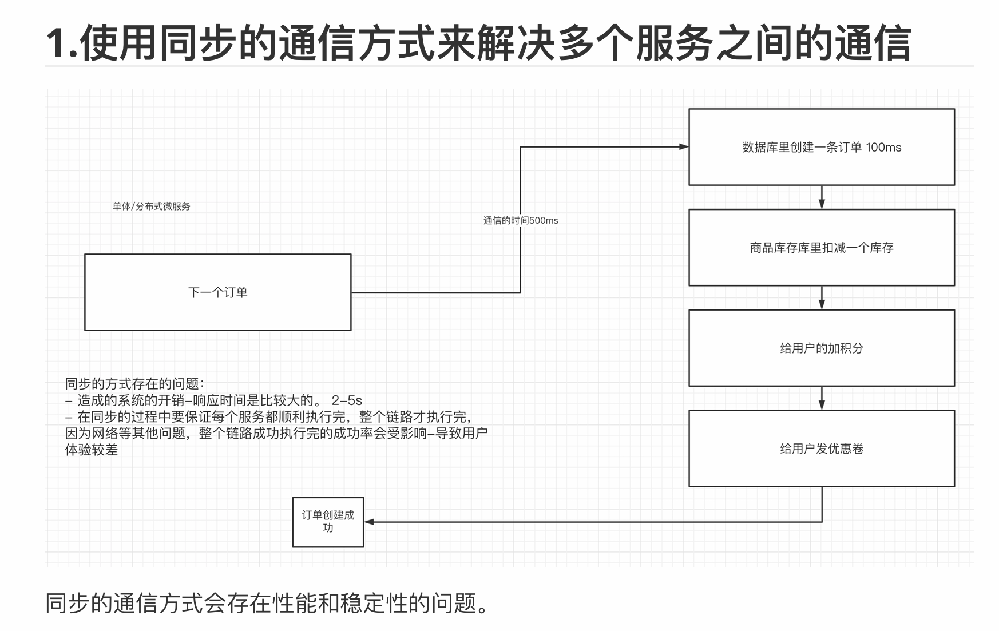
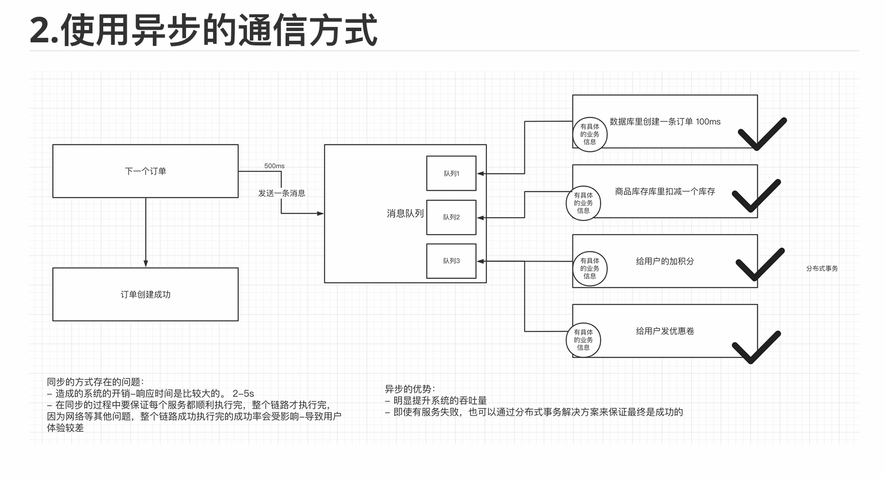
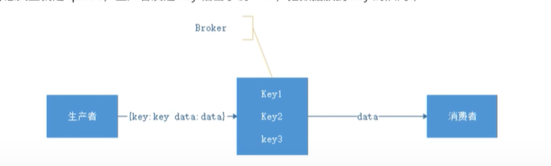
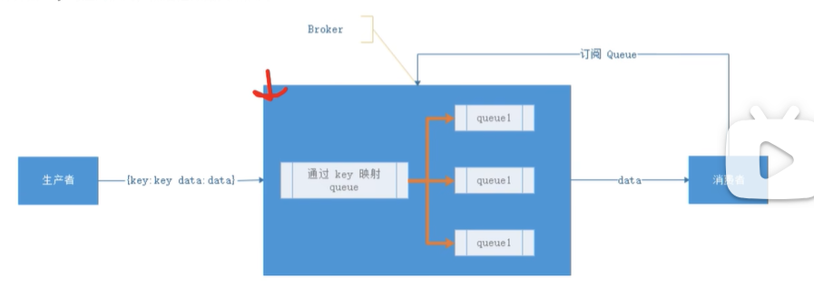

# kafka

1. 消息队列
    1.1 

## 1. 消息队列

在微服务中多个服务配合，如果使用同步来解决服务间的通信，显然耗时很久。

一种方法就是采用异步的方式，但是这样就会有一个问题，就是假如一个服务挂掉了，怎么解决 -> **分布式事务 待学**

针对于同步的通信⽅式来说，异步的⽅式，可以让上游快速成功，极⼤提⾼了系统的吞吐量。⽽且在分布式系统中，通过下游多个服务的分布式事务的保障，也能保障业务执⾏之后的最终⼀致性。

消息队列解决具体的是什么问题——**通信问题**

### 1.1 消息队列的划分

可以按照：Broker -> topic 来进行划分；

#### 1.1.1 有 Broker 的 MQ

这个流派通常有⼀台服务器作为 Broker，所有的消息都通过它中转。⽣产者把消息发送给它就结束⾃⼰的任务了，Broker 则把消息主动推送给消费者（或者消费者主动轮询）

> 重 Topic

kafka、JMS（ActiveMQ）就属于这个流派，⽣产者会发送 key 和数据到 Broker，由 Broker ⽐较 key 之后决定给哪个消费者。这种模式是我们最常⻅的模式，是我们对 MQ 最多的印象。在这种模式下⼀个 topic 往往是⼀个⽐较⼤的概念，甚⾄⼀个系统中就可能只有⼀个 topic，topic 某种意义上就是 queue，⽣产者发送 key 相当于说：“hi，把数据放到 key 的队列中”

如上图所示，Broker 定义了三个队列，key1，key2，key3，⽣产者发送数据的时候会发送 key1 和 data，Broker 在推送数据的时候则推送 data（也可能把 key 带上）

虽然架构⼀样但是 kafka 的性能要⽐ jms 的性能不知道⾼到多少倍，所以基本这种类型的 MQ 只有 kafka ⼀种备选⽅案。

> 轻 Topic

这种的代表是 RabbitMQ（或者说是 AMQP）。⽣产者发送 key 和数据，消费者定义订阅的队列，Broker 收到数据之后会通过⼀定的逻辑计算出 key 对应的队列，然后把数据交给队列

这种模式下解耦了 key 和 queue，在这种架构中 queue 是⾮常轻量级的（在 RabbitMQ 中它的上限取决于你的内存），消费者关⼼的只是⾃⼰的 queue；⽣产者不必关⼼数据最终给谁只要指定 key 就⾏了，中间的那层映射在 AMQP 中叫 exchange（交换机）。

#### 1.1.2 ⽆ Broker 的 MQ

⽆ Broker 的 MQ 的代表是 ZeroMQ。该作者⾮常睿智，他⾮常敏锐的意识到——MQ 是更⾼级的 Socket，它是解决通讯问题的。所以 ZeroMQ 被设计成了⼀个“库”⽽不是⼀个中间件，这种实现也可以达到——没有 Broker 的⽬的

节点之间通讯的消息都是发送到彼此的队列中，每个节点都既是⽣产者⼜是消费者。ZeroMQ 做的事情就是封装出⼀套类似于 Socket 的 API 可以完成发送数据，读取数据

## 2. Kafka 

