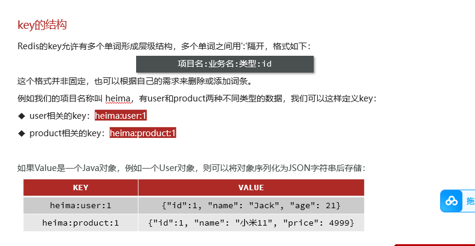
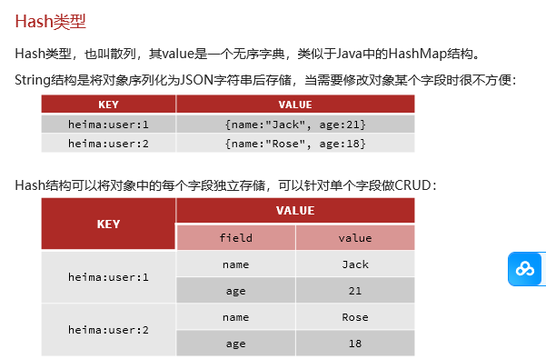
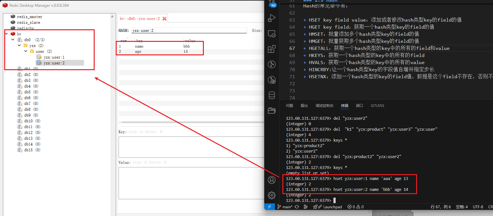
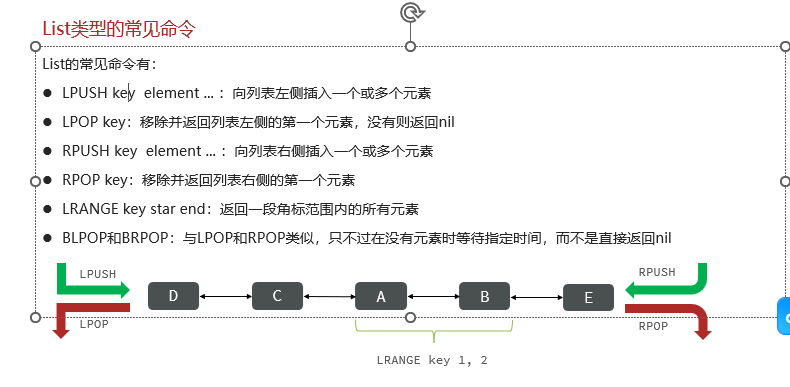
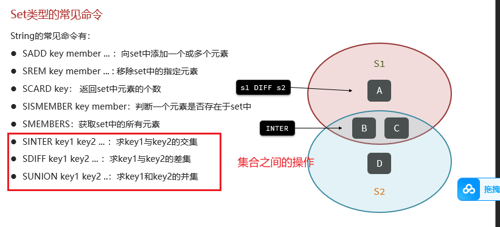

# redis

## 1. 基础使用

连接：

```bash
redis-cli -h 123.60.131.127  -p 6379 -a 20010111
```

或者不输入 -a,而是使用 auth 输入密码：`auth 密码`

## 2.命令

### 2.1 通用命令

通用指令是部分数据类型的，都可以使用的指令，常见的有：

+ KEYS：查看符合模板的所有key
+ DEL：删除一个指定的key
+ EXISTS：判断key是否存在
+ EXPIRE：给一个key设置有效期，有效期到期时该key会被自动删除
+ TTL：查看一个KEY的剩余有效期

通过help [command] 可以查看一个命令的具体用法，例如：

### 2.2 string 

String类型，也就是字符串类型，是Redis中最简单的存储类型。
其value是字符串，不过根据字符串的格式不同，又可以分为3类：

+ string：普通字符串
+ int：整数类型，可以做自增、自减操作
+ float：浮点类型，可以做自增、自减操作

不管是哪种格式，底层都是字节数组形式存储，只不过是编码方式不同。字符串类型的最大空间不能超过512m.

String的常见命令有：

+ SET：添加或者修改已经存在的一个String类型的键值对
+ GET：根据key获取String类型的value
+ MSET：批量添加多个String类型的键值对
+ MGET：根据多个key获取多个String类型的value
+ INCR：让一个整型的key自增1
+ INCRBY:让一个整型的key自增并指定步长，例如：incrby num 2 让num值自增2
+ INCRBYFLOAT：让一个浮点类型的数字自增并指定步长
+ SETNX：添加一个String类型的键值对，前提是这个key不存在，否则不执行
+ SETEX：添加一个String类型的键值对，并且指定有效期

✅ key 的结构

Redis没有类似MySQL中的Table的概念，我们该如何区分不同类型的key呢？




### 2.3 hash



Hash的常见命令有：

+ HSET key field value：添加或者修改hash类型key的field的值
+ HGET key field：获取一个hash类型key的field的值
+ HMSET：批量添加多个hash类型key的field的值
+ HMGET：批量获取多个hash类型key的field的值
+ HGETALL：获取一个hash类型的key中的所有的field和value
+ HKEYS：获取一个hash类型的key中的所有的field
+ HVALS：获取一个hash类型的key中的所有的value
+ HINCRBY:让一个hash类型key的字段值自增并指定步长
+ HSETNX：添加一个hash类型的key的field值，前提是这个field不存在，否则不执行



### 2.4 list

Redis中的List类型与Java中的LinkedList类似，可以看做是一个双向链表结构。既可以支持正向检索和也可以支持反向检索。

特征也与LinkedList类似：

+ 有序
+ 元素可以重复
+ 插入和删除快
+ 查询速度一般

常用来存储一个有序数据，例如：朋友圈点赞列表，评论列表等。



如何利用List结构模拟一个栈?

+ 入口和出口在同一边

如何利用List结构模拟一个队列?

+ 入口和出口在不同边

如何利用List结构模拟一个阻塞队列?

+ 入口和出口在不同边
+ 出队时采用BLPOP或BRPOP

### 2.5 set

Redis的Set结构与Java中的HashSet类似，可以看做是一个value为null的HashMap。因为也是一个hash表，因此具备与HashSet类似的特征：

+ 无序
+ 元素不可重复
+ 查找快
+ 支持交集、并集、差集等功能



### 2.6 SortedSet

Redis的SortedSet是一个可排序的set集合，与Java中的TreeSet有些类似，但底层数据结构却差别很大。SortedSet中的每一个元素都带有一个score属性，可以基于score属性对元素排序，底层的实现是一个跳表（SkipList）加 hash表。

SortedSet具备下列特性：

+ 可排序
+ 元素不重复
+ 查询速度快

因为SortedSet的可排序特性，经常被用来实现排行榜这样的功能。

SortedSet的常见命令有：

+ ZADD key score member：添加一个或多个元素到sorted set ，如果已经存在则更新其score值
+ ZREM key member：删除sorted set中的一个指定元素
+ ZSCORE key member : 获取sorted set中的指定元素的score值
+ ZRANK key member：获取sorted set 中的指定元素的排名
+ ZCARD key：获取sorted set中的元素个数
+ ZCOUNT key min max：统计score值在给定范围内的所有元素的个数
+ ZINCRBY key increment member：让sorted set中的指定元素自增，步长为指定的increment值
+ ZRANGE key min max：按照score排序后，获取指定排名范围内的元素
+ ZRANGEBYSCORE key min max：按照score排序后，获取指定score范围内的元素
+ ZDIFF、ZINTER、ZUNION：求差集、交集、并集

注意：所有的排名默认都是升序，如果要降序则在命令的Z后面添加REV即可


