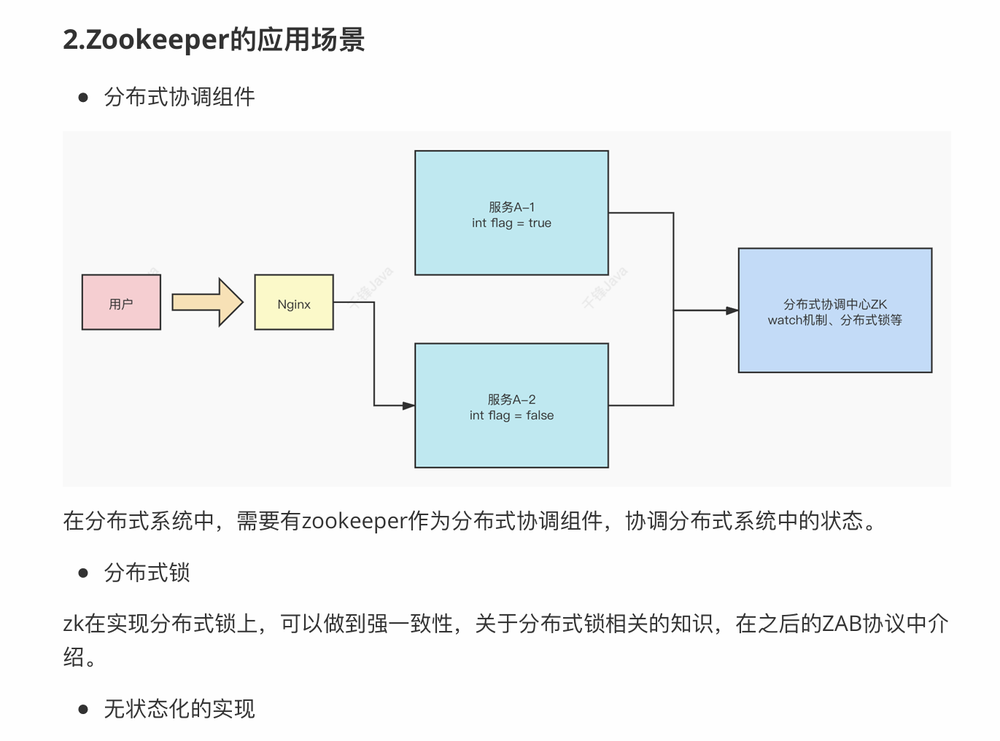
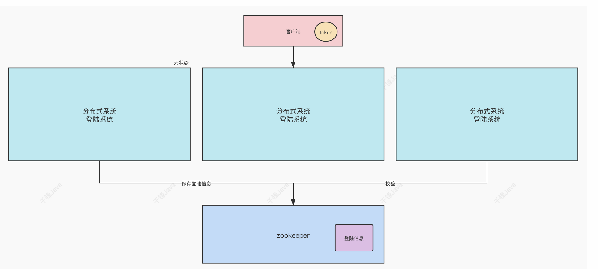
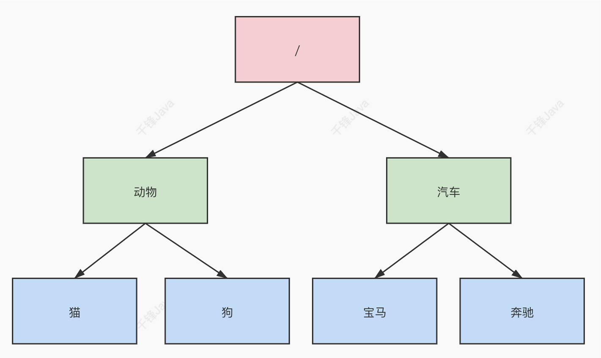
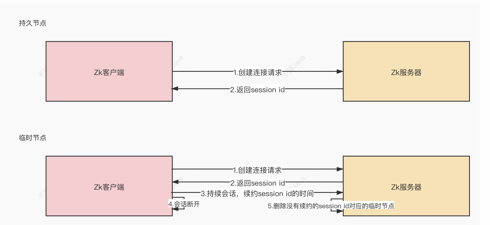

# zookeeper


## 0. 简介

ZooKeeper 是⼀种分布式协调服务，⽤于管理⼤型主机。在分布式环境中协调和管理服务是⼀个复杂的过程。ZooKeeper 通过其简单的架构和 API 解决了这个问题。ZooKeeper 允许开发⼈员专注于核⼼应⽤程序逻辑，⽽不必担⼼应⽤程序的分布式特性。






## 1. 安装

```bash
cd /usr/local
mkdir zookeeper
# 传入压缩包
tar -zxvf apache-zookeeper-3.8.4-bin.tar.gz
cd apache-zookeeper-3.8.4-bin/
cd bin
./zkServer.sh 

# 去conf文件夹下修改文件
mv zoo_sample.cfg zoo.cfg

# 在bin下，启动 并加载配置文件
./zkServer.sh start ../conf/zoo.cfg 

```
安装java
```bash
# Ubuntu
sudo apt update
sudo apt install openjdk-11-jdk

java -version
# 查找 Java 安装路径
which java
# 设置 JAVA_HOME 环境变量
echo 'export JAVA_HOME=/usr/lib/jvm/java-11-openjdk-amd64/' >> ~/.bashrc
echo 'export PATH=$JAVA_HOME/bin:$PATH' >> ~/.bashrc
source ~/.bashrc

./zkServer.sh
```


zoo.cfg配置文件说明

```bash
 # zookeeper时间配置中的基本单位 (毫秒)
 tickTime=2000
 # 允许follower初始化连接到leader最⼤时⻓，它表示tickTime时间倍数 
即:initLimit*tickTime
 initLimit=10
 # 允许follower与leader数据同步最⼤时⻓,它表示tickTime时间倍数 
syncLimit=5
 #zookeper 数据存储⽬录及⽇志保存⽬录（如果没有指明dataLogDir，则⽇志也保存在这个
⽂件中）
dataDir=/tmp/zookeeper
 #对客户端提供的端⼝号
clientPort=2181
 #单个客户端与zookeeper最⼤并发连接数
maxClientCnxns=60
 # 保存的数据快照数量，之外的将会被清除
autopurge.snapRetainCount=3
 #⾃动触发清除任务时间间隔，⼩时为单位。默认为0，表示不⾃动清除。
autopurge.purgeInterval=1
```

### zookper服务器操作命令

重命名 conf中的⽂件  `zoo_sample.cfg->zoo.cfg`
启动zk服务器： `./bin/zkServer.sh start ./conf/zoo.cfg`
查看zk服务器状态： `./bin/zkServer.sh status ./conf/zoo.cfg`
停⽌zk服务器： `./bin/zkServer.sh stop ./conf/zoo.cf`


zkCli.sh : 可以理解为命令行工具
```bash
# 启动
./zkCli.sh
```

## 2. Zookeeoer内部的数据模型

zk中的数据是保存在节点上的，节点就是znode，多个znode之间构成⼀颗树的⽬录结构。
Zookeeper 的数据模型是什么样⼦呢？它很像数据结构当中的树，也很像⽂件系统的⽬录。



树是由节点所组成，Zookeeper 的数据存储也同样是基于节点，这种节点叫做 Znode

但是，不同于树的节点，Znode 的引⽤⽅式是路径引⽤，类似于⽂件路径

```txt
/动物/猫
/汽⻋/宝⻢
```
这样的层级结构，让每⼀个 Znode 节点拥有唯⼀的路径，就像命名空间⼀样对不同信息作出
清晰的隔离。

创建节点： create
拿数据： get


### 2.zk中的znode是什么样的结构

zk中的znode，包含了四个部分：
+ data：保存数据
+ acl：权限，定义了什么样的⽤户能够操作这个节点，且能够进⾏怎样的操作。
    + c: create 创建权限，允许在该节点下创建⼦节点
    + w：write 更新权限，允许更新该节点的数据
    + r：read 读取权限，允许读取该节点的内容以及⼦节点的列表信息
    + d：delete 删除权限，允许删除该节点的⼦节点
    + a：admin 管理者权限，允许对该节点进⾏acl权限设置
+ stat：描述当前znode的元数据
+ child：当前节点的⼦节点

### 3.zk中节点znode的类型

+ 持久节点: 创建出的节点，在会话结束后依然存在。保存数据 (`create`)
+ 持久序号节点: 创建出的节点，根据先后顺序，会在节点之后带上⼀个数值，越后执⾏数
值越⼤，适⽤于分布式锁的应⽤场景- 单调递增 (`create -s`)
+ 临时节点：
临时节点是在会话结束后，⾃动被删除的，通过这个特性，zk可以实现服务注册与发现的
效果。那么临时节点是如何维持⼼跳呢？ (`create -e`)
 


+ 临时序号节点：跟持久序号节点相同，适⽤于临时的分布式锁。(`create -e -s`)
+ Container节点（3.5.3版本新增）：Container容器节点，当容器中没有任何⼦节点，该
容器节点会被zk定期删除（60s）。(`create -c`)
+ TTL节点：可以指定节点的到期时间，到期后被zk定时删除。只能通过系统配置 
zookeeper.extendedTypesEnabled=true开启


## 3. zk的数据持久化

zk的数据是运⾏在内存中，zk提供了两种持久化机制：

+ 事务⽇志
zk把执⾏的命令以⽇志形式保存在dataLogDir指定的路径中的⽂件中（如果没有指定
dataLogDir，则按dataDir指定的路径）

+ 数据快照
zk会在⼀定的时间间隔内做⼀次内存数据的快照，把该时刻的内存数据保存在快照⽂件
中。

**zk通过两种形式的持久化，在恢复时先恢复快照⽂件中的数据到内存中，再⽤⽇志⽂件中的数据做增量恢复，这样的恢复速度更快。**

## 4. Zookeeper客户端(zkCli)的使⽤

1. 多节点类型创建 

+ 创建持久节点   create 
+ 创建持久序号节点 create -s
+ 创建临时节点    create -e
+ 创建临时序号节点  create -e -s
+ 创建容器节点    create -c

2.查询节点 

+ 普通查询  `ls -R /`
+ 查询节点相信信息 `get -s /`
    +  cZxid: 创建节点的事务ID 
    +  mZxid：修改节点的事务ID
    +  pZxid：添加和删除⼦节点的事务ID
    +  ctime：节点创建的时间
    +  mtime: 节点最近修改的时间
    +  dataVersion: 节点内数据的版本，每更新⼀次数据，版本会+1
    +  aclVersion: 此节点的权限版本
    +  ephemeralOwner: 如果当前节点是临时节点，该值是当前节点所有者的 + sion 
    +  id。如果节点不是临时节点，则该值为零。
    +  dataLength: 节点内数据的⻓度
    +  numChildren: 该节点的⼦节点个

3. 删除节点 

+ 普通删除  delete /a  或  deleteall /a
+ 乐观锁删除 delete -v /a

4. 权限设置

注册当前会话的账号和密码： addauth digest xiaowang:123456

创建节点并设置权限 create /test-node abcd auth:xiaowang:123456:cdwra

在另⼀个会话中必须先使⽤账号密码，才能拥有操作该节点的权限


## 5. Curator客户端的使⽤

Curator是Netflix公司开源的⼀套zookeeper客户端框架，Curator是对Zookeeper⽀持最好
的客户端框架。Curator封装了⼤部分Zookeeper的功能，⽐如Leader选举、分布式锁等，减
少了技术⼈员在使⽤Zookeeper时的底层细节开发⼯作


