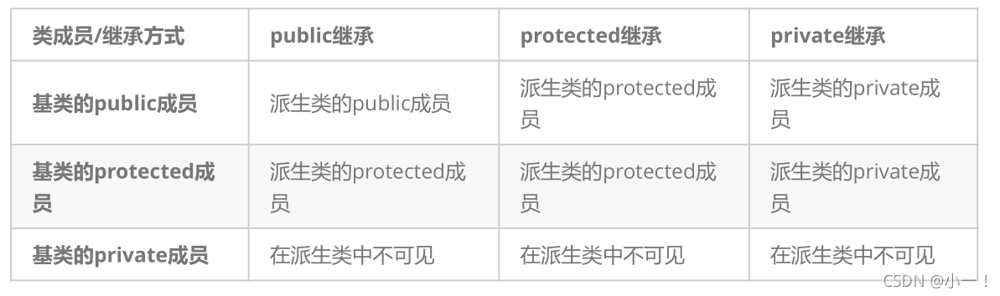
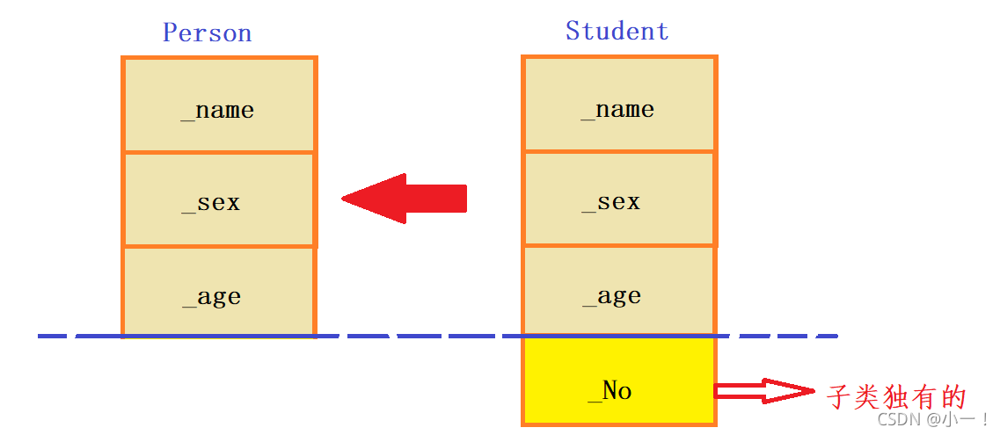

# 1. 封装
## 什么是封装？
c++是面向对象的程序，面向对象有三大特性：封装、继承、多态。

c++通过类，将一个对象的属性与行为结合在一起，使其更符合人们对于一件事务的认知，将属于该对象的所有东西打包在一起；通过访问限定符选择性的将其部分功能开放出来与其他对象进行交互，而对于内部的一些实现细节，外部用户不需要知道；

封装：将数据和操作数据的方法进行结合，隐藏对象的属性和实现细节，仅对外公开接口来和对象进行交互；

public： 类内外都可以访问 public 成员。派生类可以访问基类中的 public 成员。
private： 只有类的成员函数和友元函数可以访问 private 成员。派生类不能访问基类中的 private 成员。
protected： 类的成员函数和派生类的成员函数可以访问 protected 成员。派生类可以访问基类中的 protected 成员。

## 封装的好处：
封装的本质就是一种管理，想要暴露的用public，不想给别人看到的，我们使用protected/private把成员封装起来；隐藏内部细节，提高模块化和简化接口；

# 2. 继承
## 什么是继承？

继承机制是面向对象设计使得**代码可以复用的最重要收到**，它允许在保存原有类特性的基础上进行扩展，增加新的功能，这样产生的类叫派生类。

### 继承方式（public、protected 或 private）会影响派生类对基类成员的访问权限：

1. public 继承：
+ 基类的 public 成员在派生类中仍然是 public。
+ 基类的 protected 成员在派生类中仍然是 protected。
+ 基类的 private 成员在派生类中仍然是不可访问的。
2. protected 继承：
+ 基类的 public 和 protected 成员在派生类中都变为 protected。
+ 基类的 private 成员在派生类中仍然是不可访问的。
3. private 继承：
+ 基类的 public 和 protected 成员在派生类中都变为 private。
+ 基类的 private 成员在派生类中仍然是不可访问的。

### 总结：

1. 基类private成员在派生类中无论以什么方式继承都是不可见的。这里的不可见是指基类的私有成员还是被继承到了派生类对象中，但是语法上限制派生类对象不管在类里面还是类外面都不能去访问它。

2. 基类private成员在派生类中是不能被访问，如果基类成员不想在类外直接被访问，但需要在派生类中能访问，就定义为protected。**可以看出保护成员限定符是因继承才出现的。**

3. 实际上面的表格我们进行一下总结会发现，基类的私有成员在子类都是不可见。基类的其他成员在子类的访问方式 == Min(成员在基类的访问限定符，继承方式)，public > protected > private。

4. 使用关键字class时默认的继承方式是private，使用struct时默认的继承方式是public，不过最好显示的写出继承方式。

5. 在实际运用中一般使用都是public继承，几乎很少使用protetced/private继承，也不提倡使用protetced/private继承，因为protetced/private继承下来的成员都只能在派生类的类里面使用，实际中扩展维护性不强。

## 基类和派生类对象赋值转换
派生类对象 可以赋值给 基类的对象 / 基类的指针 / 基类的引用。这里有个形象的说法叫切片或者切割。寓意把派生类中父类那部分切来赋值过去。基类对象不能赋值给派生类对象

### 继承中的作用域
1. 在继承体系中基类和派生类都有独立的作用域
2. 子类和父类中有同名成员，子类成员将屏蔽父类对同名成员的直接访问，这种情况叫隐藏，也叫重定义。（在子类成员函数中，可以使用基类::基类成员 显示访问）
3. 需要注意的是如果是成员函数的隐藏，只需要函数名相同就构成隐藏。
4. 注意在实际中在继承体系里面最好不要定义同名的成员。

