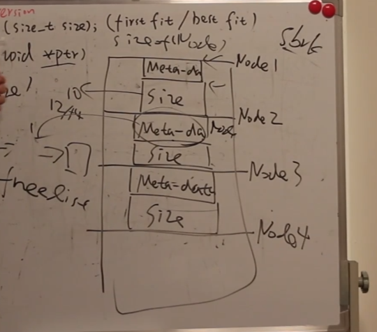

# 1. malloc
malloc：申请的内存是在堆空间。

分配内存调用底层的 sbrk();在xv6就知道这个函数了；而且知道这个分配其实时懒分配的 和 row一样，主要是利用 page fault实现的.我们知道当 malloc 时是在堆上开辟空间的，而一个进程的sz即当前进程的大小 也就是说sz就是其堆地址,当调用 sbrnk(n)时，我们分配的地址就是当前 p->sz,那么分配后的大小就是 p->sz = p->sz + n;此时我们知道修改堆，但是并不分配内存； 
```cpp
uint64
sys_sbrk(void)
{
  int addr;
  int n;

  if(argint(0, &n) < 0)
    return -1;
  addr = myproc()->sz;
  myproc()->sz = myproc()->sz + n;
//   if(growproc(n) < 0)
//     return -1;
  return addr;
}
```
当我要访问这个内存时，会触发 page fault,这个时候就是陷入中断，到 usertrap中，在这里我们进行分配内存。


>在第三章中。`sbrk` 是进程缩小或增加其内存的系统调用。该系统调用由 `growproc` 函数实现（`kernel/proc.c:253`）。`growproc` 根据 `n` 是正数还是负数调用 `uvmalloc` 或 `uvmdealloc`。
>
>`uvmalloc`（`kernel/vm.c:221`）使用 `kalloc` 分配物理内存，并使用 `mappages` 将 PTE 添加到用户页表中。


在malloc中直接调用 sbrk(n)即可； *ptr = sbrk(n);
在申请空间的时候，通常要大于n，因为要保持一些信息，比如说分配的大小和下一位置的指针：meta_data；所以在内存中的形式是：上面是meta_data，下面才是我们想要的data
用链表保存申请过的内存；




每次free的时候，把当前的 ptr加入到空闲链表中即可；当下一次申请分配的时候，直接从链表中拿取使用即可；
因为链表中是维护的可以使用的内存空间，当申请一个新的空间时，就去链表中查找，有两种策略，一种是找到第一个可以使用的，比如说申请 5,此时链表 2 10 20 30，返回node1，而且在这里可以 splic一下，因为 10 是用不完的，把这块内存分成两部分，一部分返回，一部分保留在链表中；另外一种策略是找到最适的大小比如：10 6 10，此时就返回6这个空间；


# new
new：此操作符分配的内存空间是在自由存储区；

自由存储区 是C++中动态分配和释放对象的一个概念，通过new分配的内存区域可以称为自由存储区，通过delete释放归还内存。自由存储区可以是堆、全局/静态存储区等，具体是在哪个区，主要还是要看new的实现以及C++编译器默认new申请的内存是在哪里。但是基本上，很多C++编译器默认使用堆来实现自由存储，运算符new和delete内部默认是使用malloc和free的方式来被实现，说它在堆上也对，说它在自由存储区上也正确。因为在C++中new和delete符号是可以重载的，我们可以重新实现new的实现代码，可以让其分配的内存位置在静态存储区等。而malloc和free是C里的库函数，无法对其进行重载。


delete和free的区别在于free只释放对象本身的内存，而delete还要调用析构函数。析构函数负责释放实现该对象的程序员自己觉得需要释放的其它资源。——这些资源的信息记录在对象本身，所以需要先释放这些资源之后才能释放对象本身的内存。至于new和delete底层是否使用的malloc/free不重要。因为前者跟后者的主要区别在于是否调用构造函数/析构函数，所以使用malloc/free作为底层完全没有问题。


