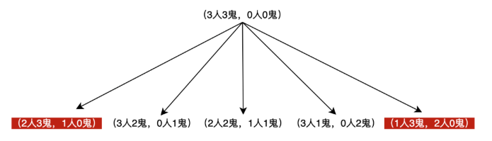

>三 个人三只鬼结伴郊游，经过一条河，河上只有一艘小木船，木船只有两个位置，每次只能载2个人或鬼，河两岸人的数量如果小于鬼的数量，人就会被鬼无情的吃掉。问怎样过河人才能安然无恙？

+ 船上只有两个位置，就是每次乘坐的情况只能是一人一鬼、两人、两鬼这三种；
+ 船开到对岸要回来，需要有人或鬼驾驶，船自己肯定不会回来，这是个隐藏信息；
+ 也是最明显的一个，任何时候船两边人的数目，必须要大于等于鬼。

> 第一轮

河的这边有三人三鬼，对岸无人，因为一来一回，其实每次送过去的只有一个。

因为目前河这边是人鬼等量，所以必须保证送一只鬼过去，另一个开船的无论是鬼还是人，结果都一样。人或鬼划船回来，剩下一只鬼在对岸，就进入了（3人2鬼-0人1鬼）状态。

> 第二轮

这一轮给对面送人，还是送鬼呢？我们其实每一轮都有五种过河选择，一人、一鬼、一人一鬼、两人、两鬼。我们就按这个顺序来想想：

1.一个人划船去对岸，得回来一个，如果是第一轮留下的鬼回来，那河这边的人就凉了（2人3鬼-1人0鬼），所以必须是人原路返回，那这样就没有意义了。

2.一只鬼去到对岸，不自己原路返回的话，只能带上之前的鬼一起，这样就回到了起点（3人3鬼-0人0鬼），也没有什么意义。

3.一人一鬼去对岸，则对岸人会遭到鬼毒杀（2人1鬼-1人2鬼），哒咩❌！

4.如果是两人一起过河，那河这边留下的那个兄弟，就会惨遭毒手。

5.两鬼去对岸，得回来一个，进入（3人1鬼-0人2鬼）状态。

所以看起来我们选择好像挺多，其实只有一条路可走：两鬼过去，得回来一个，进入（3人1鬼-0人2鬼）状态。

> 第三轮

这一轮，我们还是按我们的5条路走走看：

1.一个人划船去对岸，卒。

2.和第二轮一样，一只鬼过去，不自己原路返回的话，只能两只鬼一起回来，这样就回到了我们第一轮结束的状态，没有实质意义。

3.一人一鬼过去，那过去对岸的人就凉了。

4.两鬼到对岸，这一轮河这边的鬼只剩一只，鬼不够用啊～

5.两人到对岸，此时（1人1鬼-2人2鬼），得把船划回来，因为此时是平衡状态，如果不原样返回的话，只能是一人一鬼回来，进入（2人2鬼-1人1鬼）状态。

> 第四轮

这种情况下，其实选择已经比较明显了，不过我们还是按之前的思路来看：

1.一个人划船过去，那留在河这边的小伙伴就凉凉了。

2.一只鬼过去，那么对岸的小伙伴就凉了。

3.一人一鬼过去，此时（1人1人-2人2鬼），在第三轮第五点已经出现过了，是个死循环。

4.两鬼到对岸，对岸的小伙伴又凉了。

5.两人去对岸，此时（0人2鬼-3人1鬼），此时只能让一只鬼独自撑船回去。那么就是（0人3鬼-3人0鬼）的局面了。

> 第五轮

现在一看，稳了啊！两只鬼划船到对岸，再回去一只（0人2鬼-3人1鬼），最后两只鬼一起过河。

三人三鬼，都成功过河，且没有发生任何流血事件，画面非常和谐！

思路整理
可以看到，我们在思考过程中，其实是根据可能的情况，按直觉先一条路走到底。如果发现打了一圈，回到之前的状况，或者直接就是条死路，就另辟蹊径。

其实，这种演绎过程就是搜索的逻辑。三人三鬼，我们还可以凭借记忆，回到之前的状态，要是五人五鬼，就很难凭记忆回溯了。

更为清晰的路径，是从一开始，就画一颗树，这棵树会指引我们正确的方向！

## 限时过桥

> 问题：在一个夜晚，同时有4人需要过一桥，一次最多只能通过两个人，且只有一只手电筒，而且每人的速度不同。A，B，C，D需要时间分别为：1，2，5，10分钟。问：在17分钟内这四个人怎么过桥？

总共是17分钟
+ 第一步：A、B过花时间2分钟。 2
+ 第二步：B回花时间2分钟。   2
+ 第三步：C、D过花时间10分钟。  10
+ 第四步：A回花时间1分钟。  1
+ 第五步：A、B再过花时间2分钟。 2

