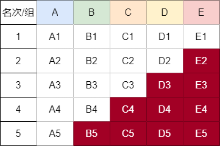

> 25匹马5条跑道找到最快的3匹马，需要跑几次？ 7次
> 25匹马5条跑道找到最快的5匹马，需要跑几次？ 最少8次或9次
> 64匹马8条跑道找到最快的4匹马，需要跑几次？ 10 或者 11次

## 1. 25匹马5条跑道，要决出前三名，最快跑几次

1. 首先将25匹马分成5组，每组5匹马进行比赛。这需要5场比赛。（现在我们知道每组的排名，但不知道和其他组相比的具体位置）

2. 然后，让每组的第一名再进行一场比赛。这场比赛之后，我们就能确定哪一组拥有最快的一匹马。（现在是6场比赛）

假设获得这场比赛前3名的马分别来自A、B、C组（按照从快到慢排序），那么我们可以做出以下推断：

+ A组的冠军是所有马中的第一名。
+ 第二名可能是A组的第二名，或者是B组的冠军。
+ 第三名可能是A组的第三名，B组的第二名，或者是C组的冠军。

因此，为了决定第二名和第三名，我们需要再举行一场比赛，包括：

+ 第一场获胜者所在组的第二名和第三名（如果有的话）。
+ 第二场获胜者所在组的第二名（如果有的话）。
+ 第三场获胜者（即第五场比赛的第三名）。

所以，总共需要7场比赛来确定前三名。这是在不使用计时器，并仅通过比较直接比赛结果的情况下找到前三名的最优解。

## 2. 25匹马，5个跑道，最少比多少次能比出前5名？

1. 前5次比赛得到前5名； 5次
2. 将每组的第一名在比赛一场； 6次

通过第六场的比赛，我们知道了每组内排名第一的马之间的排名，也挑选出了所有马中最快的那一匹，对它们进行了一个排名，自然也可以依靠这个排名看出哪些马已经失去了继续比赛的资格。

因为现在第一名已经产生，只剩下四个名额，结合A1-E1的快慢关系，可以知道B5、C4-C5、D3-D5、E2-E5已经不可能有排名了，所以可以直接淘汰掉。至于A2-A5，因为他们和最快的那匹马在同一只队伍中，还不知道它们和其他组的马之间的快慢关系，所以目前有希望出现在前五名

3. 我们将有希望冲击二、三名的马挑选出来，刚好是五匹马，让他们比赛1次之后，排名第一、二的马恰好就是所有马中第二、三快的马; 7次

根据第七次比赛的结果，我们现在已经得到了第二快和第三块的马，所以现在只剩下两个名额了，按道理说，应该又到了淘汰马的环节，但仔细观察后会发现，第七次比赛不同的结果，将会影响最后的比赛次数，下面我们来分几种情况进行讨论

a. 前两名和第一快马都不在同一个组中，即出现在B1和C1的位置上，这是最坏的情况，最后需要比赛2场才可以确定第四和第五快马

因为第七场比赛结束之后，我们只剩下了两个名额，除了确定好的前三名外，还会剩下7匹或者8匹马要争抢第四、五名，下面这种情况就剩下8匹马有机会竞争四五名，如果A2跑了第3名的话，那么就会剩下7匹马。我们需要先从剩下的马中选出5匹马出来进行比赛，找到这5匹马中最快的两匹，然后再和剩下的马比赛，最终排名一、二的就是我们要找的所有马中第四、第五快的马。这种情况导致我们最终选出前五名的马需要比赛9次才行，但是对应的并不是最少的次数，而是最多的次数。

下图中字母旁边的数字表示它们在第七场比赛中的排名情况

b）前两名和第一快的马在同一组

即A2、A3分别是比赛中的第一第二名，由于B1的速度比B2和C1的都快，所以B1一定是第三名，B2和C1两者可能是第四名或者是第五名中的一个，A4和A5还没有和其它组的马跑过，所以也有可能是第四、五名。不过我们现在只有四个名额，第五名的那个将会被我们淘汰掉。所以无论最终结果如何，最后只会剩下四匹马，我们只需让最后四匹马[A4、A5、B1、B2/C1]参加一次比赛，排名前二的就是所有马中的第四、第五名。这样一来，我们选出前五名也就只用了8次，这也是这道题的最少次数

c）前两名一个与A1同组、另一个与A1不同组

比如A2是第七次比赛的第一名，B1是第二名。对于这种情况，第四名可能是A3、B2、C1。假设第4名为A3，第5名可能为A4、B2、C1。假设第4名为B2，第5名可能为A3、B3、C1。假设第4名为C1，第5名可能为A3、B2、C2、D1。但是无论是哪种情况，争夺第四、五这两个名额的马都是小于5个的，所以最后只需进行一场比赛就可以角逐出四五名了。这种情况总共也只比较了8次。

链接：https://juejin.cn/post/7077545879384637447

## 3. 64匹马8条跑道找到最快的4匹马，需要跑几次？ 11次

第一轮：8场
把64匹马随机分为8组，总共比8场，淘汰每组后4名。为方便可视，我将马进行标记组别并同时记录每组中各马的名次。

第二轮：1场
在8组中选每组第1名的马进行比赛，按名次排序（重新对马进行标记，第一名为A1，其次为B1、C1、D1…）。

第三轮：1场或2场
目前已知A1为全场最快，已经晋级。现在需要在A2-4、B1-3、C1-2、D1这9匹马(只有8条跑道)中选择最快的3匹，同时知道B1>C1>D1。这时D1是最危险的，因为已经知道有两匹马比它快，我们选择除了D1之外的8匹马进行比赛。

加赛的情况：

如果C1以第二名的成绩晋级（除D1比赛中的第二名，已知B1>C1，所以C1不可能是第一名），那么最终第三名（除D1比赛中的第三名）在A2-4、B2-3、C2中产生，并不能知道D1与它们的快慢，所以需要D1与A2-4、B2-3、C2共7匹马再进行一次比赛，第一名进入TOP4（是总成绩中的第四名）。

不加赛的情况：

如果C1以第三至七名的成绩完赛（除D1的比赛，已知C1>D1，所以C1不可能是第八名），那么除D1这8匹马中的前三名就直接进入TOP4（总成绩中的第二、三、四名），无需进行加赛。

