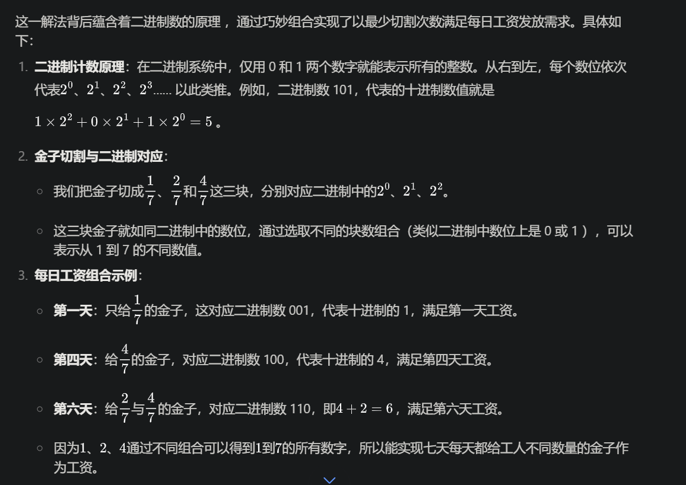

> 问题：工人为老板打工，工作七天可以获得一块金子，工人每天可以分得一点金子，老板必须每天发金子，不能多给，也不能少给，把这个金子切两刀，就可以每天给工人发工资，请问怎么切？

切两刀将金子分成三份，1/7、2/7、4/7；

+ 工作第一天 把1/7分给工人；
+ 工作第二天 把2/7分给工人，并要回1/7那块金子，工人有2/7的金子；
+ 工作第三天 把1/7给工人 工人有3/7金子；
+ 工作第四天 把前两块金子要回，给工人4/7的金子 工人有4/7的金子；
+ 工作第五天 把1/7分给工人 工人有5/7的金子；
+ 工作第六天 把2/7分给工人，并要回1/7那块金子，工人有6/7的金子；
+ 工作第七天 把1/7给工人 工人有完整的金子；

扩展：如何给工人发15天的工资？把金块分成1/15、2/15、4/15、8/15。

